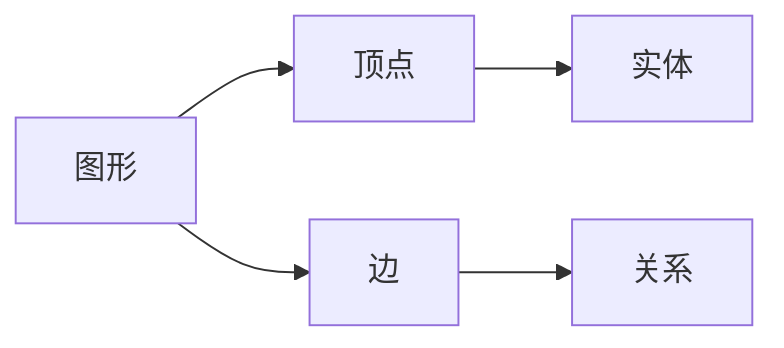

## 1.背景介绍

Apache TinkerPop是一个用于操作图形数据库的开源框架。它提供了一种通用的方式来分析和操作图形数据，无论这些数据是存储在哪种图形数据库中。TinkerPop支持各种图形数据库，包括Titan、OrientDB、Neo4j等，这使得它成为一个非常强大的工具，尤其是在处理大规模图形数据的情况下。

## 2.核心概念与联系

在TinkerPop中，最核心的概念是图形(Graph)、顶点(Vertex)和边(Edge)。图形是由顶点和边组成的结构，顶点代表实体，边代表实体之间的关系。TinkerPop提供了一种叫做Gremlin的图形遍历语言，用于查询和操作图形数据。



## 3.核心算法原理具体操作步骤

TinkerPop通过Gremlin语言实现图形的遍历操作。Gremlin的语法类似于SQL，但是它是专门为图形数据设计的。以下是一些基本的Gremlin操作：

- `g.V()`: 遍历所有的顶点
- `g.E()`: 遍历所有的边
- `g.V().has('name', 'marko')`: 查找名字为marko的顶点
- `g.V().out('knows')`: 查找所有知道其他人的顶点
- `g.V().outE('knows').inV()`: 查找所有被其他人知道的顶点

## 4.数学模型和公式详细讲解举例说明

在图形理论中，图形可以表示为一个二元组 $G = (V, E)$，其中 $V$ 是顶点的集合，$E$ 是边的集合。每条边是一个二元组 $(u, v)$，表示从顶点 $u$ 到顶点 $v$ 的一个边。

在TinkerPop中，图形的遍历可以看作是在图形的状态空间中进行搜索。每个状态可以表示为一个顶点，状态之间的转移可以表示为从一个顶点到另一个顶点的边。因此，图形遍历可以看作是一种图搜索问题。

在图搜索问题中，一个常用的算法是深度优先搜索(DFS)。DFS的基本思想是从一个顶点开始，沿着一条路径一直向前走，直到不能再走为止，然后回溯到上一个顶点，再选择另一条路径走，直到所有的顶点都被访问过。

## 5.项目实践：代码实例和详细解释说明

以下是一个使用TinkerPop操作图形数据的简单示例。这个示例演示了如何创建一个图形，添加顶点和边，然后使用Gremlin进行查询。

```java
// 创建一个空的图形
Graph graph = TinkerGraph.open();

// 添加顶点
Vertex marko = graph.addVertex(T.label, "person", T.id, 1, "name", "marko", "age", 29);
Vertex vadas = graph.addVertex(T.label, "person", T.id, 2, "name", "vadas", "age", 27);

// 添加边
marko.addEdge("knows", vadas, T.id, 7, "weight", 0.5);

// 使用Gremlin进行查询
GraphTraversalSource g = graph.traversal();
List<Vertex> vertices = g.V().has("name", "marko").toList();

// 输出查询结果
for (Vertex vertex : vertices) {
    System.out.println(vertex);
}
```

## 6.实际应用场景

TinkerPop在许多实际应用中都发挥了重要作用。例如，在社交网络分析中，可以使用TinkerPop来分析用户之间的关系，找出具有影响力的用户；在推荐系统中，可以使用TinkerPop来分析用户的行为，生成个性化的推荐；在网络安全中，可以使用TinkerPop来分析网络的结构，检测异常行为。

## 7.工具和资源推荐

如果你想要深入学习和使用TinkerPop，以下是一些有用的资源：

- Apache TinkerPop官方网站：https://tinkerpop.apache.org/
- Gremlin语言参考：https://tinkerpop.apache.org/docs/current/reference/
- TinkerPop的GitHub仓库：https://github.com/apache/tinkerpop

## 8.总结：未来发展趋势与挑战

随着数据量的不断增长，图形数据库和图形处理框架的重要性也在不断提高。TinkerPop作为一个开源的图形处理框架，有着广泛的应用前景。然而，TinkerPop也面临着一些挑战，例如如何提高处理效率，如何处理大规模的图形数据，如何提供更丰富的查询和分析功能等。

## 9.附录：常见问题与解答

1. **问题：TinkerPop支持哪些图形数据库？**

答：TinkerPop支持多种图形数据库，包括Titan、OrientDB、Neo4j、JanusGraph等。

2. **问题：如何在TinkerPop中进行复杂的图形查询？**

答：TinkerPop提供了一种叫做Gremlin的图形遍历语言，可以用来进行复杂的图形查询。Gremlin的语法类似于SQL，但是它是专门为图形数据设计的。

3. **问题：TinkerPop如何处理大规模的图形数据？**

答：TinkerPop可以通过分布式计算框架，如Apache Hadoop和Apache Spark，来处理大规模的图形数据。这些框架可以将计算任务分解成多个小任务，然后在多台计算机上并行执行，从而大大提高处理效率。

作者：禅与计算机程序设计艺术 / Zen and the Art of Computer Programming