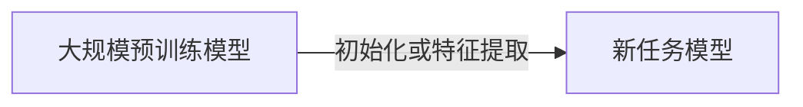
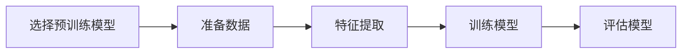

## 1.背景介绍

在深度学习领域，训练一个模型需要大量的数据和计算资源。然而，对于大多数实际问题，我们可能无法获取足够的标注数据，或者没有足够的计算资源来训练一个深度学习模型。这时，Transfer Learning（迁移学习）就派上了用场。迁移学习是一种利用预训练模型的知识来解决新问题的方法，它可以显著减少训练时间和所需的数据量。

## 2.核心概念与联系

迁移学习的主要思想是：如果一个模型在大规模数据集上训练得到的特征是有用的，那么这些特征可能也能用于其他相关的任务。这就像我们学习新的知识时，会利用已有的知识来帮助理解和记忆。在深度学习中，我们通常会将一个在大规模数据集（如ImageNet）上预训练的模型作为新任务的初始化模型，或者作为新任务的特征提取器。



## 3.核心算法原理具体操作步骤

迁移学习的过程通常包括以下步骤：

1. 选择预训练模型：预训练模型通常是在大规模数据集上训练得到的深度学习模型。例如在图像分类任务中，我们通常会选择在ImageNet数据集上预训练的模型，如ResNet、VGG等。

2. 准备数据：我们需要准备新任务的训练数据。这些数据不需要太多，但需要和新任务相关。

3. 特征提取：我们使用预训练模型作为特征提取器，将新任务的数据输入预训练模型，得到特征表示。

4. 训练模型：我们在得到的特征表示上训练新任务的模型。这时，我们可以选择冻结预训练模型的部分或全部参数，只训练新任务的模型参数。

5. 评估模型：我们在新任务的测试数据上评估模型的性能。



## 4.数学模型和公式详细讲解举例说明

在迁移学习中，我们通常会使用预训练模型的输出作为新任务的输入。假设预训练模型为$f$，新任务的模型为$g$，那么新任务的输出可以表示为$g(f(x))$，其中$x$为新任务的输入。

如果我们选择冻结预训练模型的参数，那么在训练过程中，只有新任务的模型参数会被更新。假设新任务的损失函数为$L$，那么在训练过程中，我们需要最小化$L(g(f(x)), y)$，其中$y$为新任务的真实输出。

## 5.项目实践：代码实例和详细解释说明

接下来，我们以PyTorch框架为例，展示如何使用迁移学习进行图像分类任务。

首先，我们需要加载预训练模型。在PyTorch中，我们可以使用`torchvision.models`模块来加载预训练的ResNet模型：

```python
import torchvision.models as models

# 加载预训练的ResNet模型
resnet = models.resnet50(pretrained=True)
```

然后，我们需要准备新任务的数据。在这里，我们假设已经有了一个数据加载器`dataloader`，它可以加载新任务的数据。

接下来，我们使用预训练模型进行特征提取。在这里，我们选择冻结预训练模型的参数，并添加一个新的全连接层作为新任务的模型：

```python
import torch.nn as nn

# 冻结预训练模型的参数
for param in resnet.parameters():
    param.requires_grad = False

# 添加新的全连接层
num_features = resnet.fc.in_features
resnet.fc = nn.Linear(num_features, num_classes)
```

最后，我们可以开始训练新任务的模型：

```python
import torch.optim as optim

# 使用交叉熵损失函数
criterion = nn.CrossEntropyLoss()

# 使用随机梯度下降优化器
optimizer = optim.SGD(resnet.fc.parameters(), lr=0.001, momentum=0.9)

# 开始训练
for epoch in range(num_epochs):
    for inputs, labels in dataloader:
        # 前向传播
        outputs = resnet(inputs)
        loss = criterion(outputs, labels)

        # 反向传播和优化
        optimizer.zero_grad()
        loss.backward()
        optimizer.step()
```

## 6.实际应用场景

迁移学习在许多实际应用场景中都有广泛的应用，例如：

- 图像分类：我们可以使用在ImageNet数据集上预训练的模型，来解决新的图像分类问题。

- 物体检测：我们可以使用在ImageNet数据集上预训练的模型，来解决新的物体检测问题。

- 自然语言处理：我们可以使用在大规模文本数据上预训练的模型（如BERT、GPT等），来解决新的自然语言处理问题。

## 7.工具和资源推荐

在进行迁移学习时，以下工具和资源可能会有所帮助：

- [PyTorch](https://pytorch.org/): 一个强大的深度学习框架，提供了丰富的预训练模型和易于使用的API。

- [TensorFlow](https://www.tensorflow.org/): 另一个强大的深度学习框架，也提供了丰富的预训练模型和易于使用的API。

- [Hugging Face Transformers](https://huggingface.co/transformers/): 提供了大量的预训练模型，特别是在自然语言处理领域。

## 8.总结：未来发展趋势与挑战

迁移学习已经在深度学习领域取得了显著的成功，但仍有许多挑战和未来的发展趋势：

- 更好的预训练模型：预训练模型的质量对迁移学习的效果有很大的影响。如何训练出更好的预训练模型，是一个重要的研究方向。

- 更好的迁移策略：如何更好地将预训练模型的知识迁移到新任务，也是一个重要的研究方向。这包括如何选择预训练模型，如何冻结预训练模型的参数，如何训练新任务的模型等。

- 更多的应用场景：迁移学习有很大的潜力应用于更多的场景。如何将迁移学习应用于更多的实际问题，也是一个重要的研究方向。

## 9.附录：常见问题与解答

Q: 为什么要使用迁移学习？

A: 使用迁移学习有两个主要的优点：一是可以减少训练时间，因为预训练模型已经学习到了一些有用的特征；二是可以减少所需的数据量，因为预训练模型已经在大规模数据集上训练过。

Q: 如何选择预训练模型？

A: 选择预训练模型通常取决于新任务的特性。如果新任务和预训练模型的任务相似，那么可以选择相同的模型。如果新任务和预训练模型的任务不同，那么可以选择在类似的数据上训练的模型。

Q: 如何冻结预训练模型的参数？

A: 在PyTorch中，我们可以通过设置模型参数的`requires_grad`属性为`False`来冻结模型的参数。这样，在训练过程中，这些参数就不会被更新。

Q: 如何训练新任务的模型？

A: 在得到预训练模型的特征表示后，我们可以在这些特征表示上训练新任务的模型。这时，我们可以选择使用任何的深度学习模型，如全连接网络、卷积网络、循环网络等。

作者：禅与计算机程序设计艺术 / Zen and the Art of Computer Programming