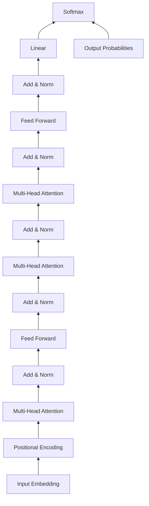

# Transformer原理与代码实战案例讲解

## 1.背景介绍

### 1.1 Transformer的诞生
2017年,Google机器翻译团队在论文《Attention is All You Need》中首次提出了Transformer模型。Transformer的出现,标志着自然语言处理(NLP)领域从传统的RNN、LSTM等模型,过渡到以Self-Attention为核心的新一代模型的开始。

### 1.2 Transformer带来的变革
Transformer模型摒弃了传统的RNN结构,完全依赖Attention机制来学习文本间的依赖关系。相比RNN模型,Transformer具有以下优势:

- 并行计算能力强,训练速度快
- 能够捕捉长距离依赖关系
- 不存在梯度消失问题
- 可以处理任意长度的序列

Transformer的出现,极大地推动了NLP技术的发展,为后续BERT、GPT等预训练语言模型奠定了基础。

### 1.3 Transformer的应用领域
凭借其强大的特征提取和建模能力,Transformer在NLP领域得到了广泛应用,主要包括:

- 机器翻译
- 文本分类
- 命名实体识别  
- 关系抽取
- 阅读理解
- 文本摘要
- 对话系统
- ......

此外,Transformer的思想也被引入到计算机视觉、语音识别等其他领域,展现出了广阔的应用前景。

## 2.核心概念与联系

### 2.1 Attention机制
Attention机制是Transformer的核心,用于对输入序列中的每个元素分配一个权重,然后基于权重对序列进行加权求和,得到一个上下文向量。Attention可以建模序列内部和序列之间的依赖关系。

### 2.2 Self-Attention
Self-Attention是Transformer中的一种特殊Attention,用于对同一个序列内部的元素计算Attention。具体来说,就是序列的每个位置都要和该序列的所有位置进行Attention计算。Self-Attention使得模型能够捕捉序列内部的长距离依赖。

### 2.3 Multi-Head Attention
Multi-Head Attention是将Self-Attention进行多次线性变换,然后并行计算Attention的一种机制。它允许模型在不同的表示子空间里学习到序列的不同方面的信息,增强了模型的表达能力。

### 2.4 位置编码
由于Transformer不包含RNN这种顺序结构,为了使模型能够利用序列的顺序信息,Transformer在输入embeddings中加入了位置编码(Positional Encoding)。位置编码可以是固定的,也可以设置成可学习的参数。 

### 2.5 Transformer的整体架构
下图展示了Transformer的整体架构。左边是编码器(Encoder),右边是解码器(Decoder),中间是连接编码器和解码器的Attention层。



编码器由6个编码层堆叠而成,每个编码层包含一个Multi-Head Attention子层和一个Feed Forward子层,并在每个子层后面接一个Add & Norm层。

解码器也由6个解码层堆叠而成,每个解码层包含两个Multi-Head Attention子层和一个Feed Forward子层,并在每个子层后面接一个Add & Norm层。第二个Multi-Head Attention子层用于与编码器输出进行Attention计算。

## 3.核心算法原理具体操作步骤

### 3.1 Self-Attention计算步骤

1. 将输入序列的每个元素通过三个线性变换,得到三个向量:Query向量Q、Key向量K、Value向量V。

2. 对于序列的每个位置i,计算其Query向量Qi与所有位置的Key向量Kj的点积,得到Attention scores。

3. 对Attention scores进行归一化,得到Attention权重。具体做法是对scores除以 $\sqrt{d_k}$ ,然后做softmax运算。其中 $d_k$ 为Key向量的维度。

4. 将Value向量Vj与对应的Attention权重相乘,然后相加,得到位置i的输出向量。

用公式表示如下:

$$
Attention(Q,K,V) = softmax(\frac{QK^T}{\sqrt{d_k}})V
$$

### 3.2 Multi-Head Attention计算步骤

1. 将输入序列的每个元素通过h组不同的线性变换,得到h组(Query,Key,Value)三元组。

2. 对每组(Query,Key,Value),分别进行Self-Attention计算,得到h个输出向量。

3. 将h个输出向量拼接起来,再通过一个线性变换,得到最终的输出向量。

用公式表示如下:

$$
\begin{aligned}
MultiHead(Q,K,V) &= Concat(head_1,...,head_h)W^O \\
head_i &= Attention(QW_i^Q, KW_i^K, VW_i^V)
\end{aligned}
$$

其中, $W_i^Q$ , $W_i^K$ , $W_i^V$ , $W^O$ 都是可学习的参数矩阵。

### 3.3 Transformer前向传播步骤

1. 将输入序列通过Embedding层和Positional Encoding层,得到输入表示。

2. 将输入表示送入编码器。编码器的每一层依次经过:
   - Multi-Head Attention子层
   - Add & Norm层
   - Feed Forward子层
   - Add & Norm层

3. 编码器的输出与解码器的输入通过Attention层连接。

4. 解码器的每一层依次经过:
   - Masked Multi-Head Attention子层(防止看到未来信息)
   - Add & Norm层  
   - Multi-Head Attention子层(与编码器输出计算Attention)
   - Add & Norm层
   - Feed Forward子层
   - Add & Norm层
   
5. 解码器的输出通过Linear层和Softmax层,得到最终的输出概率分布。

## 4.数学模型和公式详细讲解举例说明

### 4.1 Scaled Dot-Product Attention

Transformer中的Attention函数为Scaled Dot-Product Attention,对应的公式为:

$$
Attention(Q,K,V) = softmax(\frac{QK^T}{\sqrt{d_k}})V
$$

其中Q,K,V分别为Query矩阵,Key矩阵和Value矩阵,维度分别为 $d_q$ , $d_k$ , $d_v$ 。 $\sqrt{d_k}$ 起到调节作用,使得内积不至于太大。

举例说明:
假设有一个序列 $x=[x_1,x_2,x_3]$ ,每个 $x_i$ 为d维向量。我们想要计算 $x_1$ 的输出表示 $z_1$ 。

首先通过线性变换得到Q,K,V矩阵:

$$
\begin{aligned}
Q &= x_1W^Q \\
K &= [x_1;x_2;x_3]W^K \\
V &= [x_1;x_2;x_3]W^V
\end{aligned}
$$

然后计算Attention scores:

$$
scores = \frac{QK^T}{\sqrt{d_k}} = [\frac{x_1W^Q(x_1W^K)^T}{\sqrt{d_k}}, \frac{x_1W^Q(x_2W^K)^T}{\sqrt{d_k}}, \frac{x_1W^Q(x_3W^K)^T}{\sqrt{d_k}}]
$$

对scores做softmax,得到Attention权重:

$$
weights = softmax(scores) = [w_1,w_2,w_3]
$$

最后,将权重与V相乘求和,得到 $z_1$ :

$$
z_1 = w_1(x_1W^V) + w_2(x_2W^V) + w_3(x_3W^V)
$$

### 4.2 Multi-Head Attention

Multi-Head Attention的公式为:

$$
\begin{aligned}
MultiHead(Q,K,V) &= Concat(head_1,...,head_h)W^O \\
head_i &= Attention(QW_i^Q, KW_i^K, VW_i^V)
\end{aligned}
$$

举例说明:
假设我们使用h=8个头,每个头的维度为64。对于上面的例子,8个头分别进行Attention计算:

$$
\begin{aligned}
head_1 &= Attention(x_1W_1^Q, [x_1;x_2;x_3]W_1^K, [x_1;x_2;x_3]W_1^V) \\
head_2 &= Attention(x_1W_2^Q, [x_1;x_2;x_3]W_2^K, [x_1;x_2;x_3]W_2^V) \\
&... \\  
head_8 &= Attention(x_1W_8^Q, [x_1;x_2;x_3]W_8^K, [x_1;x_2;x_3]W_8^V)
\end{aligned}
$$

然后将8个head拼接,并乘以 $W^O$ 矩阵,得到 $z_1$ 的最终表示:

$$
z_1 = Concat(head_1,...,head_8)W^O
$$

其中 $W_1^Q,...,W_8^Q \in \mathbb{R}^{d \times d_q}, W_1^K,...,W_8^K \in \mathbb{R}^{d \times d_k}, W_1^V,...,W_8^V \in \mathbb{R}^{d \times d_v}, W^O \in \mathbb{R}^{hd_v \times d}$ 。

## 5.项目实践：代码实例和详细解释说明

下面我们用PyTorch实现一个简单的Transformer模型,并应用于文本分类任务。

### 5.1 定义模型结构

```python
import torch
import torch.nn as nn

class Transformer(nn.Module):
    def __init__(self, vocab_size, embed_dim, num_heads, hidden_dim, num_layers, num_classes, dropout=0.1):
        super().__init__()
        
        self.embedding = nn.Embedding(vocab_size, embed_dim)
        self.pos_encoding = PositionalEncoding(embed_dim, dropout)
        
        encoder_layer = nn.TransformerEncoderLayer(embed_dim, num_heads, hidden_dim, dropout)
        self.encoder = nn.TransformerEncoder(encoder_layer, num_layers)
        
        self.fc = nn.Linear(embed_dim, num_classes)
        
    def forward(self, x):
        x = self.embedding(x)
        x = self.pos_encoding(x)
        x = self.encoder(x)
        x = x.mean(dim=1) # 对序列维度求平均
        x = self.fc(x)
        return x
        
class PositionalEncoding(nn.Module):
    def __init__(self, d_model, dropout=0.1, max_len=5000):
        super().__init__()
        
        self.dropout = nn.Dropout(p=dropout)
        
        pe = torch.zeros(max_len, d_model)
        position = torch.arange(0, max_len, dtype=torch.float).unsqueeze(1)
        div_term = torch.exp(torch.arange(0, d_model, 2).float() * (-torch.log(torch.tensor(10000.0)) / d_model))
        pe[:, 0::2] = torch.sin(position * div_term)
        pe[:, 1::2] = torch.cos(position * div_term)
        pe = pe.unsqueeze(0).transpose(0, 1)
        self.register_buffer('pe', pe)
        
    def forward(self, x):
        x = x + self.pe[:x.size(0), :]
        return self.dropout(x)
```

- 我们定义了一个Transformer类,它包含三个主要部分:
  - Embedding层,将单词映射为稠密向量
  - PositionalEncoding层,加入位置信息
  - TransformerEncoder层,堆叠多个编码器层
  - 最后接一个全连接层,用于分类

- PositionalEncoding层使用固定的正余弦函数来编码位置信息。位置编码公式为:

$$
\begin{aligned}
PE_{(pos,2i)} &= sin(pos/10000^{2i/d_{model}}) \\
PE_{(pos,2i+1)} &= cos(pos/10000^{2i/d_{model}})
\end{aligned}
$$

其中pos为位置序号, i为维度序号, $d_{model}$ 为embedding维度。

### 5.2 训练模型

```python
import torch
import torch.nn as nn
from torch.utils.data import DataLoader, Dataset
from sklearn.model_selection import train_test_split

# 准备数据
class TextDataset(Dataset):
    def __init__(self, texts, labels):
        self.texts = texts
        self.labels = labels
        
    def __len__(self):
        return len(self.texts)
    
    def __getitem__(self, idx):
        return self.texts[idx], self.labels[idx]

# 超参数设置  
vocab_size = 5000
embed_dim = 128
num_heads = 8  