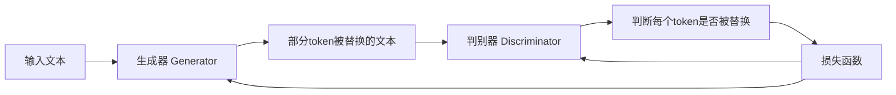

# Transformer大模型实战 ELECTRA 的生成器和判别器

## 1.背景介绍
近年来，随着深度学习技术的飞速发展，自然语言处理(NLP)领域取得了令人瞩目的进展。Transformer 架构的出现，更是掀起了 NLP 领域的一场革命。基于 Transformer 的预训练语言模型，如 BERT、GPT、XLNet 等，在各种 NLP 任务上取得了 state-of-the-art 的性能，大大推动了 NLP 技术的发展。

而在 2020 年，谷歌 AI 团队提出了 ELECTRA(Efficiently Learning an Encoder that Classifies Token Replacements Accurately)模型，再次刷新了多项 NLP 任务的最佳性能。与此同时，ELECTRA 模型还大幅提升了训练效率，训练时间仅为 BERT 的 1/4。ELECTRA 模型可谓是 NLP 领域的一大突破。

本文将深入探讨 ELECTRA 模型的核心思想和技术细节，重点介绍其生成器(Generator)和判别器(Discriminator)的原理和实现。通过本文的学习，你将掌握 ELECTRA 模型的精髓，并能够将其应用到实际的 NLP 项目中，提升模型性能和训练效率。

## 2.核心概念与联系
要理解 ELECTRA 模型，首先需要掌握以下几个核心概念：

### 2.1 Transformer 架构
Transformer 是一种基于自注意力机制(Self-Attention)的神经网络架构，广泛应用于 NLP 领域。与传统的 RNN 和 CNN 不同，Transformer 能够并行化计算，大大加速了模型训练。同时，Transformer 还能捕捉文本中的长距离依赖关系，对上下文信息建模更加准确。

### 2.2 预训练语言模型 
预训练语言模型是指在大规模无标注语料上预先训练的语言模型，如 BERT、GPT 等。通过在海量文本数据上学习通用的语言表示，预训练模型能够更好地理解和生成自然语言。预训练模型可以进一步用于下游的 NLP 任务，如文本分类、命名实体识别、问答系统等，显著提升任务性能。

### 2.3 MLM 和 DAE
ELECTRA 模型的训练过程涉及两个关键任务：Masked Language Model(MLM)和 Denoising Auto-Encoder(DAE)。

- MLM：随机 mask 掉输入文本中的部分 token，然后让模型预测被 mask 的 token。这种自监督学习方式能够让模型学到更加鲁棒的语言表示。BERT 就是典型的 MLM 模型。  

- DAE：将输入文本中的部分 token 替换为其他 token，然后训练模型恢复原始文本。通过这种方式，模型能够学习到语言的深层次结构和语义信息。ELECTRA 正是基于 DAE 思想设计的。

MLM 和 DAE 是 ELECTRA 模型的理论基础，贯穿于生成器和判别器的设计中。

### 2.4 GAN
ELECTRA 借鉴了生成对抗网络(GAN)的思想。GAN 由一个生成器(Generator)和一个判别器(Discriminator)组成，两者在训练过程中互相博弈，最终使生成器能够生成接近真实样本的数据。

ELECTRA 模型中的生成器负责替换部分 token，判别器则判断 token 是否被替换，两者联合训练，最终得到性能优异的语言模型。

## 3.核心算法原理具体操作步骤

### 3.1 ELECTRA 总体架构

ELECTRA 模型的总体架构如下图所示：



可以看到，ELECTRA 模型主要由生成器和判别器两部分组成，它们在训练过程中相互配合，最终得到性能优异的语言模型。

### 3.2 生成器(Generator)

生成器是一个 MLM 模型，主要负责以下步骤：

1. 随机 mask 掉输入文本中的部分 token，比例为 15%。
2. 对于每个被 mask 的 token，生成器预测该位置最可能的 token。
3. 用预测的 token 替换原始的 token，得到部分 token 被替换的文本。

生成器使用 Transformer 编码器实现，与 BERT 类似。不同的是，ELECTRA 的生成器规模较小，层数和隐藏单元数量均减半，以提高训练效率。

### 3.3 判别器(Discriminator) 

判别器也是一个 Transformer 编码器，主要负责以下步骤：

1. 接收生成器产生的部分 token 被替换的文本。
2. 对于每个 token，判别器判断它是否被替换。
3. 计算判别器的损失函数，即判断结果与真实标签的交叉熵损失。

判别器的目标是最小化损失函数，即提高判断 token 是否被替换的准确率。

### 3.4 联合训练

ELECTRA 模型的训练过程可以概括为以下步骤：

1. 生成器对输入文本进行 MLM 预测，产生部分 token 被替换的文本。
2. 判别器接收生成器产生的文本，判断每个 token 是否被替换。
3. 计算判别器的损失函数，并将损失回传给生成器和判别器。
4. 更新生成器和判别器的参数，使判别器的判断准确率提高，同时使生成器的 MLM 预测能力增强。
5. 重复步骤 1-4，直到模型收敛。

通过联合训练，生成器和判别器相互促进，最终得到性能优异的语言模型。

## 4.数学模型和公式详细讲解举例说明

### 4.1 生成器的数学模型

生成器的目标是最小化以下 MLM 损失函数：

$$L_{MLM}(\theta_G)=-\sum_{i=1}^n m_i \log p_G(x_i|x_{\backslash i};\theta_G)$$

其中，$\theta_G$ 表示生成器的参数，$n$ 是文本长度，$m_i$ 是指示变量，表示第 $i$ 个 token 是否被 mask，$p_G(x_i|x_{\backslash i};\theta_G)$ 表示生成器在给定上下文 $x_{\backslash i}$ 的情况下预测第 $i$ 个 token 为 $x_i$ 的概率。

生成器使用 Transformer 编码器实现，其前向传播过程可以表示为：

$$h_0 = Embedding(x)$$
$$h_l = Transformer_l(h_{l-1}), l=1,2,...,L$$
$$p_G(x_i|x_{\backslash i};\theta_G) = Softmax(W_G h_{L,i} + b_G)$$

其中，$Embedding$ 表示词嵌入层，$Transformer_l$ 表示第 $l$ 层 Transformer 块，$L$ 是 Transformer 的层数，$W_G$ 和 $b_G$ 是生成器的输出层参数。

### 4.2 判别器的数学模型

判别器的目标是最小化以下交叉熵损失函数：

$$L_D(\theta_D)=-\sum_{i=1}^n \left[ y_i \log p_D(y_i=1|x;\theta_D) + (1-y_i) \log p_D(y_i=0|x;\theta_D) \right]$$

其中，$\theta_D$ 表示判别器的参数，$y_i$ 是指示变量，表示第 $i$ 个 token 是否被替换，$p_D(y_i=1|x;\theta_D)$ 表示判别器在给定文本 $x$ 的情况下判断第 $i$ 个 token 被替换的概率。

判别器也使用 Transformer 编码器实现，其前向传播过程可以表示为：

$$h_0 = Embedding(x)$$
$$h_l = Transformer_l(h_{l-1}), l=1,2,...,L$$
$$p_D(y_i=1|x;\theta_D) = Sigmoid(w_D^T h_{L,i} + b_D)$$

其中，$w_D$ 和 $b_D$ 是判别器的输出层参数。

### 4.3 联合训练的数学模型

ELECTRA 模型的总体损失函数为生成器和判别器损失函数的加权和：

$$L(\theta_G,\theta_D) = L_{MLM}(\theta_G) + \lambda L_D(\theta_D)$$

其中，$\lambda$ 是平衡两个损失函数的超参数。

在训练过程中，生成器和判别器的参数交替更新：

$$\theta_G \leftarrow \theta_G - \eta \nabla_{\theta_G} L(\theta_G,\theta_D)$$
$$\theta_D \leftarrow \theta_D - \eta \nabla_{\theta_D} L(\theta_G,\theta_D)$$

其中，$\eta$ 是学习率。

通过以上数学模型和优化算法，ELECTRA 模型能够在联合训练中不断提升生成器的 MLM 预测能力和判别器的判断准确率，最终得到性能优异的语言模型。

## 5.项目实践：代码实例和详细解释说明

下面我们通过 PyTorch 代码来实现 ELECTRA 模型的生成器和判别器。

### 5.1 生成器代码实现

```python
class Generator(nn.Module):
    def __init__(self, config):
        super().__init__()
        self.config = config
        self.embedding = nn.Embedding(config.vocab_size, config.hidden_size)
        self.encoder = Encoder(config)
        self.mlm_head = nn.Linear(config.hidden_size, config.vocab_size)
        
    def forward(self, input_ids, attention_mask):
        embeddings = self.embedding(input_ids)
        hidden_states = self.encoder(embeddings, attention_mask)
        mlm_logits = self.mlm_head(hidden_states)
        return mlm_logits
```

生成器的主要组成部分包括：

- `embedding`：词嵌入层，将输入的 token id 映射为连续的向量表示。
- `encoder`：Transformer 编码器，用于提取输入文本的上下文信息。
- `mlm_head`：MLM 预测头，用于预测被 mask 的 token。

生成器的前向传播过程如下：

1. 将输入的 token id 通过词嵌入层映射为向量表示。
2. 将词嵌入向量输入 Transformer 编码器，提取上下文信息。
3. 将 Transformer 编码器的输出通过 MLM 预测头，得到被 mask token 的预测概率分布。

### 5.2 判别器代码实现

```python
class Discriminator(nn.Module):
    def __init__(self, config):
        super().__init__()
        self.config = config
        self.embedding = nn.Embedding(config.vocab_size, config.hidden_size)
        self.encoder = Encoder(config)
        self.discriminator_head = nn.Linear(config.hidden_size, 1)
        
    def forward(self, input_ids, attention_mask):
        embeddings = self.embedding(input_ids)
        hidden_states = self.encoder(embeddings, attention_mask)
        discriminator_logits = self.discriminator_head(hidden_states).squeeze(-1)
        return discriminator_logits
```

判别器的主要组成部分包括：

- `embedding`：词嵌入层，与生成器共享。
- `encoder`：Transformer 编码器，与生成器共享。
- `discriminator_head`：判别器预测头，用于判断 token 是否被替换。

判别器的前向传播过程如下：

1. 将输入的 token id 通过词嵌入层映射为向量表示。
2. 将词嵌入向量输入 Transformer 编码器，提取上下文信息。
3. 将 Transformer 编码器的输出通过判别器预测头，得到每个 token 被替换的概率。

### 5.3 联合训练代码实现

```python
def train_one_step(generator, discriminator, g_optimizer, d_optimizer, batch):
    input_ids, attention_mask = batch
    
    # 生成器前向传播
    with torch.no_grad():
        g_logits = generator(input_ids, attention_mask)
        pred_toks = torch.argmax(g_logits, dim=-1)
        replace_mask = torch.rand(input_ids.shape, device=input_ids.device) < 0.15
        replace_input_ids = torch.where(replace_mask, pred_toks, input_ids)
        
    # 判别器前向传播
    d_logits = discriminator(replace_input_ids, attention_mask)
    d_labels = replace_mask.float()
    d_loss = nn.BCEWithLogitsLoss()(d_logits, d_labels)
    
    # 判别器反向传播