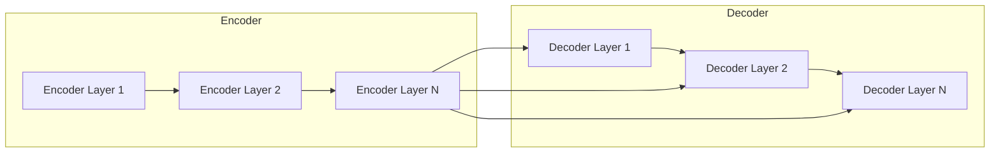
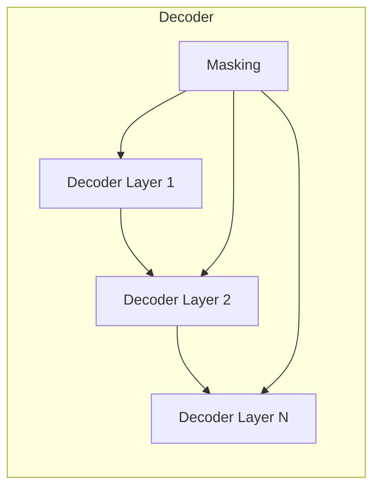

# Transformer大模型实战 Transformer 简介

## 1.背景介绍

### 1.1 深度学习的发展历程

深度学习作为一种有效的机器学习方法,已经在计算机视觉、自然语言处理等多个领域取得了巨大的成功。早期的深度学习模型主要基于卷积神经网络(CNN)和循环神经网络(RNN),在图像识别、语音识别等任务上表现出色。然而,这些模型在处理长期依赖问题时存在一定的局限性。

### 1.2 Transformer模型的兴起

2017年,Google的研究人员提出了Transformer模型,这是一种全新的基于注意力机制(Attention Mechanism)的神经网络架构。Transformer模型通过自注意力机制,能够有效地捕获输入序列中任意两个位置之间的依赖关系,从而更好地处理长期依赖问题。

Transformer模型最初被应用于机器翻译任务,取得了令人瞩目的成绩,在多个翻译基准测试中超过了基于RNN的模型。随后,Transformer及其变体被广泛应用于自然语言处理、计算机视觉、语音识别等多个领域,展现出了强大的建模能力。

### 1.3 Transformer大模型的兴起

随着Transformer模型在各个领域的成功应用,研究人员开始探索训练更大规模的Transformer模型。大规模的Transformer模型通常被称为Transformer大模型,具有数十亿甚至上百亿的参数量。这些大模型在海量数据上进行预训练,能够学习到丰富的知识表示,并在下游任务上通过微调(fine-tuning)获得出色的性能表现。

著名的Transformer大模型包括GPT(Generative Pre-trained Transformer)系列、BERT(Bidirectional Encoder Representations from Transformers)系列、T5(Text-to-Text Transfer Transformer)等。这些大模型在自然语言理解、生成、问答等多个任务上展现出了强大的能力,推动了自然语言处理领域的快速发展。

## 2.核心概念与联系

### 2.1 自注意力机制(Self-Attention Mechanism)

自注意力机制是Transformer模型的核心,它允许模型在计算目标位置的表示时,直接关注整个输入序列中的所有位置。具体来说,对于每个目标位置,自注意力机制会计算该位置与输入序列中其他所有位置的关联程度,并根据这些关联程度对其他位置的表示进行加权求和,得到目标位置的表示。

自注意力机制可以有效地捕获输入序列中任意两个位置之间的依赖关系,从而更好地处理长期依赖问题。与RNN相比,自注意力机制不存在递归计算的问题,可以并行计算,因此具有更高的计算效率。

$$
\begin{aligned}
\text{Attention}(Q, K, V) &= \text{softmax}(\frac{QK^T}{\sqrt{d_k}})V \\
\text{MultiHead}(Q, K, V) &= \text{Concat}(head_1, \ldots, head_h)W^O\\
\text{where } head_i &= \text{Attention}(QW_i^Q, KW_i^K, VW_i^V)
\end{aligned}
$$

其中,$ Q $、$ K $、$ V $分别表示查询(Query)、键(Key)和值(Value)。多头注意力机制(Multi-Head Attention)将注意力机制应用于不同的子空间,从而捕获更多的依赖关系。

### 2.2 编码器-解码器架构(Encoder-Decoder Architecture)

Transformer模型采用了编码器-解码器架构,该架构广泛应用于序列到序列(Sequence-to-Sequence)的任务中,如机器翻译、文本摘要等。

编码器(Encoder)的作用是将输入序列编码为一系列连续的表示,解码器(Decoder)则根据这些表示生成目标序列。在机器翻译任务中,编码器将源语言句子编码为表示,解码器根据这些表示生成目标语言的翻译结果。

在Transformer中,编码器和解码器都由多个相同的层组成,每一层都包含多头自注意力子层和全连接前馈网络子层。编码器中使用的是自注意力机制,而解码器除了自注意力机制之外,还引入了编码器-解码器注意力机制,允许解码器关注编码器的输出表示。

### 2.3 位置编码(Positional Encoding)

由于Transformer模型没有像RNN那样的递归结构,因此需要一种机制来捕获序列中元素的位置信息。Transformer使用位置编码(Positional Encoding)来实现这一点。

位置编码是一种将位置信息编码为向量的方法,它将被加到输入的嵌入向量中,使模型能够区分不同位置的输入。常见的位置编码方法包括正弦位置编码和学习的位置嵌入。

正弦位置编码利用正弦函数的周期性,将位置信息编码为一个固定的向量,不需要学习。而学习的位置嵌入则将位置信息作为可学习的参数,在训练过程中进行优化。

### 2.4 掩码机制(Masking Mechanism)

在机器翻译等序列到序列的任务中,解码器在生成目标序列时,不应该关注未来的位置信息,因为这会导致模型产生不合理的输出。为了解决这个问题,Transformer引入了掩码机制。

掩码机制通过在自注意力计算中加入一个掩码张量,将未来位置的注意力权重设置为一个很小的值(如负无穷),从而忽略这些位置的影响。这种机制确保了解码器在生成每个目标位置的表示时,只关注当前位置及之前的位置信息。

## 3.核心算法原理具体操作步骤

Transformer模型的核心算法原理可以概括为以下几个步骤:

1. **输入嵌入(Input Embedding)**: 将输入序列(如文本)转换为嵌入向量表示。

2. **位置编码(Positional Encoding)**: 将位置信息编码为向量,并加到输入嵌入向量中。

3. **编码器(Encoder)处理**:
   - 将带有位置编码的输入嵌入向量输入到编码器中。
   - 在每一层中,进行多头自注意力计算和前馈网络计算。
   - 编码器的输出是一系列连续的表示,捕获了输入序列中元素之间的依赖关系。

4. **解码器(Decoder)处理**:
   - 将目标序列(如翻译结果)转换为嵌入向量表示,并加上位置编码。
   - 在每一层中,进行掩码多头自注意力计算、编码器-解码器注意力计算和前馈网络计算。
   - 掩码多头自注意力计算确保解码器在生成每个位置的表示时,只关注当前位置及之前的位置信息。
   - 编码器-解码器注意力计算允许解码器关注编码器的输出表示。

5. **输出生成(Output Generation)**: 将解码器的最终输出通过线性层和softmax层,生成目标序列的概率分布。

6. **训练(Training)**: 使用监督学习方法,最小化模型在训练数据上的损失函数(如交叉熵损失),优化模型参数。

需要注意的是,Transformer模型的具体实现细节可能会有所不同,例如添加残差连接、层归一化等技术来提高模型性能和训练稳定性。

## 4.数学模型和公式详细讲解举例说明

### 4.1 注意力机制(Attention Mechanism)

注意力机制是Transformer模型的核心,它允许模型在计算目标位置的表示时,直接关注整个输入序列中的所有位置。具体来说,对于每个目标位置,注意力机制会计算该位置与输入序列中其他所有位置的关联程度,并根据这些关联程度对其他位置的表示进行加权求和,得到目标位置的表示。

注意力机制的数学表达式如下:

$$\text{Attention}(Q, K, V) = \text{softmax}(\frac{QK^T}{\sqrt{d_k}})V$$

其中:

- $Q$ 表示查询(Query)矩阵,其中每一行对应一个查询向量。
- $K$ 表示键(Key)矩阵,其中每一行对应一个键向量。
- $V$ 表示值(Value)矩阵,其中每一行对应一个值向量。
- $d_k$ 是键向量的维度,用于缩放点积的结果,以防止过大的值导致softmax函数饱和。

计算步骤如下:

1. 计算查询向量与所有键向量的点积,得到一个注意力分数矩阵。
2. 对注意力分数矩阵的每一行进行softmax操作,得到注意力权重矩阵。
3. 将注意力权重矩阵与值矩阵相乘,得到加权求和的结果,即目标位置的表示。

例如,假设我们有一个长度为5的输入序列,查询向量$q$、键向量$k_i$和值向量$v_i$分别为:

$$
q = \begin{bmatrix} 0.1 \\ 0.2 \\ 0.3 \end{bmatrix}, \quad
k_i = \begin{bmatrix} 0.4 \\ 0.5 \\ 0.6 \end{bmatrix}, \quad
v_i = \begin{bmatrix} 0.7 \\ 0.8 \\ 0.9 \end{bmatrix}
$$

则目标位置的表示$y$可以计算如下:

$$
\begin{aligned}
\text{score}_i &= \frac{q^Tk_i}{\sqrt{3}} = \frac{0.1 \times 0.4 + 0.2 \times 0.5 + 0.3 \times 0.6}{\sqrt{3}} \approx 0.28 \\
\alpha_i &= \text{softmax}(\text{score}_i) = \frac{e^{0.28}}{\sum_j e^{\text{score}_j}} \\
y &= \sum_i \alpha_i v_i = \alpha_1 v_1 + \alpha_2 v_2 + \ldots + \alpha_5 v_5
\end{aligned}
$$

通过注意力机制,模型可以自适应地为每个位置分配不同的权重,从而更好地捕获输入序列中元素之间的依赖关系。

### 4.2 多头注意力机制(Multi-Head Attention)

多头注意力机制是对注意力机制的一种扩展,它将注意力机制应用于不同的子空间,从而捕获更多的依赖关系。具体来说,多头注意力机制将查询、键和值矩阵分别线性投影到多个子空间,在每个子空间中计算注意力,最后将所有子空间的注意力结果进行拼接。

多头注意力机制的数学表达式如下:

$$
\begin{aligned}
\text{MultiHead}(Q, K, V) &= \text{Concat}(head_1, \ldots, head_h)W^O\\
\text{where } head_i &= \text{Attention}(QW_i^Q, KW_i^K, VW_i^V)
\end{aligned}
$$

其中:

- $h$ 是头数,即子空间的数量。
- $W_i^Q$、$W_i^K$、$W_i^V$ 分别是第 $i$ 个子空间的查询、键和值的线性投影矩阵。
- $W^O$ 是一个可学习的参数矩阵,用于将拼接后的注意力结果映射回原始空间。

计算步骤如下:

1. 将查询、键和值矩阵分别线性投影到 $h$ 个子空间。
2. 在每个子空间中,计算注意力机制得到注意力结果 $head_i$。
3. 将所有子空间的注意力结果拼接起来,得到一个矩阵。
4. 将拼接后的矩