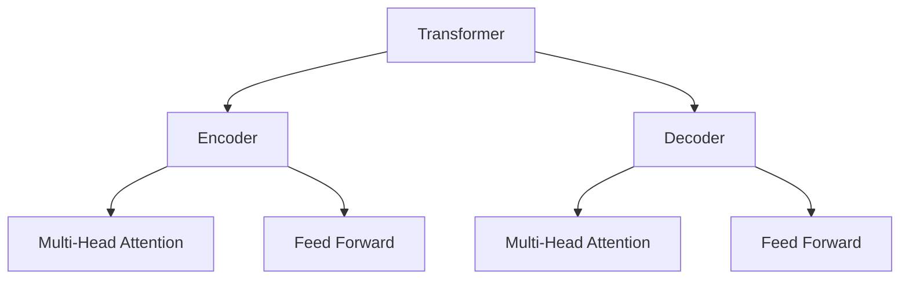
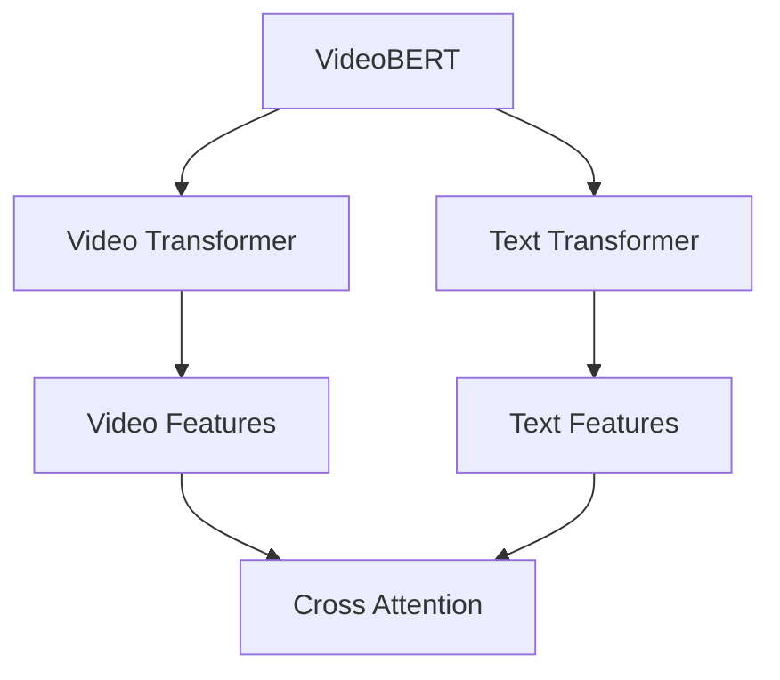

# Transformer大模型实战 VideoBERT模型学习语言及视频特征

## 1. 背景介绍

### 1.1 多模态学习的重要性

在当今信息时代,数据呈现形式日益多样化,不仅包括文本,还包括图像、视频、音频等多种模态。传统的单一模态机器学习模型已经无法满足复杂场景下的需求,因此,多模态学习 (Multimodal Learning) 应运而生。多模态学习旨在从多种模态数据中捕获丰富的信息,融合不同模态的特征,提高模型的泛化能力和鲁棒性。

### 1.2 视频理解的挑战

视频理解是多模态学习中的一个重要任务,它需要模型同时学习视频中的视觉和语音信息。与单一模态相比,视频理解面临更多挑战:

1. 视频数据的高维度和复杂性
2. 视觉和语音信息的异构性
3. 长期依赖关系的建模

### 1.3 Transformer在视频理解中的应用

Transformer 模型凭借其强大的序列建模能力,在自然语言处理领域取得了巨大成功。近年来,研究人员开始尝试将 Transformer 应用于视频理解任务,旨在捕捉视频中的长期依赖关系,并融合视觉和语音信息。VideoBERT 就是一种基于 Transformer 的视频-文本双流模型,它能够同时学习视频和文本的特征表示,为视频理解任务提供强大的支持。

## 2. 核心概念与联系

### 2.1 Transformer 模型

Transformer 是一种基于注意力机制的序列到序列模型,它不依赖于循环神经网络 (RNN) 和卷积神经网络 (CNN),而是通过自注意力机制直接捕获序列中任意两个位置之间的依赖关系。Transformer 的核心组件包括编码器 (Encoder) 和解码器 (Decoder),它们都由多个相同的层组成,每一层都包含多头自注意力子层和前馈神经网络子层。



### 2.2 VideoBERT 模型

VideoBERT 是一种基于 Transformer 的视频-文本双流模型,它由两个子模型组成:视频 Transformer 和文本 Transformer。视频 Transformer 负责捕获视频中的视觉特征,而文本 Transformer 则负责捕获文本描述中的语义信息。两个子模型通过交叉注意力机制相互关注,实现视频和文本的特征融合。



### 2.3 多模态融合

多模态融合是多模态学习的核心挑战之一。VideoBERT 通过交叉注意力机制实现视频和文本特征的融合,具体过程如下:

1. 视频 Transformer 和文本 Transformer 分别编码视频和文本输入,得到对应的特征表示。
2. 交叉注意力机制使视频特征和文本特征相互关注,捕获两种模态之间的相关性。
3. 融合后的特征表示包含了视频和文本的丰富信息,可用于下游任务,如视频描述、视频问答等。

## 3. 核心算法原理具体操作步骤

### 3.1 输入表示

VideoBERT 模型的输入包括视频和文本两个模态。

1. **视频输入**:视频被分割为一系列帧,每一帧通过预训练的视觉特征提取器 (如 3D ConvNet) 提取视觉特征,得到一个视觉特征序列。
2. **文本输入**:文本描述被tokenized,每个token通过预训练的文本编码器 (如 BERT) 编码为词向量,得到一个文本特征序列。

### 3.2 视频 Transformer

视频 Transformer 由多个相同的编码器层组成,每一层包含多头自注意力子层和前馈神经网络子层。

1. **多头自注意力子层**:计算视觉特征序列中每个位置与其他位置的注意力权重,捕获长期依赖关系。
2. **前馈神经网络子层**:对每个位置的特征进行非线性变换,增强表示能力。

通过多层编码器,视频 Transformer 可以学习到丰富的视频特征表示。

### 3.3 文本 Transformer

文本 Transformer 的结构与视频 Transformer 类似,也由多个编码器层组成。它负责捕获文本描述中的语义信息,学习到丰富的文本特征表示。

### 3.4 交叉注意力机制

交叉注意力机制是 VideoBERT 的核心,它使视频特征和文本特征相互关注,实现两种模态的融合。具体操作步骤如下:

1. 视频特征和文本特征分别通过自注意力子层,得到增强的视频特征表示 $V$ 和文本特征表示 $T$。
2. 计算视频特征和文本特征之间的注意力权重矩阵 $A_{v,t}$:

$$A_{v,t} = \text{softmax}(\frac{VW_q(TW_k)^T}{\sqrt{d_k}})$$

其中 $W_q$ 和 $W_k$ 是可学习的线性变换矩阵,用于投影视频特征和文本特征到查询空间和键空间;$d_k$ 是缩放因子。

3. 使用注意力权重矩阵 $A_{v,t}$ 更新视频特征表示:

$$\tilde{V} = \text{softmax}(A_{v,t})TW_v$$

其中 $W_v$ 是可学习的线性变换矩阵,用于投影文本特征到值空间。

4. 类似地,计算文本特征和视频特征之间的注意力权重矩阵 $A_{t,v}$,并更新文本特征表示 $\tilde{T}$。
5. 融合后的视频特征表示 $\tilde{V}$ 和文本特征表示 $\tilde{T}$ 包含了两种模态的丰富信息,可用于下游任务。

### 3.5 预训练和微调

VideoBERT 通常采用两阶段训练策略:

1. **预训练**:在大规模视频-文本数据集上进行自监督预训练,学习通用的视频和文本表示。预训练任务包括视频遮罩、句子遮罩、视频-文本匹配等。
2. **微调**:在特定的下游任务上对预训练模型进行微调,使模型适应任务的特殊需求。

## 4. 数学模型和公式详细讲解举例说明

### 4.1 多头自注意力机制

多头自注意力机制是 Transformer 模型的核心组件之一,它能够捕获序列中任意两个位置之间的依赖关系。对于一个长度为 $n$ 的序列 $X = (x_1, x_2, \dots, x_n)$,多头自注意力机制的计算过程如下:

1. 线性投影:将输入序列 $X$ 分别投影到查询 (Query)、键 (Key) 和值 (Value) 空间,得到 $Q$、$K$ 和 $V$。

$$Q = XW_Q,\ K = XW_K,\ V = XW_V$$

其中 $W_Q$、$W_K$ 和 $W_V$ 是可学习的线性变换矩阵。

2. 计算注意力权重:对于序列中的每个位置 $i$,计算它与其他位置 $j$ 的注意力权重 $\alpha_{ij}$。

$$\alpha_{ij} = \text{softmax}(\frac{Q_iK_j^T}{\sqrt{d_k}})$$

其中 $d_k$ 是缩放因子,用于防止内积值过大导致梯度消失。

3. 加权求和:使用注意力权重 $\alpha_{ij}$ 对值向量 $V_j$ 进行加权求和,得到位置 $i$ 的输出表示 $o_i$。

$$o_i = \sum_{j=1}^n \alpha_{ij}V_j$$

4. 多头注意力:为了捕获不同的子空间关系,多头注意力机制将输入序列分成 $h$ 个子空间,分别进行注意力计算,最后将各个子空间的结果拼接起来。

$$\text{MultiHead}(Q, K, V) = \text{Concat}(\text{head}_1, \text{head}_2, \dots, \text{head}_h)W^O$$

其中 $\text{head}_i = \text{Attention}(QW_i^Q, KW_i^K, VW_i^V)$,而 $W_i^Q$、$W_i^K$、$W_i^V$ 和 $W^O$ 都是可学习的线性变换矩阵。

多头自注意力机制能够有效捕获序列中的长期依赖关系,是 Transformer 模型取得巨大成功的关键所在。

### 4.2 交叉注意力机制

交叉注意力机制是 VideoBERT 实现视频-文本融合的核心,它使视频特征和文本特征相互关注,捕获两种模态之间的相关性。

假设视频特征序列为 $V = (v_1, v_2, \dots, v_m)$,文本特征序列为 $T = (t_1, t_2, \dots, t_n)$,交叉注意力机制的计算过程如下:

1. 计算视频特征和文本特征之间的注意力权重矩阵 $A_{v,t}$:

$$A_{v,t} = \text{softmax}(\frac{VW_q(TW_k)^T}{\sqrt{d_k}})$$

其中 $W_q$ 和 $W_k$ 是可学习的线性变换矩阵,用于投影视频特征和文本特征到查询空间和键空间;$d_k$ 是缩放因子。

2. 使用注意力权重矩阵 $A_{v,t}$ 更新视频特征表示:

$$\tilde{V} = \text{softmax}(A_{v,t})TW_v$$

其中 $W_v$ 是可学习的线性变换矩阵,用于投影文本特征到值空间。

3. 类似地,计算文本特征和视频特征之间的注意力权重矩阵 $A_{t,v}$,并更新文本特征表示 $\tilde{T}$。

$$A_{t,v} = \text{softmax}(\frac{TW_q(VW_k)^T}{\sqrt{d_k}})$$
$$\tilde{T} = \text{softmax}(A_{t,v})VW_v$$

4. 融合后的视频特征表示 $\tilde{V}$ 和文本特征表示 $\tilde{T}$ 包含了两种模态的丰富信息,可用于下游任务。

交叉注意力机制使 VideoBERT 能够有效融合视频和文本信息,提高了模型在视频理解任务上的性能。

## 5. 项目实践: 代码实例和详细解释说明

在本节中,我们将提供一个基于 PyTorch 的 VideoBERT 实现示例,帮助读者更好地理解模型的实现细节。

### 5.1 导入所需库

```python
import torch
import torch.nn as nn
import torch.nn.functional as F
```

### 5.2 定义 Transformer 编码器层

```python
class TransformerEncoderLayer(nn.Module):
    def __init__(self, d_model, nhead, dim_feedforward=2048, dropout=0.1):
        super(TransformerEncoderLayer, self).__init__()
        self.self_attn = nn.MultiheadAttention(d_model, nhead, dropout=dropout)
        self.linear1 = nn.Linear(d_model, dim_feedforward)
        self.dropout = nn.Dropout(dropout)
        self.linear2 = nn.Linear(dim_feedforward, d_model)

        self.norm1 = nn.LayerNorm(d_model)
        self.norm2 = nn.LayerNorm(d_model)
        self.dropout1 = nn.Dropout(dropout)
        self.dropout2 = nn.Dropout(dropout)

    def forward(self, src, src_mask=None, src_key_padding_mask=None):
        src2 = self.self_attn(src, src, src, attn_mask=src_mask,
                              key_padding_mask=src_key_padding_mask)[0]
        src = src + self.dropout1(src2)
        src = self.norm1(src)
        src2 = self.linear2(self.dropout(F.relu(self.linear1(src))))
        src = src + self.dropout2(src2)
        src = self.norm2(src)