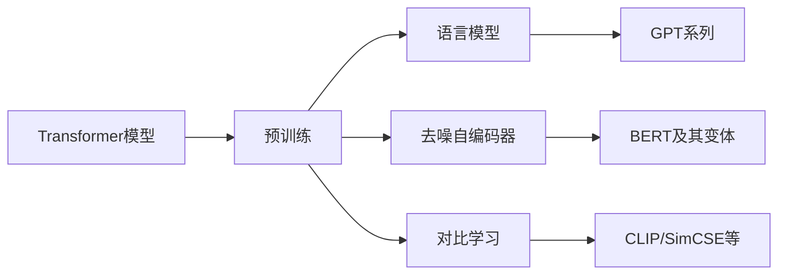

# Transformer大模型实战 比较不同的预训练目标

## 1.背景介绍
### 1.1 Transformer模型的兴起
Transformer模型自从2017年被提出以来，迅速成为自然语言处理(NLP)领域的主流模型架构。它摒弃了此前主流的RNN模型，完全依赖注意力机制(Attention Mechanism)来学习文本的上下文依赖关系，在机器翻译、文本分类、问答系统等多个NLP任务上取得了突破性的进展。

### 1.2 预训练的重要性
随着模型和数据规模的不断扩大，从头训练这些大型Transformer模型的成本变得越来越高。为了解决这个问题，预训练(Pre-training)技术应运而生。通过在大规模无标注语料上进行自监督学习，模型可以学习到语言的通用表征，再在具体任务上进行微调(Fine-tuning)，从而大幅节省训练成本，提高模型性能。

### 1.3 不同预训练目标的探索
预训练方法的选择对最终模型性能有着至关重要的影响。研究人员提出了多种预训练目标，如语言模型、去噪自编码器、对比学习等。不同的预训练目标让模型关注不同的语言特征，具有不同的优缺点。本文将重点比较几种主流的预训练目标，分析它们的原理、优劣和适用场景。

## 2.核心概念与联系
### 2.1 语言模型(Language Modeling)
语言模型是一种经典的自监督学习目标，让模型学习在给定上文的情况下预测下一个单词。通过这种方式，模型可以学习单词的语义以及语言的语法、句法结构。代表模型有GPT系列。

### 2.2 去噪自编码器(Denoising Autoencoder) 
去噪自编码器是另一种常用的预训练目标，通过随机遮挡或替换部分输入文本，让模型学习恢复原始文本。这种方法可以让模型学习文本的全局语义，对噪声具有更强的鲁棒性。BERT及其变体主要采用这一目标。

### 2.3 对比学习(Contrastive Learning)
对比学习通过最大化正样本对的相似度，最小化负样本对的相似度，让模型学习文本的语义表征。这种方法可以让模型关注语义层面的信息，而不是局限于字面的共现关系。代表模型有CLIP、SimCSE等。

### 2.4 融合多种目标
上述几种预训练目标并不是互斥的，研究者们也在探索融合多种不同目标的方法，以期获得更全面、更鲁棒的语言表征。



## 3.核心算法原理具体操作步骤

### 3.1 语言模型(GPT系列)
#### 3.1.1 输入表示
将文本序列 $\mathbf{x} = (x_1, x_2, ..., x_n)$ 通过词嵌入(Word Embedding)和位置编码(Positional Encoding)映射为向量序列 $\mathbf{h}^0 = (\mathbf{h}_1^0, \mathbf{h}_2^0, ..., \mathbf{h}_n^0)$。

#### 3.1.2 Transformer编码
通过堆叠的Transformer编码器块对输入序列进行编码，第 $l$ 层的输出为:

$$
\mathbf{h}^l = \text{TransformerBlock}(\mathbf{h}^{l-1}), l = 1,2,...,L
$$

其中 TransformerBlock 包括多头自注意力(Multi-head Self-attention)和前馈网络(Feed-forward Network)两个子层。

#### 3.1.3 语言模型损失
对于每个位置 $t$，使用第 $L$ 层的隐状态 $\mathbf{h}_t^L$ 预测下一个单词 $x_{t+1}$，损失函数为:

$$
\mathcal{L}_{LM} = -\sum_{t=1}^{n-1} \log P(x_{t+1}|\mathbf{h}_t^L)
$$

其中 $P(x_{t+1}|\mathbf{h}_t^L)$ 通过softmax层计算。

### 3.2 去噪自编码器(BERT系列)
#### 3.2.1 输入表示
对于文本序列 $\mathbf{x} = (x_1, x_2, ..., x_n)$，随机遮挡或替换其中的一些单词，得到损坏的序列 $\hat{\mathbf{x}} = (\hat{x}_1, \hat{x}_2, ..., \hat{x}_n)$。将 $\hat{\mathbf{x}}$ 通过词嵌入和位置编码映射为 $\mathbf{h}^0$。

#### 3.2.2 Transformer编码
与语言模型类似，通过Transformer编码器对输入序列进行编码:

$$
\mathbf{h}^l = \text{TransformerBlock}(\mathbf{h}^{l-1}), l = 1,2,...,L
$$

#### 3.2.3 重构损失
对于每个被遮挡或替换的位置 $t$，使用第 $L$ 层的隐状态 $\mathbf{h}_t^L$ 预测原始单词 $x_t$，损失函数为:

$$
\mathcal{L}_{DAE} = -\sum_{t \in \mathcal{C}} \log P(x_t|\mathbf{h}_t^L)
$$

其中 $\mathcal{C}$ 为被遮挡或替换的位置集合。

### 3.3 对比学习(SimCSE等)
#### 3.3.1 正负样本构建
对于每个文本序列 $\mathbf{x}$，构建其正样本 $\mathbf{x}^+$ (如通过数据增强得到) 和若干负样本 $\{\mathbf{x}_i^-\}$。将它们通过词嵌入和位置编码映射为 $\mathbf{h}, \mathbf{h}^+, \{\mathbf{h}_i^-\}$。

#### 3.3.2 Transformer编码
通过Transformer编码器分别对 $\mathbf{h}, \mathbf{h}^+, \{\mathbf{h}_i^-\}$ 进行编码，得到它们的句向量表征 $\mathbf{z}, \mathbf{z}^+, \{\mathbf{z}_i^-\}$。

#### 3.3.3 对比损失
使用InfoNCE损失最大化正样本对 $(\mathbf{z}, \mathbf{z}^+)$ 的相似度，最小化与负样本 $\{\mathbf{z}_i^-\}$ 的相似度:

$$
\mathcal{L}_{CL} = -\log \frac{e^{\text{sim}(\mathbf{z},\mathbf{z}^+)/\tau}}
{e^{\text{sim}(\mathbf{z},\mathbf{z}^+)/\tau} + \sum_i e^{\text{sim}(\mathbf{z},\mathbf{z}_i^-)/\tau}}
$$

其中 $\text{sim}(\cdot,\cdot)$ 为余弦相似度，$\tau$ 为温度超参数。

## 4.数学模型和公式详细讲解举例说明

### 4.1 注意力机制(Attention Mechanism)
注意力机制是Transformer模型的核心组件，用于捕捉文本中的长距离依赖关系。对于查询向量 $\mathbf{q}$, 键向量 $\mathbf{k}$ 和值向量 $\mathbf{v}$, 注意力分数 $\alpha$ 计算如下:

$$
\alpha = \text{softmax}(\frac{\mathbf{q}\mathbf{k}^T}{\sqrt{d}})
$$

其中 $d$ 为向量维度。注意力输出为值向量的加权和:

$$
\text{Attention}(\mathbf{q},\mathbf{k},\mathbf{v}) = \alpha \mathbf{v}
$$

在自注意力(Self-attention)中，查询、键、值向量都来自同一个输入序列。多头自注意力将输入线性投影到多个子空间，分别进行注意力计算，再拼接结果:

$$
\text{MultiHead}(\mathbf{h}) = \text{Concat}(\text{head}_1, ..., \text{head}_H) \mathbf{W}^O \\
\text{head}_i = \text{Attention}(\mathbf{h}\mathbf{W}_i^Q, \mathbf{h}\mathbf{W}_i^K, \mathbf{h}\mathbf{W}_i^V)
$$

其中 $\mathbf{W}_i^Q, \mathbf{W}_i^K, \mathbf{W}_i^V, \mathbf{W}^O$ 为可学习的投影矩阵。

### 4.2 前馈网络(Feed-forward Network)
前馈网络由两个线性变换和一个非线性激活函数(通常为ReLU)组成，用于增加模型的非线性表达能力:

$$
\text{FFN}(\mathbf{h}) = \text{ReLU}(\mathbf{h}\mathbf{W}_1 + \mathbf{b}_1)\mathbf{W}_2 + \mathbf{b}_2
$$

其中 $\mathbf{W}_1, \mathbf{W}_2, \mathbf{b}_1, \mathbf{b}_2$ 为可学习的参数矩阵和偏置向量。

### 4.3 残差连接和层归一化
为了促进梯度传播和训练稳定性，Transformer在每个子层之后都会加入残差连接(Residual Connection)和层归一化(Layer Normalization):

$$
\mathbf{h}' = \text{LayerNorm}(\mathbf{h} + \text{Sublayer}(\mathbf{h}))
$$

其中 $\text{Sublayer}(\cdot)$ 表示自注意力或前馈网络子层。层归一化通过缩放和平移输入使其均值为0、方差为1:

$$
\text{LayerNorm}(\mathbf{h}) = \frac{\mathbf{h} - \mu}{\sqrt{\sigma^2 + \epsilon}} \odot \gamma + \beta
$$

其中 $\mu, \sigma^2$ 为均值和方差，$\gamma, \beta$ 为可学习的缩放和平移参数，$\epsilon$ 为平滑项。

## 5.项目实践：代码实例和详细解释说明

下面以PyTorch为例，展示如何实现Transformer编码器的核心组件:

```python
import torch
import torch.nn as nn

class MultiHeadAttention(nn.Module):
    def __init__(self, d_model, num_heads):
        super().__init__()
        self.d_model = d_model
        self.num_heads = num_heads
        self.head_dim = d_model // num_heads
        
        self.q_proj = nn.Linear(d_model, d_model)
        self.k_proj = nn.Linear(d_model, d_model)
        self.v_proj = nn.Linear(d_model, d_model)
        self.out_proj = nn.Linear(d_model, d_model)
    
    def forward(self, query, key, value, attn_mask=None):
        batch_size = query.size(0)
        
        # 线性投影到多个子空间
        q = self.q_proj(query).view(batch_size, -1, self.num_heads, self.head_dim).transpose(1, 2)
        k = self.k_proj(key).view(batch_size, -1, self.num_heads, self.head_dim).transpose(1, 2)
        v = self.v_proj(value).view(batch_size, -1, self.num_heads, self.head_dim).transpose(1, 2)
        
        # 缩放点积注意力
        attn_scores = torch.matmul(q, k.transpose(-2, -1)) / math.sqrt(self.head_dim)
        if attn_mask is not None:
            attn_scores = attn_scores.masked_fill(attn_mask == 0, -1e9)
        attn_probs = F.softmax(attn_scores, dim=-1)
        
        # 注意力加权
        attn_output = torch.matmul(attn_probs, v)
        attn_output = attn_output.transpose(1, 2).contiguous().view(batch_size, -1, self.d_model)
        
        # 线性输出
        attn_output = self.out_proj(attn_output)
        return attn_output

class FeedForward(nn.Module):
    def __init__(self, d_model, d_ff):
        super().__init__()
        self.linear1 = nn.Linear(d_model, d_ff)
        self.linear2 = nn.Linear(d_ff, d_model)
    
    def forward(self, x):
        x = self.linear1(x)
        x = F.relu(x)
        x = self.linear2(x)
        return x

class TransformerEncoderLayer(nn.Module):
    def __init__(self, d_model, num_heads, d_ff):
        super().__init__()
        self.self_attn = MultiHe