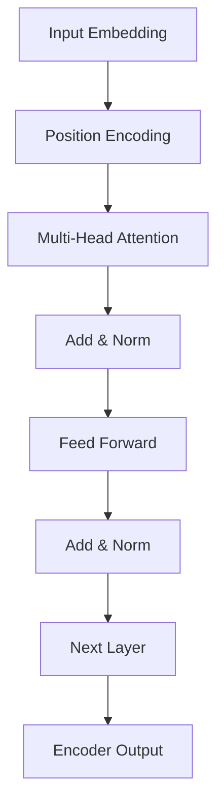

# Transformer大模型实战：理解编码器

## 1.背景介绍

### 1.1 序列到序列模型的崛起

在深度学习时代,序列到序列(Sequence-to-Sequence, Seq2Seq)模型逐渐成为自然语言处理、机器翻译、语音识别等领域的主导范式。传统的Seq2Seq模型通常由编码器(Encoder)和解码器(Decoder)组成,编码器将输入序列编码为上下文向量表示,解码器则根据该向量生成目标序列。

### 1.2 注意力机制的革命性作用 

虽然Seq2Seq模型取得了一些成功,但在处理长序列时仍然存在瓶颈。2014年,注意力机制(Attention Mechanism)应运而生,它允许模型在生成每个目标词时,对输入序列中的不同位置赋予不同的权重,从而更好地捕获长距离依赖关系。注意力机制极大地提高了Seq2Seq模型的性能。

### 1.3 Transformer模型的诞生

2017年,Transformer模型在论文"Attention Is All You Need"中被提出,它完全抛弃了RNN和CNN,纯粹基于注意力机制构建,在机器翻译等任务上取得了令人瞩目的成绩。Transformer的核心组件是编码器(Encoder)和解码器(Decoder),本文将重点介绍编码器的工作原理。

## 2.核心概念与联系

### 2.1 自注意力机制(Self-Attention)

Transformer编码器的核心是多头自注意力机制(Multi-Head Self-Attention),它允许输入序列中的每个词都可以关注其他词,捕获序列内部的长距离依赖关系。

自注意力机制的计算过程如下:

$$\begin{aligned}
\text{Attention}(Q, K, V) &= \text{softmax}(\frac{QK^T}{\sqrt{d_k}})V \\
\text{MultiHead}(Q, K, V) &= \text{Concat}(head_1, ..., head_h)W^O\\
\text{where} \, head_i &= \text{Attention}(QW_i^Q, KW_i^K, VW_i^V)
\end{aligned}$$

其中 $Q$、$K$、$V$ 分别表示查询(Query)、键(Key)和值(Value)向量,通过线性变换得自输入序列。多头注意力机制可以从不同的子空间捕获不同的信息。

### 2.2 位置编码(Positional Encoding)

由于Transformer没有使用RNN或CNN捕获序列顺序,因此需要一种位置编码方式将词序信息注入到模型中。Transformer采用的是正弦位置编码,其公式如下:

$$PE_{(pos, 2i)} = \sin(pos / 10000^{2i / d_{model}})$$
$$PE_{(pos, 2i+1)} = \cos(pos / 10000^{2i / d_{model}})$$

其中$pos$是词在序列中的位置,而$i$是编码的维度。该位置编码会直接加到输入的嵌入向量上。

### 2.3 层归一化(Layer Normalization)

为了避免内部协变量偏移的问题,Transformer在每个子层之后应用层归一化(Layer Normalization),公式如下:

$$\begin{aligned}
&\mu_\beta = \frac{1}{H}\sum_{i=1}^{H}x_{i} \qquad &\text{(计算均值)}\\
&\sigma_\beta^2 = \frac{1}{H}\sum_{i=1}^{H}(x_i - \mu_\beta)^2 \qquad &\text{(计算方差)}\\
&\hat{x_i} = \frac{x_i - \mu_\beta}{\sqrt{\sigma_\beta^2 + \epsilon}} \qquad &\text{(归一化)}\\
&LN_{\beta}(x_i) = \gamma \hat{x_i} + \beta \qquad &\text{(重缩放和位移)}
\end{aligned}$$

这里 $\beta$ 和 $\gamma$ 是可学习的参数向量。层归一化有助于加速收敛并提高模型性能。

## 3.核心算法原理具体操作步骤

Transformer编码器的核心操作步骤如下:

1. **嵌入和位置编码**: 将输入序列的词映射为嵌入向量,并加上位置编码以注入位置信息。

2. **多头自注意力**: 计算自注意力,捕获序列内部的长距离依赖关系。多头机制可从不同子空间提取信息。

3. **残差连接和层归一化**: 对注意力输出进行残差连接,并执行层归一化以加速收敛。

4. **前馈全连接网络**: 将归一化后的注意力表示通过全连接前馈网络,对表示进行非线性变换。

5. **残差连接和层归一化**: 再次进行残差连接和层归一化。

6. **堆叠和编码器输出**: 重复上述步骤 N 次(N 是编码器层数),最终输出是最上层的编码器表示。

下面是编码器的计算流程图:



通过这种方式,Transformer编码器可以高效地捕获输入序列的上下文信息,为下游任务提供强有力的表示。

## 4.数学模型和公式详细讲解举例说明

在上一节中,我们已经给出了自注意力机制、位置编码和层归一化的数学公式,现在让我们通过具体例子来进一步理解它们。

### 4.1 自注意力机制详解

假设我们有一个长度为 6 的输入序列 $X = (x_1, x_2, x_3, x_4, x_5, x_6)$,我们希望计算第三个词 $x_3$ 的注意力表示。

首先,我们需要将输入序列 $X$ 映射为查询 $Q$、键 $K$ 和值 $V$ 向量:

$$Q = X W^Q, \quad K = X W^K, \quad V = X W^V$$

其中 $W^Q$、$W^K$ 和 $W^V$ 是可学习的权重矩阵。

接下来,我们计算 $x_3$ 对其他词的注意力权重:

$$\text{Attention}(x_3, X) = \text{softmax}(\frac{q_3 k_1^T}{\sqrt{d_k}}, \frac{q_3 k_2^T}{\sqrt{d_k}}, \ldots, \frac{q_3 k_6^T}{\sqrt{d_k}})$$

其中 $q_3$ 和 $k_i$ 分别是 $Q$ 和 $K$ 中对应的向量。注意力权重反映了 $x_3$ 对其他词的关注程度。

最后,我们将注意力权重与值向量 $V$ 相乘,得到 $x_3$ 的注意力表示:

$$\text{Attention}(x_3) = \sum_{i=1}^{6} \alpha_i v_i$$

其中 $\alpha_i$ 是注意力权重,而 $v_i$ 是 $V$ 中对应的值向量。

对于多头注意力,我们只需要重复上述过程 $h$ 次(每次使用不同的权重矩阵),然后将结果拼接即可。

### 4.2 位置编码示例

假设我们有一个长度为 4 的序列,嵌入维度为 8,让我们计算第二个位置的位置编码:

$$\begin{aligned}
PE_{(2, 0)} &= \sin(2 / 10000^{0/8}) = 0 \\
PE_{(2, 1)} &= \cos(2 / 10000^{1/8}) = 0.847\\ 
PE_{(2, 2)} &= \sin(2 / 10000^{2/8}) = 0.156\\
&\ldots\\
PE_{(2, 7)} &= \sin(2 / 10000^{7/8}) = -0.104
\end{aligned}$$

因此,第二个位置的位置编码是 $(0, 0.847, 0.156, \ldots, -0.104)$。我们将其加到对应位置的词嵌入向量上,就可以注入位置信息了。

### 4.3 层归一化实例

假设我们有一个小批量输入 $X = (x_1, x_2, x_3)$,其中 $x_1 = (5, 1, 0)$、$x_2 = (1, 3, 3)$ 和 $x_3 = (0, 5, 7)$。我们希望对这个小批量进行层归一化。

首先,我们计算均值和方差:

$$\begin{aligned}
\mu &= \frac{1}{3}(5 + 1 + 0, 1 + 3 + 5, 0 + 3 + 7) = (2, 3, \frac{10}{3})\\
\sigma^2 &= \frac{1}{3}((5 - 2)^2 + (1 - 2)^2 + (0 - 2)^2, \ldots) = (\frac{10}{3}, \frac{8}{3}, \frac{28}{9})
\end{aligned}$$

接下来,我们执行归一化和重缩放:

$$\begin{aligned}
\hat{x_1} &= \frac{5 - 2}{\sqrt{\frac{10}{3} + \epsilon}}, \frac{1 - 3}{\sqrt{\frac{8}{3} + \epsilon}}, \frac{0 - \frac{10}{3}}{\sqrt{\frac{28}{9} + \epsilon}} \\
\hat{x_2} &= \frac{1 - 2}{\sqrt{\frac{10}{3} + \epsilon}}, \frac{3 - 3}{\sqrt{\frac{8}{3} + \epsilon}}, \frac{3 - \frac{10}{3}}{\sqrt{\frac{28}{9} + \epsilon}}\\
\hat{x_3} &= \frac{0 - 2}{\sqrt{\frac{10}{3} + \epsilon}}, \frac{5 - 3}{\sqrt{\frac{8}{3} + \epsilon}}, \frac{7 - \frac{10}{3}}{\sqrt{\frac{28}{9} + \epsilon}}\\
\end{aligned}$$

其中 $\epsilon$ 是一个很小的常数,用于避免除以零。

最后,我们对归一化后的结果进行重缩放和位移:

$$LN(X) = \gamma \hat{X} + \beta$$

其中 $\gamma$ 和 $\beta$ 是可学习的参数向量。

通过这种方式,层归一化可以加速模型收敛并提高性能。

## 5.项目实践:代码实例和详细解释说明

为了更好地理解Transformer编码器的工作原理,我们将使用PyTorch实现一个简单的编码器模型。完整代码请参考:https://github.com/coderzm/transformer-encoder

首先,让我们定义一些基本参数:

```python
import math
import torch
import torch.nn as nn

# 超参数
max_len = 60  # 输入序列的最大长度
d_model = 512  # 模型维度
n_heads = 8  # 多头注意力头数
d_ff = 2048  # 前馈全连接网络的维度
n_layers = 6  # 编码器层数
dropout = 0.1  # dropout率
```

### 5.1 位置编码

我们先实现位置编码层:

```python
class PositionalEncoding(nn.Module):
    def __init__(self, d_model, max_len=5000, dropout=0.1):
        super().__init__()
        self.dropout = nn.Dropout(p=dropout)
        pe = torch.zeros(max_len, d_model)
        position = torch.arange(0, max_len, dtype=torch.float).unsqueeze(1)
        div_term = torch.exp(torch.arange(0, d_model, 2).float() * (-math.log(10000.0) / d_model))
        pe[:, 0::2] = torch.sin(position * div_term)
        pe[:, 1::2] = torch.cos(position * div_term)
        pe = pe.unsqueeze(0)
        self.register_buffer('pe', pe)

    def forward(self, x):
        x = x + self.pe[:, :x.size(1), :]
        return self.dropout(x)
```

这里我们先构造一个位置编码张量 `pe`,其形状为 `(1, max_len, d_model)`。然后,我们将其加到输入嵌入上,并执行 Dropout 操作。

### 5.2 缩放点积注意力

接下来,我们实现缩放点积注意力层:

```python
class ScaledDotProductAttention(nn.Module):
    def __init__(self):
        super().__init__()

    def forward(self, q, k, v, mask=None):
        # 获取查询、键和值的最后一个维度
        d_k = q.size(-1)
        # 计算注意力权重
        scores = torch.matmul(q, k.transpose(-2, -1)) / math.sqrt(d_k)
        if mask is not None:
            scores = scores.masked_fill(mask == 0, -1e