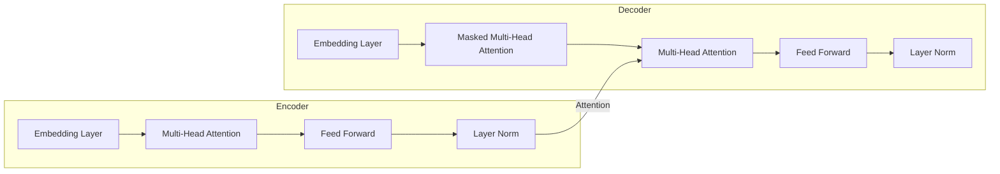

# Transformer大模型实战 西班牙语的BETO模型

## 1.背景介绍

### 1.1 自然语言处理的重要性

在当今的数字时代,自然语言处理(Natural Language Processing,NLP)已经成为一个不可或缺的技术领域。它使计算机能够理解、解释和生成人类语言,为人机交互提供了强大的支持。随着大数据和人工智能技术的快速发展,NLP在各个领域都有着广泛的应用前景,如机器翻译、智能问答系统、情感分析、自动文摘等。

### 1.2 Transformer模型的崛起

2017年,Transformer模型被提出,它完全依赖于注意力机制(Attention Mechanism),摒弃了传统序列模型中的循环神经网络和卷积神经网络结构。这种全新的架构极大地提高了模型的并行计算能力,同时显著缩短了训练时间。Transformer模型在机器翻译等任务上取得了卓越的成绩,引发了NLP领域的革命性变化。

### 1.3 BERT与多语种NLP

2018年,谷歌推出了BERT(Bidirectional Encoder Representations from Transformers)模型,它基于Transformer架构,采用了全新的双向编码器表示,在多项NLP任务上取得了突破性进展。然而,BERT主要针对英语等高资源语言,对于低资源语言的支持则相对有限。

### 1.4 BETO:面向西班牙语的预训练语言模型

为了更好地服务于西班牙语社区,西班牙语BERT(Bidirectional Encoder Representations from Transformers for Spanish,BETO)应运而生。它是一个针对西班牙语的大型预训练语言模型,旨在为西语NLP任务提供强有力的支持。

## 2.核心概念与联系

### 2.1 Transformer架构

Transformer模型的核心架构由编码器(Encoder)和解码器(Decoder)两个部分组成。编码器将输入序列映射为一系列连续的表示,解码器则根据这些表示生成输出序列。两者之间通过注意力机制建立联系,实现序列到序列(Sequence-to-Sequence)的转换。



### 2.2 自注意力机制(Self-Attention)

自注意力机制是Transformer模型的核心,它允许模型捕捉输入序列中任意两个位置之间的依赖关系,而不受距离或方向的限制。这种灵活的注意力机制大大提高了模型的表现力,使其能够更好地建模长距离依赖。

### 2.3 多头注意力机制(Multi-Head Attention)

多头注意力机制是在自注意力机制的基础上进行扩展,它将注意力分成多个子空间,每个子空间都学习到输入序列的不同表示,最后将这些表示合并起来,捕捉更丰富的依赖关系。

### 2.4 BERT的双向编码器表示

BERT模型采用了双向编码器表示,即在编码器中同时考虑了输入序列的左右上下文信息。这种方式能够更好地捕捉序列中的语义信息,为下游NLP任务提供更有效的表示。

### 2.5 BETO与BERT的区别

BETO模型在BERT的基础上进行了针对西班牙语的预训练,使用了大量的西语语料库。与BERT相比,BETO能够更好地理解和表示西语的语法、语义和语用特征,为西语NLP任务提供更准确的支持。

## 3.核心算法原理具体操作步骤

### 3.1 Transformer编码器

Transformer编码器的核心操作步骤如下:

1. **嵌入层(Embedding Layer)**: 将输入序列的每个词元(token)映射为一个固定长度的向量表示。

2. **位置编码(Positional Encoding)**: 由于Transformer没有递归或卷积结构,因此需要显式地引入位置信息。位置编码将位置信息编码到每个词元的嵌入向量中。

3. **多头自注意力(Multi-Head Self-Attention)**: 计算每个词元与输入序列中所有其他词元的注意力权重,生成注意力表示。

   - 将查询(Query)、键(Key)和值(Value)投影到不同的子空间
   - 计算每个子空间中的注意力权重
   - 将注意力表示合并

4. **前馈神经网络(Feed Forward Neural Network)**: 对注意力表示进行非线性变换,捕捉更高级的特征。

5. **残差连接(Residual Connection)**: 将输入和子层的输出相加,以缓解深度网络的梯度消失问题。

6. **层归一化(Layer Normalization)**: 对残差连接的输出进行归一化,加速收敛并提高模型稳定性。

上述步骤在编码器的每一层中重复进行,最终输出编码器的最终表示。

### 3.2 Transformer解码器

Transformer解码器的操作步骤与编码器类似,但有以下不同之处:

1. **掩码自注意力(Masked Self-Attention)**: 在自注意力计算中,解码器只能关注当前位置及其之前的位置,以保证不会"窥视"未来的信息。

2. **编码器-解码器注意力(Encoder-Decoder Attention)**: 解码器需要关注编码器的输出,以捕捉输入序列和输出序列之间的依赖关系。

3. **线性层和softmax层**: 在最后一层,解码器会通过一个线性层和softmax层生成词元的概率分布,从而得到输出序列。

### 3.3 BERT/BETO预训练

BERT/BETO模型采用了两个预训练任务:

1. **掩码语言模型(Masked Language Model, MLM)**: 随机掩码输入序列中的一些词元,模型需要根据上下文预测被掩码的词元。

2. **下一句预测(Next Sentence Prediction, NSP)**: 判断两个句子是否相邻,以捕捉更长距离的依赖关系。

通过在大规模语料库上进行预训练,BERT/BETO模型能够学习到丰富的语言知识,为下游NLP任务提供强大的初始化参数。

## 4.数学模型和公式详细讲解举例说明

### 4.1 注意力机制(Attention Mechanism)

注意力机制是Transformer模型的核心,它能够自动捕捉输入序列中任意两个位置之间的依赖关系。给定一个查询向量 $\boldsymbol{q}$ 和一组键向量 $\{\boldsymbol{k}_1, \boldsymbol{k}_2, \ldots, \boldsymbol{k}_n\}$ 及其对应的值向量 $\{\boldsymbol{v}_1, \boldsymbol{v}_2, \ldots, \boldsymbol{v}_n\}$,注意力机制的计算过程如下:

$$\begin{aligned}
\text{Attention}(\boldsymbol{q}, \boldsymbol{K}, \boldsymbol{V}) &= \text{softmax}\left(\frac{\boldsymbol{q}\boldsymbol{K}^\top}{\sqrt{d_k}}\right)\boldsymbol{V} \\
&= \sum_{i=1}^n \alpha_i \boldsymbol{v}_i
\end{aligned}$$

其中, $\boldsymbol{K} = [\boldsymbol{k}_1, \boldsymbol{k}_2, \ldots, \boldsymbol{k}_n]$ 是键矩阵, $\boldsymbol{V} = [\boldsymbol{v}_1, \boldsymbol{v}_2, \ldots, \boldsymbol{v}_n]$ 是值矩阵, $d_k$ 是键向量的维度, $\alpha_i$ 是注意力权重。

注意力机制通过计算查询向量与每个键向量的相似性,得到对应的注意力权重,然后将注意力权重与值向量加权求和,得到注意力表示。这种机制允许模型自适应地选择输入序列中最相关的部分,并聚焦于这些部分以生成输出。

### 4.2 多头注意力机制(Multi-Head Attention)

多头注意力机制是在注意力机制的基础上进行扩展,它将注意力分成多个子空间,每个子空间都学习到输入序列的不同表示,最后将这些表示合并起来,捕捉更丰富的依赖关系。

具体来说,给定查询 $\boldsymbol{Q}$、键 $\boldsymbol{K}$ 和值 $\boldsymbol{V}$,多头注意力机制的计算过程如下:

$$\begin{aligned}
\text{MultiHead}(\boldsymbol{Q}, \boldsymbol{K}, \boldsymbol{V}) &= \text{Concat}(\text{head}_1, \text{head}_2, \ldots, \text{head}_h)\boldsymbol{W}^O \\
\text{where}\quad \text{head}_i &= \text{Attention}(\boldsymbol{Q}\boldsymbol{W}_i^Q, \boldsymbol{K}\boldsymbol{W}_i^K, \boldsymbol{V}\boldsymbol{W}_i^V)
\end{aligned}$$

其中, $\boldsymbol{W}_i^Q \in \mathbb{R}^{d_\text{model} \times d_k}$、$\boldsymbol{W}_i^K \in \mathbb{R}^{d_\text{model} \times d_k}$ 和 $\boldsymbol{W}_i^V \in \mathbb{R}^{d_\text{model} \times d_v}$ 是可学习的线性投影矩阵, $\boldsymbol{W}^O \in \mathbb{R}^{hd_v \times d_\text{model}}$ 是另一个可学习的线性投影矩阵, $h$ 是头数, $d_\text{model}$ 是模型的隐藏维度。

多头注意力机制通过多个独立的注意力子空间,能够从不同的表示子空间中捕捉输入序列的不同依赖关系,提高了模型的表现力。

### 4.3 位置编码(Positional Encoding)

由于Transformer模型没有递归或卷积结构,因此需要显式地引入位置信息。位置编码将位置信息编码到每个词元的嵌入向量中,使模型能够捕捉序列的顺序信息。

Transformer使用的是正弦和余弦函数来编码位置信息,具体公式如下:

$$\begin{aligned}
\text{PE}_{(pos, 2i)} &= \sin\left(pos / 10000^{2i / d_\text{model}}\right) \\
\text{PE}_{(pos, 2i+1)} &= \cos\left(pos / 10000^{2i / d_\text{model}}\right)
\end{aligned}$$

其中, $pos$ 是词元的位置索引, $i$ 是维度索引, $d_\text{model}$ 是模型的隐藏维度。

通过这种方式编码位置信息,模型能够自然地捕捉相对位置和绝对位置的信息,而不需要手动设计位置特征。

## 5.项目实践:代码实例和详细解释说明

在这一部分,我们将介绍如何使用HuggingFace的Transformers库来加载和微调BETO模型,并应用于西班牙语的自然语言处理任务。

### 5.1 安装依赖库

首先,我们需要安装所需的Python库,包括Transformers、PyTorch和其他必要的库。可以使用pip或conda进行安装:

```bash
pip install transformers pytorch
```

### 5.2 加载BETO模型

我们可以使用`AutoModel`和`AutoTokenizer`从HuggingFace的模型中心加载BETO模型和tokenizer:

```python
from transformers import AutoModel, AutoTokenizer

model_name = "dccuchile/bert-base-spanish-wwm-cased"
tokenizer = AutoTokenizer.from_pretrained(model_name)
model = AutoModel.from_pretrained(model_name)
```

### 5.3 文本预处理

在将文本输入到模型之前,我们需要使用tokenizer对文本进行预处理,将其转换为模型可以理解的形式:

```python
text = "Este es un ejemplo de texto en español."
inputs = tokenizer(text, return_tensors="pt")
```

### 5.4 模型推理

现在,我们可以将预处理后的输入传递给BETO模型,获得对应的输出表示:

```python
outputs =