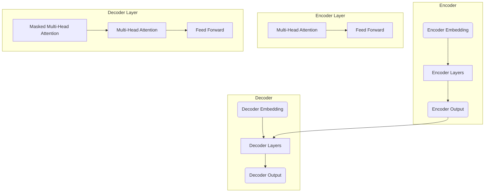

# Transformer大模型实战 语码混用和音译的影响

## 1.背景介绍

### 1.1 Transformer大模型概述

Transformer是一种全新的基于注意力机制的神经网络架构,由谷歌的Vaswani等人在2017年提出,主要应用于自然语言处理(NLP)任务。与传统的基于循环神经网络(RNN)或卷积神经网络(CNN)的序列模型不同,Transformer完全依赖注意力机制来捕获输入和输出之间的全局依赖关系,避免了RNN的梯度消失和爆炸问题,同时支持并行计算,大大提高了训练速度。

Transformer架构主要由编码器(Encoder)和解码器(Decoder)两个子模块组成。编码器将输入序列编码为一系列连续的向量表示,解码器则根据编码器的输出向量生成目标序列。两个模块内部都采用了多头自注意力(Multi-Head Attention)和前馈神经网络(Feed-Forward Network)等关键组件。

随着数据和计算能力的不断增长,Transformer模型的规模也在不断扩大。目前,GPT-3、PanGu-Alpha、BLOOM等超大规模预训练语言模型(Large Language Model,LLM)已经达到数十亿甚至上万亿参数的规模,展现出了强大的泛化能力,可以在多种自然语言处理任务上取得出色的表现。

### 1.2 语码混用和音译的概念

**语码混用(Code-Mixing)**是指在单个语句或短语中混合使用两种或多种语言的现象,通常发生在多语种社区。例如,在一个英语句子中插入一些西班牙语单词。语码混用广泛存在于日常交流中,对于自然语言处理系统来说,正确识别和处理语码混用是一个重要挑战。

**音译(Phonetic Translation)**是指将外语词汇按其发音转录成目标语言文字的过程。例如,将英语单词"computer"音译为汉语拼音"ke-pu-tuan"。音译常用于处理缺乏对应翻译的专有名词、新词等,是机器翻译系统需要面对的一个难题。

## 2.核心概念与联系

### 2.1 语码混用的挑战

语码混用给自然语言处理带来了诸多挑战:

1. **词汇歧义**:同一个词在不同语言中可能有不同的含义,需要根据上下文准确识别。
2. **语法差异**:不同语言的语法结构存在差异,模型需要学习各种语言的规则。
3. **数据稀缺**:大规模的语码混用语料库较为缺乏,给模型的训练带来困难。
4. **领域差异**:语码混用的模式因领域而异,如社交媒体、文学作品等场景存在区别。

### 2.2 音译的挑战

音译也对自然语言处理系统提出了新的挑战:

1. **发音变体**:同一个词在不同语言或地区可能有不同的发音方式,需要考虑多种变体。
2. **缩写歧义**:缩写词可能对应多个全称,需要根据上下文进行disambigution。
3. **新词识别**:新兴的专有名词、术语等缺乏标准音译,需要模型自主生成合理的音译结果。
4. **语音识别**:将口语转录为音译文本是一个错综复杂的过程,需要处理语音信号。

### 2.3 Transformer大模型的作用

大规模的Transformer语言模型由于其强大的表示能力和泛化性,为解决语码混用和音译等复杂任务提供了新的可能:

1. **跨语言建模**:预训练语料可覆盖多种语言,使模型能够同时学习不同语言的特征。
2. **上下文理解**:Self-Attention机制赋予模型捕获长距离依赖关系的能力,对于理解上下文语境至关重要。
3. **知识迁移**:大模型在预训练阶段获取了大量的知识,可以迁移到下游任务中加速学习。
4. **生成能力**:Transformer解码器可用于生成任务,如音译结果的自动生成。

综上所述,语码混用、音译与Transformer大模型存在密切的关联,探索大模型在这些领域的应用是一个具有重要意义的研究方向。

## 3.核心算法原理具体操作步骤

### 3.1 Transformer编码器(Encoder)

Transformer的编码器由多个相同的层组成,每一层包括两个子层:多头自注意力机制(Multi-Head Attention)和前馈全连接网络(Feed-Forward Network)。

具体操作步骤如下:

1. **输入表示**:将输入序列(如一个句子)的每个词token映射为词向量表示。

2. **位置编码**:因为Self-Attention没有学习词序信息的能力,所以需要为每个词向量添加相应的位置编码。

3. **多头注意力**:
   - 线性投影:将输入词向量分别投影到查询(Query)、键(Key)和值(Value)的向量空间。
   - 注意力计算:
     $$\mathrm{Attention}(Q,K,V)=\mathrm{softmax}(\frac{QK^T}{\sqrt{d_k}})V$$
     其中$Q$为查询向量,$K$为键向量,$V$为值向量。
   - 多头组合:将多个注意力头的结果进行拼接和线性变换,融合不同表示。

4. **残差连接与层归一化**:对注意力输出进行残差连接,然后执行层归一化(Layer Normalization),这有助于模型训练。

5. **前馈全连接网络**:
   - 两个线性变换:
     $$\mathrm{FFN}(x)=\max(0,xW_1+b_1)W_2+b_2$$
   - 残差连接与层归一化。

6. **层堆叠**:重复以上步骤,堆叠多个编码器层,得到最终的序列表示。

编码器的输出将作为解码器的输入,用于生成目标序列。

### 3.2 Transformer解码器(Decoder)

Transformer解码器的结构与编码器类似,也由多个相同的层组成,每一层包括三个子层:

1. **遮掩多头自注意力**:用于捕获输出序列中的依赖关系,采用遮掩机制避免关注未来位置的信息。

2. **编码器-解码器注意力**:将编码器的输出作为键(Key)和值(Value),解码器输入作为查询(Query),捕获输入与输出之间的依赖关系。

3. **前馈全连接网络**:与编码器中的结构相同。

4. **残差连接与层归一化**:对每个子层的输出进行残差连接和层归一化。

5. **层堆叠**:重复上述步骤,堆叠多个解码器层。

解码器的最终输出将作为生成目标序列(如机器翻译或文本生成)的依据。

通过Self-Attention和Cross-Attention的交替运算,Transformer能够有效地捕获输入和输出之间的长距离依赖关系,突破了RNN模型的局限性。

## 4.数学模型和公式详细讲解举例说明

### 4.1 Scaled Dot-Product Attention

Transformer中的注意力机制是基于Scaled Dot-Product Attention实现的,具体计算公式为:

$$\mathrm{Attention}(Q,K,V)=\mathrm{softmax}(\frac{QK^T}{\sqrt{d_k}})V$$

其中:
- $Q$为查询向量(Query)
- $K$为键向量(Key)
- $V$为值向量(Value)
- $d_k$为键向量的维度,用于缩放点积

这种注意力机制的计算过程包括:

1. 计算查询向量$Q$与所有键向量$K$的点积,得到未缩放的分数张量。
2. 对分数张量除以$\sqrt{d_k}$进行缩放,避免过大的值导致softmax函数饱和。
3. 对缩放后的分数张量应用softmax函数,得到注意力权重张量。
4. 将注意力权重张量与值向量$V$相乘,得到加权后的值向量。

这种注意力机制可以并行计算,大大提高了计算效率。同时,它能够自动学习输入序列中不同位置之间的依赖关系,而无需人工设计特征。

例如,在机器翻译任务中,查询向量$Q$可以是目标语言的部分译文,键向量$K$和值向量$V$则来自源语言的编码向量。通过计算$Q$与$K$的相关性分数,模型可以自动关注源语言中与当前译文相关的部分,并生成正确的译文。

### 4.2 Multi-Head Attention

为了捕获不同子空间的信息,Transformer引入了Multi-Head Attention机制。具体来说,是将查询向量$Q$、键向量$K$和值向量$V$线性投影到$h$个子空间,分别计算Scaled Dot-Product Attention,然后将结果拼接起来:

$$\mathrm{MultiHead}(Q,K,V)=\mathrm{Concat}(head_1,\dots,head_h)W^O$$
$$\text{where } head_i=\mathrm{Attention}(QW_i^Q,KW_i^K,VW_i^V)$$

其中$W_i^Q\in\mathbb{R}^{d_\text{model}\times d_k},W_i^K\in\mathbb{R}^{d_\text{model}\times d_k},W_i^V\in\mathbb{R}^{d_\text{model}\times d_v}$是可训练的投影矩阵,用于将输入映射到子空间。$W^O\in\mathbb{R}^{hd_v\times d_\text{model}}$是另一个可训练矩阵,用于将多头注意力的结果拼接并映射回模型维度$d_\text{model}$。

Multi-Head Attention能够同时关注不同的表示子空间,提高了模型的表达能力。在实践中,通常设置$h=8$或$h=16$个注意力头。

### 4.3 位置编码(Positional Encoding)

由于Self-Attention没有捕获序列顺序信息的能力,Transformer在输入编码阶段引入了位置编码(Positional Encoding)。位置编码是一个将词位置映射为向量的函数,将其与词向量相加,使模型能够区分不同位置的词。

Transformer使用的是正弦/余弦函数构造的位置编码,公式如下:

$$\begin{aligned}
\mathrm{PE}_{(pos,2i)}&=\sin\left(pos/10000^{2i/d_{\text{model}}}\right)\\
\mathrm{PE}_{(pos,2i+1)}&=\cos\left(pos/10000^{2i/d_{\text{model}}}\right)
\end{aligned}$$

其中$pos$是词的位置索引,从0开始;$i$是维度索引,从0到$d_\text{model}-1$;$d_\text{model}$是模型的维度,通常设为512或1024。

这种基于正弦/余弦函数的位置编码具有一些良好的数学性质,如相对位置的周期性和线性运算的可加性,有助于模型更好地学习位置信息。

在实际应用中,位置编码通常是预先计算好的常量张量,在训练和推理时直接与词向量相加。这种简单而高效的位置编码方式,避免了引入额外的位置编码向量,是Transformer的一个关键创新点。

## 5.项目实践:代码实例和详细解释说明

为了更好地理解Transformer的工作原理,我们提供了一个基于PyTorch实现的简化版Transformer模型代码示例。该示例包括编码器(Encoder)和解码器(Decoder)的核心组件,如Multi-Head Attention、前馈全连接网络等。

### 5.1 模型架构

如上图所示,Transformer模型由编码器(Encoder)和解码器(Decoder)两个主要部分组成:

- **编码器(Encoder)**:
  - 输入经过Embedding层转