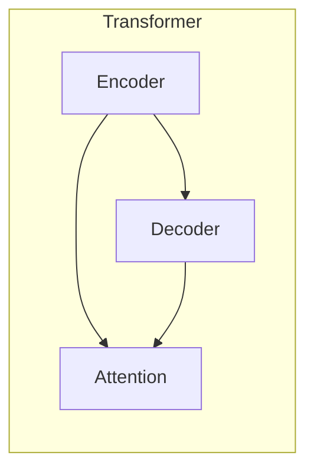
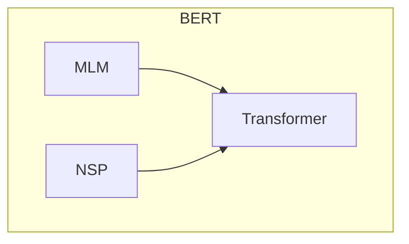
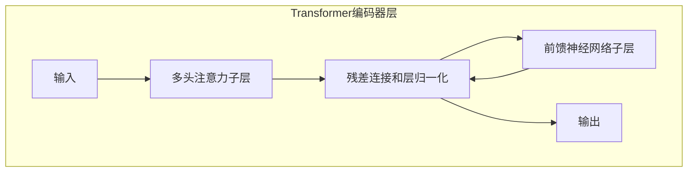

# Transformer大模型实战 预训练的BERT模型

## 1.背景介绍

### 1.1 自然语言处理的挑战

在过去的几十年里,自然语言处理(NLP)一直是人工智能领域最具挑战性的任务之一。语言的复杂性和多样性使得机器很难真正理解和生成人类语言。传统的NLP系统主要依赖于手工制作的规则和特征,这种方法存在一些固有的局限性:

1. 规则和特征的构建需要大量的人工劳动,效率低下且成本高昂。
2. 规则和特征往往过于简单和刚性,难以捕捉语言的丰富语义和语用信息。
3. 针对特定领域和任务构建的规则和特征,泛化能力差,难以迁移到新的领域和任务。

### 1.2 深度学习在NLP中的突破

近年来,随着深度学习技术的不断发展,NLP领域取得了突破性的进展。深度神经网络具有自动从大量数据中学习特征表示的能力,克服了传统方法的局限性。尤其是transformer等注意力机制模型的出现,使得NLP模型能够更好地捕捉长距离依赖关系,提高了语言理解和生成的质量。

### 1.3 BERT:预训练语言模型的里程碑

2018年,谷歌的AI研究员发表了BERT(Bidirectional Encoder Representations from Transformers)模型,这是一个基于transformer编码器的双向预训练语言模型。BERT在大规模无标注语料库上进行了预训练,学习到了丰富的语义和语法知识。通过在下游任务上进行微调,BERT在多项NLP任务上取得了当时的最佳表现,成为预训练语言模型的里程碑式工作。

## 2.核心概念与联系

### 2.1 Transformer模型

Transformer是一种全新的基于注意力机制的序列到序列模型,用于机器翻译等序列转换任务。与传统的基于RNN或CNN的序列模型不同,Transformer完全依赖注意力机制来捕捉输入和输出序列之间的长距离依赖关系,避免了RNN的梯度消失问题,并且可以高度并行化,计算效率更高。

Transformer模型主要由编码器(Encoder)和解码器(Decoder)两部分组成。编码器的作用是将输入序列映射为一系列连续的向量表示,解码器则根据编码器的输出向量生成目标序列。



### 2.2 BERT的模型结构

BERT借鉴了Transformer的编码器结构,并在此基础上做出了一些关键改进:

1. **双向编码**:传统语言模型是单向的,每次只能获取单词的单向上下文。BERT使用Transformer的编码器对上下文进行双向编码,能够同时获取单词的左右上下文信息。

2. **Masked Language Model预训练目标**:BERT在预训练阶段采用了掩码语言模型(MLM)的预训练目标。模型会随机掩码输入序列中的部分单词,并预测这些被掩码单词的正确词元。这种方式可以更好地学习词元之间的关系。

3. **Next Sentence Prediction预训练目标**:为了捕捉句子之间的关系,BERT还引入了下一句预测(NSP)的辅助训练目标。模型需要判断两个句子是否连续出现。



### 2.3 BERT的预训练和微调

BERT的训练分为两个阶段:预训练(Pre-training)和微调(Fine-tuning)。

1. **预训练**:BERT在大规模无标注语料库上进行预训练,学习通用的语言表示。预训练使用掩码语言模型和下一句预测两个任务目标,使BERT能够捕捉单词级和句子级的语义关系。

2. **微调**:对于特定的下游NLP任务(如文本分类、问答等),BERT会在相应的带标注数据集上进行微调。微调过程中,BERT模型的大部分参数保持不变,只对最后一层进行少量参数微调,使模型适应特定任务。

通过这种预训练+微调的范式,BERT可以在下游任务上发挥出极佳的性能,同时避免了从头开始训练带来的巨大计算开销。

## 3.核心算法原理具体操作步骤

### 3.1 输入表示

BERT的输入由三部分组成:Token Embeddings、Segment Embeddings和Position Embeddings。

1. **Token Embeddings**:对输入序列中的每个词元使用WordPiece嵌入。

2. **Segment Embeddings**:对于双句输入,使用不同的embeddings表示两个句子,以区分句子边界。

3. **Position Embeddings**:由于Transformer无法像RNN那样自然地捕捉序列的位置信息,BERT使用位置编码将位置信息编码到embeddings中。

最终的输入表示是三种embeddings的元素级求和:

$$\text{Input Representation} = \text{Token Embeddings} + \text{Segment Embeddings} + \text{Position Embeddings}$$

### 3.2 Transformer编码器

BERT使用了基于多头注意力机制的Transformer编码器结构。编码器由多层相同的编码器层组成,每一层包含两个子层:

1. **多头注意力子层**:对输入序列进行自注意力计算,捕捉单词之间的长距离依赖关系。

2. **前馈神经网络子层**:对每个单词的向量表示进行非线性映射,提供"编码"能力。

在每个子层之后,BERT使用了残差连接和层归一化,以提高模型的性能和训练稳定性。



### 3.3 预训练任务

BERT在预训练阶段使用了两个无监督任务:掩码语言模型(MLM)和下一句预测(NSP)。

1. **掩码语言模型(MLM)**:在输入序列中随机掩码15%的词元,模型需要基于上下文预测被掩码的词元。与传统语言模型不同,MLM的掩码方式使得模型能够更好地利用上下文信息。

2. **下一句预测(NSP)**:BERT的输入为两个句子,NSP任务需要判断第二个句子是否为第一个句子的下一句。这个辅助任务有助于BERT捕捉句子间的关系。

通过联合优化MLM和NSP两个任务的损失函数,BERT在大规模语料库上进行预训练,学习到通用的语言表示。

### 3.4 微调

对于特定的下游NLP任务,BERT需要在相应的带标注数据集上进行微调。微调过程中,BERT模型的大部分参数保持不变,只对最后一层进行少量参数微调,使模型适应特定任务。

以文本分类任务为例,微调步骤如下:

1. 准备带标注的文本分类数据集。
2. 将输入文本序列输入到BERT模型,获取最后一层的[CLS]向量表示。
3. 在BERT的输出上添加一个分类器(如逻辑回归或全连接层)。
4. 使用带标注数据集,以分类损失作为目标函数,对BERT模型的最后一层和分类器进行端到端的联合微调。
5. 在测试集上评估微调后的模型性能。

通过微调,BERT可以将在大规模语料库上学习到的通用语言知识迁移到特定的下游任务,显著提高了模型的性能。

## 4.数学模型和公式详细讲解举例说明

### 4.1 注意力机制

注意力机制是Transformer和BERT的核心,它允许模型在编码序列时动态地为不同位置分配不同的注意力权重,从而更好地捕捉长距离依赖关系。

给定一个查询向量$q$和一组键值对$(k_i, v_i)$,注意力机制的计算过程如下:

1. 计算查询向量与每个键向量的相似度分数:

$$\text{Score}(q, k_i) = q \cdot k_i$$

2. 对相似度分数进行缩放和softmax归一化,得到注意力权重:

$$\text{Attention}(q, k_i, v_i) = \text{softmax}(\frac{\text{Score}(q, k_i)}{\sqrt{d_k}})v_i$$

其中$d_k$是键向量的维度,用于防止较大的点积导致softmax函数的梯度较小。

3. 对所有值向量进行加权求和,得到注意力输出:

$$\text{AttentionOutput} = \sum_i \text{Attention}(q, k_i, v_i)$$

### 4.2 多头注意力

为了捕捉不同子空间的信息,Transformer使用了多头注意力机制。具体来说,查询、键和值向量首先被线性投影到不同的子空间,然后在每个子空间内计算注意力,最后将所有子空间的注意力输出进行拼接:

$$\text{MultiHead}(Q, K, V) = \text{Concat}(\text{head}_1, \dots, \text{head}_h)W^O$$
$$\text{where } \text{head}_i = \text{Attention}(QW_i^Q, KW_i^K, VW_i^V)$$

其中$W_i^Q$、$W_i^K$和$W_i^V$分别是查询、键和值的线性投影矩阵,$W^O$是最终的线性变换矩阵。

通过多头注意力机制,Transformer能够同时关注不同的子空间信息,提高了模型的表达能力。

### 4.3 位置编码

由于Transformer没有循环或卷积结构,因此无法像RNN或CNN那样自然地捕捉序列的位置信息。BERT使用了位置编码的方式将位置信息编码到embeddings中。

对于位置$pos$和embeddings维度$i$,BERT使用如下公式计算位置编码:

$$
\begin{aligned}
\text{PE}_{(pos, 2i)} &= \sin(pos / 10000^{2i / d_{\text{model}}}) \\
\text{PE}_{(pos, 2i+1)} &= \cos(pos / 10000^{2i / d_{\text{model}}})
\end{aligned}
$$

其中$d_{\text{model}}$是embeddings的维度。这种位置编码公式可以让模型更容易学习相对位置,因为对于任意固定偏移量$k$,$\text{PE}_{pos+k}$可以被$\text{PE}_{pos}$的线性函数表示。

位置编码会被直接加到embeddings上,使得embeddings不仅包含单词语义信息,还包含了位置信息。

## 5.项目实践:代码实例和详细解释说明

为了帮助读者更好地理解BERT模型,这里提供了一个使用Hugging Face的Transformers库进行BERT微调的代码示例,任务为文本分类。

### 5.1 导入所需库

```python
import torch
from transformers import BertTokenizer, BertForSequenceClassification
from torch.utils.data import TensorDataset, DataLoader
```

### 5.2 加载BERT分词器和预训练模型

```python
# 加载BERT分词器
tokenizer = BertTokenizer.from_pretrained('bert-base-uncased')

# 加载预训练的BERT模型
model = BertForSequenceClassification.from_pretrained('bert-base-uncased', num_labels=2)
```

### 5.3 准备数据

```python
# 示例数据
texts = ["This movie is great!", "I didn't like the book."]
labels = [1, 0]  # 1表示正面情感,0表示负面情感

# 对文本进行分词和编码
input_ids = []
attention_masks = []

for text in texts:
    encoded = tokenizer.encode_plus(
        text,
        add_special_tokens=True,
        max_length=64,
        pad_to_max_length=True,
        return_attention_mask=True
    )
    input_ids.append(encoded['input_ids'])
    attention_masks.append(encoded['attention_mask'])

# 转换为PyTorch张量
input_ids = torch.tensor(input_ids)
attention_masks = torch.tensor(attention_masks)
labels = torch.tensor(labels)

# 创建TensorDataset
dataset = TensorDataset(input_ids, attention_masks, labels)
```

### 5.4 微调BERT模型

```python
from transformers import AdamW

# 设置