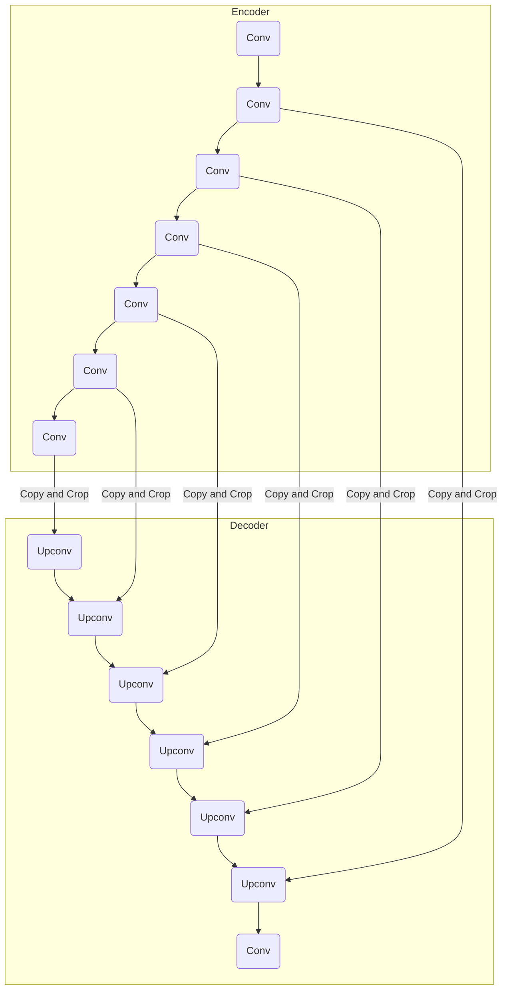

# UNet竞赛：挑战自我，突破极限

## 1.背景介绍

### 1.1 深度学习在计算机视觉中的应用

随着人工智能和深度学习技术的不断发展,计算机视觉领域取得了令人瞩目的进步。深度学习模型能够从大量数据中自动学习特征表示,并对图像、视频等视觉数据进行高精度的识别、分类和分割等任务。其中,卷积神经网络(CNN)因其在图像处理任务中的卓越表现,成为计算机视觉领域的主流模型之一。

### 1.2 语义分割任务及其重要性

语义分割是计算机视觉中一项重要的基础任务,旨在对图像中的每个像素进行分类,将图像分割为semantically meaningful的多个区域。准确的语义分割可为许多高级视觉任务奠定基础,如目标检测、实例分割、场景理解等,因此在无人驾驶、医疗影像分析等领域有着广泛的应用前景。

### 1.3 UNet模型及其在生物医学图像分割中的应用

2015年,Olaf Ronneberger等人在论文"U-Net: Convolutional Networks for Biomedical Image Segmentation"中提出了UNet模型,这一全卷积网络架构专门设计用于生物医学图像分割任务。UNet通过对称的编码器-解码器结构和跨层特征融合,能够精确捕获图像的上下文信息,在保留空间信息的同时融合多尺度特征,从而实现对细小物体的精准分割。自问世以来,UNet及其变体在细胞图像分割、医学图像分割等领域展现出卓越的性能,成为生物医学图像分割的主流模型之一。

### 1.4 UNet竞赛概述

为了推动生物医学图像分割技术的发展,并激励研究人员不断探索和创新,业内举办了多项UNet相关的算法竞赛。这些竞赛通常会提供一定量的训练数据和标注数据,要求参赛者在给定的数据集上训练UNet及其变体模型,并在测试集上评估模型的分割性能。优胜者不仅可获得丰厚的奖金,更重要的是能与业内顶尖的研究人员同台竞技,相互切磋技艺,促进整个领域的发展。

## 2.核心概念与联系

### 2.1 UNet网络架构

UNet采用对称的编码器-解码器架构,如下图所示:

编码器部分由一系列卷积和下采样层组成,用于从输入图像中提取不同尺度的特征表示。解码器部分则由上采样层和卷积层构成,用于逐步恢复特征图的空间分辨率。编码器和解码器之间通过特征融合连接,将编码器中的高分辨率特征图拷贝并裁剪后,与解码器中对应尺度的特征图进行拼接,从而融合不同尺度的上下文信息。最终输出与输入图像相同大小的分割mask。

### 2.2 跨层特征融合

跨层特征融合是UNet的核心创新之一。在传统的编码器-解码器架构中,解码器仅依赖于编码器的最终输出特征,无法利用编码器中的中间特征,导致分割结果常常缺乏细节信息。而UNet通过特征融合连接,将编码器中不同尺度的特征传递到解码器的对应层,使得解码器在恢复空间分辨率的同时,也能融合多尺度的上下文信息,从而提高了分割的精度和鲁棒性。

### 2.3 全卷积网络

与传统的全连接网络不同,UNet是一种全卷积网络(Fully Convolutional Network, FCN),即网络中仅包含卷积层、上采样层和下采样层,不存在全连接层。这使得UNet能够接受任意大小的输入图像,输出与输入图像相同大小的分割mask,从而避免了传统网络在分割任务中存在的输入输出大小限制问题。

### 2.4 数据增强

由于医学图像数据的获取和标注成本较高,可用于训练的数据量往往有限。为了提高模型的泛化能力,数据增强技术在UNet训练中扮演着重要角色。常用的数据增强方法包括翻转、旋转、缩放、平移、高斯噪声、亮度调整等,可以在不增加新数据的情况下,人为扩充训练集的多样性,增强模型对不同变换的鲁棒性。

## 3.核心算法原理具体操作步骤

### 3.1 UNet训练流程

1. **数据准备**:收集并准备好训练数据集和验证数据集。训练数据集包含输入图像和对应的Ground Truth分割mask标签。
2. **数据预处理**:对图像进行标准化,如减去均值除以标准差等,以加速训练收敛。对于分割mask,则需要进行One-Hot编码,将每个像素值映射为对应类别的One-Hot向量。
3. **定义网络结构**:根据UNet的架构,定义编码器、解码器、特征融合连接等网络组件。
4. **设置损失函数**:常用的损失函数包括交叉熵损失、Dice Loss、Focal Loss等,也可以对多个损失函数进行加权组合。
5. **选择优化器**:如Adam、SGD等,并设置合适的学习率和其他超参数。
6. **训练模型**:将训练数据输入模型,计算损失,并通过反向传播算法更新网络参数。在训练过程中,可以定期在验证集上评估模型性能,防止过拟合。
7. **模型评估**:在测试集上评估训练好的模型,计算分割指标如IoU、Dice系数等,分析模型的泛化能力。
8. **模型微调**:根据评估结果,对超参数、网络结构、损失函数等进行微调,以进一步提升模型性能。

### 3.2 数据增强策略

数据增强对于提高UNet模型的泛化能力至关重要。常用的数据增强方法包括:

1. **几何变换**:翻转、旋转、缩放、平移等,可增强模型对图像几何变化的鲁棒性。
2. **颜色变换**:调整亮度、对比度、饱和度等,模拟不同的图像获取条件。
3. **噪声添加**:高斯噪声、椒盐噪声等,增强模型对噪声的鲁棒性。
4. **弹性变形**:对图像进行局部扭曲变形,模拟生物组织的形变。
5. **混合策略**:将上述多种增强方法结合使用,进一步扩充数据多样性。

在实际应用中,需要根据具体任务和数据特点,选择合适的数据增强策略。

### 3.3 损失函数设计

合理设计损失函数对于UNet分割性能的提升至关重要。常用的损失函数包括:

1. **交叉熵损失(Cross Entropy Loss)**:
   $$\mathcal{L}_{CE} = -\frac{1}{N}\sum_{i=1}^{N}\sum_{c=1}^{C}y_{i,c}\log(p_{i,c})$$
   其中$N$为批次大小,$C$为类别数量,$y_{i,c}$为Ground Truth标签,$p_{i,c}$为模型预测的概率。

2. **Dice Loss**:
   $$\mathcal{L}_{Dice} = 1 - \frac{2\sum_{i=1}^{N}p_iy_i}{\sum_{i=1}^{N}p_i^2 + \sum_{i=1}^{N}y_i^2}$$
   其中$p_i$和$y_i$分别为预测和Ground Truth中的第$i$个元素。Dice Loss直接优化Dice系数,常用于医学图像分割任务。

3. **Focal Loss**:
   $$\mathcal{L}_{Focal} = -\frac{1}{N}\sum_{i=1}^{N}(1-p_i)^\gamma y_i\log(p_i)$$
   其中$\gamma$为调节因子,用于加大易分类样本的权重,从而关注难分类样本。

4. **组合损失函数**:通常将上述损失函数进行加权组合,以获得更好的分割性能:
   $$\mathcal{L} = \alpha\mathcal{L}_{CE} + \beta\mathcal{L}_{Dice} + \gamma\mathcal{L}_{Focal}$$
   其中$\alpha$、$\beta$、$\gamma$为权重系数,需要根据具体任务进行调整。

### 3.4 评估指标

评估UNet分割性能的常用指标包括:

1. **IoU(Intersection over Union)**:预测区域与Ground Truth区域的交集与并集之比,常用于评估分割质量。
2. **Dice系数**:预测区域与Ground Truth区域的相似度,与IoU有一定关联。
3. **精确率(Precision)**:正确预测为正样本的比例。
4. **召回率(Recall)**:被正确预测为正样本的比例。
5. **F1-Score**:精确率和召回率的加权调和平均。

在实际应用中,需要根据具体任务的需求,选择合适的评估指标。

## 4.数学模型和公式详细讲解举例说明

### 4.1 卷积运算

卷积运算是卷积神经网络的核心运算,用于从输入数据(如图像)中提取特征。对于二维输入$X$和卷积核$K$,卷积运算可表示为:

$$
(X * K)(i, j) = \sum_{m}\sum_{n}X(i+m, j+n)K(m, n)
$$

其中$i$和$j$为输出特征图的坐标,卷积核$K$在输入$X$上滑动,对每个位置进行点乘累加运算。通过学习卷积核的权重,网络可以自动提取出有意义的特征表示。

在UNet中,编码器部分由多个卷积层堆叠而成,用于从输入图像中提取不同尺度的特征。解码器部分则通过上采样层和卷积层,逐步恢复特征图的空间分辨率。

### 4.2 上采样运算

上采样运算是UNet解码器中的关键步骤,用于将低分辨率的特征图放大到更高分辨率。常用的上采样方法包括:

1. **转置卷积(Transposed Convolution)**:
   $$
   X_{up}(i, j) = \sum_{m}\sum_{n}X(m, n)K(i-m\cdot s, j-n\cdot s)
   $$
   其中$s$为步长,通过对输入特征图进行卷积运算,实现上采样。转置卷积可以有效保留特征信息,但计算代价较高。

2. **最近邻插值(Nearest Neighbor Interpolation)**:在原特征图的每个像素周围插入$s-1$个与其相同的像素,实现上采样。计算效率高,但会引入棋盘效应。

3. **双线性插值(Bilinear Interpolation)**:在原特征图的每个像素周围,根据距离对周围像素进行加权平均,实现上采样。计算代价适中,效果较好。

在UNet中,通常采用转置卷积进行上采样,以保留足够的特征信息。

### 4.3 特征融合

特征融合是UNet的核心创新之一,通过将编码器中的高分辨率特征与解码器中的对应特征进行拼接,融合不同尺度的上下文信息,从而提高了分割精度。

具体来说,对于编码器中的特征图$X_e$和解码器中的特征图$X_d$,特征融合可表示为:

$$
X_f = \text{concat}(X_e, X_d)
$$

其中$X_e$需要先通过拷贝和裁剪操作,将其空间维度与$X_d$对齐。$X_f$是融合后的特征图,将被送入后续的卷