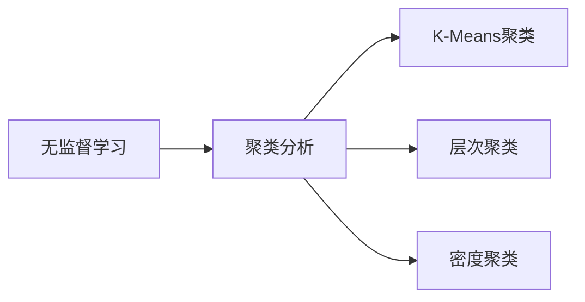
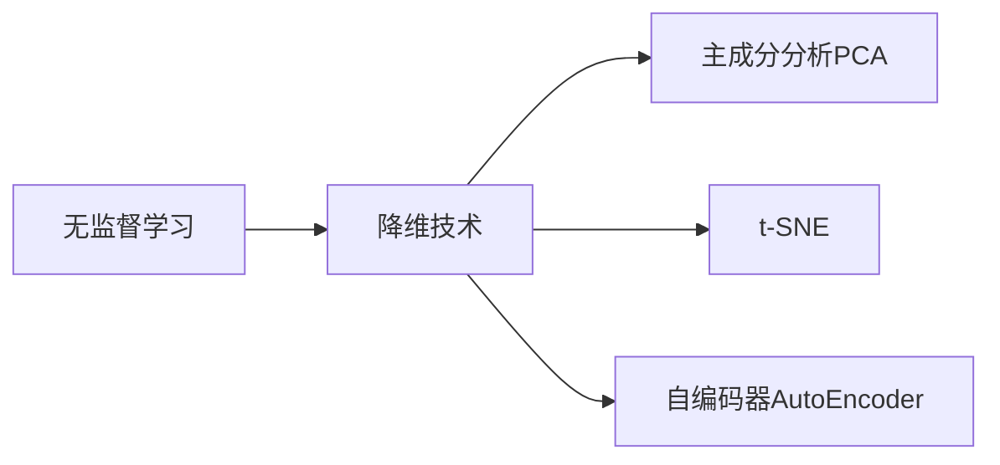
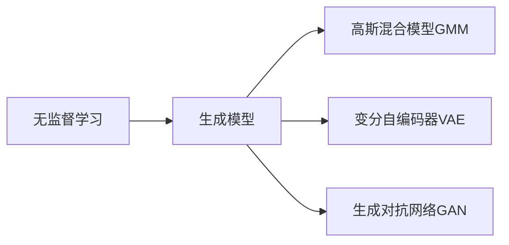

# Unsupervised Learning原理与代码实例讲解

## 1.背景介绍

### 1.1 什么是无监督学习?

无监督学习(Unsupervised Learning)是机器学习中一种重要的范式,它不同于有监督学习需要大量标注好的训练数据。无监督学习试图从未标记的原始数据中发现内在的模式、结构或规律。它主要用于发现数据的内在分布、聚类、降维等任务。

无监督学习的应用场景非常广泛,例如:

- 聚类分析(Clustering Analysis): 将相似的数据点分组,如客户细分、基因表达分析等。
- 降维(Dimensionality Reduction): 将高维数据映射到低维空间,方便可视化和提高模型效率。 
- 异常检测(Anomaly Detection): 发现异常数据点,如金融欺诈检测、网络入侵检测等。
- 生成模型(Generative Models): 学习数据概率分布,可用于数据增强、推荐系统等。

### 1.2 无监督学习的重要性

随着大数据时代的到来,海量的非结构化数据急需通过无监督学习来发现隐藏的知识。与有监督学习相比,无监督学习具有以下优势:

- 无需人工标注,节省了大量的人力和时间成本。
- 可以发现人类难以察觉的潜在模式和规律。
- 可以对复杂的高维数据进行降维和可视化。
- 适用于探索性数据分析,为后续的监督学习奠定基础。

## 2.核心概念与联系

无监督学习涉及多种核心概念,下面将介绍它们之间的联系。

### 2.1 聚类分析

聚类分析(Clustering Analysis)是无监督学习中最常见的任务,旨在将相似的数据点分组到同一个簇。常用的聚类算法有:

- **K-Means聚类**: 将数据划分为K个簇,使簇内数据点相似度最大,簇间相似度最小。
- **层次聚类**(Hierarchical Clustering): 通过递归的聚合或分裂过程形成聚类树状结构。
- **密度聚类**(Density-Based Clustering): 根据数据点密集程度进行聚类,如DBSCAN算法。



### 2.2 降维技术

高维数据存在"维数灾难"问题,如数据稀疏、计算复杂度高等。降维技术能将高维数据映射到低维空间,常用方法有:

- **主成分分析**(PCA): 将数据投影到最大方差的低维子空间。
- **t-SNE**: 将高维数据映射到二维或三维空间,保持相似性。
- **自编码器**(AutoEncoder): 利用神经网络自动学习数据的低维表示。



### 2.3 生成模型

生成模型(Generative Models)旨在学习数据的概率分布,可用于数据生成、异常检测等任务。常见的生成模型包括:

- **高斯混合模型**(GMM): 假设数据由多个高斯分布的混合而成。
- **变分自编码器**(VAE): 结合自编码器和贝叶斯理论,学习数据的隐变量和生成过程。
- **生成对抗网络**(GAN): 由生成器和判别器两个对抗网络组成,生成器尝试生成逼真的数据。



## 3.核心算法原理具体操作步骤

在这一部分,我们将详细介绍几种核心无监督学习算法的原理和具体操作步骤。

### 3.1 K-Means聚类算法

K-Means是最经典的聚类算法之一,其目标是将$n$个数据点$\{x_1,x_2,...,x_n\}$划分为$K$个簇$\{C_1,C_2,...,C_K\}$,使得簇内数据点相似度最大,簇间相似度最小。算法步骤如下:

1. 随机选取$K$个初始质心$\{\mu_1,\mu_2,...,\mu_K\}$。
2. 对每个数据点$x_i$,计算它与每个质心的距离$d(x_i,\mu_j)$,将其分配到最近的簇$C_j$。
3. 更新每个簇$C_j$的质心为该簇所有点的均值:$\mu_j=\frac{1}{|C_j|}\sum_{x\in C_j}x$。
4. 重复步骤2和3,直至质心不再发生变化。

K-Means算法易于实现,但存在一些缺陷:

- 需要预先指定簇数$K$,对结果影响较大。
- 对噪声和异常值敏感。
- 无法发现非凸形状的簇。

### 3.2 主成分分析(PCA)

PCA是一种常用的线性降维技术,其思想是将高维数据投影到最大方差的低维子空间。具体步骤如下:

1. 对数据进行归一化处理,使其均值为0。
2. 计算数据的协方差矩阵$\Sigma$。
3. 对协方差矩阵$\Sigma$进行特征值分解,得到特征值$\lambda_1,\lambda_2,...,\lambda_d$和对应的特征向量$v_1,v_2,...,v_d$。
4. 选取前$k$个最大特征值对应的特征向量$\{v_1,v_2,...,v_k\}$,构成投影矩阵$P$。
5. 将原始数据$X$投影到$k$维空间:$X'=XP$。

PCA的优点是计算简单,能够有效降低数据维度。但它只能发现线性结构,对非线性数据效果不佳。

### 3.3 变分自编码器(VAE)

变分自编码器是一种常用的生成模型,它结合了自编码器和贝叶斯理论,能够学习数据的隐变量和生成过程。VAE的基本结构包括编码器(Encoder)和解码器(Decoder)两部分:

- 编码器$q_\phi(z|x)$将输入数据$x$编码为隐变量$z$的概率分布。
- 解码器$p_\theta(x|z)$根据隐变量$z$生成数据$x$的概率分布。

VAE的目标是最大化边际对数似然$\log p_\theta(x)$,但由于后验分布$p_\theta(z|x)$难以直接计算,因此使用变分推断(Variational Inference)求解:

$$
\log p_\theta(x) \geq \mathbb{E}_{q_\phi(z|x)}[\log p_\theta(x|z)] - D_{KL}(q_\phi(z|x)||p_\theta(z))
$$

其中$D_{KL}$是KL散度,用于约束$q_\phi(z|x)$与真实后验$p_\theta(z|x)$的差异。VAE通过重参数技巧(Reparameterization Trick)和随机梯度下降算法优化编码器和解码器的参数。

相比传统的自编码器,VAE能够学习数据的概率分布,从而实现数据生成、插值等功能。但它也存在一些局限性,如后验分布的简单假设、难以学习复杂的多模态分布等。

## 4.数学模型和公式详细讲解举例说明

在无监督学习中,数学模型和公式扮演着重要的角色。接下来,我们将详细讲解几种常见模型的数学原理,并给出具体的例子说明。

### 4.1 高斯混合模型(GMM)

高斯混合模型假设数据由多个高斯分布的混合而成,每个高斯分布对应一个簇。设有$K$个高斯分布,第$k$个分布的均值为$\mu_k$,协方差矩阵为$\Sigma_k$,混合系数为$\pi_k$,则GMM的概率密度函数为:

$$
p(x) = \sum_{k=1}^K \pi_k \mathcal{N}(x|\mu_k,\Sigma_k)
$$

其中$\mathcal{N}(x|\mu,\Sigma)$表示均值为$\mu$,协方差矩阵为$\Sigma$的高斯分布。

我们可以使用期望最大化(EM)算法来估计GMM的参数$\{\pi_k,\mu_k,\Sigma_k\}$。具体步骤如下:

1. 初始化参数$\{\pi_k,\mu_k,\Sigma_k\}$。
2. E步骤(Expectation):计算每个数据点$x_i$属于第$k$个高斯分布的后验概率(责任):
   $$
   \gamma_{ik} = \frac{\pi_k\mathcal{N}(x_i|\mu_k,\Sigma_k)}{\sum_{j=1}^K\pi_j\mathcal{N}(x_i|\mu_j,\Sigma_j)}
   $$
3. M步骤(Maximization):使用$\gamma_{ik}$更新参数:
   $$
   \begin{aligned}
   \pi_k &= \frac{1}{N}\sum_{i=1}^N\gamma_{ik} \\
   \mu_k &= \frac{1}{N_k}\sum_{i=1}^N\gamma_{ik}x_i \\
   \Sigma_k &= \frac{1}{N_k}\sum_{i=1}^N\gamma_{ik}(x_i-\mu_k)(x_i-\mu_k)^T
   \end{aligned}
   $$
   其中$N_k=\sum_{i=1}^N\gamma_{ik}$。
4. 重复步骤2和3,直至收敛。

作为例子,我们可以使用GMM对下图中的数据进行聚类:

```python
import numpy as np
import matplotlib.pyplot as plt
from sklearn.mixture import GaussianMixture

# 生成模拟数据
np.random.seed(0)
X = np.concatenate([np.random.normal([-1, -1], 0.5, 300),
                    np.random.normal([1, 1], 0.5, 300)])

# 使用GMM进行聚类
gmm = GaussianMixture(n_components=2, covariance_type='full')
gmm.fit(X)
labels = gmm.predict(X)

# 可视化结果
plt.scatter(X[:, 0], X[:, 1], c=labels, s=10, cmap='viridis')
plt.show()
```

上述代码使用scikit-learn库中的GaussianMixture类来拟合GMM模型,并对二维数据进行聚类。结果如下图所示,GMM能够很好地识别出两个高斯分布簇。


### 4.2 主成分分析(PCA)的数学模型

PCA的目标是将高维数据$X$投影到低维空间,使投影后的数据具有最大的方差。设投影矩阵为$P$,则投影后的数据为$X'=XP$。我们希望$X'$的方差最大,即:

$$
\max_{P^TP=I} \operatorname{Var}(X')\quad\text{s.t. }X'=XP
$$

由于$\operatorname{Var}(X')=\operatorname{Tr}(\operatorname{Cov}(X'))$,我们可以等价地最大化$X'$的协方差矩阵的迹:

$$
\max_{P^TP=I} \operatorname{Tr}(P^T\operatorname{Cov}(X)P)
$$

上式的解析解为$\operatorname{Cov}(X)$的特征向量,对应的特征值就是投影后的方差。因此,PCA的具体步骤如下:

1. 对数据$X$进行中心化,使其均值为0:$\tilde{X}=X-\bar{X}$。
2. 计算$\tilde{X}$的协方差矩阵$\Sigma=\frac{1}{n}\tilde{X}^T\tilde{X}$。
3. 对$\Sigma$进行特征值分解:$\Sigma=U\Lambda U^T$,其中$\Lambda$是对角矩阵,对角线元素为特征值$\lambda_1\geq\lambda_2\geq...\geq\lambda_d$。
4. 选取前$k$个最大特征值对应的特征向量