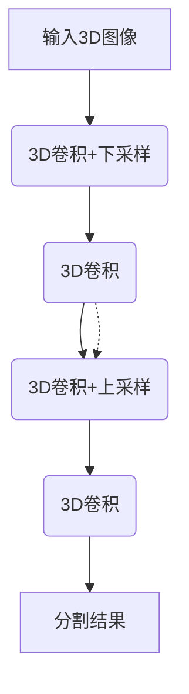

# VNet：3D图像分割的利器

## 1.背景介绍

### 1.1 医学图像分析的重要性

在医疗保健领域中,准确的图像分析对于诊断和治疗至关重要。医学图像如CT、MRI和PET扫描可以提供人体内部结构和功能的宝贵信息,帮助医生发现疾病并制定治疗方案。然而,手动分析和标注这些图像是一项耗时且容易出错的任务。

### 1.2 3D图像分割的挑战

与2D图像相比,3D医学图像分割面临更多挑战。3D数据集体积庞大,包含大量的切片,需要处理的信息量巨大。此外,不同组织和器官之间的边界往往模糊,增加了分割的难度。传统的基于规则或特征的方法往往效果有限,难以应对复杂的3D结构。

### 1.3 深度学习在图像分割中的应用

近年来,深度学习技术在图像分割领域取得了令人瞩目的成就。卷积神经网络(CNN)等深度学习模型能够自动学习图像的特征表示,从而实现准确的像素级别分割。然而,大多数CNN模型是为2D图像设计的,直接应用于3D数据会导致计算效率低下和信息损失。

## 2.核心概念与联系

### 2.1 3D卷积神经网络

为了有效处理3D医学图像数据,需要使用3D卷积神经网络(3D CNN)。与2D CNN不同,3D CNN的卷积核和池化操作在三个维度上进行,能够同时捕获空间和时间上的特征信息。

### 2.2 V-Net架构

V-Net是一种专门为3D图像分割设计的全卷积神经网络架构。它的灵感来自于U-Net,但进行了多项改进以适应3D数据。V-Net使用3D卷积和3D上采样,并引入了残差连接,有助于提高模型的性能和收敛速度。



### 2.3 数据增强

由于医学图像数据的获取困难和隐私问题,通常数据集的大小有限。为了增加训练数据的多样性,可以采用数据增强技术,如旋转、平移、缩放等变换,从而提高模型的泛化能力。

## 3.核心算法原理具体操作步骤

V-Net的核心算法原理可以分为以下几个步骤:

1. **3D卷积编码器**:输入3D图像经过一系列3D卷积和下采样操作,提取不同尺度的特征图。
2. **3D卷积解码器**:通过3D上采样和3D卷积,逐步恢复特征图的空间分辨率。
3. **残差连接**:将编码器的特征图与解码器的对应层相加,形成残差连接,有助于梯度反向传播和特征重用。
4. **分类层**:最后一层是一个1x1x1的卷积,对每个像素进行分类,输出分割掩码。

V-Net的具体操作步骤如下:

1. 准备3D医学图像数据集,进行预处理(归一化、填充等)。
2. 构建V-Net模型,定义3D卷积、上采样、下采样和残差连接等操作。
3. 设置损失函数(如交叉熵)和优化器(如Adam)。
4. 对训练数据进行数据增强(旋转、平移等)。
5. 训练模型,使用批量数据进行前向传播和反向传播。
6. 在验证集上评估模型性能,根据指标(如Dice系数)进行调参。
7. 在测试集上测试模型,获取最终的分割结果。

## 4.数学模型和公式详细讲解举例说明

### 4.1 3D卷积

3D卷积是V-Net的核心操作之一。与2D卷积类似,3D卷积也是通过一个权重核在输入特征图上滑动,计算加权和来提取特征。不同之处在于,3D卷积核在三个维度上移动,能够同时捕获空间和时间上的信息。

3D卷积的数学表达式如下:

$$
y_{l,m,n}^{k} = \sum_{i=0}^{I-1}\sum_{j=0}^{J-1}\sum_{p=0}^{P-1}w_{i,j,p}^{k}x_{l+i,m+j,n+p}^{k} + b^{k}
$$

其中:
- $y_{l,m,n}^{k}$是输出特征图在位置$(l,m,n)$处的值
- $x_{l,m,n}^{k}$是输入特征图在位置$(l,m,n)$处的值
- $w_{i,j,p}^{k}$是卷积核的权重
- $b^{k}$是偏置项
- $I,J,P$分别是卷积核在三个维度上的大小

通过在输入特征图上滑动卷积核,可以获得一个新的特征图,捕获到不同的特征模式。

### 4.2 3D上采样

在V-Net的解码器阶段,需要使用3D上采样操作来恢复特征图的空间分辨率。3D上采样可以看作是3D卷积的逆过程,通过插值等方式增加特征图的尺寸。

常见的3D上采样方法包括最近邻插值、双线性插值和三线性插值。其中,三线性插值是最精确的方法,它根据8个最近的像素值进行加权平均,计算新像素的值。

三线性插值的数学表达式如下:

$$
V(x,y,z) = \sum_{i=0}^{1}\sum_{j=0}^{1}\sum_{k=0}^{1}V(i,j,k)(1-x)^{1-i}x^{i}(1-y)^{1-j}y^{j}(1-z)^{1-k}z^{k}
$$

其中:
- $V(x,y,z)$是插值后的像素值
- $V(i,j,k)$是8个最近邻像素的值
- $x,y,z$是插值位置的坐标

通过三线性插值,可以获得更平滑、更精确的上采样结果,有助于提高分割质量。

### 4.3 Dice系数

在3D图像分割任务中,常用的评估指标之一是Dice系数。Dice系数用于衡量预测掩码与ground truth之间的重合程度,取值范围为[0,1],值越大表示重合度越高。

Dice系数的数学表达式如下:

$$
Dice = \frac{2|X \cap Y|}{|X| + |Y|}
$$

其中:
- $X$是预测掩码的像素集合
- $Y$是ground truth的像素集合
- $|X \cap Y|$是两个集合的交集元素个数
- $|X|$和$|Y|$分别是两个集合的元素个数

在实际计算中,可以将Dice系数改写为:

$$
Dice = \frac{2\sum_{i=1}^{N}p_ig_i}{\sum_{i=1}^{N}p_i + \sum_{i=1}^{N}g_i}
$$

其中:
- $N$是像素总数
- $p_i$是预测掩码中第$i$个像素的值(0或1)
- $g_i$是ground truth中第$i$个像素的值(0或1)

Dice系数越接近1,说明分割结果与ground truth越相似,模型性能越好。

## 5.项目实践:代码实例和详细解释说明

以下是使用PyTorch实现V-Net的代码示例,包括模型定义、数据加载和训练过程。

### 5.1 导入必要的库

```python
import torch
import torch.nn as nn
import torch.nn.functional as F
from torch.utils.data import DataLoader
```

### 5.2 定义V-Net模型

```python
class VNet(nn.Module):
    def __init__(self, in_channels, out_channels):
        super(VNet, self).__init__()
        
        # 编码器部分
        self.conv1 = nn.Conv3d(in_channels, 16, kernel_size=3, padding=1)
        self.conv2 = nn.Conv3d(16, 32, kernel_size=3, padding=1)
        self.conv3 = nn.Conv3d(32, 64, kernel_size=3, padding=1)
        
        # 解码器部分
        self.upconv1 = nn.ConvTranspose3d(64, 32, kernel_size=3, padding=1)
        self.upconv2 = nn.ConvTranspose3d(32, 16, kernel_size=3, padding=1)
        self.upconv3 = nn.ConvTranspose3d(16, out_channels, kernel_size=3, padding=1)
        
        # 残差连接
        self.residual1 = nn.Conv3d(32, 32, kernel_size=1)
        self.residual2 = nn.Conv3d(16, 16, kernel_size=1)
        
    def forward(self, x):
        # 编码器
        x1 = F.relu(self.conv1(x))
        x2 = F.relu(self.conv2(F.max_pool3d(x1, kernel_size=2, stride=2)))
        x3 = F.relu(self.conv3(F.max_pool3d(x2, kernel_size=2, stride=2)))
        
        # 解码器
        x = F.relu(self.upconv1(x3))
        x = x + self.residual1(x2)
        x = F.relu(self.upconv2(x))
        x = x + self.residual2(x1)
        x = self.upconv3(x)
        
        return x
```

这个实现包括以下几个关键部分:

- 编码器部分使用三层3D卷积和最大池化层,逐步提取特征图。
- 解码器部分使用三层3D转置卷积(上采样),逐步恢复特征图的空间分辨率。
- 残差连接通过将编码器的特征图与解码器的对应层相加,形成残差连接。
- 最后一层是一个1x1x1的卷积,对每个像素进行分类,输出分割掩码。

### 5.3 加载数据

```python
from torch.utils.data import Dataset

class MedicalImageDataset(Dataset):
    def __init__(self, images, masks):
        self.images = images
        self.masks = masks
        
    def __len__(self):
        return len(self.images)
    
    def __getitem__(self, idx):
        image = self.images[idx]
        mask = self.masks[idx]
        return image, mask

# 加载数据集
train_images, train_masks = load_data('train')
val_images, val_masks = load_data('val')

# 创建数据加载器
train_dataset = MedicalImageDataset(train_images, train_masks)
val_dataset = MedicalImageDataset(val_images, val_masks)

train_loader = DataLoader(train_dataset, batch_size=4, shuffle=True)
val_loader = DataLoader(val_dataset, batch_size=4, shuffle=False)
```

这里定义了一个自定义的`MedicalImageDataset`类,用于加载医学图像和对应的分割掩码。`load_data`函数用于从文件中读取数据。最后,创建了训练集和验证集的数据加载器,方便在训练过程中批量加载数据。

### 5.4 训练模型

```python
import torch.optim as optim

# 初始化模型、损失函数和优化器
model = VNet(in_channels=1, out_channels=2)
criterion = nn.CrossEntropyLoss()
optimizer = optim.Adam(model.parameters(), lr=0.001)

# 训练循环
num_epochs = 50
for epoch in range(num_epochs):
    train_loss = 0.0
    val_loss = 0.0
    
    # 训练阶段
    model.train()
    for images, masks in train_loader:
        optimizer.zero_grad()
        outputs = model(images)
        loss = criterion(outputs, masks)
        loss.backward()
        optimizer.step()
        train_loss += loss.item()
        
    # 验证阶段
    model.eval()
    with torch.no_grad():
        for images, masks in val_loader:
            outputs = model(images)
            loss = criterion(outputs, masks)
            val_loss += loss.item()
            
    # 打印训练和验证损失
    train_loss /= len(train_loader)
    val_loss /= len(val_loader)
    print(f'Epoch [{epoch+1}/{num_epochs}], Train Loss: {train_loss:.4f}, Val Loss: {val_loss:.4f}')
```

在训练过程中,我们执行以下步骤:

1. 初始化模型、损失函数(交叉熵损失)和优化器(Adam优化器)。
2. 在每个epoch中,分别进行训练和验证阶段。
3. 在训练阶段,将模型设置为训练模式,对每个批次的数据进行前向传播、计算损失、反向传播和优化器