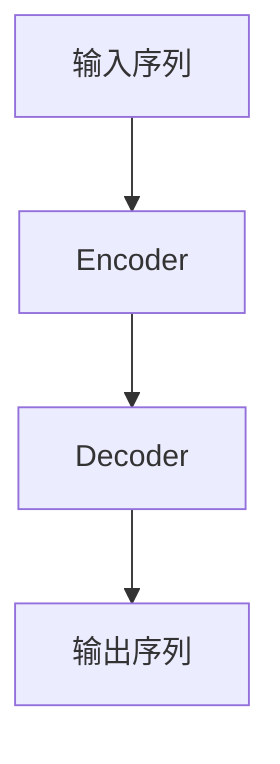

# XLNet的参数设置与调优：打造最佳模型

## 1.背景介绍

### 1.1 自然语言处理的重要性

在当今数字时代,自然语言处理(NLP)已成为人工智能领域中最重要和最具挑战性的研究方向之一。它旨在使计算机能够理解、解释和生成人类语言,为无数应用程序提供支持,如机器翻译、问答系统、文本摘要、情感分析等。随着大数据和强大计算能力的出现,NLP取得了长足进展,深度学习模型在该领域发挥了关键作用。

### 1.2 Transformer模型的崛起

2017年,Transformer模型在机器翻译任务中取得了突破性的成功,它完全依赖于注意力机制,摒弃了传统序列模型中的循环和卷积结构。Transformer模型的出现极大地推动了NLP的发展,为各种下游任务提供了强大的语言表示能力。

### 1.3 XLNet模型简介

XLNet是由谷歌AI大脑团队和卡内基梅隆大学于2019年提出的一种新型Transformer语言模型。它旨在解决BERT等双向模型中存在的残缺问题,通过一种被称为排列语言模型(Permutation Language Modeling)的新颖预训练目标,XLNet能够利用所有可能的因果序列来学习双向上下文信息,从而获得更好的语言理解能力。

## 2.核心概念与联系

### 2.1 Transformer模型回顾

为了更好地理解XLNet,我们需要先回顾一下Transformer模型的核心概念。Transformer是一种基于注意力机制的序列到序列模型,它由编码器(Encoder)和解码器(Decoder)两个主要部分组成。



编码器将输入序列映射到一系列连续的向量表示,解码器则根据这些向量表示生成输出序列。注意力机制允许模型在计算目标位置的向量表示时,关注整个输入序列的不同位置。

### 2.2 BERT模型及其局限性

BERT(Bidirectional Encoder Representations from Transformers)是一种基于Transformer的双向语言模型,它在预训练阶段同时考虑了左右上下文,显著提高了语言理解能力。然而,BERT存在一个根本缺陷:为了解决自回归语言模型中的困境,BERT采用了掩码语言模型(Masked Language Modeling)的预训练目标,这种方式虽然允许模型利用双向上下文,但也导致了一些潜在的缺陷:

1. **输入残缺(Input Corruption)**: BERT在预训练时随机掩码15%的输入token,这种人为的噪声破坏了原始输入的完整性。

2. **输入缺失(Input Denigration)**: 由于掩码token无法利用上下文信息,BERT无法有效地建模这些位置的表示。

3. **输入混淆(Input Confusion)**: 对于相同的输入序列,由于掩码位置的随机性,BERT需要为每个掩码模式学习不同的策略,这增加了预训练的难度和计算成本。

### 2.3 XLNet的创新:排列语言模型

为了解决BERT中的残缺问题,XLNet提出了一种全新的预训练目标:排列语言模型(Permutation Language Modeling)。其核心思想是最大化所有可能的排列顺序的概率,而不是掩码语言模型中固定的单向或双向语境。具体来说,XLNet将输入序列进行排列,然后以自回归的方式预测排列后的序列,从而学习到双向语境信息。

例如,对于输入序列"我爱学习自然语言处理",XLNet会生成所有可能的排列,如"学习我自然语言处理爱"、"自然语言处理学习爱我"等,并最大化这些排列序列的联合概率。通过这种方式,XLNet能够有效地整合双向上下文,避免了BERT中的残缺问题。

## 3.核心算法原理具体操作步骤

### 3.1 排列语言模型算法

XLNet的核心算法是排列语言模型(Permutation Language Modeling),它包括以下几个主要步骤:

1. **生成所有可能的排列序列**

   给定一个长度为n的输入序列$X = (x_1, x_2, \ldots, x_n)$,我们需要生成它的所有$n!$种可能的排列序列。例如,对于序列"我爱学习",它的排列包括"我爱学习"、"学习我爱"、"爱学习我"等。

2. **构建双向语境流**

   对于每个排列序列,我们将其视为一个标准的自回归语言模型,其中每个token都依赖于它前面的所有token。这种双向语境流允许XLNet充分利用上下文信息。

3. **计算排列概率**

   对于每个排列序列,XLNet计算它的概率$P(Z)$,其中$Z$是排列后的序列。根据链式法则,我们有:

   $$P(Z) = \prod_{t=1}^n P(z_t | z_{<t})$$

   其中$z_{<t}$表示排列序列中位置$t$之前的所有token。

4. **最大化排列概率**

   XLNet的目标是最大化所有可能排列序列的概率之和:

   $$\max_{\theta} \sum_{Z \in \mathcal{Z}_n} P(Z; \theta)$$

   其中$\theta$是模型参数,$\mathcal{Z}_n$是长度为$n$的所有可能排列序列的集合。

通过这种方式,XLNet能够有效地整合双向上下文信息,避免了BERT中的残缺问题。然而,由于需要计算所有排列序列的概率,XLNet的计算复杂度较高,尤其是对于长序列而言。

### 3.2 两阶段优化策略

为了提高XLNet的训练效率,作者提出了一种两阶段优化策略:

1. **第一阶段:基于Transformer-XL的自回归语言模型预训练**

   在第一阶段,我们使用标准的自回归语言模型目标对XLNet进行预训练,这与训练传统的Transformer语言模型类似。这一阶段的目的是让模型学习到基本的语言理解能力。

2. **第二阶段:基于排列语言模型的辅助语言模型预训练**

   在第二阶段,我们使用排列语言模型目标对XLNet进行进一步的预训练。具体来说,我们固定第一阶段学习到的参数,只优化与排列语言模型相关的新增参数。这种两阶段优化策略可以显著提高训练效率。

### 3.3 内存和计算优化

由于需要计算所有排列序列的概率,XLNet的计算和内存需求都很高。为了解决这个问题,作者提出了以下优化策略:

1. **分块数据并行**

   将输入序列划分为多个块,并在不同的GPU上并行计算每个块的排列概率。

2. **缓存排列索引**

   预计算并缓存每个序列长度的所有排列索引,避免重复计算排列序列。

3. **动态程序和张量环绕**

   使用动态程序和张量环绕技术,有效地重用计算结果,减少重复计算。

通过这些优化策略,XLNet的计算效率得到了显著提升,使其能够在合理的时间内完成预训练。

## 4.数学模型和公式详细讲解举例说明

在XLNet中,排列语言模型的数学形式化描述如下:

给定一个长度为$n$的输入序列$X = (x_1, x_2, \ldots, x_n)$,我们首先生成它的所有$n!$种可能的排列$\mathcal{Z}_n$。对于每个排列$Z \in \mathcal{Z}_n$,我们将其视为一个标准的自回归语言模型,其中每个token $z_t$的概率依赖于它前面的所有token $z_{<t}$:

$$P(z_t | z_{<t}) = f(z_{<t}; \theta)$$

其中$f$是XLNet模型,参数为$\theta$。根据链式法则,我们可以计算整个排列序列$Z$的概率:

$$P(Z; \theta) = \prod_{t=1}^n P(z_t | z_{<t}; \theta)$$

XLNet的目标是最大化所有可能排列序列的概率之和:

$$\mathcal{L}(\theta) = \sum_{Z \in \mathcal{Z}_n} \log P(Z; \theta) = \sum_{Z \in \mathcal{Z}_n} \sum_{t=1}^n \log P(z_t | z_{<t}; \theta)$$

这个目标函数被称为排列语言模型(Permutation Language Modeling)。

让我们用一个简单的例子来说明排列语言模型是如何工作的。假设我们有一个长度为3的输入序列"我 爱 学习"。它的所有可能排列如下:

- "我 爱 学习"
- "我 学习 爱"
- "爱 我 学习" 
- "爱 学习 我"
- "学习 我 爱"
- "学习 爱 我"

对于第一个排列"我 爱 学习",XLNet将计算以下概率:

$$\begin{aligned}
P("我 \; 爱 \; 学习"; \theta) &= P("我"; \theta) \times P("爱" | "我"; \theta) \times P("学习" | "我 \; 爱"; \theta) \\
&= f(\varnothing; \theta) \times f("我"; \theta) \times f("我 \; 爱"; \theta)
\end{aligned}$$

对于第二个排列"我 学习 爱",XLNet将计算:

$$\begin{aligned}
P("我 \; 学习 \; 爱"; \theta) &= P("我"; \theta) \times P("学习" | "我"; \theta) \times P("爱" | "我 \; 学习"; \theta) \\
&= f(\varnothing; \theta) \times f("我"; \theta) \times f("我 \; 学习"; \theta)
\end{aligned}$$

以此类推,XLNet将计算所有排列序列的概率,并最大化它们的对数似然之和。通过这种方式,XLNet能够有效地整合双向上下文信息,避免了BERT中的残缺问题。

需要注意的是,由于需要计算所有排列序列的概率,XLNet的计算复杂度较高。对于长度为$n$的序列,时间复杂度为$\mathcal{O}(n! \times n)$,空间复杂度为$\mathcal{O}(n!)$。因此,作者提出了一些优化策略,如分块数据并行、缓存排列索引等,以提高XLNet的计算效率。

## 5.项目实践:代码实例和详细解释说明

在这一部分,我们将通过一个实际的代码示例,展示如何使用XLNet模型进行文本分类任务。我们将使用Python编程语言和PyTorch深度学习框架。

### 5.1 准备工作

首先,我们需要安装所需的Python包:

```bash
pip install transformers
```

接下来,我们导入必要的模块:

```python
import torch
from transformers import XLNetForSequenceClassification, XLNetTokenizer
```

我们将使用`XLNetForSequenceClassification`模型,它是一个基于XLNet的序列分类模型。`XLNetTokenizer`用于对输入文本进行tokenization。

### 5.2 加载预训练模型和分词器

我们从Hugging Face的模型库中加载预训练的XLNet模型和分词器:

```python
model = XLNetForSequenceClassification.from_pretrained('xlnet-base-cased')
tokenizer = XLNetTokenizer.from_pretrained('xlnet-base-cased')
```

### 5.3 数据预处理

假设我们有一些文本数据,每个样本都有一个标签(0或1)。我们将文本转换为XLNet模型可以理解的输入格式:

```python
texts = [
    "This is a positive review.",
    "I didn't like the product at all.",
    # ...
]

labels = [1, 0, ...]

encodings = tokenizer(texts, truncation=True, padding=True, max_length=512, return_tensors='pt')
input_ids = encodings['input_ids']
attention_mask = encodings['attention_mask']
labels = torch.tensor(labels)
```

`tokenizer`将文本转换为输入ID序列,并添加必要的填充和截断。`attention_mask`指示哪些token应该被模型关注。

### 5.4 模型训练

现在,我们可以开始训练XLNet模型了:

```python
model.train()
optimizer = torch.optim.AdamW(model.parameters(), lr=2e-5