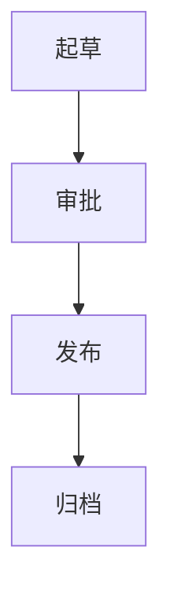
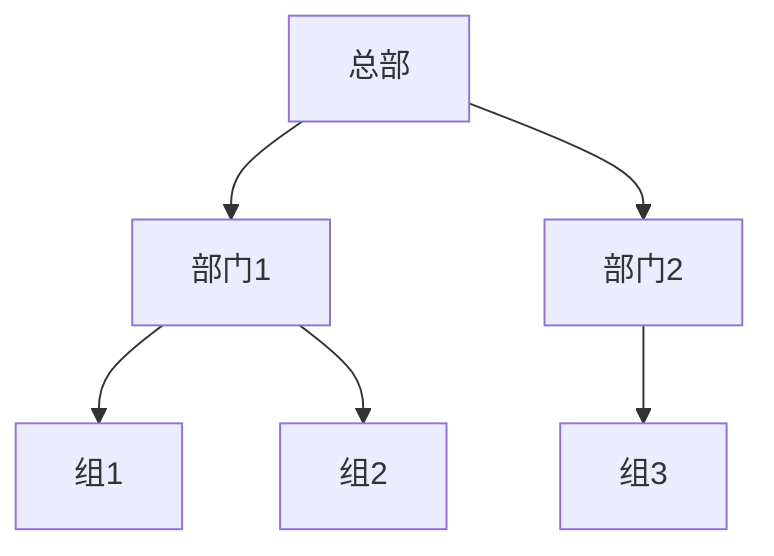
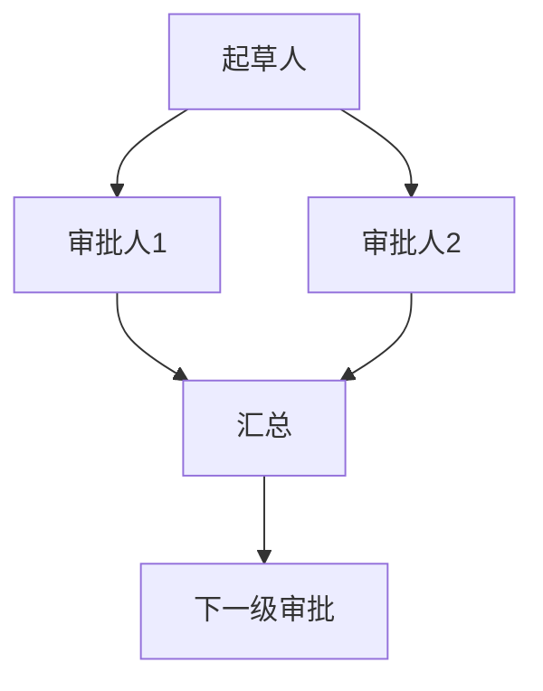
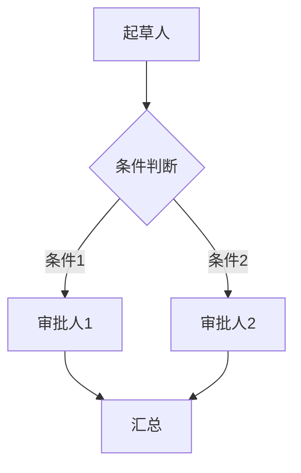
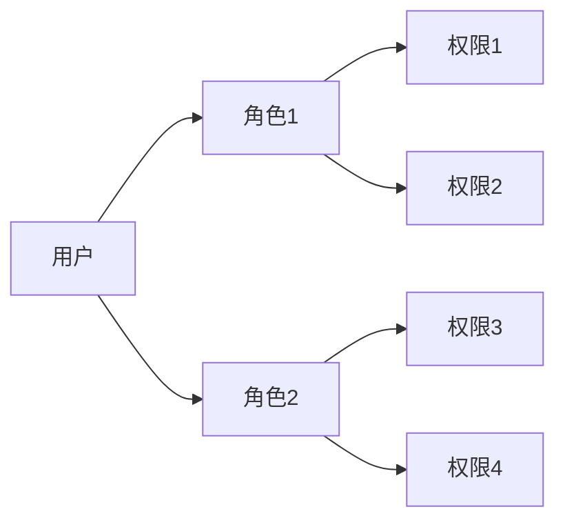
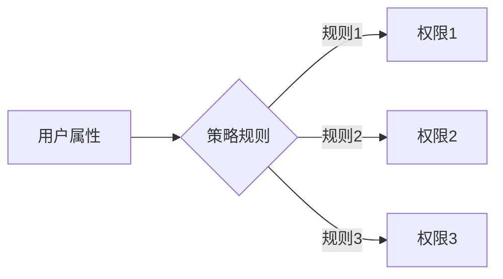

# XX学院信息化办公平台-公文、组织机构管理系统的设计与实现

## 1.背景介绍

### 1.1 信息化办公的重要性

在当今快节奏的数字时代,高效的办公管理对于提高工作效率、降低运营成本和提升整体竞争力至关重要。传统的纸质办公模式不仅效率低下,而且容易出现信息遗失、沟通不畅等问题。因此,构建一个集中、高效、安全的信息化办公平台成为各大机构和企业的迫切需求。

### 1.2 公文和组织机构管理的挑战

公文管理和组织机构管理是办公自动化系统的两大核心模块。公文管理涉及公文的起草、审批、发布和归档等流程,需要严格的权限控制和审计机制。组织机构管理则需要高效地管理机构的层级结构、人员信息和权限分配。这两个模块的复杂性和重要性都对系统的设计和实现提出了巨大挑战。

### 1.3 XX学院的信息化需求

作为一所规模庞大的高等院校,XX学院拥有复杂的组织架构和大量的公文流转。传统的办公方式已无法满足日益增长的需求,因此急需一套高效、安全、易用的信息化办公平台来提升办公效率、加强协作和降低运营成本。

## 2.核心概念与联系

### 2.1 公文管理

公文管理是指对机构内部产生的各种公文(如通知、决议、命令等)进行统一管理的过程,包括公文的起草、审批、发布、归档等环节。它是办公自动化系统的核心模块之一。

#### 2.1.1 公文流转流程

公文流转流程通常包括以下几个主要步骤:

1. 起草: 根据需求,指定的人员起草公文初稿。
2. 审批: 公文初稿按照预设的审批流程,经过多级审批人员的审核和修改。
3. 发布: 审批通过后,公文正式发布,相关人员可查阅和执行。
4. 归档: 公文发布后,将其归档保存,以备后续查询和审计。

#### 2.1.2 公文权限控制

由于公文内容的敏感性和重要性,需要对公文的查看、修改和审批等操作进行严格的权限控制,确保信息安全和工作流程的顺利进行。

### 2.2 组织机构管理

组织机构管理模块主要负责维护和管理机构的组织架构、人员信息和权限分配等内容,是办公自动化系统的另一核心模块。

#### 2.2.1 组织架构管理

组织架构通常呈现为树状层级结构,包括不同的部门、岗位和职能。系统需要支持灵活的架构调整,如添加、删除或合并部门等操作。

#### 2.2.2 人员信息管理

人员信息管理模块需要记录每个员工的基本信息、岗位职责、联系方式等数据,并与组织架构相关联。同时,还需要支持员工入职、离职、调动等操作。

#### 2.2.3 权限分配管理

根据组织架构和岗位职责,系统需要为不同的用户分配合理的操作权限,如查看公文、审批公文、管理组织架构等,以确保系统的安全性和工作流程的有序进行。

### 2.3 公文和组织机构管理的关系

公文管理和组织机构管理模块虽然职责不同,但两者之间存在紧密的联系:

- 公文的审批流程和发布对象需要根据组织架构和人员信息来确定。
- 不同岗位和部门的员工对公文的查看、修改和审批等操作拥有不同的权限。
- 组织架构和人员变动会影响公文流转的路径和权限分配。

因此,这两个模块需要高度集成,确保数据的一致性和业务流程的顺畅运行。

## 3.核心算法原理具体操作步骤

### 3.1 公文流转算法

公文流转算法的核心是根据预设的审批流程,将公文按顺序传递给各级审批人员。常见的算法包括:

#### 3.1.1 线性审批流程算法

线性审批流程算法将审批人员按照固定的顺序排列,公文需要逐级审批通过后才能进入下一级别。这种算法简单直观,但缺乏灵活性。

#### 3.1.2 并行审批流程算法

并行审批流程算法允许同一级别的多个审批人员同时审批公文,只有全部审批通过后才能进入下一级别。这种算法提高了审批效率,但增加了协调的复杂性。

#### 3.1.3 条件审批流程算法

条件审批流程算法根据公文的内容或其他条件,动态确定审批路径和审批人员。这种算法最为灵活,但也最为复杂。

无论采用哪种算法,都需要对审批流程进行严格的权限控制,确保只有授权人员才能参与审批,防止信息泄露和非法操作。

### 3.2 组织架构管理算法

组织架构管理算法的核心是高效地维护和查询机构的层级结构,常见的数据结构和算法包括:

#### 3.2.1 树状数据结构

树状数据结构天然适合表示层级关系,每个节点代表一个部门或岗位,节点之间通过父子关系连接。添加、删除和搜索操作都可以在对数时间复杂度内完成。

#### 3.2.2 路径枚举算法

路径枚举算法用于查找两个节点之间的路径,可以用于确定上级部门、下级部门或同级部门等关系。常见的算法包括深度优先搜索和广度优先搜索。

#### 3.2.3 最近公共祖先算法

最近公共祖先算法用于查找两个节点的最近公共上级部门,在确定部门之间的层级关系时非常有用。可以使用离线预处理的方式加速查询。

除了高效的数据结构和算法之外,组织架构管理模块还需要支持架构调整操作(如添加、删除或合并部门等),并确保相关数据(如人员信息、权限分配等)的一致性。

### 3.3 权限管理算法

权限管理算法的核心是根据用户的身份和岗位,为其分配合理的系统操作权限,常见的算法包括:

#### 3.3.1 基于角色的访问控制(RBAC)

RBAC将系统操作权限按功能划分为不同的角色,然后将用户与相应的角色相关联。这种算法简单直观,易于维护和扩展。

#### 3.3.2 基于属性的访问控制(ABAC)

ABAC根据用户的属性(如部门、岗位、资格等)动态分配权限,更加灵活和精细。但实现较为复杂,需要定义详细的策略规则。

无论采用何种算法,权限管理都需要遵循最小权限原则,只分配必要的操作权限,从而降低系统的安全风险。同时,还需要对敏感操作进行审计跟踪,确保责任追溯。

## 4.数学模型和公式详细讲解举例说明

在公文和组织机构管理系统中,数学模型和公式主要应用于以下几个方面:

### 4.1 公文审批流程建模

公文审批流程可以使用有向无环图(DAG)来建模,每个节点代表一个审批环节,边代表审批流转的方向。通过图论算法(如拓扑排序)可以确定审批的先后顺序。

设有向无环图 $G=(V,E)$ 表示审批流程,其中 $V$ 为节点集合(审批环节), $E$ 为边集合(审批流转)。对于任意节点 $v \in V$,定义其入度 $indeg(v)$ 为指向它的边的数量。

则拓扑排序算法可以描述如下:

$$
\begin{array}{ll}
1) & \textbf{初始化:} 将所有入度为 0 的节点加入队列 Q \\
2) & \textbf{循环:} 从 Q 中取出一个节点 u,并输出 \\
   & \qquad 对于每个从 u 出发的边 (u,v) \in E,将 v 的入度减 1 \\
   & \qquad 若存在入度减为 0 的节点 v,则将其加入队列 Q \\
3) & \textbf{结束:} 如果所有节点均已输出,则拓扑排序成功;否则存在环路,失败
\end{array}
$$

通过拓扑排序,我们可以得到一个线性的审批顺序,满足所有依赖关系。

### 4.2 组织架构层级关系建模

组织架构的层级关系可以使用树状数据结构来建模,每个节点代表一个部门或岗位,边表示上下级关系。

设树 $T=(V,E)$ 表示组织架构,其中 $V$ 为节点集合(部门或岗位), $E$ 为边集合(上下级关系)。对于任意节点 $v \in V$,定义其深度 $depth(v)$ 为从根节点到该节点的边数。

则两个节点 $u,v \in V$ 之间的层级距离可以定义为:

$$
dist(u,v) = |depth(u) - depth(v)|
$$

如果 $dist(u,v) = 0$,则 $u$ 和 $v$ 在同一层级;如果 $dist(u,v) = 1$,则它们相差一级。通过计算层级距离,我们可以确定部门之间的上下级关系。

### 4.3 权限分配优化建模

在权限分配过程中,我们需要遵循最小权限原则,即只分配必要的最小操作权限。这可以建模为一个整数线性规划问题:

设有 $n$ 个用户 $U=\{u_1,u_2,...,u_n\}$, $m$ 个权限 $P=\{p_1,p_2,...,p_m\}$,用 $0-1$ 变量 $x_{ij}$ 表示用户 $u_i$ 是否被分配了权限 $p_j$ (分配为 $1$,否则为 $0$)。

定义目标函数:

$$
\min \sum_{i=1}^{n}\sum_{j=1}^{m}x_{ij}
$$

约束条件:

- 每个用户至少被分配一个必要的权限:

$$
\sum_{j=1}^{m}x_{ij} \geq 1,\quad \forall i=1,2,...,n
$$

- 满足用户角色和权限之间的关联关系:

$$
\sum_{i=1}^{n}a_{ik}x_{ij} \geq b_k,\quad \forall k=1,2,...,r
$$

其中 $a_{ik}$ 和 $b_k$ 是已知的常数,表示角色 $k$ 所需的最小权限数量。