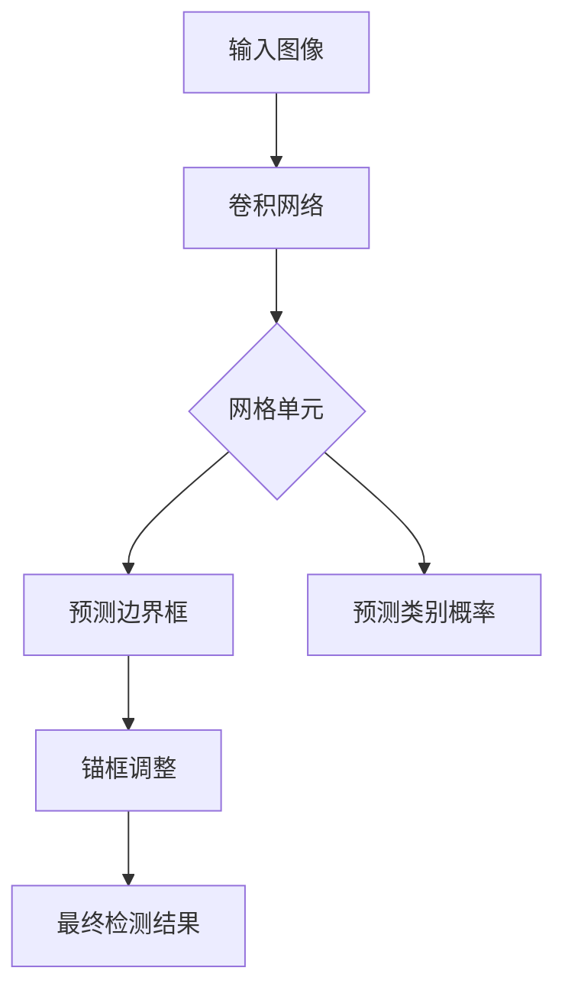
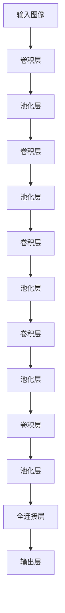

# YOLOv2原理与代码实例讲解

## 1.背景介绍

### 1.1 目标检测的重要性

在计算机视觉领域,目标检测是一项极具挑战的基础任务。它旨在定位图像或视频中的目标对象,并对它们进行分类。准确高效的目标检测技术对于诸多应用领域至关重要,例如:

- 自动驾驶汽车需要检测行人、车辆、交通标志等
- 安防监控系统需要检测可疑人员和物体
- 机器人视觉需要检测周围环境中的各种目标

随着深度学习技术的不断发展,目标检测算法也在不断演进和优化,以满足更高的精度和实时性要求。

### 1.2 YOLO系列算法的革新意义

在2015年,Joseph Redmon等人提出了YOLO(You Only Look Once)目标检测系统,开创了基于深度学习的端到端目标检测新范式。与传统的基于候选区域的两阶段目标检测方法不同,YOLO将目标检测任务看作一个回归问题,直接从图像像素预测目标边界框和类别概率。这种全卷积网络结构使得YOLO在保持较高精度的同时,实现了极高的检测速度。

2016年,YOLO的第二版YOLOv2算法应运而生,在精度和速度上都有了大幅提升。本文将重点介绍YOLOv2的核心原理、关键改进点,并通过代码示例帮助读者更好地理解和掌握这一经典目标检测算法。

## 2.核心概念与联系

### 2.1 端到端目标检测

传统的基于候选区域的目标检测算法通常包含以下几个步骤:

1. 生成大量候选边界框
2. 提取候选框特征
3. 分类和边界框回归

这种分步骤的方法存在一些缺陷,如计算量大、管道复杂、难以优化等。

相比之下,YOLOv2采用的端到端(end-to-end)方法将整个目标检测过程融合到一个神经网络中,直接从输入图像预测目标边界框和类别。这种设计大大简化了检测流程,降低了系统复杂度,并为实时应用奠定了基础。

### 2.2 网格单元与锚框

YOLOv2将输入图像划分为固定数量的网格单元(grid cell),每个单元负责预测其覆盖区域内的目标对象。具体来说,每个单元预测B个边界框(bounding box),以及这些边界框所属的类别概率。

为了处理不同形状和大小的目标,YOLOv2采用了先验锚框(anchor box)的概念。每个网格单元使用一组预设的锚框作为初始边界框,并根据输入图像中目标的实际位置和大小调整这些锚框。这种方法使得YOLOv2能够更好地适应不同比例的目标。



### 2.3 损失函数

为了使神经网络能够同时学习预测准确的边界框和分类结果,YOLOv2设计了一个复合损失函数。该损失函数包含三个部分:

1. 边界框坐标损失:衡量预测边界框与真实边界框之间的坐标偏差
2. 边界框置信度损失:衡量预测边界框包含目标的置信程度
3. 分类损失:衡量预测类别与真实类别之间的差异

通过最小化这个复合损失函数,神经网络能够逐步优化边界框回归和目标分类的性能。

## 3.核心算法原理具体操作步骤

### 3.1 网络结构

YOLOv2采用了Darknet-19作为主干网络,其基于VGGNet,但使用3×3卷积核和更小的滤波器数量,从而显著减少了计算量和模型大小。



### 3.2 网格单元与锚框

对于输入分辨率为$S \times S$的图像,YOLOv2将其划分为$S \times S$个网格单元。每个单元预测B个边界框,以及这些边界框所属的C个类别的概率。

每个边界框由5个预测值表示:$(x, y, w, h, c)$,其中$(x, y)$是边界框中心相对于网格单元的偏移量,$w$和$h$是边界框的宽度和高度,而$c$是该边界框包含目标的置信度。

为了处理不同形状和大小的目标,YOLOv2使用k个先验锚框,通常设置k=5。这些锚框是基于训练集中目标边界框的聚类结果预先确定的。

### 3.3 预测与损失函数

在训练阶段,YOLOv2会为每个网格单元分配一个真实的边界框,该边界框与该单元预测的锚框具有最大的交并比(IoU)。然后,该单元需要预测该真实边界框的位置和类别。

具体来说,对于包含目标的网格单元,其损失函数由三部分组成:

1. 边界框坐标损失:使用均方根误差(RMSE)衡量预测边界框与真实边界框之间的坐标偏差。

$$
\lambda_{coord}\sum_{i=0}^{S^2}\sum_{j=0}^B\mathbb{1}_{ij}^{obj}[(x_i-\hat{x}_i)^2 + (y_i-\hat{y}_i)^2 + ({\sqrt{w_i}}-{\sqrt{\hat{w}_i}})^2 + ({\sqrt{h_i}}-{\sqrt{\hat{h}_i}})^2]
$$

其中,$\lambda_{coord}$是坐标损失的权重系数,$\mathbb{1}_{ij}^{obj}$是一个指示器,用于确定第i个网格单元的第j个边界框是否负责预测该目标。

2. 边界框置信度损失:使用交叉熵损失函数衡量预测边界框包含目标的置信程度。

$$
\lambda_{noobj}\sum_{i=0}^{S^2}\sum_{j=0}^B\mathbb{1}_{ij}^{noobj}(c_i)^2 + \lambda_{obj}\sum_{i=0}^{S^2}\sum_{j=0}^B\mathbb{1}_{ij}^{obj}(c_i-\hat{c}_i)^2
$$

其中,$\lambda_{noobj}$和$\lambda_{obj}$分别是不包含目标和包含目标时的置信度损失权重。

3. 分类损失:使用softmax损失函数衡量预测类别与真实类别之间的差异。

$$
\sum_{i=0}^{S^2}\mathbb{1}_{i}^{obj}\sum_{c \in \text{classes}}(p_i(c)-\hat{p}_i(c))^2
$$

最终的损失函数是上述三部分的加权和。在训练过程中,通过反向传播和梯度下降优化这个损失函数,从而使网络能够同时学习准确的边界框回归和目标分类。

## 4.数学模型和公式详细讲解举例说明

### 4.1 交并比(IoU)

交并比(Intersection over Union,IoU)是目标检测领域中一个重要的评估指标,用于衡量预测边界框与真实边界框之间的重叠程度。其计算公式如下:

$$
\text{IoU} = \frac{\text{Area of Intersection}}{\text{Area of Union}}
$$

其中,交集区域(Area of Intersection)表示预测边界框和真实边界框的重叠部分面积,并集区域(Area of Union)表示两个边界框的总面积。

IoU的取值范围在[0,1]之间,值越大表示预测边界框与真实边界框重叠程度越高。在YOLOv2中,IoU被用于确定哪个预测边界框应该负责预测某个真实目标。

例如,假设一个网格单元预测了5个锚框,如下图所示:

```
+---------------+
|      ____     |
|     /    \    |
|    /      \   |
|   |   __   |  |
|   |  /  \  |  |
| __|_/    \_|__|
|   |        |  |
+---------------+
```

其中,红色边界框与真实目标的IoU最大,因此该网格单元将负责预测这个真实目标的位置和类别。

### 4.2 非最大值抑制(NMS)

由于YOLOv2会为每个网格单元预测多个边界框,因此可能会出现多个边界框检测到同一目标的情况。为了解决这个问题,YOLOv2采用了非最大值抑制(Non-Maximum Suppression,NMS)算法。

NMS算法的基本思路是:对于具有较高置信度的边界框,抑制其他与之重叠的边界框。具体步骤如下:

1. 根据预测边界框的置信度排序
2. 从置信度最高的边界框开始,移除所有与之重叠的边界框(IoU超过阈值)
3. 重复步骤2,直到所有边界框都被处理

通过NMS,YOLOv2能够保留置信度最高的边界框,从而避免重复检测同一目标。

例如,对于下图中的情况:

```
+---------------+
|    _____      |
|   /     \     |
|  /       \    |
| |         |   |
| |         |   |
|  \_______/    |
|        _____  |
|       /     \ |
+---------------+
```

假设红色边界框的置信度最高,NMS算法将保留红色边界框,并移除与之重叠的蓝色边界框。

## 5.项目实践:代码实例和详细解释说明

为了帮助读者更好地理解YOLOv2算法,我们将提供一个基于PyTorch的代码实现示例。这个示例包含了YOLOv2网络的构建、训练和测试流程,并对关键代码进行了详细的注释说明。

### 5.1 环境配置

本示例使用Python 3.7和PyTorch 1.7.1。您可以使用以下命令创建一个新的虚拟环境并安装所需的依赖项:

```bash
python3 -m venv yolov2-env
source yolov2-env/bin/activate
pip install torch==1.7.1 torchvision==0.8.2
```

### 5.2 数据准备

我们将使用COCO数据集进行训练和测试。您可以从官方网站下载数据集,并将其解压缩到指定目录。

```bash
mkdir data
wget http://images.cocodataset.org/zips/train2017.zip
wget http://images.cocodataset.org/zips/val2017.zip
wget http://images.cocodataset.org/annotations/annotations_trainval2017.zip
unzip train2017.zip -d data/
unzip val2017.zip -d data/
unzip annotations_trainval2017.zip -d data/
```

### 5.3 模型实现

我们将实现YOLOv2网络的核心组件,包括Darknet-19主干网络、锚框生成器和YOLOv2检测头。

```python
import torch
import torch.nn as nn

# Darknet-19主干网络
class Darknet19(nn.Module):
    ...

# 锚框生成器
class AnchorBoxes(nn.Module):
    ...

# YOLOv2检测头
class YOLOv2Head(nn.Module):
    ...

# 整合YOLOv2网络
class YOLOv2(nn.Module):
    def __init__(self, num_classes):
        super(YOLOv2, self).__init__()
        self.backbone = Darknet19()
        self.anchors = AnchorBoxes()
        self.head = YOLOv2Head(num_classes)

    def forward(self, x):
        x = self.backbone(x)
        anchors = self.anchors(x)
        outputs = self.head(x, anchors)
        return outputs
```

### 5.4 训练和测试

我们将定义数据加载器、损失函数和优化器,并实现训练和测试循环。

```python
import torch.optim as optim
from torch.utils.data import DataLoader
from dataset import COCODataset
from utils import yolov2_loss

# 数据加载器
train_dataset = COCODataset(root='data', mode='train')
train_loader = DataLoader(train_dataset, batch_size=16, shuffle