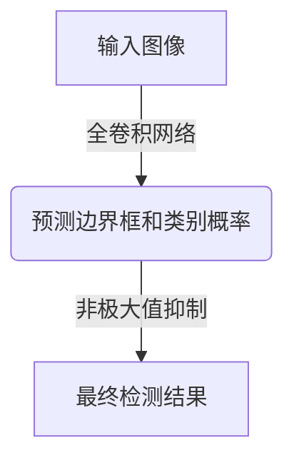
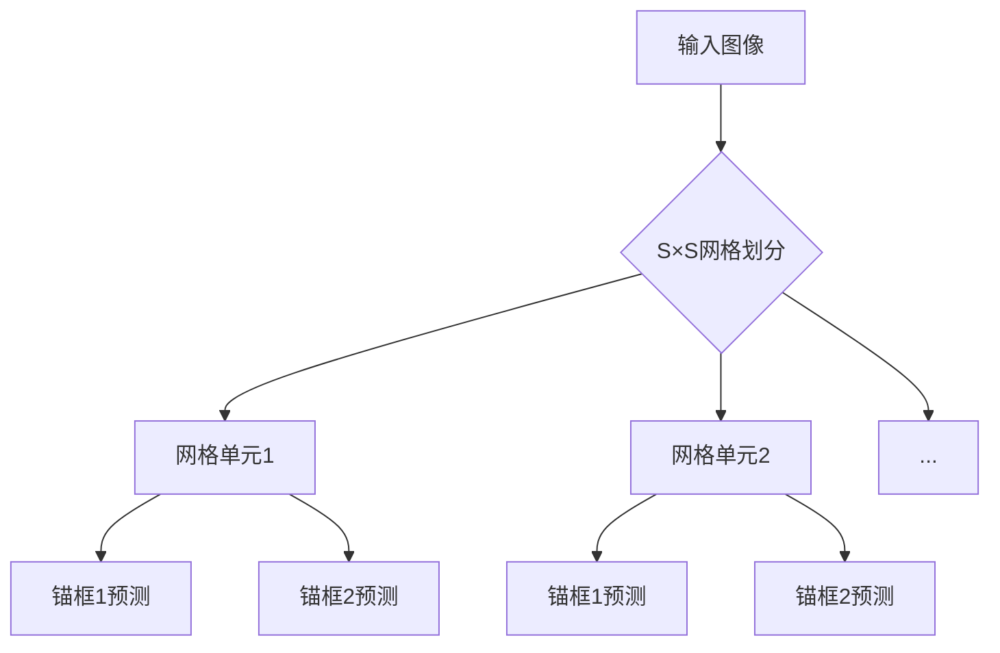
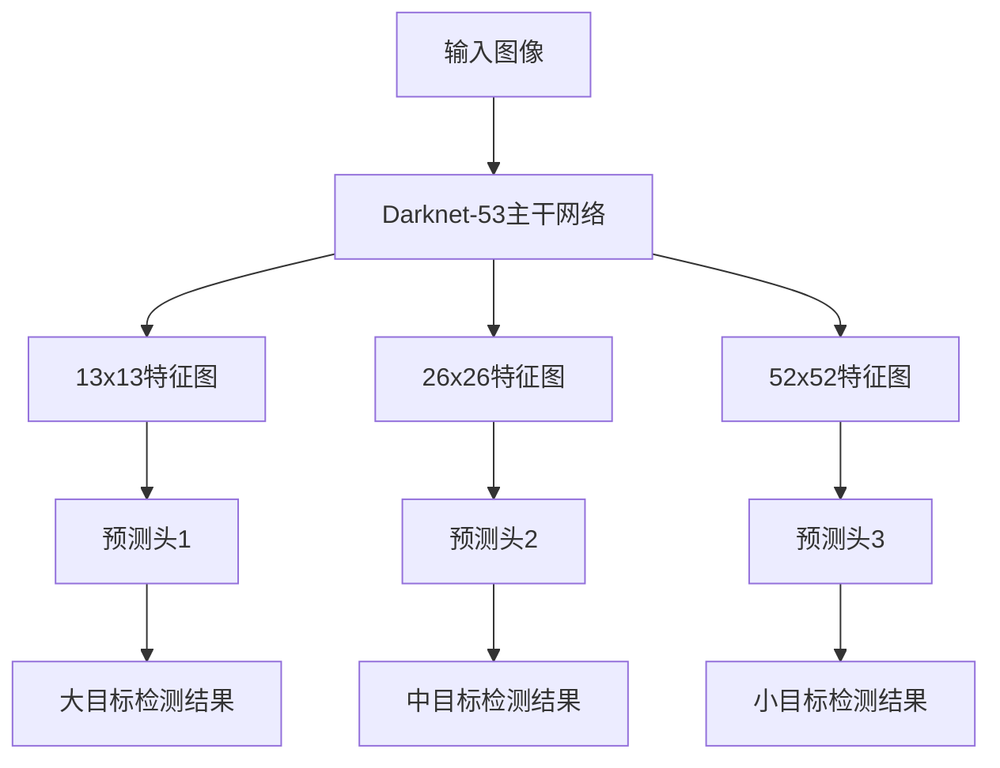
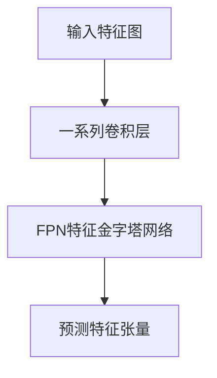
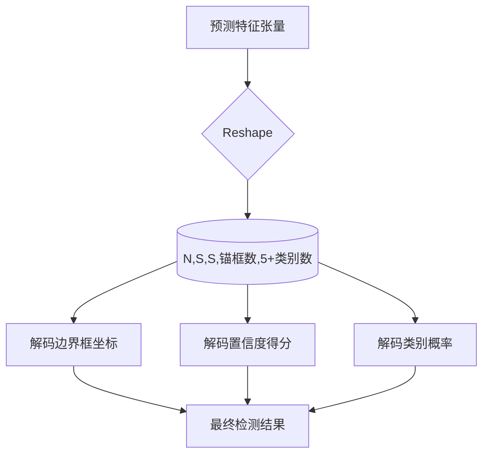

# YOLOv3原理与代码实例讲解

## 1.背景介绍

### 1.1 目标检测任务概述

目标检测是计算机视觉领域的一个核心任务,旨在从给定的图像或视频中找出感兴趣的目标实例,并给出每个目标的位置和类别标签。它广泛应用于安防监控、自动驾驶、机器人视觉等诸多领域。

### 1.2 目标检测发展历程

早期的目标检测方法主要基于传统的机器学习算法,如滑动窗口+手工特征+分类器的经典框架。该类方法存在计算效率低下、泛化能力差等缺陷。

2012年AlexNet的提出,标志着深度学习在计算机视觉领域取得突破性进展。基于深度卷积神经网络(CNN)的目标检测算法逐渐崭露头角,主流方法可分为两大类:

1. 基于候选区域的两阶段目标检测器(Two-Stage)
2. 基于密集采样的一阶段目标检测器(One-Stage)

### 1.3 YOLO系列算法的重要意义

在一阶段目标检测器中,YOLO(You Only Look Once)系列算法是最具代表性的。它于2015年由Joseph Redmon等人提出,通过将目标检测任务建模为端到端的回归问题,极大地提高了检测速度,被公认为实时目标检测领域的开山之作。

YOLOv3是YOLO系列算法的最新版本,在检测精度和实时性方面都有了大幅提升,成为目前最流行的实时目标检测算法之一。本文将重点介绍YOLOv3的核心原理和实现细节。

## 2.核心概念与联系

### 2.1 端到端目标检测

传统的目标检测算法通常分为两个阶段:候选区域生成和目标分类。这种分步骤的方式存在着严重的缺陷,如计算复杂度高、速度慢等。

YOLO算法将目标检测任务建模为端到端的回归问题,直接从输入图像预测目标边界框和类别概率,无需先生成候选区域。这种全卷积的设计显著提升了检测速度。



### 2.2 网格单元和锚框

YOLO算法将输入图像划分为S×S个网格单元,每个单元负责预测B个边界框以及这些框的置信度和类别概率。

为了处理不同尺度的目标,YOLO采用了锚框(Anchor Boxes)的概念。每个网格单元会为预设的锚框尺寸预测对应的边界框,从而提高对不同大小目标的检测能力。



### 2.3 损失函数

YOLO的损失函数由三部分组成:边界框坐标损失、目标置信度损失和类别概率损失。

1. 边界框坐标损失:衡量预测边界框与实际边界框的位置和尺寸偏差。
2. 目标置信度损失:衡量每个预测边界框包含目标的置信度。
3. 类别概率损失:衡量每个预测边界框的类别概率分布与真实类别的差异。

通过优化这个多任务损失函数,使网络能够同时学习预测精确的边界框、置信度和类别概率。

## 3.核心算法原理具体操作步骤

### 3.1 网络结构

YOLOv3的主干网络采用的是Darknet-53,这是一个经过深度可分离卷积和残差连接优化的53层卷积网络。与标准卷积相比,深度可分离卷积可以大幅减少参数量和计算量。

Darknet-53输出三个不同尺度的特征图,分别被三个独立的预测头(Prediction Head)处理,生成对应尺度的检测结果。这种多尺度预测的设计提高了对不同大小目标的检测能力。



### 3.2 预测头结构

每个预测头由一系列卷积层和一个特征金字塔网络(FPN)组成。

1. 卷积层用于提取高级语义特征。
2. FPN通过自上而下的横向连接,融合低层次和高层次的特征,增强了特征的表示能力。

最终,预测头会输出一个特征张量,其通道数等于锚框数乘以(5+类别数)。其中,5对应边界框的4个坐标值和1个置信度值,类别数对应每个类别的概率值。



### 3.3 边界框解码

从预测特征张量中解码出边界框坐标、置信度和类别概率的过程如下:

1. 将特征张量reshape为(N,S,S,锚框数,5+类别数)的张量,其中N为批大小,S为网格尺寸。
2. 对每个网格单元,提取出锚框数个(5+类别数)维的预测向量。
3. 将预测向量分解为:
   - 边界框坐标(tx,ty,tw,th)
   - 置信度得分(to)
   - 类别概率(p1,p2,...,pC)
4. 将(tx,ty,tw,th)解码为实际的(bx,by,bw,bh)边界框坐标。
5. 对每个边界框,计算其包含目标的最终置信度:置信度得分 * 类别概率的最大值。



### 3.4 非极大值抑制

由于存在锚框分配的原因,同一个目标可能被多个边界框检测到。为了消除这种冗余,YOLOv3采用了非极大值抑制(NMS)的后处理步骤。

NMS的基本思路是:对于重叠程度很高的边界框,只保留置信度最高的那个,剩余的边界框被抑制掉。具体操作如下:

1. 根据包含目标的置信度对所有预测边界框进行排序。
2. 从置信度最高的边界框开始,计算其与其他边界框的IoU(交并比)。
3. 将IoU大于阈值的边界框删除。
4. 重复步骤2-3,直到所有边界框被遍历完。

通过NMS,可以极大地减少重复检测,提高最终检测的精确度。

## 4.数学模型和公式详细讲解举例说明

### 4.1 边界框坐标的解码

YOLOv3采用了一种特殊的参数化方式来表示边界框坐标,使得网络可以更高效地学习目标的位置和尺寸。

对于每个网格单元,网络需要预测出B个边界框$(t_x, t_y, t_w, t_h)$,它们分别对应于锚框$(a_x, a_y, a_w, a_h)$的偏移量。具体的解码公式如下:

$$
b_x = \sigma(t_x) + c_x \\
b_y = \sigma(t_y) + c_y \\
b_w = p_w e^{t_w} \\
b_h = p_h e^{t_h}
$$

其中:

- $(b_x, b_y)$是预测边界框的中心坐标,$(c_x, c_y)$是当前网格单元的左上角坐标。
- $(b_w, b_h)$是预测边界框的宽高,$(p_w, p_h)$是锚框的宽高。
- $\sigma$是sigmoid函数,确保$(b_x, b_y)$的值在(0,1)之间。

这种参数化方式可以让网络更容易学习到边界框的位置和大小,从而提高检测精度。

### 4.2 损失函数

YOLOv3的损失函数由三部分组成:边界框坐标损失$L_{coord}$、目标置信度损失$L_{conf}$和类别概率损失$L_{class}$。总的损失函数为:

$$
\mathcal{L} = \lambda_{coord}\sum_{i=0}^{S^2}\sum_{j=0}^{B}L_{coord}^{ij} + \lambda_{noobj}\sum_{i=0}^{S^2}\sum_{j=0}^{B}L_{noobj}^{ij} + \lambda_{obj}\sum_{i=0}^{S^2}\sum_{j=0}^{B}L_{obj}^{ij} + \sum_{i=0}^{S^2}\sum_{j=0}^{B}L_{class}^{ij}
$$

其中:

- $L_{coord}$是边界框坐标损失,使用均方差(MSE)计算。
- $L_{obj}$是包含目标时的置信度损失,使用交叉熵(CE)计算。
- $L_{noobj}$是不包含目标时的置信度损失,也使用CE计算。
- $L_{class}$是类别概率损失,使用CE计算。
- $\lambda$是各项损失的权重系数,用于平衡不同损失项的贡献。

通过优化这个多任务损失函数,网络可以同时学习预测精确的边界框坐标、置信度和类别概率,从而提高整体的检测性能。

## 5.项目实践:代码实例和详细解释说明

为了帮助读者更好地理解YOLOv3的原理和实现细节,我们将提供一个基于PyTorch的代码示例。该示例包括YOLOv3模型的构建、训练和测试等核心部分。

### 5.1 模型定义

```python
import torch
import torch.nn as nn

# 定义卷积块
def conv_block(in_channels, out_channels, kernel_size, stride=1, padding=0, bn_act=True):
    conv = nn.Conv2d(in_channels, out_channels, kernel_size, stride, padding, bias=not bn_act)
    module = [conv]
    if bn_act:
        module.append(nn.BatchNorm2d(out_channels))
        module.append(nn.LeakyReLU(0.1, inplace=True))
    return nn.Sequential(*module)

# 定义残差块
def residual_block(in_channels, out_channels, num_blocks):
    layers = []
    for i in range(num_blocks):
        layers.append(conv_block(in_channels, out_channels // 2, 1))
        layers.append(conv_block(out_channels // 2, out_channels, 3, 1, 1))
        in_channels = out_channels
    return nn.Sequential(*layers)

# 定义Darknet-53主干网络
class Darknet53(nn.Module):
    def __init__(self):
        super(Darknet53, self).__init__()
        self.conv1 = conv_block(3, 32, 3, 1, 1)
        self.conv2 = conv_block(32, 64, 3, 2, 1)
        self.residual1 = residual_block(64, 64, 1)
        self.conv3 = conv_block(64, 128, 3, 2, 1)
        self.residual2 = residual_block(128, 128, 2)
        self.conv4 = conv_block(128, 256, 3, 2, 1)
        self.residual3 = residual_block(256, 256, 8)
        self.conv5 = conv_block(256, 512, 3, 2, 1)
        self.residual4 = residual_block(512, 512, 8)
        self.conv6 = conv_block(512, 1024, 3, 2, 1)
        self.residual5 = residual_block(1024, 1024, 4)

    def forward(self, x):
        x = self.conv1(x)
        x = self.conv2(x)
        x = self.residual1(x)
        x = self.conv3(x)
        x = self.residual2(x)