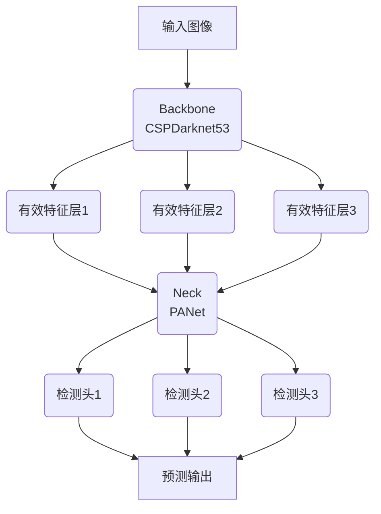

# YOLOv5原理与代码实例讲解

## 1.背景介绍

### 1.1 目标检测的重要性

在计算机视觉领域,目标检测是一项极其重要的基础技术。它旨在自动识别和定位图像或视频中感兴趣的目标对象,并为每个检测到的目标生成一个准确的边界框。目标检测广泛应用于多个领域,如安防监控、自动驾驶、机器人视觉等。随着深度学习技术的飞速发展,基于深度卷积神经网络(CNN)的目标检测算法取得了巨大的进步,在准确率和速度上都有了显著的提升。

### 1.2 YOLO系列算法概述  

You Only Look Once(YOLO)是一种开创性的基于深度学习的目标检测算法,由Joseph Redmon等人于2016年提出。相较于传统的基于区域提取的两阶段目标检测算法,YOLO将目标检测任务看作一个回归问题,通过单个神经网络直接从图像像素预测目标边界框和类别概率。YOLO系列算法具有速度快、背景误检率低等优点,在保持较高精度的同时,实现了极高的推理速度,因而在实时目标检测任务中备受青睐。

YOLOv5是在YOLOv4的基础上进行改进和优化的最新版本,由Glenn Jocher等人于2020年发布。它在网络结构、训练策略、推理部署等多个方面进行了创新,显著提升了检测精度和推理速度,同时降低了模型大小和计算量。本文将重点介绍YOLOv5的核心原理、算法细节、代码实现等内容。

## 2.核心概念与联系

### 2.1 单阶段目标检测

传统的基于区域提取的两阶段目标检测算法(如R-CNN系列)首先生成大量候选区域,然后对每个区域进行分类和精修。这种方法虽然精度较高,但存在速度慢、耗时长的缺陷。相比之下,单阶段目标检测算法将目标检测任务看作一个回归问题,通过单个神经网络直接从图像像素预测目标边界框和类别概率,避免了候选区域生成和分类的多余计算,因而速度更快、效率更高。

YOLO系列算法采用的正是单阶段检测范式。具体来说,YOLO将输入图像划分为S×S个网格,每个网格负责预测B个边界框以及每个边界框所属的类别概率。这种密集预测的方式大大提高了检测效率,但也带来了一些缺陷,如对小目标的检测效果不佳。YOLOv5在此基础上进行了多方面的改进和优化。

### 2.2 特征金字塔

为了提高对不同尺度目标的检测能力,YOLO借鉴了Feature Pyramid Network(FPN)的思想,构建了一种高效的特征金字塔结构。具体来说,YOLOv5从backbone(如CSPDarknet53)提取出三个有效特征层,分别对应于大、中、小尺度的目标。然后通过路径聚合块(PANet)融合不同层次的特征,最终生成高质量的特征金字塔用于预测。这种多尺度特征融合的方式,使得YOLOv5能够有效检测不同大小的目标。

### 2.3 注意力机制

注意力机制是深度学习领域的一种热门技术,通过自适应地分配不同区域的注意力权重,使模型能够更好地关注图像中的关键区域。YOLOv5借鉴了注意力机制的思想,在网络中引入了空间注意力模块(SAM)和通道注意力模块(CAM),显著提高了特征表达能力。此外,YOLOv5还采用了反向注意力传播(BAM)机制,进一步提升了小目标检测的性能。

## 3.核心算法原理具体操作步骤

### 3.1 网络结构

YOLOv5的网络结构可以分为backbone、neck和head三个部分:

1. **Backbone**: YOLOv5采用了CSPDarknet53作为backbone,用于从输入图像提取特征。CSPDarknet53是一种高效的卷积神经网络,通过跨层连接和重复残差结构,在保持较高精度的同时大幅减少了计算量和模型大小。

2. **Neck**: Neck部分由PANet(Path Aggregation Network)组成,它融合了来自backbone的三个有效特征层,生成特征金字塔。PANet通过自适应权重相加的方式,有效地整合了不同尺度的特征信息。

3. **Head**: Head部分由一系列的检测头组成,每个检测头负责预测一个特定尺度的目标。检测头由卷积层、批归一化层和YOLO层构成,YOLO层输出最终的边界框坐标、置信度和类别概率。

此外,YOLOv5还采用了注意力机制(SAM、CAM和BAM)来增强特征表达能力,从而提高检测性能。



### 3.2 目标检测过程

YOLOv5将输入图像划分为S×S个网格,每个网格负责预测B个边界框。对于每个边界框,模型会输出以下几个预测值:

1. **边界框坐标(tx, ty, tw, th)**: 相对于当前网格的边界框坐标偏移量。
2. **置信度(Conf)**: 当前边界框包含目标的置信度得分。
3. **类别概率(Pr(Class))**: 当前边界框中目标属于各个类别的概率分布。

具体来说,检测过程包括以下几个步骤:

1. **特征提取**: 输入图像通过backbone网络提取特征,得到三个有效特征层。
2. **特征融合**: 三个特征层通过PANet融合,生成特征金字塔。
3. **密集预测**: 对于每个尺度的特征层,通过对应的检测头进行密集预测,输出边界框坐标、置信度和类别概率。
4. **非极大值抑制(NMS)**: 对所有预测的边界框进行NMS,去除重复的检测框。

通过上述步骤,YOLOv5能够高效地从输入图像中检测出所有感兴趣的目标。

## 4.数学模型和公式详细讲解举例说明

### 4.1 边界框编码

YOLOv5采用了一种高效的边界框编码方式。具体来说,对于每个网格,模型预测B个边界框,每个边界框由4个值(tx, ty, tw, th)表示,它们分别对应于以下公式:

$$
b_x = \sigma(t_x) + c_x \\
b_y = \sigma(t_y) + c_y \\
b_w = p_w e^{t_w} \\
b_h = p_h e^{t_h}
$$

其中:

- $(b_x, b_y)$是预测边界框的中心坐标
- $(b_w, b_h)$是预测边界框的宽度和高度
- $(c_x, c_y)$是当前网格的左上角坐标
- $(p_w, p_h)$是先验边界框的宽度和高度
- $\sigma$是sigmoid函数,用于将$t_x$和$t_y$的值限制在(0,1)范围内

这种编码方式能够有效地捕获目标的位置和大小信息,同时避免了边界框越界的问题。

### 4.2 损失函数

YOLOv5的损失函数由三部分组成:边界框损失(bbox loss)、置信度损失(confidence loss)和分类损失(classification loss)。

**1. 边界框损失**

边界框损失衡量预测边界框与真实边界框之间的差异,采用GIOU(Generalized Intersection over Union)损失函数。GIOU损失不仅考虑了两个边界框的相交区域,还包括了它们之间的相似性和遗漏率,因此能够更好地反映边界框之间的几何差异。GIOU损失的公式如下:

$$
\mathcal{L}_{\text{GIOU}} = 1 - \text{GIOU}
$$

其中,GIOU的计算过程较为复杂,具体可参考相关论文。

**2. 置信度损失**

置信度损失衡量模型对目标存在与否的判断是否准确。对于包含目标的边界框,置信度损失使用BCE(Binary Cross Entropy)损失函数;对于不包含目标的边界框,置信度损失使用焦点损失(Focal Loss)。焦点损失能够有效解决正负样本不平衡的问题,公式如下:

$$
\begin{aligned}
\mathcal{L}_{\text{conf}} &= \sum_{i=0}^{N} \mathbb{1}_{\text{obj}}^i \text{BCE}(p_i, \hat{p}_i) + \\
&\lambda_{\text{noobj}} \sum_{i=0}^{N} \mathbb{1}_{\text{noobj}}^i \text{FL}(p_i, \hat{p}_i)
\end{aligned}
$$

其中:

- $N$是边界框的总数
- $\mathbb{1}_{\text{obj}}^i$是一个指示函数,表示第$i$个边界框是否包含目标
- $p_i$是第$i$个边界框的预测置信度
- $\hat{p}_i$是第$i$个边界框的真实置信度
- $\lambda_{\text{noobj}}$是不包含目标的边界框的损失权重

**3. 分类损失**

分类损失衡量模型对目标类别的预测是否准确,采用交叉熵损失函数:

$$
\mathcal{L}_{\text{class}} = \sum_{i=0}^{N} \mathbb{1}_{\text{obj}}^i \text{CE}(p_i(c), \hat{p}_i(c))
$$

其中:

- $p_i(c)$是第$i$个边界框预测的类别概率分布
- $\hat{p}_i(c)$是第$i$个边界框的真实类别概率分布,是一个one-hot编码向量

**总损失函数**

YOLOv5的总损失函数是上述三个损失的加权和:

$$
\mathcal{L} = \lambda_{\text{bbox}} \mathcal{L}_{\text{GIOU}} + \lambda_{\text{conf}} \mathcal{L}_{\text{conf}} + \lambda_{\text{class}} \mathcal{L}_{\text{class}}
$$

其中,$\lambda_{\text{bbox}}$、$\lambda_{\text{conf}}$和$\lambda_{\text{class}}$分别是边界框损失、置信度损失和分类损失的权重系数。

通过最小化总损失函数,YOLOv5能够同时优化边界框预测、目标存在判断和类别预测,从而提高整体检测性能。

## 5.项目实践:代码实例和详细解释说明

在这一部分,我们将通过一个实际的代码示例,详细解释YOLOv5的实现细节。以下是一个使用PyTorch实现的YOLOv5模型的简化版本:

```python
import torch
import torch.nn as nn

# 定义卷积块
def conv_block(in_channels, out_channels, kernel_size, stride, padding, activate=True):
    layers = [nn.Conv2d(in_channels, out_channels, kernel_size, stride, padding, bias=False),
              nn.BatchNorm2d(out_channels)]
    if activate:
        layers.append(nn.LeakyReLU(0.1, inplace=True))
    return nn.Sequential(*layers)

# 定义残差块
class ResidualBlock(nn.Module):
    def __init__(self, channels, use_residual=True, num_repeats=1):
        super().__init__()
        self.layers = nn.ModuleList()
        for _ in range(num_repeats):
            self.layers += [
                conv_block(channels, channels // 2, 1, 1, 0),
                conv_block(channels // 2, channels, 3, 1, 1, activate=False)
            ]
        self.use_residual = use_residual
        self.num_repeats = num_repeats

    def forward(self, x):
        for layer in self.layers:
            if self.use_residual:
                x = layer(x) + x
            else:
                x = layer(x)
        return x

# 定义YOLO层
class YOLOLayer(nn.Module):
    def __init__(self, anchors, num_classes):
        super().__init__()
        self.num_anchors = len(anchors)
        self.num_classes = num_classes
        self.mse_loss = nn