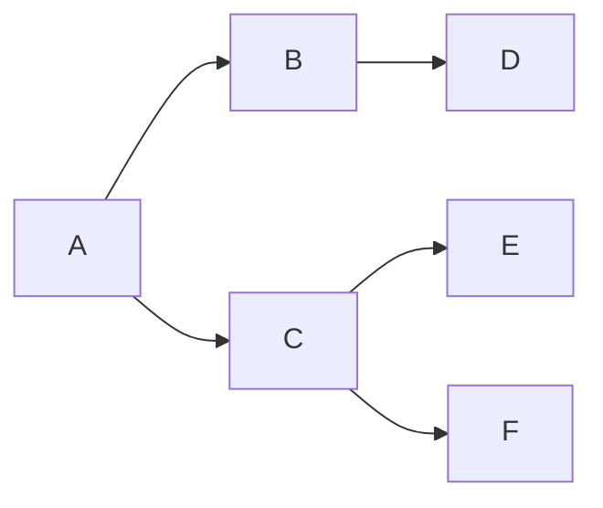

# Yarn 原理与代码实例讲解

## 1.背景介绍

### 1.1 什么是 Yarn?

Yarn 是一个新的软件包管理器,由 Facebook 的软件工程师们开发,旨在提高整个软件生态系统的性能。它是为了解决 npm 存在的一些缺陷而设计的,主要目标是更快、更可靠、更安全。

Yarn 的主要优势包括:

- 更快的安装速度
- 更简单的逻辑和更好的缓存
- 更可靠的代码安装
- 更好的安全性

### 1.2 为什么需要 Yarn?

npm 作为 Node.js 的默认包管理器,在使用过程中存在一些问题:

- 安装速度较慢
- 安装包的版本并不是完全一致
- 网络情况不佳时安装失败率较高

Yarn 的出现旨在解决上述问题,通过更快的安装速度、更可靠的依赖安装和更好的网络弹性等优势,为开发人员提供更好的开发体验。

## 2.核心概念与联系

### 2.1 包管理器的作用

包管理器的主要作用是管理项目的依赖关系,确保项目所需的所有依赖包都被正确安装。它们通常包含以下核心功能:

- 依赖安装
- 依赖更新
- 依赖版本管理
- 依赖缓存
- 依赖树构建

### 2.2 Yarn 的核心概念

Yarn 引入了一些新的核心概念,用于提高性能和可靠性:

1. **yarn.lock 文件**

   yarn.lock 文件用于锁定安装的依赖包的精确版本,确保在不同环境下安装的依赖版本完全一致。它是 Yarn 实现可靠性的关键所在。

2. **离线镜像**

   Yarn 会在本地缓存已安装的包,以加快后续的安装速度。这种离线镜像机制使得 Yarn 在网络环境不佳时也能正常工作。

3. **并行安装**

   Yarn 采用了最大程度的并行安装方式,充分利用多核 CPU 的优势,从而显著提高了安装速度。

4. **Flat Mode**

   Flat Mode 是 Yarn 的一种安装模式,它会将所有依赖包安装到一个单一的目录中,避免了嵌套的依赖目录结构,从而简化了文件系统的层级。

### 2.3 Yarn 与 npm 的关系

Yarn 并不是要取代 npm,而是作为一个更好的替代方案与 npm 并存。它们之间的关系如下:

- Yarn 仍然使用 npm 的包存储库,只是在安装和管理依赖包的方式上有所不同。
- Yarn 可以与现有的 npm 项目完全兼容,只需将 `package-lock.json` 文件替换为 `yarn.lock` 文件即可。
- npm 仍然是 Node.js 的默认包管理器,但 Yarn 提供了更好的性能和可靠性。

## 3.核心算法原理具体操作步骤 

### 3.1 Yarn 的安装

Yarn 可以通过 npm 或者独立安装程序进行安装。推荐使用独立安装程序,因为它会自动配置好环境变量。

```bash
# 通过 npm 安装
npm install --global yarn

# 通过独立安装程序安装
curl -o- -L https://yarnpkg.com/install.sh | bash
```

### 3.2 初始化新项目

在新的项目目录中,可以使用 `yarn init` 命令创建一个新的 `package.json` 文件。

```bash
mkdir my-project
cd my-project
yarn init
```

### 3.3 安装依赖包

使用 `yarn add` 命令安装所需的依赖包。Yarn 会自动更新 `yarn.lock` 文件和 `node_modules` 目录。

```bash
# 安装 react 和 react-dom
yarn add react react-dom

# 安装开发依赖
yarn add --dev webpack webpack-cli
```

### 3.4 运行脚本

与 npm 类似,Yarn 也支持在 `package.json` 中定义脚本,并通过 `yarn run` 命令执行。

```json
// package.json
{
  "scripts": {
    "build": "webpack --mode=production"
  }
}
```

```bash
yarn run build
```

### 3.5 发布包

如果你需要发布自己的包,可以使用 `yarn publish` 命令。Yarn 会自动创建一个新的 git tag 并发布到 npm 仓库。

```bash
yarn publish
```

## 4.数学模型和公式详细讲解举例说明

虽然 Yarn 主要是一个工具软件,但它的一些核心算法和优化策略还是基于一些数学模型和公式的。下面我们来详细讲解一下其中的一些关键部分。

### 4.1 依赖树构建算法

在安装依赖包时,Yarn 需要构建一个依赖树,以确定需要安装哪些包及其版本。这个过程可以用一个有向无环图 (DAG) 来表示。

假设我们有一个包 A,它依赖于包 B 和包 C。包 B 又依赖于包 D,包 C 依赖于包 E 和包 F。我们可以用下面的图来表示这个依赖关系:



在构建依赖树时,Yarn 会从根节点 (项目本身) 开始,递归地解析每个依赖包的依赖关系,直到所有依赖都被解析完毕。这个过程可以用深度优先搜索 (DFS) 或广度优先搜索 (BFS) 算法来实现。

假设我们使用 DFS 算法,那么上面的依赖树构建过程可以表示为:

1. 开始于根节点 A
2. 遍历 A 的邻居节点 B 和 C
3. 从 B 开始,遍历其邻居节点 D
4. 回溯到 C,遍历其邻居节点 E 和 F
5. 所有节点都被遍历完毕,依赖树构建完成

在实际实现中,Yarn 会对这个算法进行一些优化,例如利用已有的缓存信息、并行解析依赖关系等,以提高构建速度。

### 4.2 版本选择算法

在解析依赖关系时,Yarn 还需要确定每个包的具体版本。这个过程遵循 SemVer (语义化版本控制) 的规范,并使用一种称为 "最小嵌套"的策略。

SemVer 规定了版本号的格式,例如 `1.2.3`。其中:

- 主版本号 (1) 在有重大更新时递增
- 次版本号 (2) 在有新增功能时递增
- 修订号 (3) 在有 Bug 修复时递增

根据包的版本范围,Yarn 会选择满足要求的最高版本。例如,如果一个包依赖于 `^1.2.3` 的版本范围,那么 Yarn 会选择 `1.x.x` 范围内的最高版本。

当存在多个依赖包时,Yarn 会使用 "最小嵌套" 策略来避免版本冲突。具体来说,它会选择一个最小的版本范围,使得所有依赖包的版本要求都能被满足。

例如,假设包 A 依赖于 `^1.2.3` 的版本范围,包 B 依赖于 `^1.3.0` 的版本范围。那么 Yarn 会选择 `1.3.x` 作为这两个包的公共版本,因为它是满足两个版本范围的最小版本范围。

这个版本选择算法可以用一种称为 "语义版本范围交集" 的数学模型来表示。我们定义一个语义版本范围 $R$ 为一个左闭右开区间 $[a, b)$,其中 $a$ 和 $b$ 都是语义版本号。

那么,两个语义版本范围 $R_1 = [a_1, b_1)$ 和 $R_2 = [a_2, b_2)$ 的交集可以定义为:

$$
R_1 \cap R_2 = \begin{cases}
\emptyset & \text{if } b_1 \leq a_2 \text{ or } b_2 \leq a_1\\
{[}\max(a_1, a_2), \min(b_1, b_2){)} & \text{otherwise}
\end{cases}
$$

Yarn 的版本选择算法就是找到所有依赖包版本范围的交集,并从中选择最高的版本。

### 4.3 网络传输优化

由于 Yarn 需要从远程仓库下载依赖包,因此网络传输的效率对整体性能有很大影响。Yarn 采用了一些优化策略来提高网络传输效率。

1. **HTTP keep-alive**

   Yarn 会复用已建立的 HTTP 连接,避免每次请求都需要重新建立连接,从而减少了网络延迟。

2. **HTTP 分块传输**

   Yarn 支持 HTTP 分块传输,可以在传输过程中并行地处理数据,而不是等待整个文件传输完毕后再进行处理。

3. **带宽优化**

   Yarn 会根据网络状况动态调整下载带宽,避免过度占用带宽导致其他应用程序受到影响。它使用了一种基于 TCP Vegas 的拥塞控制算法,可以有效地利用网络带宽而不会导致网络拥塞。

TCP Vegas 算法的核心思想是维护一个期望传输速率 $expected$ 和实际传输速率 $actual$ 之间的差值 $diff = expected - actual$。如果 $diff$ 过大,说明网络拥塞程度较高,应该减小发送窗口;如果 $diff$ 过小,说明网络利用率较低,应该增大发送窗口。

具体来说,TCP Vegas 会根据以下公式调整发送窗口大小 $cwnd$:

$$
cwnd = \begin{cases}
cwnd + 1 & \text{if } diff < \alpha\\
cwnd - 1 & \text{if } diff > \beta\\
cwnd & \text{otherwise}
\end{cases}
$$

其中 $\alpha$ 和 $\beta$ 是两个预设的阈值,用于控制窗口大小的调整幅度。

通过这种动态调整发送窗口大小的方式,TCP Vegas 可以有效地利用网络带宽,同时避免过度拥塞。Yarn 在实现中对这个算法进行了一些改进和优化,以适应软件包管理的特殊需求。

## 4.项目实践:代码实例和详细解释说明

为了更好地理解 Yarn 的原理和使用方式,我们来看一个实际的项目示例。

### 4.1 初始化项目

首先,我们创建一个新的 React 项目,并使用 Yarn 进行依赖管理。

```bash
mkdir yarn-demo
cd yarn-demo
yarn init
```

执行 `yarn init` 命令后,Yarn 会提示你输入一些项目信息,例如项目名称、版本号、描述等。根据提示填写相应的信息即可。

### 4.2 安装 React 依赖

接下来,我们安装 React 和 React DOM 作为项目依赖。

```bash
yarn add react react-dom
```

Yarn 会自动将这两个依赖包及其所有嵌套依赖一并安装到 `node_modules` 目录中,同时在 `yarn.lock` 文件中锁定了所有依赖包的精确版本。

### 4.3 创建 React 组件

现在,我们来创建一个简单的 React 组件。

```jsx
// src/App.jsx
import React from 'react';

const App = () => {
  return (
    <div>
      <h1>Hello, Yarn!</h1>
      <p>This is a demo project using Yarn as the package manager.</p>
    </div>
  );
};

export default App;
```

### 4.4 配置 Webpack

为了能够在浏览器中运行我们的 React 应用程序,我们需要使用 Webpack 对代码进行打包。首先,安装 Webpack 及其相关依赖作为开发依赖。

```bash
yarn add --dev webpack webpack-cli webpack-dev-server babel-loader @babel/core @babel/preset-env @babel/preset-react
```

接下来,创建 Webpack 配置文件 `webpack.config.js`。

```javascript
const path = require('path');

module.exports = {
  entry: './src/index.jsx',
  output: {
    path: path.resolve(__dirname, 'dist'),
    filename: 'bundle.js',
  },
  module: {
    rules: [
      {
        test: /\.(js|jsx)$/,
        exclude: /node_modules/,
        use: {
          loader: 'babel-loader',
          options: {
            presets: ['@babel/preset-env', '@babel/preset-