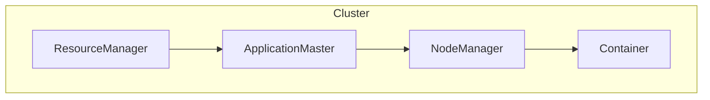
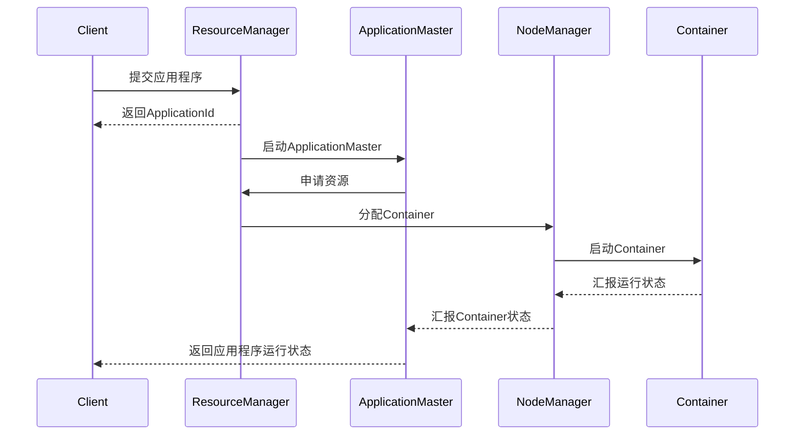
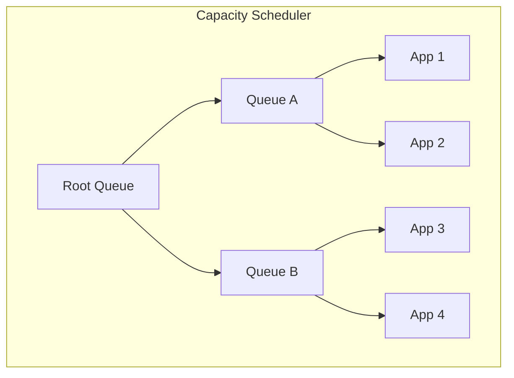
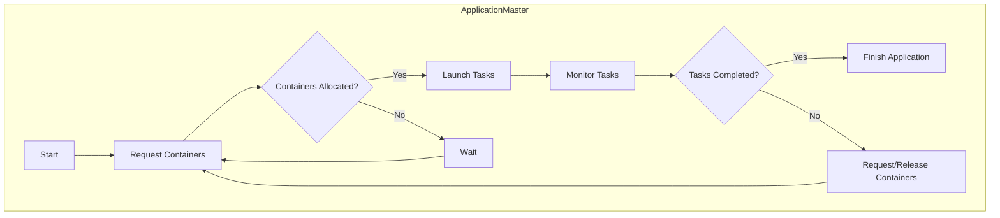
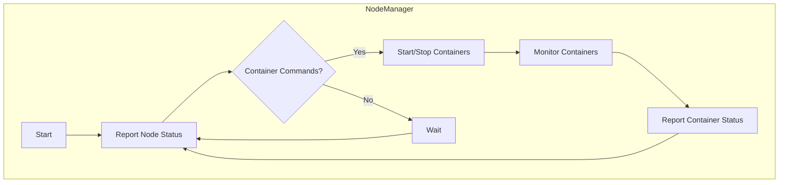

# Yarn资源管理和任务调度原理与代码实例讲解

## 1.背景介绍

### 1.1 大数据时代的到来

随着互联网、物联网和人工智能技术的飞速发展,海量数据的产生和处理已经成为当今社会不可忽视的挑战。传统的数据处理方式已经无法满足现代大数据应用的需求,因此分布式计算框架应运而生。Apache Hadoop作为开源的大数据处理平台,为解决大规模数据集的存储和计算问题提供了可靠、可扩展和高效的解决方案。

### 1.2 Hadoop生态系统概述

Hadoop生态系统包括多个核心组件,其中最关键的是HDFS(Hadoop分布式文件系统)和YARN(Yet Another Resource Negotiator)。HDFS负责跨多台机器存储和管理大规模数据集,而YARN则负责集群资源管理和任务调度。

### 1.3 YARN的重要性

作为Hadoop 2.x版本的核心组件,YARN为整个Hadoop生态系统提供了一个通用的资源管理和任务调度框架。它将资源管理和作业调度/监控从单一的JobTracker中分离出来,提高了系统的可扩展性和可靠性。YARN不仅支持MapReduce作业,还可以运行其他类型的分布式应用程序,如Apache Spark、Apache Flink等。因此,深入理解YARN的工作原理对于有效利用Hadoop集群资源至关重要。

## 2.核心概念与联系

### 2.1 YARN架构概览

YARN的架构主要由ResourceManager、ApplicationMaster、NodeManager和Container四个核心组件组成。



1. **ResourceManager(RM)**: 集群资源管理器,负责整个集群的资源管理和调度。它包含两个主要组件:Scheduler和ApplicationsManager。
2. **ApplicationMaster(AM)**: 每个应用程序都有一个专用的AM进程,负责该应用程序的整个生命周期管理,包括向RM申请资源、启动容器、监控容器运行状态等。
3. **NodeManager(NM)**: 运行在每个节点上的代理,负责管理该节点上的资源,启动和监控容器。
4. **Container**: 资源抽象的基本单位,封装了CPU、内存等资源,用于运行应用程序的任务。

### 2.2 核心组件交互流程

YARN中各组件之间的交互流程如下:



1. 客户端向ResourceManager提交应用程序。
2. ResourceManager启动ApplicationMaster进程。
3. ApplicationMaster向ResourceManager申请资源(Container)。
4. ResourceManager指示NodeManager启动Container。
5. Container在NodeManager上运行,并将运行状态汇报给NodeManager。
6. NodeManager将Container状态汇报给ApplicationMaster。
7. ApplicationMaster监控整个应用程序的运行状态,并将结果返回给客户端。

## 3.核心算法原理具体操作步骤

### 3.1 资源管理器(ResourceManager)

ResourceManager是YARN的大脑和协调者,负责集群资源的管理和调度。它主要包含两个核心组件:Scheduler和ApplicationsManager。

#### 3.1.1 Scheduler

Scheduler负责根据集群的资源状况和应用程序的资源需求,对资源进行合理分配和调度。YARN支持多种调度器,如FIFO、Fair和Capacity等。

**Capacity Scheduler**是Hadoop默认的调度器,它通过队列来管理集群资源。每个队列都有一定的资源配额,并且可以设置不同的调度策略,如先入先出(FIFO)或公平调度(Fair)。



Capacity Scheduler的核心算法步骤如下:

1. 根据队列的资源配额和应用程序的资源需求,计算每个队列的可用资源。
2. 按照队列的调度策略(FIFO或Fair)为队列中的应用程序分配资源。
3. 如果某个队列的资源未被充分利用,则将剩余资源分配给其他队列。
4. 重复上述步骤,直到所有应用程序的资源需求得到满足或者集群资源耗尽。

#### 3.1.2 ApplicationsManager

ApplicationsManager负责管理集群中所有应用程序的生命周期,包括接收新的应用程序提交、启动ApplicationMaster、监控应用程序状态等。

ApplicationsManager的核心算法步骤如下:

1. 接收客户端提交的新应用程序。
2. 为新应用程序分配一个ApplicationId,并创建ApplicationMaster进程。
3. 监控ApplicationMaster的运行状态,如果失败则重新启动。
4. 将ApplicationMaster的运行状态和进度信息返回给客户端。
5. 当应用程序完成后,释放占用的资源。

### 3.2 应用程序管理器(ApplicationMaster)

ApplicationMaster是每个应用程序的私人协调者,负责该应用程序的整个生命周期管理。它的主要职责包括:

1. 向ResourceManager申请资源(Container)。
2. 根据应用程序的需求,在获得的Container中启动任务。
3. 监控任务的运行状态,并在出现失败时重新启动任务。
4. 与ResourceManager协调,根据需要申请或释放资源。
5. 当应用程序完成后,通知ResourceManager并退出。

ApplicationMaster的核心算法步骤如下:



1. 启动ApplicationMaster进程。
2. 向ResourceManager申请所需的Container资源。
3. 如果获得足够的Container,则在Container中启动任务。
4. 监控任务的运行状态。
5. 如果所有任务都完成,则结束应用程序。
6. 否则,根据需要向ResourceManager申请或释放Container资源,并重复步骤2-4。

### 3.3 节点管理器(NodeManager)

NodeManager运行在每个节点上,负责管理该节点上的资源和容器。它的主要职责包括:

1. 向ResourceManager汇报节点的资源状况。
2. 根据ResourceManager的指示,启动或终止容器。
3. 监控容器的资源使用情况和运行状态。
4. 将容器的运行状态汇报给ApplicationMaster。

NodeManager的核心算法步骤如下:



1. 启动NodeManager进程。
2. 向ResourceManager汇报节点的资源状况。
3. 检查是否有来自ResourceManager的容器启动/终止命令。
4. 如果有,则执行相应的操作,启动或终止容器。
5. 监控容器的运行状态和资源使用情况。
6. 将容器的运行状态汇报给ApplicationMaster。
7. 重复步骤2-6,持续监控和汇报。

## 4.数学模型和公式详细讲解举例说明

在YARN中,资源管理和任务调度涉及一些数学模型和公式,用于计算和优化资源分配。下面我们将详细讲解其中的一些关键公式。

### 4.1 资源模型

在YARN中,每个节点的资源被抽象为一个向量,包括CPU、内存等多种资源类型。我们用 $R_n$ 表示节点 $n$ 的资源向量,其中 $R_n = (r_n^1, r_n^2, \ldots, r_n^k)$,其中 $r_n^i$ 表示节点 $n$ 的第 $i$ 种资源的数量。

同样,每个容器的资源需求也可以表示为一个向量 $C_j = (c_j^1, c_j^2, \ldots, c_j^k)$,其中 $c_j^i$ 表示容器 $j$ 对第 $i$ 种资源的需求。

### 4.2 资源分配约束

在分配资源时,需要满足以下约束条件:

$$
\sum_{j \in J_n} c_j^i \leq r_n^i, \quad \forall i \in \{1, 2, \ldots, k\}
$$

其中 $J_n$ 表示分配到节点 $n$ 上的所有容器的集合。该约束条件保证了每种资源的总需求不超过节点的资源容量。

### 4.3 资源公平性指标

为了评估资源分配的公平性,我们可以使用一些公平性指标,如Jain's Fairness Index:

$$
J(x_1, x_2, \ldots, x_n) = \frac{(\sum_{i=1}^n x_i)^2}{n \sum_{i=1}^n x_i^2}
$$

其中 $x_i$ 表示分配给第 $i$ 个应用程序的资源数量。$J$ 的取值范围为 $[1/n, 1]$,值越接近 1 表示资源分配越公平。

### 4.4 资源利用率

资源利用率是衡量集群资源利用效率的重要指标之一。对于单个节点,资源利用率可以定义为:

$$
U_n = \frac{\sum_{j \in J_n} \sum_{i=1}^k c_j^i}{R_n}
$$

其中分子表示节点 $n$ 上所有容器对各种资源的总需求,分母表示节点 $n$ 的总资源容量。

对于整个集群,资源利用率可以定义为所有节点资源利用率的加权平均:

$$
U = \frac{\sum_{n=1}^N U_n R_n}{\sum_{n=1}^N R_n}
$$

其中 $N$ 表示集群中节点的总数。

通过优化资源分配算法,我们可以提高集群的资源利用率,从而提高整体的计算效率。

## 4.项目实践:代码实例和详细解释说明

为了更好地理解YARN的工作原理,我们将通过一个简单的示例项目来演示YARN的基本用法。该项目包括一个WordCount应用程序,用于统计文本文件中单词的出现次数。

### 4.1 项目结构

```
yarn-wordcount/
├── pom.xml
├── src/
│   ├── main/
│   │   ├── java/
│   │   │   └── com/
│   │   │       └── example/
│   │   │           ├── WordCount.java
│   │   │           └── WordCountMapper.java
│   │   └── resources/
│   │       └── input.txt
│   └── test/
│       └── java/
│           └── com/
│               └── example/
│                   └── WordCountTest.java
└── README.md
```

- `pom.xml`: Maven项目配置文件。
- `WordCount.java`: WordCount应用程序的主类。
- `WordCountMapper.java`: MapReduce作业的Mapper实现。
- `input.txt`: 示例输入文件。
- `WordCountTest.java`: 单元测试类。

### 4.2 WordCount应用程序

`WordCount.java`是应用程序的入口点,它继承自`org.apache.hadoop.util.Tool`接口,实现了`run()`方法。

```java
public class WordCount extends Configured implements Tool {
    public static void main(String[] args) throws Exception {
        int exitCode = ToolRunner.run(new WordCount(), args);
        System.exit(exitCode);
    }

    public int run(String[] args) throws Exception {
        Configuration conf = getConf();
        Job job = Job.getInstance(conf, "Word Count");
        job.setJarByClass(WordCount.class);
        job.setMapperClass(WordCountMapper.class);
        job.setCombinerClass(IntSumReducer.class);
        job.setReducerClass(IntSumReducer.class);
        job.setOutputKeyClass(Text.class);
        job.setOutputValueClass(IntWrit