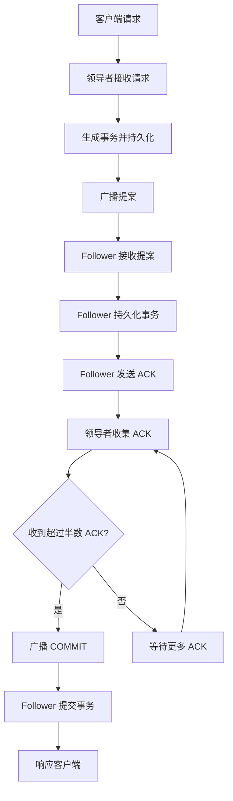

# Zookeeper ZAB协议原理与代码实例讲解

## 1.背景介绍

### 1.1 分布式系统的一致性挑战

在分布式系统中,确保数据一致性是一个巨大的挑战。由于节点之间的通信延迟、网络分区和节点故障等因素,很难保证所有节点在同一时间拥有相同的数据视图。传统的解决方案如两阶段提交协议(2PC)虽然可以解决一些问题,但在实际应用中存在一些缺陷,如同步阻塞问题、单点故障风险等。

### 1.2 Zookeeper 的作用

Apache ZooKeeper 是一个分布式协调服务,旨在为分布式应用程序提供一致性服务。它通过维护一个全局数据视图,使得分布式进程可以基于这个全局数据视图达成数据一致。ZooKeeper 本质上是一个分布式的、开放源码的分布式应用程序协调服务,是 Google 的 Chubby 一个开源的实现。分布式应用程序可以基于 ZooKeeper 实现诸如数据发布/订阅、负载均衡、命名服务、分布式协调/通知、集群管理、Master 选举、分布式锁和分布式队列等功能。

### 1.3 ZAB 协议的重要性

ZAB(ZooKeeper Atomic Broadcast) 协议是 ZooKeeper 的核心,它能够让分布式系统中的多个服务器节点数据保持一致。ZAB 协议基于主备模型,由一个主节点(Leader)和多个备节点(Follower)组成。主节点负责接收写请求并发起广播,备节点则接收广播并持久化数据。通过 ZAB 协议,ZooKeeper 集群可以达到数据的最终一致性。

## 2.核心概念与联系

### 2.1 ZAB 协议中的三种节点状态

在 ZAB 协议中,每个 ZooKeeper 服务器节点可处于以下三种状态之一:

1. **领导者(Leader)**: 领导者负责接收并处理写请求,并将数据变更以事务日志的形式持久化到磁盘。然后,它会广播该事务日志给所有的 Follower 和 Observer。

2. **学习者(Follower)**: 学习者接收并处理来自领导者的事务日志,并将事务日志持久化到磁盘中。当领导者崩溃时,剩余的 Follower 会重新进行领导者选举。

3. **观察者(Observer)**: 观察者接收并处理来自领导者的事务日志,但不参与任何形式的投票,也不能成为领导者。它的作用是为客户端提供非写服务,减轻 Follower 的工作负载。

### 2.2 ZAB 协议的两个模式

ZAB 协议分为两个模式:

1. **广播模式(Broadcast)**: 当一个写请求被处理时,领导者会生成一个事务并持久化到磁盘中。然后,它会将事务以提案(Proposal)的形式发送给所有的 Follower 和 Observer。

2. **原子广播模式(Atomic Broadcast)**: 在广播模式的基础上,ZAB 协议还引入了一个新的同步机制。领导者在发出提案后,需要等待超过半数的 Follower 确认(ACK)该提案。只有当收到足够的 ACK 时,领导者才会再次向所有的 Follower 和 Observer 发送 COMMIT 消息,通知它们可以提交该事务。

### 2.3 ZAB 协议的核心流程

ZAB 协议的核心流程包括以下几个步骤:

1. **领导者选举**: 当集群启动或者现有的领导者崩溃时,剩余的 Follower 会通过投票选举出一个新的领导者。

2. **数据同步**: 一旦选举出新的领导者,它会确保所有的 Follower 都拥有最新的数据视图。

3. **请求广播**: 客户端将写请求发送给领导者。领导者会生成一个事务并持久化到磁盘中,然后将事务以提案的形式广播给所有的 Follower 和 Observer。

4. **数据提交**: 当领导者收到超过半数 Follower 的 ACK 后,它会向所有的 Follower 和 Observer 发送 COMMIT 消息,通知它们可以提交该事务。

5. **响应客户端**: 一旦事务被提交,领导者会向客户端返回响应。

## 3.核心算法原理具体操作步骤

### 3.1 领导者选举算法

当 ZooKeeper 集群启动或者现有的领导者崩溃时,剩余的 Follower 会通过投票选举出一个新的领导者。领导者选举算法的具体步骤如下:

1. **初始化**: 每个 Follower 都会给自己投一票,并将自己的投票信息(服务器 ID、ZXID、epoch)广播给其他所有服务器。

2. **投票阶段**: 每个 Follower 收集其他服务器的投票信息,并根据以下两个规则来重新投票:

   - 规则一:如果一个服务器的投票数据(ZXID、epoch)比自己的更新,则更新自己的投票数据并投票给该服务器。
   - 规则二:如果另一个服务器的投票数据与自己的相同,则投票给 ID 更大的服务器。

3. **统计阶段**: 每个 Follower 统计已经收到的投票数,如果有一个服务器收到了超过半数的投票,则该服务器就会成为新的领导者。

4. **领导者广播**: 新选举出的领导者会向所有的 Follower 和 Observer 广播自己的领导地位。

5. **数据同步**: 新的领导者会确保所有的 Follower 都拥有最新的数据视图,然后整个集群就可以对外提供服务了。

### 3.2 原子广播算法

一旦领导者被选举出来,它就可以开始处理客户端的写请求了。原子广播算法的具体步骤如下:

1. **客户端请求**: 客户端将写请求发送给领导者。

2. **事务持久化**: 领导者会为该请求生成一个事务,并将事务持久化到磁盘中。

3. **提案广播**: 领导者将事务以提案(Proposal)的形式广播给所有的 Follower 和 Observer。

4. **ACK 收集**: 领导者会等待超过半数的 Follower 发送 ACK 确认该提案。

5. **COMMIT 广播**: 一旦收到足够的 ACK,领导者会向所有的 Follower 和 Observer 发送 COMMIT 消息,通知它们可以提交该事务。

6. **事务提交**: 所有的 Follower 和 Observer 收到 COMMIT 消息后,会将事务提交到磁盘中。

7. **响应客户端**: 事务提交完成后,领导者会向客户端返回响应。

## 4.数学模型和公式详细讲解举例说明

### 4.1 ZooKeeper 中的逻辑时钟

在 ZAB 协议中,ZooKeeper 使用了一种逻辑时钟(ZXID)来对事务进行编号和排序。ZXID 由两部分组成:

$$ZXID = epoch \ \| \ counter$$

其中:

- **epoch**: 代表领导者任期的编号,每当一个新的领导者被选举出来,epoch 就会递增。
- **counter**: 代表事务在当前 epoch 中的编号,每当有新的事务被处理时,counter 就会递增。

通过 ZXID,ZooKeeper 可以保证事务的有序性和唯一性。具有更大 ZXID 的事务被认为是更新的,并且具有优先权。

### 4.2 ZooKeeper 中的投票算法

在领导者选举过程中,ZooKeeper 使用了一种基于 ZXID 和 epoch 的投票算法。假设有两个服务器 A 和 B,它们的投票信息分别为 (ZXID_A, epoch_A) 和 (ZXID_B, epoch_B),则投票规则如下:

1. 如果 epoch_A > epoch_B,则 A 的投票胜出。
2. 如果 epoch_A = epoch_B,且 ZXID_A > ZXID_B,则 A 的投票胜出。
3. 如果 epoch_A = epoch_B,且 ZXID_A = ZXID_B,则 ID 更大的服务器的投票胜出。

这种投票算法可以保证选举出的领导者是最新的,并且可以避免出现"裂脑"情况。

### 4.3 ZooKeeper 中的数据一致性保证

在 ZAB 协议中,ZooKeeper 通过以下两个条件来保证数据的一致性:

1. **已提交的事务顺序性**: 所有服务器都按照相同的顺序来提交事务。这是通过 ZXID 来保证的。
2. **已提交的事务完整性**: 一个事务要么被所有服务器提交,要么没有任何服务器提交。这是通过 "原子广播" 模式来保证的。

只有满足了这两个条件,ZooKeeper 集群中的所有服务器才能达到数据的最终一致性。

## 5.项目实践:代码实例和详细解释说明

### 5.1 ZooKeeper 服务器端代码示例

以下是 ZooKeeper 服务器端的核心代码示例,用于实现 ZAB 协议:

```java
// Leader 选举
void lookForLeader() {
    try {
        // 初始化投票
        self.sendBroadcast(self.jmx.getVotingView());

        // 收集投票
        Map<Long, Vote> recvSet = new HashMap<Long, Vote>();
        while (!self.getCnxnFactory().isShutdown()) {
            Vote v = null;
            try {
                v = self.getVote();
            } catch (InterruptedException e) {
                ...
            }
            recvSet.put(v.getCandidate().getId(), v);
            // 统计投票
            self.updateVote(v, recvSet);
        }
    } finally {
        ...
    }
}

// 原子广播
void atomicBroadcast(Proposal proposal) {
    try {
        // 持久化事务
        self.logRequest(proposal);

        // 广播提案
        self.sendBroadcast(proposal);

        // 收集 ACK
        Map<Long, Proposal> ackSet = new HashMap<Long, Proposal>();
        while (!self.getMinCommittedLog().isGreaterThanOrEqualTo(proposal.getZxid())) {
            Proposal ack = self.getAck();
            ackSet.put(ack.getCandidate().getId(), ack);
        }

        // 广播 COMMIT
        self.sendCommit(proposal);
    } finally {
        ...
    }
}
```

上面的代码展示了 ZooKeeper 服务器端实现领导者选举和原子广播的核心逻辑。

### 5.2 ZooKeeper 客户端代码示例

以下是 ZooKeeper 客户端与服务器端进行交互的代码示例:

```java
// 创建 ZooKeeper 实例
ZooKeeper zk = new ZooKeeper("127.0.0.1:2181", 3000, null);

// 创建节点
zk.create("/myapp", "Hello World".getBytes(), ZooDefs.Ids.OPEN_ACL_UNSAFE, CreateMode.PERSISTENT);

// 获取节点数据
byte[] data = zk.getData("/myapp", false, null);
System.out.println(new String(data)); // 输出: Hello World

// 更新节点数据
zk.setData("/myapp", "Hello ZooKeeper".getBytes(), -1);

// 删除节点
zk.delete("/myapp", -1);

// 关闭 ZooKeeper 实例
zk.close();
```

上面的代码展示了如何使用 ZooKeeper 客户端进行基本的节点操作,如创建、读取、更新和删除节点。

### 5.3 Mermaid 流程图

以下是 ZAB 协议的核心流程图,使用 Mermaid 绘制:



该流程图清晰地展示了 ZAB 协议中的原子广播过程,包括领导者接收请求、生成事务、广播提案、收集 ACK、广播 COMMIT 以及 