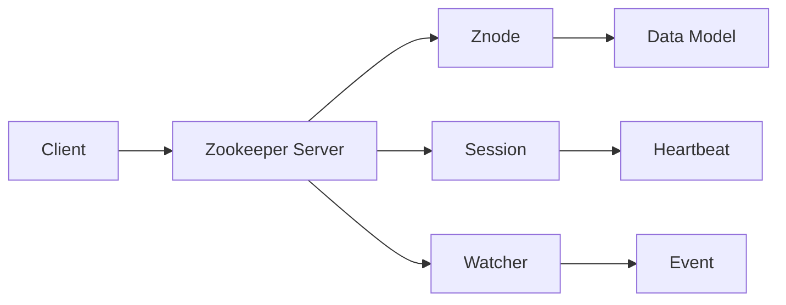

# Zookeeper分布式协调服务原理与代码实例讲解

## 1.背景介绍

在当今分布式系统日益复杂的时代,如何有效地协调和管理分布式系统中的各个节点,已经成为一个至关重要的课题。而Apache Zookeeper作为一个开源的分布式协调服务,为解决这一难题提供了有力的工具支持。本文将深入探讨Zookeeper的核心原理,并结合实际代码案例,全面讲解其在分布式系统中的应用。

### 1.1 分布式系统面临的挑战
#### 1.1.1 节点之间的协调与同步
#### 1.1.2 配置信息的一致性维护
#### 1.1.3 分布式锁的实现
#### 1.1.4 集群成员管理

### 1.2 Zookeeper的优势
#### 1.2.1 简单易用的API
#### 1.2.2 可靠的消息通知机制  
#### 1.2.3 高可用性与可扩展性
#### 1.2.4 严格的顺序访问控制

## 2.核心概念与联系

要理解Zookeeper的工作原理,首先需要掌握其核心概念。本章节将重点介绍Zookeeper的数据模型、会话机制、Watcher机制等关键概念,并阐述它们之间的内在联系。

### 2.1 数据模型
#### 2.1.1 层次命名空间
#### 2.1.2 Znode及其类型
#### 2.1.3 版本与时间戳

### 2.2 会话机制
#### 2.2.1 会话的建立
#### 2.2.2 会话超时与心跳检测
#### 2.2.3 会话迁移

### 2.3 Watcher机制
#### 2.3.1 Watcher的注册与触发
#### 2.3.2 Watcher的一次性特性
#### 2.3.3 不同类型的Watcher

### 2.4 概念之间的关系



## 3.核心算法原理与操作步骤

Zookeeper之所以能够实现高效可靠的分布式协调,离不开其内部几个核心算法的支撑。本章将重点剖析Zookeeper所采用的ZAB协议、Paxos算法的基本原理,并给出其具体的操作步骤。

### 3.1 ZAB协议
#### 3.1.1 消息广播
#### 3.1.2 崩溃恢复
#### 3.1.3 数据同步

### 3.2 Paxos算法
#### 3.2.1 Basic Paxos
#### 3.2.2 Multi Paxos
#### 3.2.3 ZooKeeper Atomic Broadcast

### 3.3 Leader选举
#### 3.3.1 ServerID
#### 3.3.2 选举过程
#### 3.3.3 Leader与Follower

### 3.4 具体实现步骤
#### 3.4.1 Zookeeper集群搭建
#### 3.4.2 Leader选举演示
#### 3.4.3 Follower同步过程

## 4.数学模型与公式讲解

为了更好地理解Zookeeper的工作原理,有必要对其背后的数学模型进行深入分析。本章将重点介绍Zookeeper所涉及的CAP定理、Znode的数据结构等数学知识,并给出相关公式的详细推导过程。

### 4.1 CAP定理
#### 4.1.1 一致性(Consistency) 
#### 4.1.2 可用性(Availability)
#### 4.1.3 分区容错性(Partition tolerance)

数学公式表示:
$$
Consistency + Availability + Partition\,Tolerance = CAP
$$

### 4.2 Znode数据结构
#### 4.2.1 Znode Path
Znode路径可以表示为一个有序序列:

$Znode Path = (z_1, z_2, \cdots, z_n)$

其中$z_i$表示第i层Znode的名称。

#### 4.2.2 Znode Metadata
Znode元数据可以表示为一个五元组:

$Metadata(z_i) = (version, ctime, mtime, cversion, dataLength)$ 

其中:
- version: 数据版本号
- ctime: Znode创建时间
- mtime: 最后修改时间 
- cversion: 子节点版本号
- dataLength: 数据长度

### 4.3 数据一致性模型
#### 4.3.1 最终一致性
#### 4.3.2 先序一致性
#### 4.3.3 线性一致性

## 5.项目实践:代码实例与详解

本章将通过几个具体的代码实例,演示如何使用Zookeeper进行分布式系统的协调与管理。每个实例都配有详细的注释说明,帮助读者深入理解Zookeeper API的使用方法。

### 5.1 创建Znode

```java
// 创建一个持久化节点
zk.create("/test", "Hello".getBytes(), Ids.OPEN_ACL_UNSAFE, CreateMode.PERSISTENT);

// 创建一个临时有序节点
String path = zk.create("/test/child", "World".getBytes(), Ids.OPEN_ACL_UNSAFE, CreateMode.EPHEMERAL_SEQUENTIAL);
```

### 5.2 获取数据

```java
// 同步获取数据
byte[] data = zk.getData("/test", false, null);
System.out.println(new String(data));

// 异步获取数据
zk.getData("/test", new Watcher() {
    @Override
    public void process(WatchedEvent event) {
        System.out.println("Node data changed: " + event);
    }
}, new DataCallback() {
    @Override
    public void processResult(int rc, String path, Object ctx, byte[] data, Stat stat) {
        System.out.println("Async getData result: " + new String(data));
    }
}, null);
```

### 5.3 更新数据

```java
// 更新数据
zk.setData("/test", "Apache".getBytes(), -1);
```

### 5.4 删除节点

```java
// 删除一个节点
zk.delete("/test/child", -1);

// 递归删除所有子节点
ZKUtil.deleteRecursive(zk, "/test");
```

### 5.5 分布式锁实现

```java
public class ZkLock implements Lock {
    
    private ZooKeeper zk;
    private String lockPath;
    
    public ZkLock(String lockPath) {
        this.lockPath = lockPath;
        zk = new ZooKeeper("localhost:2181", 5000, null);
    }
    
    @Override
    public void lock() {
        // 创建锁节点
        String path = zk.create(lockPath, new byte[0], Ids.OPEN_ACL_UNSAFE, CreateMode.EPHEMERAL_SEQUENTIAL);
        
        // 判断是否获得锁
        while (true) {
            List<String> nodes = zk.getChildren(lockPath, false);
            Collections.sort(nodes);
            if (path.equals(lockPath + "/" + nodes.get(0))) {
                return;
            } else {
                // 等待锁释放
                zk.exists(lockPath + "/" + nodes.get(0), true);
            }
        }
    }
    
    @Override
    public void unlock() {
        // 删除锁节点
        zk.delete(lockPath, -1);
    }
}
```

## 6.实际应用场景

Zookeeper在实际的分布式系统中有着广泛的应用,本章将重点介绍其在几个典型场景下的使用方式,如分布式配置管理、分布式锁、负载均衡等。

### 6.1 分布式配置管理
#### 6.1.1 统一配置存储 
#### 6.1.2 配置变更通知
#### 6.1.3 配置版本管理

### 6.2 分布式锁
#### 6.2.1 排他锁
#### 6.2.2 共享锁
#### 6.2.3 读写锁

### 6.3 负载均衡
#### 6.3.1 服务注册与发现
#### 6.3.2 动态上下线通知
#### 6.3.3 负载策略

### 6.4 其他应用
#### 6.4.1 分布式队列
#### 6.4.2 命名服务
#### 6.4.3 集群管理

## 7.工具与资源推荐

### 7.1 Zookeeper官方文档

Zookeeper官网提供了非常详尽的用户文档和API参考,是学习和使用Zookeeper不可或缺的资料。

官方文档地址: https://zookeeper.apache.org/doc/current/

### 7.2 Curator客户端

Curator是Netflix开源的一个Zookeeper客户端框架,提供了比原生API更加简洁易用的编程接口,值得推荐。

项目地址:https://github.com/Netflix/curator

### 7.3 ZooKeeper权威指南

《ZooKeeper:分布式过程协同技术详解》是国内Zookeeper领域的经典著作,由Zookeeper PMC成员倪超主编,系统全面地介绍了Zookeeper的原理和使用方法,是深入学习Zookeeper不可多得的佳作。

### 7.4 Zookeeper论文

想要深入理解Zookeeper的设计思想和技术细节,阅读相关论文是最直接的途径。以下是几篇重要的论文:

- ZooKeeper: Wait-free coordination for Internet-scale systems
- Zab:High-performance broadcast for primary-backup systems
- Paxos Made Live - An Engineering Perspective

## 8.总结:未来发展与挑战

### 8.1 Zookeeper的局限性
#### 8.1.1 吞吐量瓶颈
#### 8.1.2 单点问题
#### 8.1.3 数据容量限制

### 8.2 新兴技术对比
#### 8.2.1 etcd
#### 8.2.2 Consul 
#### 8.2.3 Eureka

### 8.3 未来的发展方向
#### 8.3.1 纯内存化
#### 8.3.2 多机房支持
#### 8.3.3 更灵活的一致性模型

### 8.4 总结

Zookeeper作为一个优秀的分布式协调服务,在过去的十多年里被广泛应用于各种分布式系统之中,发挥了巨大的作用。展望未来,Zookeeper还将在云计算、大数据、人工智能等领域扮演重要角色。同时,Zookeeper自身也面临着许多挑战,需要在性能、可靠性、易用性等方面不断改进。相信通过社区的共同努力,Zookeeper一定能够在分布式系统领域继续发光发热。

## 9.附录:常见问题解答

### 9.1 Zookeeper安装与配置
#### 9.1.1 单机模式
#### 9.1.2 集群模式
#### 9.1.3 常用配置项

### 9.2 客户端连接问题
#### 9.2.1 Session expired
#### 9.2.2 CONNECTIONLOSS
#### 9.2.3 SESSIONMOVED

### 9.3 Watcher使用注意事项
#### 9.3.1 一次性触发
#### 9.3.2 重复注册
#### 9.3.3 时序保证

### 9.4 常见异常分析
#### 9.4.1 KeeperErrorCode
#### 9.4.2 NoNodeException
#### 9.4.3 NodeExistsException

### 9.5 数据与存储
#### 9.5.1 内存数据
#### 9.5.2 事务日志
#### 9.5.3 数据快照

作者：禅与计算机程序设计艺术 / Zen and the Art of Computer Programming