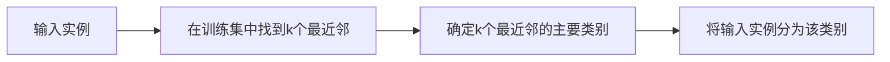

## 1.背景介绍

k-近邻算法（k-Nearest Neighbors），简称k-NN，是一种基于实例的学习，或者说是基于记忆的学习。在分类和回归问题中，它可以被用作一种简单而强大的方法。这种算法的基本思想是：如果一个样本在特征空间中的k个最相邻的样本中的大多数属于某一个类别，则该样本也属于这个类别。

## 2.核心概念与联系

k-近邻算法的工作原理很简单：给定一个训练数据集，对新的输入实例，在训练数据集中找到与该实例最邻近的k个实例，这k个实例的多数属于某个类，就把该输入实例分为这个类。

**Mermaid流程图**



## 3.核心算法原理具体操作步骤

1. **计算距离**：计算测试数据与各个训练数据之间的距离；
2. **邻居选择**：按照距离的递增关系进行排序；
3. **决策制作**：选取距离最小的K个点，并确定这K个点所在类别的出现频率；
4. **结果返回**：返回前K个点中出现频率最高的类别作为测试数据的预测分类。

## 4.数学模型和公式详细讲解举例说明

在k-近邻算法中，我们通常使用欧氏距离（Euclidean distance）来计算两个实例之间的距离。欧氏距离的计算公式如下：

$$
d(x, y) = \sqrt{\sum_{i=1}^{n}(x_i - y_i)^2}
$$

其中，$x$和$y$是两个实例，$n$是特征的数量，$x_i$和$y_i$是对应的特征值。

## 5.项目实践：代码实例和详细解释说明

下面是一个简单的Python代码示例，使用k-近邻算法进行分类：

```python
from sklearn.neighbors import KNeighborsClassifier
from sklearn.datasets import load_iris
from sklearn.model_selection import train_test_split
from sklearn.metrics import accuracy_score

# Load iris dataset
iris = load_iris()
X = iris.data
y = iris.target

# Split the data
X_train, X_test, y_train, y_test = train_test_split(X, y, test_size=0.2, random_state=42)

# Create KNN classifier
knn = KNeighborsClassifier(n_neighbors = 3)

# Fit the classifier to the data
knn.fit(X_train,y_train)

# Predict the labels for the test data
y_pred = knn.predict(X_test)

# Calculate accuracy
print("Accuracy:", accuracy_score(y_test, y_pred))
```

## 6.实际应用场景

k-近邻算法在许多实际应用中都有广泛的使用，例如：

- **推荐系统**：k-近邻算法可以用于推荐系统，通过找到与特定用户具有相似兴趣的其他用户，然后推荐这些相似用户喜欢的项目。
- **图像识别**：k-近邻算法也可以用于图像识别任务，通过比较新图像和训练图像的相似性，来识别新图像的类别。
- **文本分类**：在文本分类任务中，k-近邻算法可以通过比较新文档和训练文档的相似性，来确定新文档的类别。

## 7.工具和资源推荐

- **Scikit-learn**：Scikit-learn是一个强大的Python机器学习库，其中包含了k-近邻算法的实现。
- **NumPy**：NumPy是Python的一个库，提供了大量的数学和数值运算功能，包括对数组和矩阵的操作，这在处理数据时非常有用。

## 8.总结：未来发展趋势与挑战

k-近邻算法是一种简单而强大的算法，但也有其局限性。首先，它的计算复杂性随着训练数据的增加而增加，这可能会限制其在大规模数据集上的应用。其次，它对于不平衡数据集的处理能力较弱，因为它主要依赖于邻近的实例的多数投票。此外，它对于高维数据的处理能力也较弱，因为在高维空间中，所有的数据点都可能会变得“远离”对其他点。

尽管如此，k-近邻算法仍然是一种非常有用的工具，可以作为许多机器学习任务的基线方法。未来，我们可以期待有更多的研究和技术用于改进k-近邻算法，以解决其现有的挑战。

## 9.附录：常见问题与解答

**Q: 如何选择最佳的k值？**

A: 最佳的k值通常通过交叉验证来确定。一种常用的方法是使用不同的k值进行多次运行，然后选择结果最好的那个k值。

**Q: k-近邻算法可以用于回归问题吗？**

A: 是的，k-近邻算法也可以用于回归问题。在这种情况下，输出值是其k个最近邻的值的平均值。

**Q: k-近邻算法对于特征的标准化有何要求？**

A: 由于k-近邻算法是基于距离的，所以如果特征的尺度差异很大，可能会对结果产生影响。因此，通常在使用k-近邻算法之前，我们需要对数据进行标准化处理。

作者：禅与计算机程序设计艺术 / Zen and the Art of Computer Programming