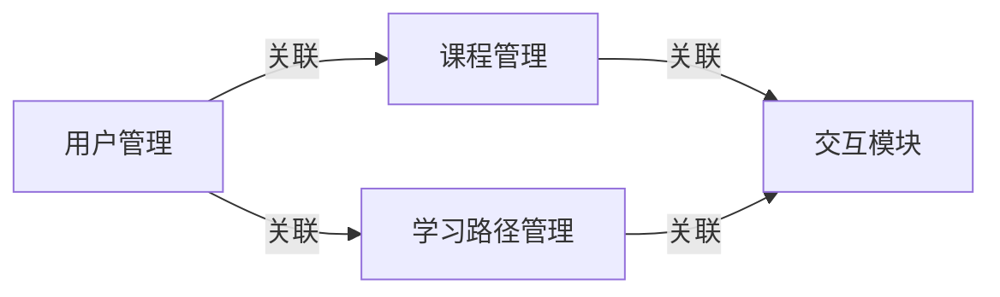

## 1.背景介绍

在当今信息化的时代，网络学习已经成为了一种趋势。随着技术的发展，各种在线学习平台如雨后春笋般出现。SpringBoot作为一种简化Spring应用开发的框架，因其简单、快速、方便的特性，广受开发者们的喜爱。本文将详细介绍如何使用SpringBoot构建一个网上学习系统。

## 2.核心概念与联系

首先，我们需要理解SpringBoot的核心概念。SpringBoot是一种基于Spring的开发框架，其主要目标是简化Spring应用的初始搭建以及开发过程。SpringBoot使用了特定的方式来配置Spring，这使得开发者可以快速启动并运行应用，而不需要进行大量的配置。

在构建网上学习系统时，我们需要考虑到以下几个核心模块：用户管理模块，课程管理模块，学习路径管理模块，以及交互模块。这些模块之间的关系可以通过下面的Mermaid流程图来表示：



## 3.核心算法原理具体操作步骤

在SpringBoot中，我们可以通过以下步骤来构建我们的网上学习系统：

1. 创建SpringBoot项目：使用IDEA或者STS等IDE工具，创建一个基于Maven或者Gradle的SpringBoot项目。
2. 添加依赖：在项目的pom.xml或者build.gradle文件中，添加我们需要的SpringBoot Starter依赖，如spring-boot-starter-web，spring-boot-starter-data-jpa等。
3. 编写配置文件：在application.properties或者application.yml文件中，配置我们的数据源，服务器端口，以及其他相关配置。
4. 编写代码：根据我们的需求，编写Controller，Service，Repository以及Entity等代码。
5. 运行项目：使用IDE的运行按钮，或者在命令行中使用mvn spring-boot:run命令，启动我们的项目。

## 4.数学模型和公式详细讲解举例说明

在构建网上学习系统时，我们可能需要使用到一些数学模型和公式。例如，在课程推荐功能中，我们可以使用协同过滤算法。协同过滤算法的基本思想是：如果两个用户在过去都对相同的对象表现出了相同的行为，那么他们在将来也会对相同的对象表现出相同的行为。

协同过滤算法的数学模型可以表示为：

$$ r_{ui} = k \sum_{j \in N(i; u)} w_{ij} r_{uj} $$

其中，$r_{ui}$表示用户u对项目i的评分，$w_{ij}$表示项目i和项目j的相似度，$N(i; u)$表示用户u评分过的和项目i最相似的k个项目，k是一个常数。

## 5.项目实践：代码实例和详细解释说明

在我们的网上学习系统中，我们可以通过以下代码来实现用户注册功能：

```java
@RestController
@RequestMapping("/user")
public class UserController {

    @Autowired
    private UserService userService;

    @PostMapping("/register")
    public ResponseEntity register(@RequestBody User user) {
        userService.register(user);
        return ResponseEntity.ok().build();
    }
}
```

在这段代码中，我们首先定义了一个UserController类，这个类负责处理和用户相关的HTTP请求。然后，我们定义了一个register方法，这个方法接收一个POST请求，路径为/user/register。这个方法接收一个User对象作为请求体，然后调用UserService的register方法来注册用户，最后返回一个状态码为200的HTTP响应。

## 6.实际应用场景

SpringBoot构建的网上学习系统可以广泛应用于各种在线教育场景，例如大学的在线课程，公司的内部培训，以及各种在线学习平台等。

## 7.工具和资源推荐

在构建SpringBoot网上学习系统时，我们推荐以下工具和资源：

- IntelliJ IDEA：一款强大的Java IDE，内置了SpringBoot项目的创建和管理工具。
- Spring Initializr：一个在线的SpringBoot项目生成工具，可以快速生成SpringBoot项目的基本结构。
- Spring Boot官方文档：详细介绍了SpringBoot的各种特性和使用方法，是学习SpringBoot的重要资源。

## 8.总结：未来发展趋势与挑战

随着在线学习的普及，网上学习系统的需求将会越来越大。SpringBoot因其简单、快速的特性，将会在构建网上学习系统中发挥重要的作用。然而，如何构建一个高效、稳定、易用的网上学习系统，还需要我们不断地探索和实践。

## 9.附录：常见问题与解答

Q: SpringBoot适合构建大型的网上学习系统吗？
A: SpringBoot适合构建各种规模的应用，包括大型的网上学习系统。SpringBoot提供了丰富的Starter，可以方便地集成各种服务，如数据库，缓存，消息队列等。

Q: 如何提高SpringBoot应用的性能？
A: 提高SpringBoot应用的性能可以从以下几个方面入手：优化SQL查询，使用缓存，异步处理耗时操作，以及使用SpringBoot的性能监控工具等。

作者：禅与计算机程序设计艺术 / Zen and the Art of Computer Programming