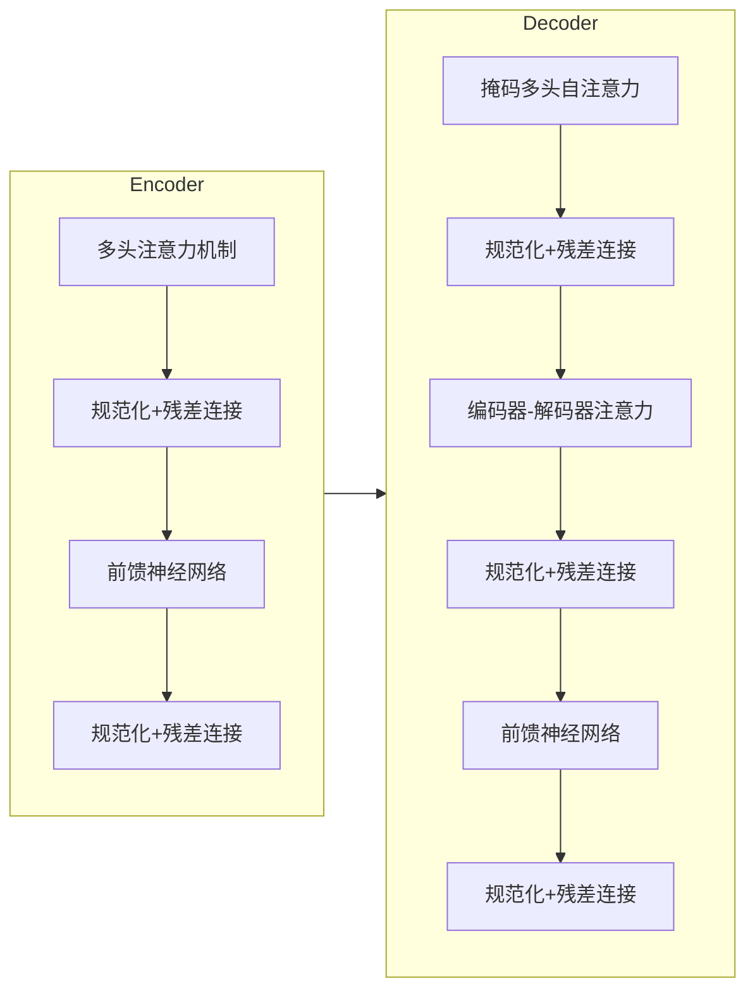

# transformer 原理与代码实例讲解

## 1.背景介绍

在深度学习的发展历程中,transformer模型无疑是一个里程碑式的创新。自2017年Transformer被提出以来,它迅速成为自然语言处理(NLP)、计算机视觉(CV)、语音识别等多个领域的主流模型。Transformer的核心思想是利用注意力机制(Attention Mechanism)来捕捉输入序列中不同位置元素之间的依赖关系,从而有效地建模长期依赖关系。

传统的序列模型如RNN(循环神经网络)和LSTM(长短期记忆网络)在处理长序列时存在梯度消失/爆炸的问题,难以有效捕捉长期依赖关系。而Transformer则通过自注意力机制直接对序列中任意两个位置的元素建模关联,避免了RNN的递归计算,大大提高了并行计算能力。此外,Transformer完全基于注意力机制,摒弃了递归和卷积,使得模型结构更加简洁高效。

Transformer最初被应用于机器翻译任务,取得了令人瞩目的成绩,随后也被广泛应用于其他NLP任务,如文本生成、语义理解等。最近几年,Transformer及其变体模型(如BERT、GPT等)在NLP领域取得了一系列突破性进展,推动了该领域的飞速发展。

## 2.核心概念与联系

### 2.1 Transformer架构

Transformer的整体架构由编码器(Encoder)和解码器(Decoder)两个子模块组成,如下图所示:

编码器的作用是映射输入序列到一个连续的表示空间,解码器则根据编码器的输出生成目标序列。两者的核心都是基于注意力机制的多头自注意力(Multi-Head Attention)和前馈神经网络(Feed-Forward Network)模块,通过层与层之间的残差连接(Residual Connection)和层归一化(Layer Normalization)操作来促进梯度传播。

### 2.2 注意力机制(Attention Mechanism)

注意力机制是Transformer的核心,它能够捕捉输入序列中任意两个位置元素之间的依赖关系。具体来说,对于给定的查询(Query)向量q和键(Key)向量集合K,注意力机制会通过计算q与每个k的相似性得分,然后对这些得分做softmax归一化,最终获得一个注意力权重向量。该向量与值(Value)向量集合V做加权求和,即可得到q关注的表示向量。数学表达式如下:

$$\begin{aligned}
\text{Attention}(Q, K, V) &= \text{softmax}(\frac{QK^T}{\sqrt{d_k}})V \\
\text{head}_i &= \text{Attention}(QW_i^Q, KW_i^K, VW_i^V)
\end{aligned}$$

其中, $d_k$是缩放因子, $W_i^Q$、$W_i^K$、$W_i^V$分别是查询、键、值的线性变换矩阵。多头注意力(Multi-Head Attention)则是将注意力机制独立运行$h$次(即$h$个不同的线性变换),然后将各个头的结果拼接起来。

### 2.3 位置编码(Positional Encoding)

由于Transformer没有递归和卷积操作,因此需要一种方式来注入序列的位置信息。位置编码就是对序列中每个位置的向量添加一个位置相关的向量,使得不同位置上的词嵌入向量是不同的。常用的位置编码函数有正弦/余弦函数:

$$\begin{aligned}
\text{PE}_{(pos, 2i)} &= \sin(pos / 10000^{2i / d_\text{model}}) \\
\text{PE}_{(pos, 2i+1)} &= \cos(pos / 10000^{2i / d_\text{model}})
\end{aligned}$$

其中$pos$是词在序列中的位置索引, $i$是维度索引, $d_\text{model}$是词嵌入的维度大小。

## 3.核心算法原理具体操作步骤

Transformer的核心算法可分为以下几个步骤:

1. **输入表示**: 将输入序列(如源语言句子)映射为词嵌入向量序列,并添加位置编码。
2. **编码器(Encoder)**: 
    - 对输入表示进行多头自注意力运算,获得注意力表示; 
    - 将注意力表示与输入表示相加,得到残差连接表示;
    - 对残差连接表示进行层归一化;
    - 通过前馈神经网络对上一步结果进行变换; 
    - 将变换结果与前一步输出相加,得到新的残差连接表示;
    - 对新残差连接表示进行层归一化,得到该层的最终输出。
    - 重复上述步骤 N 次(N 为编码器层数)。
3. **解码器(Decoder)**: 
    - 对目标序列(如目标语言句子)的输入表示进行掩码多头自注意力,获得自注意力表示;
    - 将自注意力表示与输入表示相加,得到残差连接表示; 
    - 对残差连接表示进行层归一化;
    - 将归一化结果与编码器最后一层输出进行多头注意力运算,得到注意力表示;
    - 将注意力表示与上一步结果相加,得到新残差连接表示;
    - 对新残差连接表示进行层归一化;  
    - 通过前馈神经网络对上一步结果进行变换;
    - 将变换结果与前一步输出相加,得到新的残差连接表示;
    - 对新残差连接表示进行层归一化,得到该层的最终输出。
    - 重复上述步骤 N 次(N 为解码器层数)。
4. **输出层**: 对解码器最后一层的输出进行线性变换和softmax运算,得到目标序列的预测概率分布。
5. **训练**: 使用交叉熵损失函数对模型进行训练,最小化预测序列与真实序列之间的差异。

整个过程中,残差连接和层归一化操作有助于更好地传播梯度,从而提高模型的优化效率。

## 4.数学模型和公式详细讲解举例说明

### 4.1 注意力计算(Attention Computation)

注意力机制是Transformer的核心部分,让我们具体分析一下其中的数学原理。给定查询(Query) $\mathbf{q} \in \mathbb{R}^{d_q}$、键(Key)集合 $\mathbf{K} = \{\mathbf{k}_1, \mathbf{k}_2, \cdots, \mathbf{k}_n\}$ 和值(Value)集合 $\mathbf{V} = \{\mathbf{v}_1, \mathbf{v}_2, \cdots, \mathbf{v}_n\}$,其中 $\mathbf{k}_i, \mathbf{v}_i \in \mathbb{R}^{d_v}$, 注意力计算的公式为:

$$\text{Attention}(\mathbf{q}, \mathbf{K}, \mathbf{V}) = \text{softmax}(\frac{\mathbf{q}\mathbf{K}^T}{\sqrt{d_k}})\mathbf{V}$$

其中, $d_k$ 是键的维度大小,用于对点积结果进行根据维度大小的缩放,以防止较大的点积值导致softmax函数的梯度较小。

具体来说,注意力计算首先计算查询向量与每个键向量的点积,得到一个长度为 $n$ 的向量,再对该向量进行softmax操作,得到注意力权重向量 $\boldsymbol{\alpha} = (\alpha_1, \alpha_2, \cdots, \alpha_n)^T$,其中 $\sum_{i=1}^n \alpha_i = 1$。最后,将注意力权重向量与值向量集合相乘并求和,即可得到注意力表示:

$$\text{Attention}(\mathbf{q}, \mathbf{K}, \mathbf{V}) = \sum_{i=1}^n \alpha_i \mathbf{v}_i$$

这种注意力机制能够自动捕捉查询与键之间的相关性,对于不同的查询,模型会自动分配不同的注意力权重。

### 4.2 多头注意力(Multi-Head Attention)

在实际应用中,我们通常使用多头注意力(Multi-Head Attention)机制,它能够从不同的子空间来捕捉查询与键之间的关系,提高模型的表达能力。具体来说,多头注意力将查询/键/值先经过线性变换,然后并行执行多个注意力计算,最后将各个注意力头的结果拼接起来:

$$\begin{aligned}
\text{head}_i &= \text{Attention}(\mathbf{q}W_i^Q, \mathbf{K}W_i^K, \mathbf{V}W_i^V) \\
\text{MultiHead}(\mathbf{q}, \mathbf{K}, \mathbf{V}) &= \text{Concat}(\text{head}_1, \text{head}_2, \cdots, \text{head}_h)W^O
\end{aligned}$$

其中, $W_i^Q \in \mathbb{R}^{d_q \times d_{q'}}, W_i^K \in \mathbb{R}^{d_k \times d_{k'}}, W_i^V \in \mathbb{R}^{d_v \times d_{v'}}$ 分别是查询、键、值的线性变换矩阵, $W^O \in \mathbb{R}^{hd_v' \times d_o}$ 是最终的线性变换矩阵, $h$ 是注意力头的数量。通过多头注意力,模型能够从不同的表示子空间获取不同的信息,提高了模型的表达能力。

### 4.3 前馈神经网络(Feed-Forward Network)

除了注意力子层之外,Transformer的编码器和解码器中还包含前馈全连接神经网络子层,它的作用是对序列中的每个位置进行相同的位置无关的变换。具体来说,前馈神经网络包含两个线性变换和一个ReLU激活函数:

$$\text{FFN}(\mathbf{x}) = \max(0, \mathbf{x}W_1 + \mathbf{b}_1)W_2 + \mathbf{b}_2$$

其中, $W_1 \in \mathbb{R}^{d_\text{model} \times d_\text{ff}}$, $W_2 \in \mathbb{R}^{d_\text{ff} \times d_\text{model}}$, $\mathbf{b}_1 \in \mathbb{R}^{d_\text{ff}}$, $\mathbf{b}_2 \in \mathbb{R}^{d_\text{model}}$, $d_\text{ff}$ 通常设置为 $4d_\text{model}$ 或 $8d_\text{model}$。

前馈神经网络的作用是对输入进行非线性变换,提高模型的表达能力。在Transformer中,前馈神经网络与多头注意力机制相结合,共同构建了编码器和解码器的核心结构。

### 4.4 层归一化(Layer Normalization)

与批归一化(Batch Normalization)类似,层归一化(Layer Normalization)是一种常用的归一化技术,它对输入进行归一化处理,使得每一层的输入数据分布保持一致,有助于加速模型收敛并提高模型性能。在Transformer中,层归一化的计算公式为:

$$\begin{aligned}
\boldsymbol{\mu} &= \frac{1}{H}\sum_{i=1}^{H}\mathbf{x}_i \\
\boldsymbol{\sigma}^2 &= \frac{1}{H}\sum_{i=1}^{H}(\mathbf{x}_i - \boldsymbol{\mu})^2 \\
\text{LN}(\mathbf{x}) &= \gamma \odot \frac{\mathbf{x} - \boldsymbol{\mu}}{\sqrt{\boldsymbol{\sigma}^2 + \epsilon}} + \boldsymbol{\beta}
\end{aligned}$$

其中, $\mathbf{x} = (\mathbf{x}_1, \mathbf{x}_2, \cdots, \mathbf{x}_H)$ 是输入序列, $H$ 是序列长度, $\gamma$ 和 $\beta$ 是可学习的缩放和偏移参数, $\