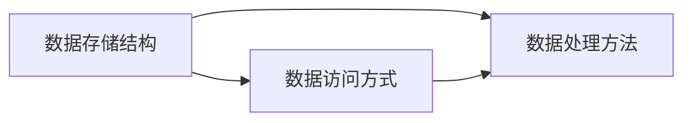

## 1.背景介绍

在我们进入人工智能（AI）和大数据的世界时，数据集（Dataset）扮演着重要的角色。无论是用于训练模型，还是用于测试和验证，数据集都是我们不可或缺的工具。尽管数据集的重要性不言而喻，但是如何有效地使用和管理数据集，却是一个需要深入理解和实践的话题。本文将深入探讨数据集的计算原理，并提供代码实例进行详细讲解。

## 2.核心概念与联系

数据集是一种特殊的数据结构，它可以包含多种类型的数据，如文本、图像、音频等。在AI和大数据计算中，我们通常使用数据集来存储和管理大量的数据。数据集的设计和实现，需要考虑数据的存储、访问、处理和管理等多个方面。

在计算原理层面，数据集的核心概念包括数据的存储结构、数据的访问方式、数据的处理方法等。这些核心概念之间存在着紧密的联系。例如，数据的存储结构会影响数据的访问方式和处理方法；数据的处理方法会影响数据的存储和访问等。



## 3.核心算法原理具体操作步骤

在处理数据集时，我们通常会使用一些核心的算法，如排序、搜索、过滤等。这些算法的实现，需要考虑数据的存储结构和访问方式。

例如，在处理大量的数据时，我们可能需要使用排序算法来对数据进行排序。排序算法的基本步骤包括：

1. 选择合适的排序方法，如快速排序、归并排序等。
2. 根据数据的存储结构和访问方式，设计排序算法的实现。
3. 实现排序算法，并对算法进行测试和验证。

在这个过程中，我们需要深入理解排序算法的原理，以及如何根据数据的特性和需求，选择和实现合适的排序方法。

## 4.数学模型和公式详细讲解举例说明

在处理数据集时，我们通常会使用一些数学模型和公式。例如，我们可以使用概率模型来描述数据的分布，或者使用统计公式来计算数据的均值、方差等。

假设我们有一个数据集$D$，其中包含$n$个数据项$d_1, d_2, ..., d_n$。我们可以使用以下公式来计算数据的均值（mean）和方差（variance）：

$$
\text{mean}(D) = \frac{1}{n} \sum_{i=1}^{n} d_i
$$

$$
\text{variance}(D) = \frac{1}{n} \sum_{i=1}^{n} (d_i - \text{mean}(D))^2
$$

在这个过程中，我们需要深入理解这些数学模型和公式的原理，以及如何根据数据的特性和需求，选择和应用合适的模型和公式。

## 5.项目实践：代码实例和详细解释说明

在实际项目中，我们通常会使用一些编程语言和工具来处理数据集。以下是一个使用Python和Pandas库处理数据集的简单示例：

```python
import pandas as pd

# Load dataset
df = pd.read_csv('dataset.csv')

# Calculate mean and variance
mean = df.mean()
variance = df.var()

print('Mean:', mean)
print('Variance:', variance)
```

在这个示例中，我们首先使用pandas的read_csv函数加载数据集。然后，我们使用mean和var函数来计算数据的均值和方差。最后，我们使用print函数来输出计算结果。

## 6.实际应用场景

数据集在许多实际应用场景中都有广泛的应用。例如，在人工智能和机器学习中，我们通常会使用数据集来训练和测试模型；在大数据分析中，我们通常会使用数据集来存储和分析大量的数据；在云计算中，我们通常会使用数据集来处理和管理分布式的数据等。

## 7.工具和资源推荐

在处理数据集时，我们通常会使用一些工具和资源，如编程语言（Python、R等）、数据处理库（Pandas、NumPy等）、数据可视化工具（Matplotlib、Seaborn等）等。这些工具和资源可以帮助我们更有效地处理和管理数据集。

## 8.总结：未来发展趋势与挑战

随着人工智能和大数据的发展，数据集的处理和管理将面临更大的挑战。一方面，数据的规模和复杂性将不断增加，这将对数据的存储、访问、处理和管理提出更高的要求。另一方面，数据的安全和隐私也将成为重要的问题，这将对数据的处理和管理提出更严格的要求。

## 9.附录：常见问题与解答

1. **问题：如何选择合适的数据存储结构和访问方式？**
答：选择合适的数据存储结构和访问方式，需要考虑数据的类型、大小、访问频率等因素。例如，如果数据的访问是随机的，那么我们可能需要选择一种可以支持快速随机访问的存储结构，如哈希表；如果数据的访问是顺序的，那么我们可能需要选择一种可以支持快速顺序访问的存储结构，如数组或链表。

2. **问题：如何处理大规模的数据集？**
答：处理大规模的数据集，需要使用一些特殊的技术和工具，如分布式计算、并行计算、云计算等。这些技术和工具可以帮助我们有效地处理和管理大规模的数据。

作者：禅与计算机程序设计艺术 / Zen and the Art of Computer Programming