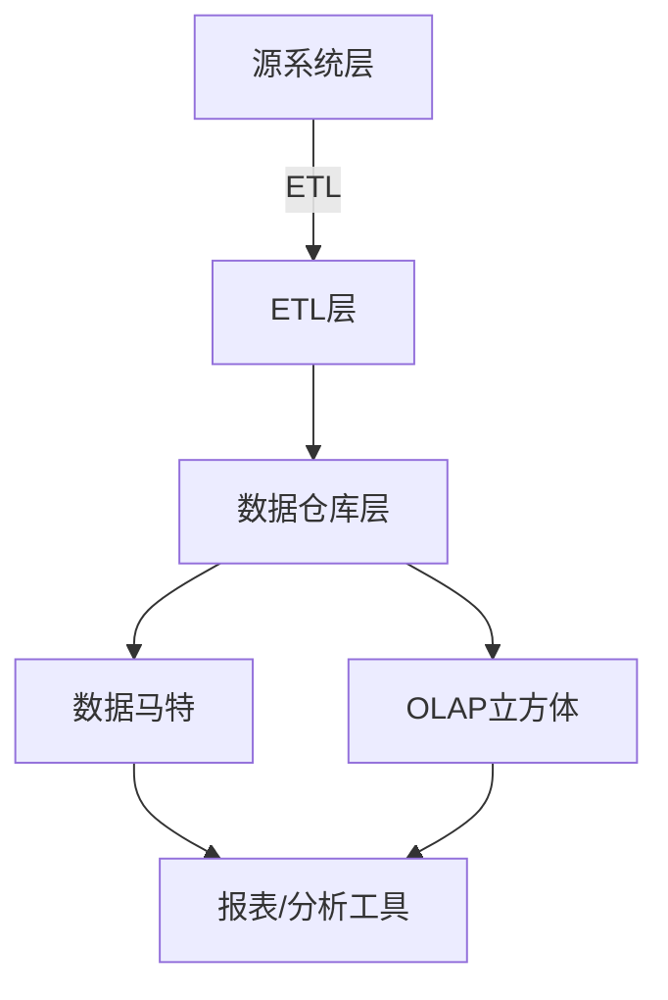
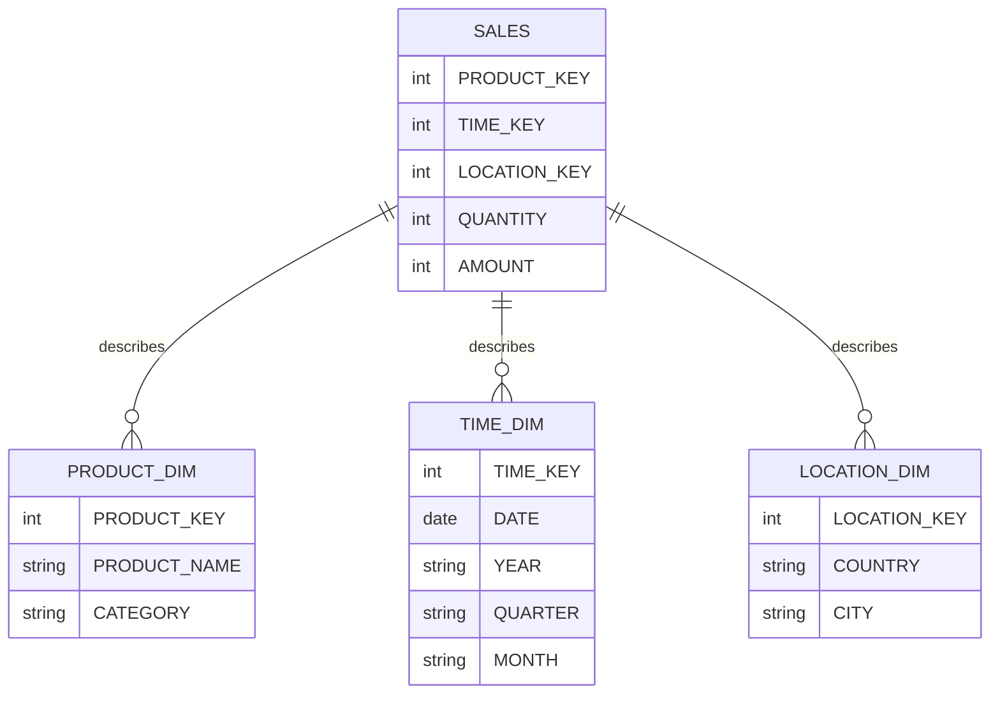
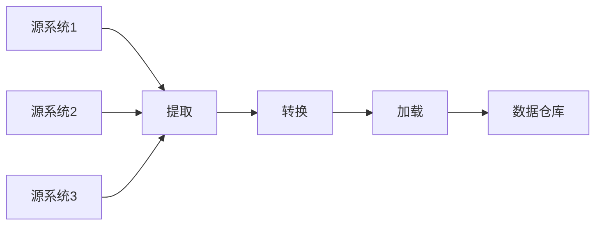

# 【AI大数据计算原理与代码实例讲解】数据仓库

## 1.背景介绍

### 1.1 数据爆炸时代

在当今时代,随着互联网、物联网、人工智能等新兴技术的迅猛发展,海量数据的产生和积累已经成为一种常态。无论是个人还是企业,都面临着如何高效管理和利用这些数据的挑战。传统的数据库系统已经无法满足现代大数据环境下的需求,因此数据仓库(Data Warehouse)应运而生。

### 1.2 数据仓库的重要性

数据仓库是一种面向主题的、集成的、非易失的、随时间变化的数据集合,用于支持管理决策过程。它将来自不同数据源的数据进行ETL(提取、转换、加载)处理,并将其存储在一个统一的数据存储区域中,为企业提供了一个集中式的数据管理和分析平台。数据仓库的出现极大地促进了商业智能(BI)和数据分析的发展,为企业的战略决策提供了有力的数据支持。

## 2.核心概念与联系

### 2.1 数据仓库架构

数据仓库通常采用三层架构,包括源系统层、ETL层和数据仓库层。



1. **源系统层**:包括各种运营系统、外部数据源等,提供原始数据。
2. **ETL层**:负责从源系统中提取数据,进行清洗、转换和加载,将数据加载到数据仓库中。
3. **数据仓库层**:存储经过ETL处理的数据,为数据分析提供支持。
4. **数据马特**:基于数据仓库构建的面向特定主题的数据集合。
5. **OLAP立方体**:为多维数据分析提供支持。
6. **报表/分析工具**:用于生成报表、进行数据挖掘和分析。

### 2.2 数据建模

数据建模是数据仓库设计的关键步骤,包括概念建模、逻辑建模和物理建模。常用的建模技术有实体-关系建模(ER)、维度建模等。

#### 2.2.1 维度建模

维度建模是数据仓库中常用的建模方法,它将数据分为事实表(fact table)和维度表(dimension table)。

- **事实表**:存储度量值(measures),记录业务过程中发生的事实。
- **维度表**:存储描述事实的上下文信息,如时间、地点、产品等。



## 3.核心算法原理具体操作步骤

### 3.1 ETL过程

ETL(提取、转换、加载)是数据仓库构建的核心过程,包括以下步骤:

1. **提取(Extract)**:从各种异构数据源中提取原始数据。
2. **转换(Transform)**:对提取的数据进行清洗、转换、整合等处理,使其符合数据仓库的要求。
3. **加载(Load)**:将转换后的数据加载到数据仓库中。



#### 3.1.1 提取

提取阶段需要考虑数据源的类型、格式、接口等,常用的提取方式包括:

- 直接从关系数据库提取
- 从平面文件(如CSV、XML)提取
- 通过API或消息队列提取

#### 3.1.2 转换

转换阶段是ETL过程中最复杂的部分,需要进行以下操作:

- **数据清洗**:处理缺失值、重复数据、异常值等问题。
- **数据转换**:进行数据类型转换、编码转换、单位转换等。
- **数据整合**:将来自不同源的数据进行整合,解决数据不一致性问题。
- **数据派生**:根据现有数据计算出新的数据。

#### 3.1.3 加载

加载阶段需要考虑数据仓库的存储结构、索引策略等,常用的加载方式包括:

- 全量加载:每次都完全重新加载数据。
- 增量加载:只加载自上次加载后发生变化的数据。

### 3.2 OLAP与多维分析

OLAP(On-Line Analytical Processing,联机分析处理)是数据仓库中的核心功能之一,支持多维数据分析。

#### 3.2.1 OLAP立方体

OLAP立方体是一种多维数据模型,它将数据组织成一个由多个维度和度量值构成的立方体结构。

```mermaid
cube
    title OLAP立方体
    unbundledDimensions: Product, Location, Time
    measures: Quantity, Amount
```

在上图中,OLAP立方体包含三个维度(产品、地点、时间)和两个度量值(数量、金额)。用户可以通过切片(slice)、切块(dice)、钻取(drill)等操作来探索数据。

#### 3.2.2 多维分析操作

- **切片(Slice)**:在立方体中选择一个特定的维度值,获取相应的二维平面视图。
- **切块(Dice)**:在立方体中选择一组特定的维度值,获取相应的子立方体视图。
- **钻取(Drill)**:在不同粒度级别之间切换,进行数据的上钻或下钻操作。
- **旋转(Pivot)**:在立方体中重新排列维度的顺序,获取不同的视角。

## 4.数学模型和公式详细讲解举例说明

在数据仓库中,常用的数学模型和公式包括:

### 4.1 数据压缩算法

由于数据仓库需要存储大量数据,因此数据压缩技术非常重要。常用的压缩算法包括:

#### 4.1.1 RLE(Run-Length Encoding)

RLE是一种简单但有效的压缩算法,适用于存在大量重复数据的场景。它将连续重复的数据用一个计数值和一个数据值来表示,从而减小存储空间。

压缩公式:

$$
C(D) = \sum_{i=1}^{n} \begin{cases}
2 & \text{if } r_i = 1\\
1 + \lceil \log_2 r_i \rceil & \text{if } r_i > 1
\end{cases}
$$

其中,
- $C(D)$表示压缩后的数据长度
- $n$表示不同数据值的个数
- $r_i$表示第$i$个数据值的重复次数

例如,对于数据序列`AAAABBBBCCCCCCCCCCDD`,压缩后为`4A4B9C2D`。

#### 4.1.2 字典编码

字典编码是另一种常用的压缩算法,它将出现频率高的数据值映射到一个短的编码,从而减小存储空间。

压缩公式:

$$
C(D) = \sum_{i=1}^{n} f_i \cdot l_i
$$

其中,
- $C(D)$表示压缩后的数据长度
- $n$表示不同数据值的个数
- $f_i$表示第$i$个数据值的出现频率
- $l_i$表示第$i$个数据值的编码长度

字典编码的效率取决于数据值的分布情况和编码长度的选择。

### 4.2 数据分区算法

数据分区是提高查询效率的一种重要技术,常用的分区算法包括:

#### 4.2.1 哈希分区

哈希分区根据一个或多个列的哈希值将数据划分到不同的分区中。它可以保证相同值的数据被存储在同一个分区中,从而提高基于等值条件的查询效率。

哈希函数:

$$
h(k) = k \bmod N
$$

其中,
- $h(k)$表示哈希函数的输出值
- $k$表示要哈希的键值
- $N$表示分区的数量

#### 4.2.2 范围分区

范围分区根据一个或多个列的值范围将数据划分到不同的分区中。它适用于基于范围条件的查询,可以避免全表扫描。

分区范围:

$$
R_i = \begin{cases}
(v_0, v_1] & \text{if } i = 1\\
(v_{i-1}, v_i] & \text{if } 1 < i < n\\
(v_{n-1}, \infty) & \text{if } i = n
\end{cases}
$$

其中,
- $R_i$表示第$i$个分区的范围
- $v_i$表示分区边界值
- $n$表示分区的数量

## 5.项目实践:代码实例和详细解释说明

为了更好地理解数据仓库的实现,我们将使用Python和常见的数据仓库工具(如Apache Hive、Apache Spark)来构建一个简单的数据仓库系统。

### 5.1 数据源

我们将使用一个包含零售销售记录的CSV文件作为数据源。该文件包含以下列:

- `InvoiceNo`:发票编号
- `StockCode`:产品代码
- `Description`:产品描述
- `Quantity`:销售数量
- `InvoiceDate`:发票日期
- `UnitPrice`:单价
- `CustomerID`:客户ID
- `Country`:国家

### 5.2 ETL过程

#### 5.2.1 提取

我们将使用Python的`csv`模块从CSV文件中提取数据:

```python
import csv

# 打开CSV文件
with open('sales.csv', 'r') as file:
    reader = csv.DictReader(file)
    
    # 遍历每一行数据
    for row in reader:
        # 处理每一行数据
        process_row(row)
```

#### 5.2.2 转换

在转换阶段,我们将进行以下操作:

- 删除重复数据
- 处理缺失值
- 转换数据类型
- 计算派生列(如总销售额)

```python
def process_row(row):
    # 删除重复数据
    if is_duplicate(row):
        return
    
    # 处理缺失值
    row = handle_missing_values(row)
    
    # 转换数据类型
    row['Quantity'] = int(row['Quantity'])
    row['UnitPrice'] = float(row['UnitPrice'])
    
    # 计算派生列
    row['TotalAmount'] = row['Quantity'] * row['UnitPrice']
    
    # 保存转换后的数据
    save_transformed_row(row)
```

#### 5.2.3 加载

最后,我们将转换后的数据加载到Apache Hive中的一个表中:

```python
from pyhive import hive

# 连接到Hive
conn = hive.Connection(host='localhost', port=10000)
cursor = conn.cursor()

# 创建表
cursor.execute('''
    CREATE TABLE sales (
        InvoiceNo STRING,
        StockCode STRING,
        Description STRING,
        Quantity INT,
        InvoiceDate STRING,
        UnitPrice FLOAT,
        CustomerID INT,
        Country STRING,
        TotalAmount FLOAT
    )
    PARTITIONED BY (year INT, month INT)
    ROW FORMAT DELIMITED
    FIELDS TERMINATED BY ','
''')

# 加载数据
for row in transformed_data:
    year = row['InvoiceDate'].year
    month = row['InvoiceDate'].month
    
    cursor.execute('''
        INSERT INTO sales PARTITION (year={}, month={})
        VALUES ('{}', '{}', '{}', {}, '{}', {}, {}, '{}', {})
    '''.format(year, month, row['InvoiceNo'], row['StockCode'], row['Description'],
               row['Quantity'], row['InvoiceDate'], row['UnitPrice'], row['CustomerID'],
               row['Country'], row['TotalAmount']))

# 提交并关闭连接
conn.commit()
cursor.close()
conn.close()
```

在上面的代码中,我们首先在Hive中创建一个分区表`sales`,然后将转换后的数据插入到相应的分区中。分区是基于发票日期的年份和月份,这样可以提高基于时间范围的查询效率。

### 5.3 数据分析

加载完数据后,我们就可以使用SQL查询进行数据分析