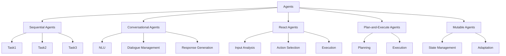

# 【LangChain编程：从入门到实践】代理的类型

## 1. 背景介绍

### 1.1 什么是LangChain?

LangChain是一个用于构建应用程序的框架,旨在与大型语言模型(LLM)进行交互。它提供了一种标准化和模块化的方式来构建应用程序,从而简化了与LLM的交互过程。LangChain的核心概念之一是"代理",它充当应用程序与LLM之间的中介。

### 1.2 代理在LangChain中的作用

代理是LangChain中的关键组件,它们负责管理与LLM的交互,并根据需要执行各种任务。代理可以执行多种功能,例如分析用户输入、调用外部工具和服务、合成输出等。通过使用代理,开发人员可以更轻松地构建复杂的应用程序,而无需直接与LLM进行低级别的交互。

## 2. 核心概念与联系

### 2.1 代理的类型

LangChain提供了多种类型的代理,每种代理都有其特定的用途和功能。以下是一些常见的代理类型:

1. **Sequential Agents**:顺序执行一系列操作的代理。
2. **Conversational Agents**:用于自然语言对话的代理。
3. **React Agents**:基于用户输入和环境状态执行操作的代理。
4. **Plan-and-Execute Agents**:先规划行动,然后执行的代理。
5. **Mutable Agents**:可以修改自身状态的代理。

### 2.2 代理之间的关系

虽然每种代理类型都有其特定的功能,但它们之间存在着密切的关系。例如,一个Conversational Agent可能会使用一个Sequential Agent来执行一系列操作,或者一个Plan-and-Execute Agent可能会利用一个React Agent来响应用户输入。这种模块化设计使得开发人员可以灵活地组合不同类型的代理,以满足特定应用程序的需求。



## 3. 核心算法原理具体操作步骤

### 3.1 Sequential Agents

Sequential Agents是LangChain中最基本的代理类型之一。它们按顺序执行一系列操作,每个操作都可以是一个独立的函数或代理。Sequential Agents的工作原理如下:

1. 初始化一个Sequential Agent实例,并提供一系列要执行的操作。
2. 代理接收输入,并依次执行每个操作。
3. 每个操作可以是一个独立的函数或代理,它们可以访问和修改代理的状态。
4. 操作的输出将作为下一个操作的输入。
5. 最后一个操作的输出将作为Sequential Agent的最终输出。

```python
from langchain import SequentialAgent, AgentExecutor
from langchain.tools import Tool
from langchain.agents import initialize_agent

# 定义工具
tool1 = Tool(name="Tool 1", func=lambda x: f"Tool 1 output: {x}", description="This is a tool that does something.")
tool2 = Tool(name="Tool 2", func=lambda x: f"Tool 2 output: {x}", description="This is another tool that does something else.")

# 创建Sequential Agent
tools = [tool1, tool2]
agent = initialize_agent([tool1, tool2], SequentialAgent, agent="sequential-agent", verbose=True)

# 执行代理
agent_executor = AgentExecutor.from_agent_and_tools(agent=agent, tools=tools, verbose=True)
result = agent_executor.run("This is some input data.")
print(result)
```

在上面的示例中,我们创建了两个工具`tool1`和`tool2`,并将它们传递给`SequentialAgent`。代理将依次执行这两个工具,并将每个工具的输出作为下一个工具的输入。最终结果将是最后一个工具的输出。

### 3.2 Conversational Agents

Conversational Agents是用于自然语言对话的代理。它们可以理解用户的输入,并生成相应的响应。Conversational Agents通常包含以下组件:

1. **自然语言理解(NLU)**: 用于解析和理解用户输入的组件。
2. **对话管理**: 决定代理应该采取什么行动的组件。
3. **响应生成**: 根据对话状态生成响应的组件。

Conversational Agents的工作原理如下:

1. 用户输入被传递给NLU组件进行处理。
2. NLU组件将用户输入转换为代理可以理解的形式,例如意图和实体。
3. 对话管理组件根据NLU的输出和当前对话状态决定代理应该采取什么行动。
4. 代理执行相应的操作,例如调用外部服务或执行内部功能。
5. 响应生成组件根据操作的结果和对话状态生成响应。
6. 响应被返回给用户,并更新对话状态。

```python
from langchain import ConversationalAgent, ConversationBufferMemory
from langchain.llms import OpenAI

# 初始化LLM
llm = OpenAI(temperature=0)

# 创建Conversational Agent
memory = ConversationBufferMemory()
conversational_agent = ConversationalAgent(llm=llm, memory=memory)

# 与代理进行对话
response = conversational_agent.run("Hello, how are you?")
print(response)

response = conversational_agent.run("I'm doing well, thanks for asking. Can you tell me about LangChain?")
print(response)
```

在上面的示例中,我们创建了一个`ConversationalAgent`实例,并使用OpenAI的LLM作为其语言模型。我们还创建了一个`ConversationBufferMemory`实例,用于存储对话历史记录。然后,我们可以与代理进行对话,代理将根据对话历史记录和用户输入生成响应。

### 3.3 React Agents

React Agents是基于用户输入和环境状态执行操作的代理。它们的工作原理如下:

1. 代理接收用户输入和环境状态。
2. 代理分析输入和状态,决定应该执行什么操作。
3. 代理执行选定的操作,并获取操作的结果。
4. 代理根据操作的结果更新环境状态。
5. 代理可以选择生成响应或执行其他操作。

React Agents通常包含以下组件:

1. **输入分析**: 用于解析和理解用户输入的组件。
2. **行动选择**: 决定代理应该执行什么操作的组件。
3. **执行**: 执行选定操作的组件。

```python
from langchain import ReactAgent, AgentExecutor
from langchain.tools import Tool
from langchain.agents import initialize_agent

# 定义工具
tool1 = Tool(name="Tool 1", func=lambda x: f"Tool 1 output: {x}", description="This is a tool that does something.")
tool2 = Tool(name="Tool 2", func=lambda x: f"Tool 2 output: {x}", description="This is another tool that does something else.")

# 创建React Agent
tools = [tool1, tool2]
agent = initialize_agent([tool1, tool2], ReactAgent, agent="react-agent", verbose=True)

# 执行代理
agent_executor = AgentExecutor.from_agent_and_tools(agent=agent, tools=tools, verbose=True)
result = agent_executor.run("This is some input data.")
print(result)
```

在上面的示例中,我们创建了一个`ReactAgent`实例,并为其提供了两个工具`tool1`和`tool2`。代理将根据用户输入和当前状态决定应该执行哪个工具,并返回工具的输出。

### 3.4 Plan-and-Execute Agents

Plan-and-Execute Agents是一种先规划行动,然后执行的代理。它们的工作原理如下:

1. 代理接收用户输入和环境状态。
2. 代理分析输入和状态,制定一系列要执行的操作计划。
3. 代理依次执行计划中的每个操作。
4. 每个操作的结果将作为下一个操作的输入。
5. 代理根据最后一个操作的结果生成响应或执行其他操作。

Plan-and-Execute Agents通常包含以下组件:

1. **规划**: 根据输入和状态制定操作计划的组件。
2. **执行**: 执行操作计划中的每个操作的组件。

```python
from langchain import PlanAndExecuteAgent, AgentExecutor
from langchain.tools import Tool
from langchain.agents import initialize_agent

# 定义工具
tool1 = Tool(name="Tool 1", func=lambda x: f"Tool 1 output: {x}", description="This is a tool that does something.")
tool2 = Tool(name="Tool 2", func=lambda x: f"Tool 2 output: {x}", description="This is another tool that does something else.")

# 创建Plan-and-Execute Agent
tools = [tool1, tool2]
agent = initialize_agent([tool1, tool2], PlanAndExecuteAgent, agent="plan-and-execute-agent", verbose=True)

# 执行代理
agent_executor = AgentExecutor.from_agent_and_tools(agent=agent, tools=tools, verbose=True)
result = agent_executor.run("This is some input data.")
print(result)
```

在上面的示例中,我们创建了一个`PlanAndExecuteAgent`实例,并为其提供了两个工具`tool1`和`tool2`。代理将根据用户输入和当前状态制定一系列操作计划,然后依次执行每个操作。最后,代理将返回最后一个操作的输出。

### 3.5 Mutable Agents

Mutable Agents是可以修改自身状态的代理。它们的工作原理如下:

1. 代理接收用户输入和环境状态。
2. 代理分析输入和状态,决定应该执行什么操作。
3. 代理执行选定的操作,并获取操作的结果。
4. 代理根据操作的结果更新自身状态。
5. 代理可以选择生成响应或执行其他操作。

Mutable Agents通常包含以下组件:

1. **状态管理**: 用于管理和更新代理状态的组件。
2. **适应**: 根据状态变化调整代理行为的组件。

```python
from langchain import MutableAgent, AgentExecutor
from langchain.tools import Tool
from langchain.agents import initialize_agent

# 定义工具
tool1 = Tool(name="Tool 1", func=lambda x: f"Tool 1 output: {x}", description="This is a tool that does something.")
tool2 = Tool(name="Tool 2", func=lambda x: f"Tool 2 output: {x}", description="This is another tool that does something else.")

# 创建Mutable Agent
tools = [tool1, tool2]
agent = initialize_agent([tool1, tool2], MutableAgent, agent="mutable-agent", verbose=True)

# 执行代理
agent_executor = AgentExecutor.from_agent_and_tools(agent=agent, tools=tools, verbose=True)
result = agent_executor.run("This is some input data.")
print(result)
```

在上面的示例中,我们创建了一个`MutableAgent`实例,并为其提供了两个工具`tool1`和`tool2`。代理将根据用户输入和当前状态决定应该执行哪个工具,并根据工具的输出更新自身状态。

## 4. 数学模型和公式详细讲解举例说明

在LangChain中,代理通常不涉及复杂的数学模型和公式。但是,在某些情况下,代理可能需要与基于数学模型的系统进行交互。在这种情况下,代理可能需要理解和处理相关的数学概念和公式。

例如,假设我们有一个基于贝叶斯网络的系统,用于预测某些事件的发生概率。代理可能需要理解贝叶斯网络的基本概念,如条件概率、边际概率和贝叶斯定理。

贝叶斯定理可以用以下公式表示:

$$P(A|B) = \frac{P(B|A)P(A)}{P(B)}$$

其中:

- $P(A|B)$ 表示已知事件 B 发生的情况下,事件 A 发生的条件概率。
- $P(B|A)$ 表示已知事件 A 发生的情况下,事件 B 发生的条件概率。
- $P(A)$ 表示事件 A 的先验概率。
- $P(B)$ 表示事件 B 的边际概率。

代理可能需要理解这些概念,并根据贝叶斯网络的结构和参数计算相关概率。

另一个例子是,如果代理需要与基于机器学习模型的系统进行交互,它可能需要理解一些常见的机器学习概念和算法,如线性回归、逻辑回归、决策树等。

例如,线性回归模型可以用以下公式表示: