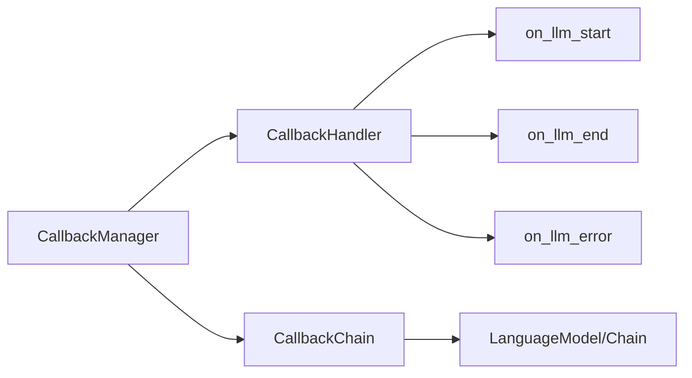

# 【LangChain编程：从入门到实践】回调模块

## 1.背景介绍

在现代软件开发中,回调(Callback)是一种常见的编程模式,广泛应用于异步编程、事件驱动编程和函数式编程等领域。LangChain作为一个强大的自然语言处理(NLP)编程框架,同样提供了灵活的回调机制,方便开发者在语言模型推理的各个阶段插入自定义逻辑,实现更精细的控制和扩展。

本文将深入探讨LangChain的回调模块,从核心概念出发,结合具体的算法原理和代码实例,全面讲解如何在LangChain中灵活运用回调机制,打造更智能、更高效的NLP应用。

## 2.核心概念与联系

在进一步探讨之前,我们先来了解一下LangChain回调模块的几个核心概念:

### 2.1 回调函数(Callback Function)

回调函数是一种特殊的函数,它作为参数传递给另一个函数,在特定事件发生或条件满足时被调用执行。在LangChain中,回调函数允许开发者在语言模型推理的不同阶段(如生成前、生成后、出错时等)插入自定义逻辑。

### 2.2 回调管理器(CallbackManager)

回调管理器是LangChain中负责管理和协调回调函数的核心类。它提供了注册、移除和触发回调函数的方法,使得开发者能够方便地控制回调行为。

### 2.3 回调处理器(CallbackHandler)

回调处理器是一个抽象基类,定义了一组标准的回调方法,如`on_llm_start`、`on_llm_end`、`on_llm_error`等。开发者可以通过继承该类并覆盖相应方法,实现自定义的回调逻辑。

### 2.4 回调链(CallbackChain)

回调链是一种特殊的链(Chain),它包装了原始的语言模型或链,并在执行过程中触发相应的回调函数。通过使用回调链,开发者可以在不修改原始逻辑的情况下,方便地插入回调功能。

下图展示了LangChain回调模块的核心组件及其关系:



## 3.核心算法原理与具体操作步骤

### 3.1 回调函数的注册与触发

LangChain通过回调管理器(CallbackManager)来管理回调函数。开发者可以通过`CallbackManager`的`add_handler`方法注册自定义的回调处理器,并通过`remove_handler`方法移除已注册的处理器。

当语言模型或链执行时,回调管理器会根据当前的执行阶段,自动触发相应的回调函数。具体的触发时机包括:

- `on_llm_start`: 语言模型开始生成文本之前
- `on_llm_end`: 语言模型完成文本生成之后
- `on_llm_error`: 语言模型生成文本过程中出错时
- `on_chain_start`: 链开始执行之前
- `on_chain_end`: 链执行完成之后
- `on_chain_error`: 链执行过程中出错时

### 3.2 自定义回调处理器

为了实现自定义的回调逻辑,开发者需要继承`CallbackHandler`基类,并覆盖相应的回调方法。例如:

```python
from langchain.callbacks import CallbackHandler

class MyHandler(CallbackHandler):
    def on_llm_start(self, serialized, prompts, **kwargs):
        print(f"LLM starting with prompts: {prompts}")
        
    def on_llm_end(self, response, **kwargs):
        print(f"LLM finished with response: {response}")
        
    def on_llm_error(self, error, **kwargs):
        print(f"LLM error: {error}")
```

在上述示例中,`MyHandler`类覆盖了`on_llm_start`、`on_llm_end`和`on_llm_error`三个回调方法,分别在语言模型开始、完成和出错时输出相应的信息。

### 3.3 使用回调链

为了方便地将回调功能与现有的语言模型或链集成,LangChain提供了回调链(CallbackChain)。回调链包装了原始的语言模型或链,并在执行过程中自动触发相应的回调函数。

下面是一个使用回调链的示例:

```python
from langchain.llms import OpenAI
from langchain.chains import LLMChain
from langchain.callbacks import CallbackManager, CallbackChain

llm = OpenAI(temperature=0.9)
manager = CallbackManager([MyHandler()])
chain = LLMChain(llm=llm, prompt=prompt, callback_manager=manager)

callback_chain = CallbackChain(chain=chain, callback_manager=manager)
result = callback_chain.run(prompt)
```

在上述代码中,我们首先创建了一个`OpenAI`语言模型和一个`LLMChain`。然后,我们创建了一个包含`MyHandler`的回调管理器,并将其传递给`LLMChain`。最后,我们使用`CallbackChain`包装原始的`LLMChain`,确保在执行过程中触发相应的回调函数。

## 4.数学模型和公式详细讲解举例说明

在LangChain的回调模块中,主要涉及的数学模型是语言模型的概率输出。语言模型在生成文本时,会输出一个概率分布,表示下一个词的可能性。这个概率分布可以用softmax函数来表示:

$$
P(w_i|w_{1:i-1}) = \frac{e^{s_i}}{\sum_{j=1}^{V} e^{s_j}}
$$

其中,$w_i$表示第$i$个词,$w_{1:i-1}$表示前$i-1$个词的序列,$s_i$表示第$i$个词的分数(通常由神经网络计算得出),V表示词汇表的大小。

通过回调函数,开发者可以访问和分析这个概率分布,实现一些高级的功能,如:

- 计算生成文本的置信度:

$$
\text{confidence} = \prod_{i=1}^{n} P(w_i|w_{1:i-1})
$$

- 对生成的文本进行重采样或过滤,提高质量:

$$
\text{resample}(w_i) = \begin{cases}
w_i, & \text{if } P(w_i|w_{1:i-1}) \ge \theta \\
\text{resample}, & \text{otherwise}
\end{cases}
$$

其中,$\theta$是一个预设的阈值,用于判断是否接受当前生成的词。

## 5.项目实践：代码实例和详细解释说明

下面,我们通过一个实际的项目案例,来演示如何在LangChain中使用回调模块实现自定义功能。

### 5.1 需求描述

假设我们正在开发一个基于语言模型的文本生成应用,需要实现以下功能:

1. 记录每次生成的提示和响应,以便后续分析
2. 对生成的文本进行情感分析,如果情感极性为负面,则重新生成
3. 在生成过程中,实时显示当前已生成的文本长度

### 5.2 代码实现

```python
from langchain.llms import OpenAI
from langchain.chains import LLMChain
from langchain.callbacks import CallbackManager, CallbackChain, CallbackHandler
from langchain.prompts import PromptTemplate

class MyHandler(CallbackHandler):
    def __init__(self):
        self.history = []
        self.current_length = 0
        
    def on_llm_start(self, serialized, prompts, **kwargs):
        self.history.append({"prompt": prompts[0], "response": ""})
        
    def on_llm_new_token(self, token, **kwargs):
        self.current_length += 1
        self.history[-1]["response"] += token
        print(f"Current length: {self.current_length}")
        
    def on_llm_end(self, response, **kwargs):
        self.current_length = 0
        
        # 对生成的文本进行情感分析
        sentiment = analyze_sentiment(response)
        if sentiment == "negative":
            # 如果情感为负面,则重新生成
            raise ValueError("Negative sentiment detected, regenerating...")
            
def analyze_sentiment(text):
    # 这里可以调用外部的情感分析API或模型
    # 简单起见,我们直接用关键词匹配来判断情感
    negative_words = ["bad", "terrible", "awful", "horrible"]
    if any(word in text.lower() for word in negative_words):
        return "negative"
    else:
        return "positive"
            
llm = OpenAI(temperature=0.9)
prompt = PromptTemplate(
    input_variables=["product"],
    template="Please write an advertisement slogan for the following product: {product}",
)

handler = MyHandler()
manager = CallbackManager([handler])
chain = LLMChain(llm=llm, prompt=prompt, callback_manager=manager)

callback_chain = CallbackChain(chain=chain, callback_manager=manager)

while True:
    product = input("Enter a product name (or 'quit' to exit): ")
    if product == "quit":
        break
        
    try:
        result = callback_chain.run(product=product)
        print(f"Generated slogan: {result}\n")
    except ValueError as e:
        print(f"Error: {e}, retrying...\n")
        
print("Generation history:")
for item in handler.history:
    print(f"Prompt: {item['prompt']}")
    print(f"Response: {item['response']}\n")
```

### 5.3 代码解释

1. 我们定义了一个自定义的回调处理器`MyHandler`,用于记录生成历史、统计当前文本长度以及进行情感分析。

2. 在`on_llm_start`方法中,我们将当前的提示添加到历史记录中。

3. 在`on_llm_new_token`方法中,我们实时更新当前生成文本的长度,并将新生成的token附加到响应中。

4. 在`on_llm_end`方法中,我们对生成的完整文本进行情感分析。如果情感为负面,则抛出一个`ValueError`异常,表示需要重新生成。

5. 在主程序中,我们创建了一个`OpenAI`语言模型、一个提示模板以及一个包含`MyHandler`的回调管理器。

6. 我们使用`CallbackChain`包装原始的`LLMChain`,确保在生成过程中触发回调函数。

7. 在一个循环中,我们不断接受用户输入的产品名称,并调用`callback_chain.run`方法生成广告语。如果生成过程中抛出`ValueError`异常,我们会捕获它并重试。

8. 最后,我们输出完整的生成历史,包括每个提示和对应的响应。

通过这个项目案例,我们演示了如何使用LangChain的回调模块实现自定义的功能,如记录生成历史、实时统计文本长度以及对生成结果进行后处理等。这种灵活的回调机制使得开发者能够方便地扩展和定制语言模型应用,满足不同的业务需求。

## 6.实际应用场景

LangChain的回调模块在实际的NLP应用中有广泛的应用场景,下面列举几个典型的例子:

### 6.1 对话系统中的上下文管理

在开发对话系统时,我们通常需要维护一个对话上下文,记录用户之前的输入和系统的响应。通过使用回调函数,我们可以方便地在语言模型生成响应的过程中访问和更新对话上下文,实现多轮对话的流畅交互。

### 6.2 知识库问答中的知识检索

对于知识库问答系统,我们需要根据用户的问题从知识库中检索相关的知识片段,然后基于这些知识生成最终的答案。使用回调机制,我们可以在语言模型生成答案的过程中实时地执行知识检索,动态地将相关知识注入到生成过程中,提高答案的准确性和信息量。

### 6.3 文本生成过程中的质量控制

在文本生成任务中,我们经常需要对生成的文本进行质量控制,如过滤不恰当的内容、纠正语法错误、提高生成文本的多样性等。通过回调函数,我们可以在文本生成的各个阶段插入自定义的质量控制逻辑,动态地调整语言模型的行为,生成更高质量的文本。

### 6.4 自然语言处理管道中的数据流监控

在复杂的自然语言处理管道中,数据在不同的组件之间流动,经过多个处理步骤。使用回调机制,我们可以在数据流动的各个节点插入监控和记录逻辑,实时地跟踪数据的变化和处理进度,方便调试和优化整个管道。

## 