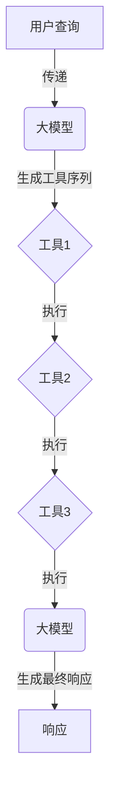
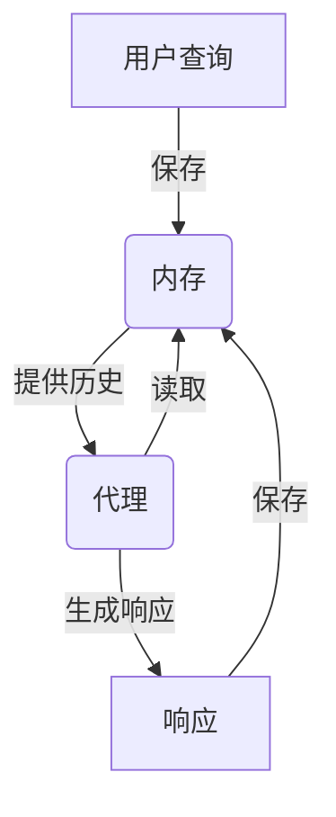

# 【LangChain编程：从入门到实践】大模型时代的开发范式

## 1. 背景介绍

### 1.1 大模型时代的到来

近年来,大型语言模型(Large Language Models, LLMs)的出现彻底改变了人工智能领域的格局。这些模型通过在海量数据上进行预训练,展现出令人惊叹的自然语言理解和生成能力,在各种任务上取得了超越人类的表现。

随着计算能力的不断提升和训练数据的日益丰富,大模型的规模也在不断扩大。从GPT-3拥有1750亿个参数,到PaLM达到5400亿参数,再到Cerebras AI的模型更是突破了1万亿参数的大关。这些庞大的模型不仅能够处理复杂的自然语言任务,还展现出了跨模态的能力,可以同时处理文本、图像、视频等多种形式的数据。

大模型时代的到来,为人工智能应用带来了前所未有的机遇,但同时也带来了新的挑战。如何高效利用这些庞大的模型?如何将它们seamlessly集成到应用程序中?如何控制它们的输出以确保安全性和可靠性?这些都是亟待解决的问题。

### 1.2 LangChain:大模型编程的利器

LangChain是一个针对大模型编程的Python库,旨在简化大模型的应用开发过程。它提供了一系列模块化的构建块,使开发人员能够轻松地组合和自定义各种组件,从而构建复杂的应用程序。

LangChain的核心理念是将大模型视为一种"程序",通过链式调用的方式,将其与各种工具、数据源和其他模型无缝集成。它支持多种流行的大模型,包括OpenAI的GPT模型、Anthropic的Claude模型、Cohere的模型等,并提供了对接这些模型的统一接口。

除了大模型接口,LangChain还提供了丰富的功能模块,如代理(Agents)、内存(Memory)、工具(Tools)等,帮助开发人员构建更加智能和上下文感知的应用程序。同时,它还支持多种数据格式的输入和输出,使得大模型能够与现有系统无缝集成。

总的来说,LangChain为大模型编程提供了一个全面的解决方案,极大地降低了开发难度,提高了开发效率。在大模型时代,LangChain将成为开发人员的得力助手,助力他们释放大模型的无限潜能。

## 2. 核心概念与联系

### 2.1 LangChain的核心概念

LangChain的核心概念包括:

1. **Agents(代理)**: 代理是LangChain的核心组件,它封装了大模型的能力,并通过与其他组件(如工具、内存等)的交互来完成复杂任务。代理可以是单一的大模型,也可以是多个模型的组合。

2. **Tools(工具)**: 工具是指可以被代理调用的外部功能,如网络搜索、数据库查询、文件操作等。代理可以根据需要选择合适的工具来完成任务。

3. **Memory(内存)**: 内存用于存储代理与人类交互的历史信息,以及代理执行任务时的中间状态。这有助于代理保持上下文感知,提高任务完成的一致性和连贯性。

4. **Chains(链)**: 链是将多个组件(如代理、工具、内存等)连接在一起的机制,用于构建复杂的应用程序流程。链可以是顺序执行的,也可以是条件分支或循环执行的。

5. **Prompts(提示词)**: 提示词是与大模型交互的关键,它们指导模型如何理解和响应特定任务。LangChain提供了多种提示词模板,并支持自定义提示词。

这些核心概念相互关联,共同构建了LangChain的编程范式。开发人员可以灵活地组合和定制这些组件,以满足不同应用场景的需求。

### 2.2 LangChain与传统编程范式的区别

与传统的命令式编程范式相比,LangChain采用了一种全新的"声明式"编程范式。在传统编程中,开发人员需要明确地定义每一个步骤,并编写具体的代码来实现这些步骤。而在LangChain中,开发人员只需要描述期望的结果,LangChain会自动选择合适的代理、工具和策略来完成任务。

这种编程范式的转变带来了以下优势:

1. **更高层次的抽象**: 开发人员可以专注于任务本身,而不必关注底层的实现细节,从而提高开发效率。

2. **更好的可扩展性**: 由于组件是解耦的,开发人员可以轻松地添加、替换或扩展组件,以满足不断变化的需求。

3. **更强的适应性**: 代理可以根据上下文动态调整策略,使应用程序能够更好地适应不同的情况。

4. **更好的可解释性**: LangChain提供了丰富的日志和跟踪功能,有助于开发人员理解代理的决策过程,从而提高系统的透明度和可解释性。

然而,这种新的编程范式也带来了一些挑战,如如何有效控制代理的行为、如何确保输出的安全性和可靠性等。这些挑战需要开发人员在使用LangChain时格外注意。

## 3. 核心算法原理具体操作步骤

### 3.1 代理(Agents)

代理是LangChain的核心组件,它封装了大模型的能力,并通过与其他组件(如工具、内存等)的交互来完成复杂任务。LangChain提供了多种预定义的代理类型,如`ZeroShotAgent`、`ConversationAgent`、`ReActAgent`等,每种代理都有其特定的使用场景和工作方式。

以`ZeroShotAgent`为例,它的工作原理如下:

1. 接收用户的输入查询。
2. 将查询和可用工具列表传递给大模型,生成一个合适的工具序列。
3. 按照生成的工具序列,依次调用每个工具,并将工具的输出作为下一个工具的输入。
4. 将所有工具的输出汇总,传递给大模型,生成最终的响应。
5. 将最终响应返回给用户。

这个过程可以用以下伪代码表示:

```python
def zero_shot_agent(query, tools):
    tool_sequence = model.generate_tool_sequence(query, tools)
    intermediate_results = []
    for tool in tool_sequence:
        input = query if not intermediate_results else intermediate_results[-1]
        output = tool.run(input)
        intermediate_results.append(output)
    final_result = model.generate_final_response(intermediate_results)
    return final_result
```

在实际应用中,`ZeroShotAgent`的工作流程可以通过以下Mermaid流程图来更直观地展示:



除了`ZeroShotAgent`,LangChain还提供了其他类型的代理,如`ConversationAgent`、`ReActAgent`等,它们的工作原理虽然有所不同,但都遵循类似的基本流程:接收输入、选择工具、执行工具、生成响应。

### 3.2 工具(Tools)

工具是指可以被代理调用的外部功能,如网络搜索、数据库查询、文件操作等。代理可以根据需要选择合适的工具来完成任务。

在LangChain中,工具是一个Python类,它需要实现一个`run()`方法,用于执行工具的具体功能。例如,一个简单的网络搜索工具可以如下实现:

```python
import requests

class WebSearchTool:
    def __init__(self, search_engine_url):
        self.search_engine_url = search_engine_url

    def run(self, query):
        response = requests.get(self.search_engine_url, params={"q": query})
        return response.text
```

在上面的示例中,`WebSearchTool`接受一个搜索引擎URL作为输入,并在`run()`方法中执行实际的网络搜索操作。

工具可以是任何可调用的Python对象,只要它实现了`run()`方法。LangChain还提供了许多预定义的工具,如`WikipediaQueryRun`、`SerperSearchRun`、`PythonREPLTool`等,开发人员可以直接使用这些工具,也可以根据需要自定义工具。

在代理的执行过程中,工具的调用顺序和输入输出都由代理自动管理。开发人员只需要提供合适的工具集合,代理就可以根据任务需求动态选择和组合工具。

### 3.3 内存(Memory)

内存用于存储代理与人类交互的历史信息,以及代理执行任务时的中间状态。这有助于代理保持上下文感知,提高任务完成的一致性和连贯性。

LangChain提供了多种内存类型,如`ConversationBufferMemory`、`ConversationEntityMemory`、`ConversationSummaryMemory`等,每种内存类型都有不同的存储和检索机制。

以`ConversationBufferMemory`为例,它的工作原理如下:

1. 初始化一个空列表,用于存储对话历史。
2. 在每次与用户交互时,将用户的查询和代理的响应作为一个元组添加到列表中。
3. 当代理需要访问历史信息时,将整个列表作为上下文传递给代理。

这个过程可以用以下伪代码表示:

```python
class ConversationBufferMemory:
    def __init__(self):
        self.history = []

    def save_interaction(self, query, response):
        self.history.append((query, response))

    def load_memory(self):
        return self.history
```

在实际应用中,`ConversationBufferMemory`的工作流程可以通过以下Mermaid流程图来更直观地展示:



除了`ConversationBufferMemory`,LangChain还提供了其他类型的内存,如`ConversationEntityMemory`、`ConversationSummaryMemory`等,它们的工作原理虽然有所不同,但都旨在为代理提供上下文信息,提高任务完成的质量和一致性。

## 4. 数学模型和公式详细讲解举例说明

在LangChain中,数学模型和公式主要体现在两个方面:提示词(Prompts)和大模型的内部机制。

### 4.1 提示词(Prompts)

提示词是与大模型交互的关键,它们指导模型如何理解和响应特定任务。LangChain提供了多种提示词模板,并支持自定义提示词。

提示词的设计遵循一定的数学原理和模式,以确保它们能够有效地引导大模型产生期望的输出。常见的提示词模式包括:

1. **零示例提示(Zero-Shot Prompts)**: 这种提示词直接描述期望的任务,而不提供任何示例。它依赖于大模型的自身理解能力,适用于简单的任务。

   例如:

   ```
   请翻译以下句子:"Hello, how are you?"
   ```

2. **少示例提示(Few-Shot Prompts)**: 这种提示词在描述任务的基础上,提供了少量的示例输入和输出对,以帮助大模型理解期望的格式和模式。

   例如:

   ```
   将以下英文句子翻译成中文:

   English: Hello, how are you?
   Chinese: 你好,你好吗?

   English: I am fine, thank you.
   Chinese: 我很好,谢谢你。

   English: Where is the nearest restaurant?
   Chinese:
   ```

3. **基于规则的提示(Rule-Based Prompts)**: 这种提示词明确地描述了任务的规则和约束条件,以确保大模型的输出符合预期。

   例如:

   ```
   请根据以下规则生成一个强密码:
   - 长度至少为8个字符
   - 必须包含大写字母、小写字母和数字
   - 可以包含特殊字符,但不能包含空格
   ```

在设计提示词时,开发人员需要权衡简洁性和详细性之间的平衡。过于简洁的提示词可能无法有效地引导大模型,而过于详细的提示词又可能