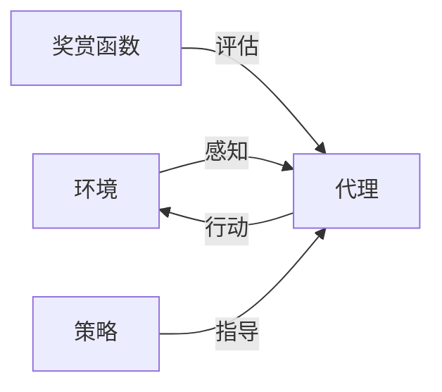

# 【LangChain编程：从入门到实践】智能代理的概念

## 1.背景介绍

### 1.1 人工智能的发展历程

人工智能(Artificial Intelligence, AI)是一门富有前景的计算机科学领域,旨在创造出能够模仿人类智能行为的智能系统。自20世纪50年代诞生以来,人工智能经历了几个重要的发展阶段。

- 第一阶段(1956-1974年):专家系统和符号主义人工智能兴起。这一时期的研究侧重于用规则和逻辑来模拟人类思维过程。
- 第二阶段(1980-1997年):知识库系统、机器学习和神经网络等技术开始兴起,人工智能研究更加注重从数据中学习。
- 第三阶段(1997年至今):深度学习、大数据和并行计算等技术的发展,使得人工智能系统能够处理更加复杂的任务,展现出超乎想象的能力。

### 1.2 智能代理的兴起

随着人工智能技术的不断进步,智能代理(Intelligent Agent)这一概念应运而生。智能代理是一种自主的软件实体,能够感知环境、处理信息、做出决策并采取行动,以实现特定目标。它们具有以下几个关键特征:

- 自主性:能够独立做出决策和行动,而无需人工干预。
- 反应性:能够持续感知环境变化并作出相应反应。
- 主动性:不仅被动响应环境,还能够主动地实现目标。
- 持续时间:是一个持续运行的过程,而非一次性的计算。
- 社会能力:能够与其他代理甚至人类进行交互和协作。

智能代理可以应用于各种领域,如个人助理、智能家居、游戏AI、机器人控制等。它们的出现标志着人工智能系统正在朝着更加自主、智能和通用的方向发展。

## 2.核心概念与联系

### 2.1 智能代理的核心概念

要理解智能代理,需要先掌握以下几个核心概念:

1. **代理(Agent)**: 指能够感知环境并在环境中采取行动的任何实体。代理可以是软件程序、机器人或人类等。

2. **环境(Environment)**: 代理所处的外部世界,包括一切可能影响代理的对象和条件。环境可以是物理世界或虚拟世界。

3. **感知(Perception)**: 代理通过传感器获取环境状态的过程。感知是代理了解环境的基础。

4. **行动(Action)**: 代理根据感知到的环境状态和内部状态,选择采取的操作,以影响环境。

5. **奖赏函数(Reward Function)**: 定义了代理的目标,用于评估代理在特定状态下采取行动的效果是好是坏。

6. **策略(Policy)**: 代理根据当前状态选择行动的规则或映射函数。策略决定了代理的行为方式。

这些概念之间的关系如下所示:

代理通过感知获取环境状态,根据策略选择行动,行动会影响环境,环境的变化又会反馈到代理。在这个循环中,奖赏函数评估代理的行动是否符合目标,策略则指导代理做出最优决策。

### 2.2 智能代理与传统程序的区别

相比传统的程序,智能代理具有以下几个显著特点:

1. **自主性**: 传统程序是被动执行预定义的指令,而智能代理能够根据环境状态自主做出决策和行动。

2. **交互性**: 传统程序通常是独立运行,而智能代理需要持续与环境进行交互。

3. **目标驱动**: 传统程序关注如何执行特定任务,而智能代理的行为是由奖赏函数定义的目标驱动的。

4. **不确定性处理**: 传统程序执行是确定性的,而智能代理需要处理环境的不确定性和动态变化。

5. **学习能力**: 大多数传统程序无法自主学习,而智能代理可以通过与环境的交互来不断优化自身的策略。

这些特点使得智能代理能够解决更加复杂、动态和不确定的问题,展现出更强的智能行为。

## 3.核心算法原理具体操作步骤

智能代理的核心算法原理可以概括为以下几个步骤:

### 3.1 构建环境模型

首先需要对代理所处的环境进行形式化描述,包括:

1. 定义环境的**状态空间(State Space) $\mathcal{S}$**,描述所有可能的环境状态。
2. 定义代理可执行的**行动空间(Action Space) $\mathcal{A}$**。
3. 定义**状态转移概率(State Transition Probability) $\mathcal{P}_{ss'}^a = \mathcal{P}(s'|s,a)$**,表示在状态$s$执行行动$a$后,转移到状态$s'$的概率。
4. 定义**奖赏函数(Reward Function) $\mathcal{R}: \mathcal{S} \times \mathcal{A} \rightarrow \mathbb{R}$**,评估在状态$s$执行行动$a$的效果。

这些元素共同构成了**马尔可夫决策过程(Markov Decision Process, MDP)** $\mathcal{M} = (\mathcal{S}, \mathcal{A}, \mathcal{P}, \mathcal{R})$,用于描述环境的动态演化过程。

### 3.2 确定策略

代理的目标是找到一个最优策略 $\pi^*$,使得在遵循该策略时,能够最大化预期的累积奖赏:

$$\pi^* = \arg\max_\pi \mathbb{E}_\pi \left[\sum_{t=0}^\infty \gamma^t r_t\right]$$

其中 $\gamma \in [0, 1]$ 是折现因子,用于权衡当前奖赏和未来奖赏的重要性。

确定最优策略的算法有多种,包括:

1. **价值迭代(Value Iteration)**: 通过迭代更新状态价值函数或行动价值函数,直到收敛,从而得到最优策略。
2. **策略迭代(Policy Iteration)**: 交替执行策略评估和策略改进,直到策略收敛为最优策略。
3. **时序差分学习(Temporal Difference Learning)**: 基于采样的增量式学习方法,如 Q-Learning 和 Sarsa 算法。
4. **策略梯度(Policy Gradient)**: 直接对策略进行参数化,并通过梯度上升优化策略参数,常用于解决连续控制问题。

不同算法在计算复杂度、收敛性和适用场景上各有优缺点,需要根据具体问题进行选择。

### 3.3 执行策略与环境交互

确定了策略后,代理就可以开始与环境进行交互循环了:

1. 代理获取当前环境状态 $s_t$。
2. 根据策略 $\pi(s_t)$,选择一个行动 $a_t$。
3. 执行行动 $a_t$,环境转移到新状态 $s_{t+1}$,并返回奖赏 $r_{t+1}$。
4. 代理观测到新状态 $s_{t+1}$ 和奖赏 $r_{t+1}$,循环执行步骤 2。

在这个过程中,代理不断获取经验 $(s_t, a_t, r_{t+1}, s_{t+1})$,并根据需要调整策略参数,以适应环境的变化。

### 3.4 策略改进与迁移学习

随着代理与环境的持续交互,策略会不断得到改进。同时,代理也可以利用以前学习到的知识,将策略迁移到新的但相似的环境中,实现**迁移学习(Transfer Learning)**。

迁移学习的常用方法包括:

1. **特征迁移**: 在源域和目标域之间找到共享的状态特征,并将其作为先验知识传递。
2. **实例迁移**: 将源域中的部分实例数据传递到目标域,作为目标域的初始化数据。
3. **模型迁移**: 直接将源域学习到的模型参数作为目标域模型的初始化参数或先验知识。
4. **关系迁移**: 学习源域和目标域之间的显式映射关系,并将其应用于目标域的学习过程。

迁移学习可以加速新环境下的策略学习,提高代理的泛化能力和适应性。

## 4.数学模型和公式详细讲解举例说明

在智能代理的理论框架中,存在一些重要的数学模型和公式,需要进一步详细讲解和举例说明。

### 4.1 马尔可夫决策过程(MDP)

马尔可夫决策过程是描述智能代理与环境交互的基本数学模型。一个 MDP 由以下几个要素构成:

- 状态空间 $\mathcal{S}$: 环境所有可能状态的集合。
- 行动空间 $\mathcal{A}$: 代理可执行的所有行动的集合。
- 状态转移概率 $\mathcal{P}_{ss'}^a = \mathcal{P}(s'|s,a)$: 在状态 $s$ 执行行动 $a$ 后,转移到状态 $s'$ 的概率。
- 奖赏函数 $\mathcal{R}: \mathcal{S} \times \mathcal{A} \rightarrow \mathbb{R}$: 评估在状态 $s$ 执行行动 $a$ 的即时奖赏。
- 折现因子 $\gamma \in [0, 1]$: 权衡当前奖赏和未来奖赏的重要性。

例如,考虑一个简单的网格世界,代理的目标是从起点移动到终点。状态空间 $\mathcal{S}$ 是所有可能的位置,行动空间 $\mathcal{A}$ 是 {上、下、左、右}。状态转移概率 $\mathcal{P}_{ss'}^a$ 取决于代理是否能够按预期移动。奖赏函数 $\mathcal{R}$ 可以设置为到达终点时获得正奖赏,其他情况为 0 或负奖赏(例如撞墙)。

### 4.2 价值函数和 Bellman 方程

在 MDP 中,我们通常使用**价值函数(Value Function)**来评估一个状态或状态-行动对的长期价值,即在该状态下遵循某策略所能获得的预期累积奖赏。

**状态价值函数(State Value Function)** $V^\pi(s)$ 表示在状态 $s$ 开始,之后遵循策略 $\pi$ 所能获得的预期累积奖赏:

$$V^\pi(s) = \mathbb{E}_\pi \left[\sum_{t=0}^\infty \gamma^t r_{t+1} | s_0 = s\right]$$

**行动价值函数(Action Value Function)** $Q^\pi(s, a)$ 表示在状态 $s$ 执行行动 $a$,之后遵循策略 $\pi$ 所能获得的预期累积奖赏:

$$Q^\pi(s, a) = \mathbb{E}_\pi \left[\sum_{t=0}^\infty \gamma^t r_{t+1} | s_0 = s, a_0 = a\right]$$

价值函数满足著名的 **Bellman 方程**:

$$\begin{aligned}
V^\pi(s) &= \sum_{a \in \mathcal{A}} \pi(a|s) \sum_{s' \in \mathcal{S}} \mathcal{P}_{ss'}^a \left[R(s, a) + \gamma V^\pi(s')\right] \\
Q^\pi(s, a) &= \sum_{s' \in \mathcal{S}} \mathcal{P}_{ss'}^a \left[R(s, a) + \gamma \sum_{a' \in \mathcal{A}} \pi(a'|s') Q^\pi(s', a')\right]
\end{aligned}$$

这些方程揭示了价值函数与即时奖赏、状态转移概率和未来价值之间的递推关系,是求解最优策略的基础。

### 4.3 最优价值函数和最优策略

对于任意 MDP,存在一个最优状态价值函数 $V^*(s)$ 和最优行动价值函数 $Q^*(s, a)$,它们定义了在该 MDP 中可获得的最大预期累积奖赏:

$$\begin{aligned}
V^*(s) &= \max_\pi V^\pi(s) \\
Q^