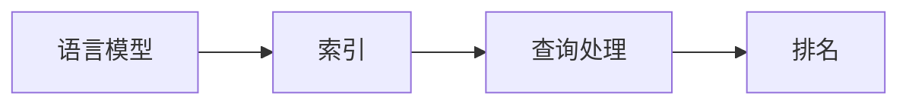

## 1.背景介绍

在当前的信息爆炸时代，我们面临着海量的数据和信息。如何从中有效地检索出我们需要的信息，已经成为了一个重要的问题。检索器作为解决这个问题的关键工具，其重要性不言而喻。本文将介绍一种名为LangChain的编程语言，以及如何使用它来构建一个强大的检索器。

## 2.核心概念与联系

LangChain是一种专门为处理文本数据和构建检索器设计的编程语言。它的核心概念包括语言模型、索引、查询处理和排名等。这些概念之间的联系非常紧密，共同构成了LangChain的核心框架。

- 语言模型：这是LangChain的基础，它定义了文本数据的结构和语义。
- 索引：索引是LangChain处理大规模数据的关键，它可以高效地存储和检索数据。
- 查询处理：这是LangChain的核心功能，它负责处理用户的查询请求，返回相关的结果。
- 排名：排名是LangChain优化查询结果的重要步骤，它根据各种因素（如 relevancy, freshness 等）对结果进行排序。



## 3.核心算法原理具体操作步骤

LangChain的核心算法包括索引构建、查询处理和排名。下面将分别介绍这三个步骤的具体操作。

### 3.1 索引构建

索引构建是LangChain处理大规模数据的关键，其主要步骤如下：

1. 读取原始文本数据。
2. 使用LangChain的语言模型进行文本解析，将文本转换为一系列的词元（token）。
3. 对每个词元，记录其在文本中的位置信息，构建倒排索引。

### 3.2 查询处理

查询处理是LangChain的核心功能，其主要步骤如下：

1. 接收用户的查询请求，使用LangChain的语言模型进行解析，将查询转换为一系列的词元。
2. 对每个词元，查找倒排索引，获取包含该词元的文档列表。
3. 对所有的文档列表进行合并，得到最终的查询结果。

### 3.3 排名

排名是LangChain优化查询结果的重要步骤，其主要步骤如下：

1. 对查询结果中的每个文档，计算其与查询的相关性得分。
2. 根据得分对查询结果进行排序，返回排名最高的文档。

## 4.数学模型和公式详细讲解举例说明

在LangChain中，我们使用TF-IDF模型来计算文档和查询的相关性得分。TF-IDF模型的基本思想是，如果一个词在文档中出现的频率（TF，Term Frequency）高，并且在其他文档中出现的频率（IDF，Inverse Document Frequency）低，那么这个词对文档的重要性就越大。

TF的计算公式为：

$$
TF(t, d) = \frac{f_{t, d}}{\sum_{t' \in d} f_{t', d}}
$$

其中，$f_{t, d}$表示词$t$在文档$d$中的频率。

IDF的计算公式为：

$$
IDF(t, D) = \log \frac{|D|}{|\{d \in D: t \in d\}|}
$$

其中，$D$表示文档集合，$|D|$表示文档集合的大小，$|\{d \in D: t \in d\}|$表示包含词$t$的文档数量。

然后，我们将TF和IDF相乘，得到TF-IDF得分：

$$
TFIDF(t, d, D) = TF(t, d) \times IDF(t, D)
$$

这就是LangChain计算文档和查询相关性的数学模型。

## 5.项目实践：代码实例和详细解释说明

下面，我们来看一个使用LangChain构建检索器的简单示例。这个示例将展示如何读取文本数据，构建索引，处理查询，以及进行排名。

```python
# 创建LangChain实例
lc = LangChain()

# 读取文本数据
lc.read_data("data.txt")

# 构建索引
lc.build_index()

# 处理查询
results = lc.process_query("LangChain")

# 进行排名
results = lc.rank(results)

# 输出结果
for doc, score in results:
    print(f"{doc}: {score}")
```

在这个示例中，我们首先创建了一个LangChain实例，然后读取了文本数据，并构建了索引。然后，我们处理了一个查询，得到了查询结果。最后，我们对查询结果进行了排名，并输出了结果。

## 6.实际应用场景

LangChain可以应用于各种需要检索功能的场景，例如：

- 搜索引擎：可以使用LangChain构建全文搜索引擎，提供网页、新闻、论文等各种类型的检索服务。
- 电子商务：可以使用LangChain构建商品搜索引擎，帮助用户快速找到他们想要的商品。
- 社交媒体：可以使用LangChain构建用户内容搜索引擎，帮助用户找到他们感兴趣的内容。

## 7.工具和资源推荐

如果你对LangChain感兴趣，以下是一些推荐的工具和资源：

- LangChain官方网站：这是LangChain的官方网站，你可以在这里找到最新的文档和教程。
- LangChain GitHub项目：这是LangChain的开源项目，你可以在这里找到最新的代码和示例。

## 8.总结：未来发展趋势与挑战

随着信息的不断增长，检索器的重要性也在不断提升。LangChain作为一种专门为构建检索器设计的编程语言，具有很大的发展潜力。然而，LangChain也面临着一些挑战，例如如何处理更复杂的查询，如何提高查询的准确性，如何处理大规模的数据等。这些都是LangChain在未来需要解决的问题。

## 9.附录：常见问题与解答

Q: LangChain支持哪些语言？

A: LangChain是一种通用的编程语言，理论上可以支持任何语言。然而，由于语言模型的复杂性，目前LangChain主要支持英文。

Q: LangChain如何处理大规模的数据？

A: LangChain使用索引来处理大规模的数据。索引可以高效地存储和检索数据，使得LangChain可以处理大规模的数据。

Q: LangChain如何优化查询结果？

A: LangChain使用排名来优化查询结果。排名根据各种因素（如 relevancy, freshness 等）对结果进行排序，返回排名最高的文档。

作者：禅与计算机程序设计艺术 / Zen and the Art of Computer Programming