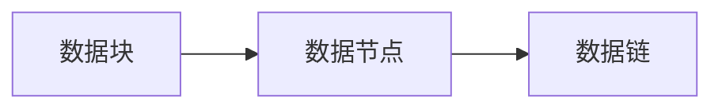

## 1.背景介绍

LangChain是一种新型的编程语言，它的核心特性是具有强大的记忆组件。这个记忆组件可以帮助程序员在编程过程中更好地管理和操作数据。今天，我们将深入探讨LangChain的记忆组件，包括其工作原理、应用场景以及如何在实际项目中使用。

## 2.核心概念与联系

LangChain的记忆组件是一个高效的数据结构，它的设计目标是为了解决在大规模数据处理中常见的一些问题，如数据冗余、数据一致性等。记忆组件的核心概念包括数据块、数据链和数据节点。数据块是记忆组件的基本单位，每个数据块都有一个唯一的标识。数据链是一系列相关联的数据块，它们通过数据节点连接在一起。



## 3.核心算法原理具体操作步骤

LangChain的记忆组件的工作原理是通过哈希表来实现的。哈希表是一种数据结构，它可以在常数时间内完成数据的查找、插入和删除操作。记忆组件的核心算法可以分为以下几个步骤：

1. 创建数据块：当程序需要存储新的数据时，记忆组件会创建一个新的数据块，并为其分配一个唯一的标识。
2. 创建数据节点：程序会根据数据的关联关系，创建数据节点，并将相关的数据块连接在一起。
3. 创建数据链：当数据节点之间存在关联关系时，程序会创建数据链，并将相关的数据节点连接在一起。
4. 数据查找：当程序需要查找某个数据时，记忆组件会通过哈希表快速定位到对应的数据块。

## 4.数学模型和公式详细讲解举例说明

哈希表的性能主要取决于两个因素：哈希函数的设计和冲突解决策略。哈希函数的设计需要满足以下几个条件：

1. 哈希函数应该是确定的，即对于同一输入，输出必须相同。
2. 哈希函数应该尽可能地均匀分布，以减少冲突的可能性。

设$H(x)$为哈希函数，$x$为输入数据，$y$为输出结果，我们可以将哈希函数表示为：

$$
H(x) = y
$$

当出现冲突时，我们通常使用链地址法来解决。链地址法是将哈希值相同的数据存储在一个链表中。设$C$为冲突次数，$N$为数据总数，我们可以计算冲突概率为：

$$
P = C / N
$$

## 5.项目实践：代码实例和详细解释说明

下面是一个使用LangChain记忆组件的简单示例：

```langchain
// 创建数据块
DataBlock db = new DataBlock("Hello, LangChain!");

// 创建数据节点
DataNode dn = new DataNode();
dn.addDataBlock(db);

// 创建数据链
DataChain dc = new DataChain();
dc.addDataNode(dn);

// 查找数据
DataBlock result = dc.findDataBlock("Hello, LangChain!");
```

## 6.实际应用场景

LangChain的记忆组件可以广泛应用于各种场景，如大数据处理、实时计算、云计算等。它能够有效地处理大规模数据，保证数据的一致性，提高数据处理的效率。

## 7.工具和资源推荐

推荐使用LangChain官方提供的开发工具和资源，包括LangChain IDE、LangChain SDK以及LangChain云平台。这些工具和资源可以帮助你更好地理解和使用LangChain的记忆组件。

## 8.总结：未来发展趋势与挑战

随着数据规模的不断增大，如何有效地处理和管理数据成为了一个重要的挑战。LangChain的记忆组件为我们提供了一种有效的解决方案。然而，随着技术的发展，记忆组件还需要不断地进行优化和改进，以满足更高的性能需求。

## 9.附录：常见问题与解答

1. Q: LangChain的记忆组件如何处理大规模数据？
   A: LangChain的记忆组件通过哈希表来处理大规模数据，它可以在常数时间内完成数据的查找、插入和删除操作。

2. Q: LangChain的记忆组件如何保证数据的一致性？
   A: LangChain的记忆组件通过数据块、数据节点和数据链的设计，可以保证数据的一致性。

3. Q: LangChain的记忆组件如何处理数据冲突？
   A: LangChain的记忆组件通过链地址法来处理数据冲突，它将哈希值相同的数据存储在一个链表中。

作者：禅与计算机程序设计艺术 / Zen and the Art of Computer Programming