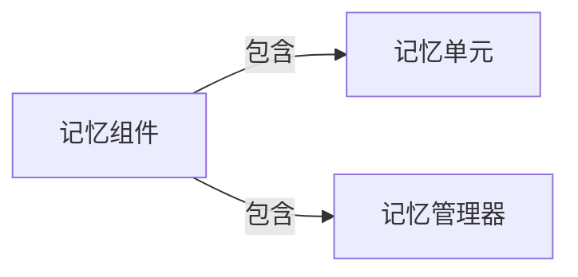

## 1.背景介绍

LangChain 是一种新型的编程语言，它的设计理念是将自然语言的处理能力与传统的编程语言的严谨性相结合，为开发者提供一种全新的编程体验。而在 LangChain 中，记忆组件是其核心的一部分，它负责存储和管理程序运行过程中的各种数据信息，对于理解和掌握 LangChain 编程具有重要的意义。

## 2.核心概念与联系

记忆组件的设计主要涉及到两个核心概念：记忆单元和记忆管理器。记忆单元是记忆组件的基本构成部分，它用于存储程序运行过程中产生的数据；记忆管理器则是对记忆单元进行管理的工具，它负责记忆单元的分配和回收，以及数据的读取和写入等操作。



## 3.核心算法原理具体操作步骤

记忆组件的工作原理主要包括以下几个步骤：

1. 当程序需要存储数据时，记忆管理器会从记忆单元池中分配一个记忆单元给程序；
2. 程序将数据写入到分配的记忆单元中；
3. 当程序需要读取数据时，记忆管理器会根据程序提供的记忆单元地址，从记忆单元中读取对应的数据；
4. 当程序不再需要某个记忆单元时，记忆管理器会将该记忆单元回收，放回到记忆单元池中。

## 4.数学模型和公式详细讲解举例说明

在 LangChain 中，记忆单元的分配和回收可以用数学模型来描述。设 $N$ 为记忆单元池中的记忆单元总数，$M$ 为已经分配出去的记忆单元数，那么记忆单元池中剩余的记忆单元数就是 $N-M$。

当程序需要一个记忆单元时，记忆管理器会检查记忆单元池中是否还有剩余的记忆单元，即检查 $N-M>0$ 是否成立。如果成立，则分配一个记忆单元给程序，同时 $M$ 的值增加 1；如果不成立，则说明记忆单元已经分配完，需要等待其他程序回收记忆单元。

当程序不再需要某个记忆单元时，记忆管理器会将该记忆单元回收，放回到记忆单元池中，同时 $M$ 的值减少 1。

## 5.项目实践：代码实例和详细解释说明

接下来，我们通过一个简单的 LangChain 程序来演示记忆组件的使用。

```langchain
# 定义一个变量
var a = 10;

# 打印变量的值
print(a);

# 修改变量的值
a = 20;

# 再次打印变量的值
print(a);
```

在这个程序中，我们定义了一个变量 `a`，并给它赋值为 10。这个过程实际上就是记忆管理器分配了一个记忆单元给变量 `a`，并将 10 写入到这个记忆单元中。然后，我们通过 `print(a)` 打印了变量 `a` 的值，这个过程实际上就是记忆管理器从 `a` 对应的记忆单元中读取了数据。最后，我们修改了变量 `a` 的值，这个过程实际上就是记忆管理器将 20 写入到 `a` 对应的记忆单元中。

## 6.实际应用场景

记忆组件在 LangChain 编程中有着广泛的应用，几乎所有需要存储和处理数据的程序都会用到它。例如，在开发一个计算器程序时，我们需要用记忆组件来存储用户输入的数值和计算结果；在开发一个文本编辑器程序时，我们需要用记忆组件来存储用户编辑的文本内容等等。

## 7.工具和资源推荐

如果你想深入学习 LangChain 编程，以下是一些我推荐的工具和资源：

- LangChain 官方文档：这是学习 LangChain 编程的最权威的资源，它详细介绍了 LangChain 的各种语法和特性，是每个 LangChain 开发者必备的参考资料。
- LangChain 开发环境：这是一个专门为 LangChain 开发者设计的开发环境，它提供了代码编辑、编译、运行和调试等功能，可以大大提高你的开发效率。
- LangChain 论坛：这是一个 LangChain 开发者的交流平台，你可以在这里提问、分享你的代码和经验，也可以从别人的问题和分享中学习到很多东西。

## 8.总结：未来发展趋势与挑战

随着人工智能和自然语言处理技术的发展，我相信 LangChain 这种将自然语言处理能力与编程语言严谨性相结合的新型编程语言将会有更广泛的应用。而记忆组件作为 LangChain 的核心部分，其在程序数据存储和处理中的作用也将越来越重要。

然而，随着程序的复杂性增加，如何有效地管理记忆单元，如何提高数据读写的效率，如何防止记忆单元的泄露和滥用等问题，都是记忆组件面临的挑战。我相信，只有不断地研究和改进，我们才能克服这些挑战，使 LangChain 成为一种更强大、更易用的编程语言。

## 9.附录：常见问题与解答

1. 问题：记忆单元的大小是固定的吗？
答：在 LangChain 中，记忆单元的大小是可以根据需要进行调整的。记忆管理器会根据存储的数据类型和大小，动态地分配和回收记忆单元。

2. 问题：如何防止记忆单元的泄露？
答：在 LangChain 中，记忆管理器会自动管理记忆单元的生命周期。当程序不再需要某个记忆单元时，记忆管理器会自动将其回收，以防止记忆单元的泄露。

3. 问题：记忆管理器是如何知道程序何时不再需要某个记忆单元的？
答：在 LangChain 中，程序可以通过特殊的语法告诉记忆管理器它不再需要某个记忆单元。此外，记忆管理器也会根据程序的运行情况，自动推断出哪些记忆单元已经不再被需要，然后将其回收。

作者：禅与计算机程序设计艺术 / Zen and the Art of Computer Programming