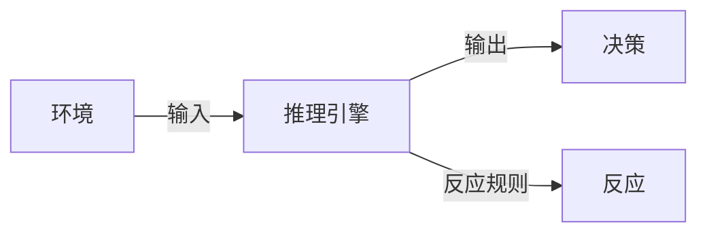
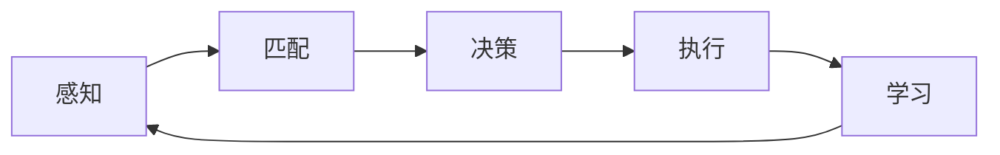

## 1.背景介绍

在人工智能(AI)的世界里，Agent是一个重要的概念。它是一个自主的实体，能够感知环境，根据环境的变化做出决策，并执行相应的行动。在AI Agent的设计和开发过程中，推理引擎是一项关键技术，它是Agent的“大脑”，决定了Agent如何理解环境，如何做出决策。本文将深入探讨一种名为ReAct的推理引擎框架，通过理论和实践相结合的方式，帮助读者理解和掌握这一重要技术。

## 2.核心概念与联系

首先，我们需要理解推理引擎的核心概念。推理引擎是一个系统，它接收输入（来自环境的信息），并根据一组预定义的规则，生成输出（决策）。在ReAct框架中，这些规则被编码为一种称为“反应”的结构，这就是ReAct名称的由来。



## 3.核心算法原理具体操作步骤

ReAct框架的核心是反应规则的处理。反应规则是一种条件-行动对（Condition-Action Pair），当条件满足时，就执行相应的行动。这个过程可以分为以下几个步骤：

1. 感知：Agent从环境中获取信息，这些信息被编码为一组事实（Facts）。
2. 匹配：推理引擎将这些事实与反应规则进行匹配，找出所有满足条件的反应规则。
3. 决策：如果有多个反应规则的条件都被满足，推理引擎需要选择一个进行执行。这个选择过程可能依赖于一些优先级规则，或者随机选择。
4. 执行：执行选定的反应规则的行动部分，这可能会改变环境，也可能会改变Agent自身的状态。
5. 学习：根据执行结果和预期目标，推理引擎可以学习和调整反应规则，以优化未来的决策。



## 4.数学模型和公式详细讲解举例说明

在ReAct框架中，反应规则的选择过程可以被建模为一个优化问题。假设我们有$n$个反应规则，每个反应规则$i$有一个满足条件的概率$p_i$，和一个执行成功的奖励$r_i$。我们的目标是选择一个反应规则，使得期望奖励最大。这个问题可以用以下公式表示：

$$
\max \sum_{i=1}^{n} p_i r_i
$$

这个公式的解可以通过动态规划或贪心算法来求解。

## 5.项目实践：代码实例和详细解释说明

让我们通过一个简单的例子来说明如何在Python中实现ReAct框架。假设我们有一个Agent，它在一个环境中寻找食物。环境中有两种食物：苹果和香蕉。Agent有一个反应规则：如果看到苹果，就吃苹果；如果看到香蕉，就吃香蕉。以下是实现这个Agent的代码：

```python
class Agent:
    def __init__(self):
        self.reactions = {
            '看到苹果': self.eat_apple,
            '看到香蕉': self.eat_banana,
        }

    def perceive(self, environment):
        # 这里简化为直接从环境中获取信息
        return environment.get_info()

    def react(self, info):
        # 找到对应的反应并执行
        reaction = self.reactions.get(info)
        if reaction:
            reaction()

    def eat_apple(self):
        print('吃苹果')

    def eat_banana(self):
        print('吃香蕉')
```

在这个例子中，`perceive`方法用于获取环境信息，`react`方法用于执行反应，`eat_apple`和`eat_banana`是两个具体的反应。

## 6.实际应用场景

ReAct框架可以应用于许多实际问题中，例如游戏AI、自动驾驶、智能家居等。在游戏AI中，反应规则可以是“如果看到敌人，就攻击”；在自动驾驶中，反应规则可以是“如果前方有障碍物，就刹车”；在智能家居中，反应规则可以是“如果天黑了，就打开灯”。

## 7.工具和资源推荐

以下是一些有用的工具和资源，可以帮助你更好地理解和使用ReAct框架：

- [Python](https://www.python.org/)：一种广泛用于AI和机器学习的编程语言。
- [OpenAI Gym](https://gym.openai.com/)：一个用于开发和比较强化学习算法的工具包。
- [PyTorch](https://pytorch.org/)：一个强大的机器学习库，可以用于实现复杂的反应规则和学习算法。

## 8.总结：未来发展趋势与挑战

ReAct框架提供了一种简单而强大的方法来设计和实现AI Agent的推理引擎。然而，它也面临着一些挑战，例如如何处理复杂的环境信息，如何优化反应规则的选择过程，如何有效地学习和调整反应规则等。随着AI和机器学习技术的发展，我们有理由相信，这些问题将会得到解决，ReAct框架将在未来的AI Agent设计和开发中发挥更大的作用。

## 9.附录：常见问题与解答

- 问题：ReAct框架适用于所有类型的AI Agent吗？
- 答案：不一定。ReAct框架适用于那些能够清晰定义反应规则的问题。对于一些复杂的问题，可能需要使用更复杂的框架或算法。

- 问题：在ReAct框架中，如何处理多个反应规则的条件都满足的情况？
- 答案：这需要根据具体的应用场景来决定。一种常见的方法是定义一些优先级规则，例如，优先执行最能带来奖励的反应规则。另一种方法是随机选择一个反应规则。

- 问题：在ReAct框架中，如何学习和调整反应规则？
- 答案：这通常需要使用一些机器学习算法，例如强化学习。通过不断地试错和反馈，Agent可以学习到哪些反应规则能够带来更好的结果。

作者：禅与计算机程序设计艺术 / Zen and the Art of Computer Programming