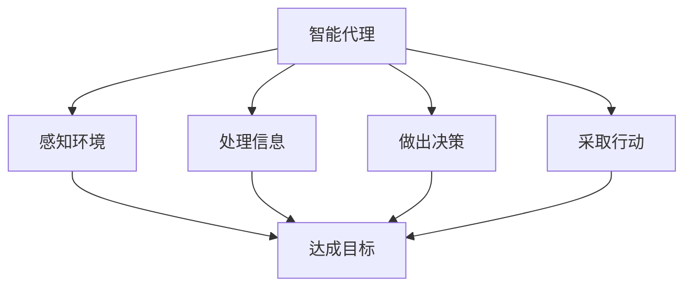
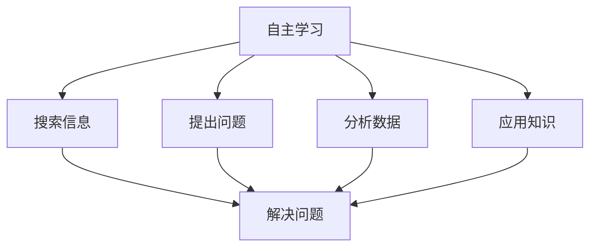
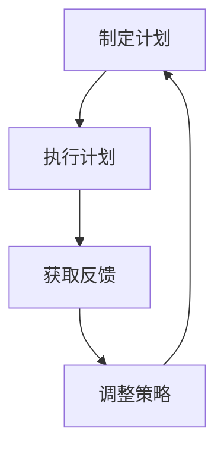
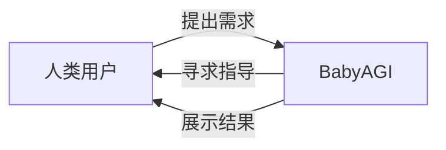

# 【大模型应用开发 动手做AI Agent】BabyAGI

## 1. 背景介绍

### 1.1 人工智能的发展

人工智能(AI)是当代科技领域最具革命性和颠覆性的技术之一。自20世纪50年代诞生以来,AI不断发展壮大,已经渗透到我们生活的方方面面。从语音助手到自动驾驶汽车,从推荐系统到医疗诊断,AI的应用越来越广泛。

### 1.2 大模型的兴起

近年来,大型语言模型(Large Language Models,LLMs)的出现推动了AI的飞速发展。LLMs通过在海量文本数据上训练,能够掌握丰富的自然语言知识,并具备出色的生成、理解和推理能力。以GPT-3、PaLM、ChatGPT等为代表的大模型,展现了令人惊叹的性能,在多个领域取得了突破性进展。

### 1.3 BabyAGI的诞生

在大模型的基础上,一种新型AI系统应运而生——BabyAGI。它是一个基于大语言模型的智能代理(Intelligent Agent),旨在通过自主学习和推理来完成复杂任务。BabyAGI的核心思想是赋予语言模型自我驱动的能力,使其能够制定计划、搜索信息、迭代改进,最终解决手头的问题。

## 2. 核心概念与联系

### 2.1 智能代理

智能代理是一种自主系统,能够感知环境、处理信息、做出决策并采取行动,以达成特定目标。在BabyAGI中,大语言模型扮演着智能代理的角色,通过与外部世界交互来完成任务。

### 2.2 自主学习

传统的机器学习系统需要人工设计特征并提供标注数据,而BabyAGI则通过自主学习的方式获取知识。它可以主动搜索相关信息、提出问题、分析数据,并将学习到的知识应用于解决实际问题。

### 2.3 迭代优化

BabyAGI的工作流程是一个不断迭代优化的循环。它会根据当前的知识状态制定计划,执行计划并获取反馈,然后根据反馈调整策略,重复这个过程直到达成目标。

### 2.4 人机协作

虽然BabyAGI具备一定的自主能力,但它并非完全独立运行。在实际应用中,BabyAGI需要与人类用户密切协作,获取任务需求、汲取人类知识、寻求指导和反馈,最终完成人机协同的智能系统。

## 3. 核心算法原理具体操作步骤

BabyAGI的核心算法由多个模块组成,它们协同工作,形成了一个自主学习和推理的闭环系统。下面我们逐一探讨这些模块的工作原理和具体操作步骤。

### 3.1 任务分解模块

任务分解模块的作用是将复杂的任务分解为一系列可管理的子任务。这个过程类似于人类在解决问题时,将大问题拆分为多个小问题的思维方式。

具体操作步骤如下:

1. 分析任务描述,识别关键信息和目标。
2. 基于对任务的理解,提出多个可能的子任务。
3. 评估每个子任务的重要性和优先级,对它们进行排序。
4. 将排序后的子任务列表输出为任务分解的结果。

### 3.2 任务规划模块

任务规划模块根据任务分解的结果,为每个子任务生成具体的执行计划。这个计划包括要采取的行动步骤、所需的资源和工具等。

具体操作步骤如下:

1. 遍历子任务列表。
2. 对于每个子任务,分析其特征和要求。
3. 根据对子任务的理解,提出多个可能的解决方案。
4. 评估每个解决方案的优缺点,选择最佳方案作为该子任务的执行计划。
5. 将所有子任务的执行计划汇总,形成整体任务规划。

### 3.3 执行模块

执行模块负责实施任务规划中的具体行动。它会根据计划中的指令,调用相应的工具和资源,完成信息搜索、数据处理、模型运行等操作。

具体操作步骤如下:

1. 从任务规划中获取下一步要执行的行动。
2. 解析行动指令,识别所需的工具和资源。
3. 加载并初始化相应的工具和资源。
4. 执行指令,完成相应的操作(如搜索、计算、生成等)。
5. 将操作结果记录下来,作为后续步骤的输入。
6. 重复上述步骤,直到完成整个任务规划。

### 3.4 结果分析模块

结果分析模块对执行模块的输出进行评估和总结,判断是否已经达成任务目标。如果目标未达成,它会提出改进建议,供任务规划模块参考,以优化后续的执行流程。

具体操作步骤如下:

1. 收集执行模块的所有输出结果。
2. 根据任务目标,分析结果的质量和完整性。
3. 如果结果满足目标要求,则任务完成,输出最终结果。
4. 如果结果不满足要求,则识别存在的缺陷和不足。
5. 提出改进建议,如重新规划、补充信息、调整参数等。
6. 将改进建议反馈给任务规划模块,启动新一轮的迭代。

### 3.5 人机交互模块

人机交互模块是BabyAGI与人类用户之间的桥梁。它能够理解用户的自然语言指令,并将系统的输出以人类可读的形式呈现。同时,它还会在适当的时候请求人类的指导和反馈,以提高系统的效率和准确性。

具体操作步骤如下:

1. 接收用户的自然语言输入。
2. 使用自然语言处理技术解析输入,提取关键信息。
3. 将解析结果传递给相应的模块(如任务分解、结果分析等)。
4. 获取模块的输出结果。
5. 将结果转换为自然语言形式。
6. 以多模态方式(文本、图像、语音等)向用户呈现结果。
7. 在需要时,请求用户提供额外的指导或反馈。

通过上述模块的紧密配合,BabyAGI形成了一个自主学习和推理的闭环系统,能够高效地解决复杂任务。

## 4. 数学模型和公式详细讲解举例说明

在BabyAGI的实现中,数学模型和公式扮演着重要的角色,为系统的各个环节提供理论支撑和计算基础。下面我们将详细讲解一些核心模型和公式,并给出具体的例子说明。

### 4.1 任务分解的聚类算法

任务分解模块需要将复杂任务拆分为多个子任务。这个过程可以使用聚类算法来实现,将任务描述中的关键词和短语划分为不同的簇,每个簇代表一个潜在的子任务。

常用的聚类算法包括K-Means、层次聚类等。以K-Means为例,其目标函数可以表示为:

$$J = \sum_{i=1}^{k}\sum_{x \in C_i}\left \| x - \mu_i \right \|^2$$

其中,$ k $是簇的数量,$ C_i $是第$ i $个簇,$ \mu_i $是第$ i $个簇的质心。算法的目标是最小化所有点到其所属簇质心的距离之和。

例如,对于任务"规划一次家庭野餐"的描述,我们可以将其拆分为以下子任务:

- 选择地点
- 准备食物和饮料
- 安排交通
- 购买野餐用品
- 安排活动

### 4.2 任务规划的决策模型

任务规划模块需要为每个子任务生成最佳的执行计划。这可以建模为一个决策过程,通过评估不同方案的效用值,选择效用最大的方案作为规划。

一种常见的决策模型是多属性效用理论(MAUT),它将每个方案的效用表示为多个属性效用的加权和:

$$U(a_i) = \sum_{j=1}^{n}w_j u_j(a_i)$$

其中,$ a_i $是第$ i $个方案,$ u_j(a_i) $是第$ j $个属性对于方案$ a_i $的效用值,$ w_j $是第$ j $个属性的权重。

例如,对于子任务"准备食物和饮料",我们可以考虑以下属性:

- 成本
- 方便程度
- 营养价值
- 口味偏好

通过为每个属性赋予适当的权重,并评估不同方案在各个属性上的表现,我们可以选择综合效用值最高的方案作为执行计划。

### 4.3 结果评估的相似度度量

结果分析模块需要评估执行模块的输出结果是否满足任务目标。这可以通过计算结果与目标之间的相似度来实现。

一种常用的相似度度量是余弦相似度,它测量两个向量之间的夹角余弦值:

$$\text{sim}(A, B) = \cos(\theta) = \frac{A \cdot B}{\|A\|\|B\|} = \frac{\sum_{i=1}^{n}A_iB_i}{\sqrt{\sum_{i=1}^{n}A_i^2}\sqrt{\sum_{i=1}^{n}B_i^2}}$$

其中,$ A $和$ B $是两个向量,$ \theta $是它们之间的夹角。

例如,假设我们的任务目标是"为一次野餐准备美味的食物",而执行模块的输出结果是"三明治、水果拼盘、薯片"。我们可以将目标和结果表示为词向量,然后计算它们的余弦相似度。如果相似度值足够高,则认为结果满足目标要求。

### 4.4 人机交互的语义匹配

人机交互模块需要理解用户的自然语言输入,并将系统的输出转换为人类可读的形式。这需要利用语义匹配技术,捕捉输入和输出的语义含义,实现准确的理解和生成。

一种常用的语义匹配方法是基于深度学习的模型,如BERT、RoBERTa等。这些模型通过在大规模语料库上预训练,学习捕捉单词和句子的语义表示。

假设我们有一个语义匹配模型$ f $,输入是两个句子$ s_1 $和$ s_2 $的表示,输出是它们的语义相似度分数$ y $:

$$y = f(s_1, s_2)$$

在训练过程中,模型会最小化真实相似度标注$ \hat{y} $与预测值$ y $之间的损失函数,例如交叉熵损失:

$$\mathcal{L} = -\hat{y}\log(y) - (1 - \hat{y})\log(1 - y)$$

通过优化损失函数,模型可以学习到有效的语义表示,从而提高语义匹配的准确性。

例如,如果用户输入"我想为野餐准备一些好吃的食物",而系统输出"建议准备三明治、水果拼盘和薯片",语义匹配模型可以捕捉到两者之间的语义相关性,从而实现准确的理解和生成。

通过上述数学模型和公式,BabyAGI的各个模块能够获得理论支撑和计算能力,从而更好地完成复杂任务。这些模型和公式还为BabyAGI的未来发展和优化提