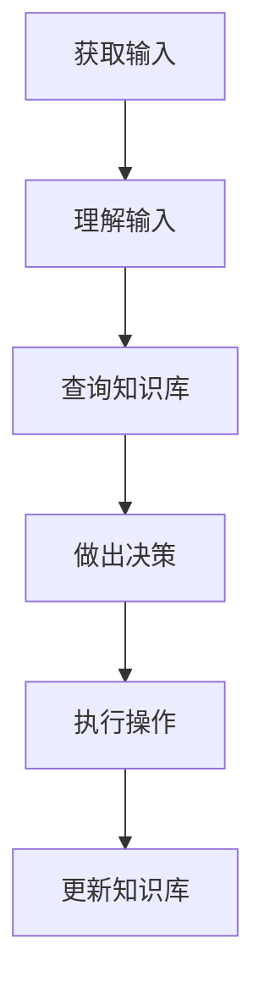

# 【大模型应用开发 动手做AI Agent】Function的说明文字很重要

## 1.背景介绍

### 1.1 人工智能的崛起

近年来,人工智能(AI)技术取得了长足的进步,尤其是在自然语言处理、计算机视觉和决策系统等领域。大型语言模型(LLM)的出现,使得AI系统能够更好地理解和生成自然语言,为构建智能对话系统、问答系统和内容生成系统等应用奠定了基础。

### 1.2 AI Agent的重要性

在AI应用开发中,Agent扮演着关键角色。Agent是一种自主的软件实体,能够感知环境、做出决策并采取行动。AI Agent通常集成了多种AI能力,如自然语言处理、知识库查询、规划和推理等,使其能够完成复杂的任务。

### 1.3 Function API在AI Agent中的作用

Function API为AI Agent提供了与外部系统集成的接口,使其能够利用各种功能和服务来增强自身能力。通过Function API,Agent可以访问知识库、调用Web服务、与数据库交互等,极大扩展了其功能范围。因此,Function的说明文字对于开发高质量的AI Agent至关重要。

## 2.核心概念与联系

### 2.1 AI Agent

AI Agent是一种自主的软件实体,能够感知环境、做出决策并采取行动。它通常由以下几个核心组件组成:

- **感知器(Sensor)**: 用于从环境中获取信息
- **执行器(Actuator)**: 用于对环境进行操作
- **决策引擎**: 根据感知信息和知识库做出决策
- **知识库**: 存储Agent所掌握的知识和规则

### 2.2 Function API

Function API为AI Agent提供了与外部系统集成的接口,使其能够利用各种功能和服务来增强自身能力。常见的Function API包括:

- **知识库查询API**: 允许Agent查询知识库中的信息
- **Web服务API**: 允许Agent调用各种Web服务,如天气API、地图API等
- **数据库API**: 允许Agent与数据库进行交互,如查询、插入和更新数据
- **第三方API**: 允许Agent调用各种第三方提供的API服务

### 2.3 Function说明文字

Function说明文字是描述Function API的文档,通常包含以下内容:

- **功能描述**: 简要说明Function的作用和用途
- **输入参数**: 列出Function所需的输入参数及其含义
- **输出结果**: 描述Function的输出结果格式和含义
- **使用示例**: 提供Function的使用示例代码
- **错误处理**: 说明可能出现的错误及其处理方式
- **限制和注意事项**: 列出Function的限制条件和需要注意的事项

高质量的Function说明文字对于AI Agent开发者来说至关重要,它能够帮助开发者正确理解和使用Function API,从而构建出功能强大、稳定可靠的AI Agent。

## 3.核心算法原理具体操作步骤

### 3.1 AI Agent的工作流程

AI Agent的工作流程通常包括以下几个步骤:

1. **获取输入**: Agent通过感知器从环境中获取输入信息,如用户查询、传感器数据等。
2. **理解输入**: Agent使用自然语言处理技术来理解输入的含义和意图。
3. **查询知识库**: Agent在知识库中查找与输入相关的信息和规则。
4. **做出决策**: Agent的决策引擎根据输入、知识库信息和规则做出决策。
5. **执行操作**: Agent通过执行器采取相应的操作,如回复用户、调用API等。
6. **更新知识库**: 根据操作结果,Agent可能需要更新知识库。



### 3.2 Function API的集成

为了利用Function API增强Agent的能力,需要在上述工作流程中集成Function API的调用。以下是一个典型的集成步骤:

1. **识别需求**: 确定Agent需要什么样的外部功能,如知识库查询、Web服务调用等。
2. **选择Function API**: 根据需求选择合适的Function API。
3. **理解API文档**: 仔细阅读Function API的说明文字,了解其输入参数、输出结果和使用方式。
4. **集成API调用**: 在Agent的代码中集成Function API的调用,通常在"做出决策"和"执行操作"步骤中进行。
5. **错误处理**: 根据API文档中的错误处理说明,在代码中添加相应的错误处理逻辑。
6. **测试和调试**: 彻底测试API的集成,并根据测试结果进行调试和优化。

## 4.数学模型和公式详细讲解举例说明

在AI Agent的开发中,数学模型和公式扮演着重要角色,尤其是在自然语言处理、知识表示和决策算法等领域。以下是一些常见的数学模型和公式,以及它们在AI Agent中的应用。

### 4.1 自然语言处理

#### 4.1.1 N-gram语言模型

N-gram语言模型是自然语言处理中一种常用的统计模型,用于计算一个词序列的概率。它的基本思想是,一个词的出现概率与它前面的 N-1 个词有关。

对于一个长度为 m 的词序列 $W = w_1, w_2, \ldots, w_m$,它的概率可以表示为:

$$P(W) = \prod_{i=1}^{m}P(w_i|w_{i-N+1}^{i-1})$$

其中,$ P(w_i|w_{i-N+1}^{i-1}) $是在给定前 N-1 个词的情况下,第 i 个词 $w_i$ 出现的条件概率。

N-gram语言模型在AI Agent中可用于语言理解、语言生成和机器翻译等任务。

#### 4.1.2 词嵌入(Word Embedding)

词嵌入是一种将词映射到连续向量空间的技术,使得语义相似的词在向量空间中彼此靠近。它是深度学习在自然语言处理中的一个重要应用。

设有一个词汇表 $V$,每个词 $w \in V$ 被映射到一个 $d$ 维向量 $\vec{w} \in \mathbb{R}^d$,这个向量就是词 $w$ 的词嵌入。常用的词嵌入模型包括Word2Vec、GloVe等。

词嵌入在AI Agent中可用于表示输入文本的语义,从而帮助Agent更好地理解自然语言输入。

### 4.2 知识表示

#### 4.2.1 知识图谱

知识图谱是一种结构化的知识表示形式,它将实体、概念及其关系用图的形式表示出来。在知识图谱中,节点表示实体或概念,边表示它们之间的关系。

形式上,一个知识图谱可以表示为一个有向图 $G = (V, E)$,其中 $V$ 是节点集合(实体或概念), $E \subseteq V \times R \times V$ 是边集合(关系三元组),$R$ 是关系类型集合。

知识图谱在AI Agent中可用于存储和查询结构化知识,为Agent的决策提供支持。

### 4.3 决策算法

#### 4.3.1 马尔可夫决策过程(MDP)

马尔可夫决策过程是一种描述序列决策问题的数学框架,在强化学习和决策理论中有广泛应用。

一个MDP可以形式化描述为一个五元组 $(S, A, P, R, \gamma)$,其中:

- $S$ 是状态集合
- $A$ 是动作集合
- $P(s'|s,a)$ 是状态转移概率,表示在状态 $s$ 下执行动作 $a$ 后,转移到状态 $s'$ 的概率
- $R(s,a,s')$ 是回报函数,表示在状态 $s$ 下执行动作 $a$ 后,转移到状态 $s'$ 所获得的回报
- $\gamma \in [0,1)$ 是折现因子,用于权衡即时回报和长期回报

MDP在AI Agent中可用于建模序列决策问题,并通过强化学习等技术求解最优决策策略。

#### 4.3.2 多臂老虎机问题

多臂老虎机问题是一种经典的探索与利用权衡问题,在线上学习和决策领域有广泛应用。

假设有 $K$ 个老虎机臂,每次拉动某个臂 $k$ 都会获得一个回报 $r_k$,这些回报服从某种未知分布。目标是通过不断拉动臂并观察回报,找到一种策略来最大化总回报。

设 $\mu_k$ 为第 $k$ 个臂的期望回报,我们希望找到一个策略 $\pi$,使得 $\pi$ 的期望回报 $\mathbb{E}[\sum_{t=1}^{T}r_{\pi(t)}]$ 最大化,其中 $\pi(t)$ 表示在时间 $t$ 选择的臂。

多臂老虎机问题在AI Agent中可用于建模探索与利用的权衡,如在推荐系统、广告投放等场景下,需要在利用已知的最优选择和探索新的可能性之间做出权衡。

上述数学模型和公式只是AI Agent开发中的一小部分,在实际应用中还有许多其他模型和算法,如贝叶斯网络、马尔可夫链、支持向量机等。AI Agent开发者需要根据具体任务和需求,选择合适的数学模型和算法。

## 5.项目实践:代码实例和详细解释说明

为了更好地理解AI Agent的开发,我们将通过一个简单的示例项目来实践Function API的集成。在这个示例中,我们将构建一个基于命令行的天气查询Agent,它可以根据用户输入的城市名称,查询并返回该城市的天气信息。

### 5.1 项目概述

我们的天气查询Agent将使用以下技术和工具:

- **编程语言**: Python
- **自然语言处理**: NLTK库
- **Function API**: OpenWeatherMap API (用于获取天气数据)

Agent的工作流程如下:

1. 获取用户输入(城市名称)
2. 使用NLTK进行自然语言处理,提取出城市名称
3. 调用OpenWeatherMap API获取该城市的天气数据
4. 将天气数据格式化并输出给用户

### 5.2 OpenWeatherMap API说明

OpenWeatherMap API是一个免费的天气数据API,它提供了全球各地的实时天气数据、天气预报等服务。我们将使用它的"当前天气数据"接口来获取指定城市的天气信息。

#### 5.2.1 功能描述

当前天气数据接口可以根据城市名称、地理坐标或城市ID来获取该地点的当前天气数据,包括温度、湿度、风速等信息。

#### 5.2.2 输入参数

- `q`: 城市名称
- `appid`: API密钥(需要先在OpenWeatherMap网站上注册获取)
- `units`: 单位制(可选,默认为标准单位)

#### 5.2.3 输出结果

API将返回一个JSON格式的响应,包含请求城市的当前天气数据。主要字段包括:

- `name`: 城市名称
- `weather`: 天气状况描述
- `main`: 温度、气压等主要数据
- `wind`: 风速和风向数据

#### 5.2.4 使用示例

```python
import requests

# 替换为你的API密钥
api_key = "YOUR_API_KEY"

# 查询纽约市的天气
city = "New York"
url = f"http://api.openweathermap.org/data/2.5/weather?q={city}&appid={api_key}&units=metric"

response = requests.get(url)
data = response.json()

if data["cod"] == 200:
    print(f"城市: {data['name']}")
    print(f"天气: {data['weather'][0]['description']}")
    print(f"温度: {data['main']['temp']}°C")
    print(f"湿度: {data['main']['humidity']}%")
    print(f"风速: {data['wind']['speed']} m/s")
else:
    print("查询失败")
```

#### 5.2.5 错误处理

OpenWeatherMap API可能返回以下错误代码:

- `404`: 未找到指定的城市
- `401`: 无效的API密钥
- `429`: 请求次数过多,被暂时限制

我们需要在代码中添加相应的错误处理逻辑。

### 5