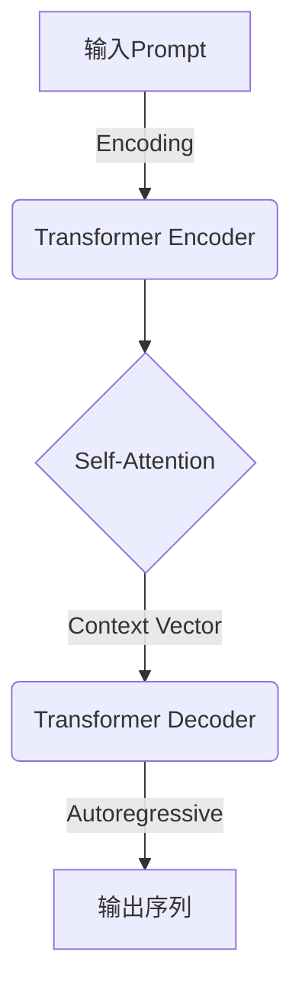
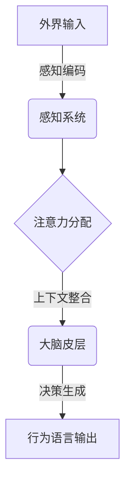
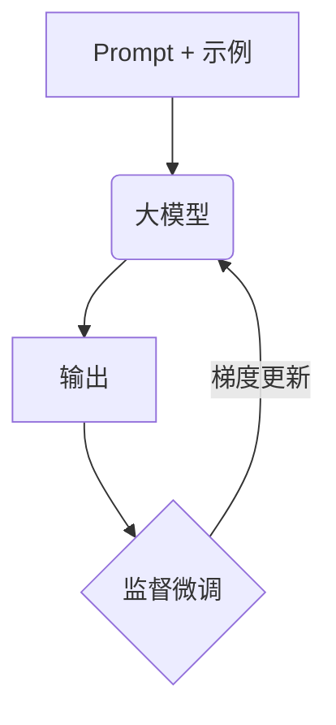
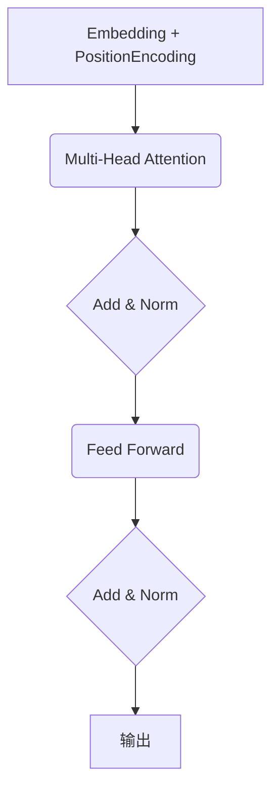

# 【大模型应用开发 动手做AI Agent】人类的大脑了不起

## 1. 背景介绍

### 1.1 人工智能的崛起

人工智能(Artificial Intelligence, AI)已经成为当今科技领域最热门的话题之一。随着计算能力的不断提升和算法的持续创新,AI技术在各个领域都取得了长足的进步,给我们的生活和工作带来了翻天覆地的变化。

### 1.2 大模型的兴起

在AI的发展历程中,大模型(Large Language Model, LLM)的出现可谓是一个里程碑式的突破。这些基于深度学习的语言模型通过消化海量的文本数据,学习到了丰富的语言知识和推理能力,可以生成看似人类写作的自然语言内容。

### 1.3 人类大脑的神奇

尽管AI取得了令人瞩目的成就,但人类大脑仍然是世界上最复杂、最神奇的"计算机"。我们的大脑不仅能够高效地处理语言、图像等多模态信息,还具备出色的推理、创造和情感能力,是AI所难以企及的。

## 2. 核心概念与联系

### 2.1 大模型的工作原理

大模型本质上是一种基于自注意力机制(Self-Attention)的transformer模型。它通过自回归(Autoregressive)的方式,根据输入的前缀(Prompt)生成后续的文本。这种方法使得大模型可以灵活地处理各种任务,如问答、文本生成、代码生成等。



### 2.2 人类大脑的信息处理

人类大脑的信息处理过程与大模型有某些相似之处。我们的感知系统(视觉、听觉等)就相当于Encoder,将外界信息编码为神经脉冲;而大脑皮层则扮演着Decoder的角色,根据先前的上下文,生成行为和语言等输出。不过,人脑的处理过程更加复杂、分布式,涉及多个脑区的互动。



### 2.3 注意力机制的启发

大模型和人脑在处理信息时,都依赖于注意力机制来聚焦于关键的内容。这种注意力分配的过程,使得有限的计算资源可以高效地关注最相关的信息,从而产生恰当的输出。人工智能研究者正在借鉴这一原理,设计出更加人性化、高效的AI系统。

## 3. 核心算法原理具体操作步骤

### 3.1 Transformer模型

Transformer是大模型的核心算法,它完全基于注意力机制,摒弃了传统的RNN和CNN结构。Transformer的主要组成部分包括:

1. **Embedding层**:将输入的token(单词或子词)映射为向量表示。
2. **Positional Encoding**:引入位置信息,因为Self-Attention无法捕获序列顺序。
3. **Multi-Head Attention**:并行计算多个注意力头,捕获不同的依赖关系。
4. **Feed-Forward层**:对每个位置的表示进行高阶特征提取。
5. **规范化(Normalization)和残差连接(Residual Connection)**:促进梯度传播和模型收敛。

以下是Transformer Encoder的具体计算过程:

$$
\begin{align*}
    &\text{Embedding输出:} &&\boldsymbol{x}_1, \boldsymbol{x}_2, \dots, \boldsymbol{x}_n \\
    &\text{位置编码:} &&\boldsymbol{x}_i' = \boldsymbol{x}_i + \text{PositionalEncoding}(i) \\
    &\text{Self-Attention:} &&\boldsymbol{z}_i = \text{Attention}(\boldsymbol{x}_i', \boldsymbol{x}_1', \dots, \boldsymbol{x}_n') \\
    &\text{Multi-Head:} &&\text{MultiHead}(\boldsymbol{X}') = \text{Concat}(\text{head}_1, \dots, \text{head}_h)\boldsymbol{W}^O\\
    &\text{Add && Norm:} &&\boldsymbol{y}_i = \text{LayerNorm}(\boldsymbol{z}_i + \boldsymbol{x}_i') \\
    &\text{Feed Forward:} &&\boldsymbol{y}_i' = \text{LayerNorm}(\text{FFN}(\boldsymbol{y}_i) + \boldsymbol{y}_i)
\end{align*}
$$

其中，$\text{Attention}(\boldsymbol{q}, \boldsymbol{K}, \boldsymbol{V}) = \text{softmax}(\frac{\boldsymbol{q}\boldsymbol{K}^\top}{\sqrt{d_k}})\boldsymbol{V}$计算注意力权重。

### 3.2 自回归语言模型(Autoregressive LM)

大模型通过掌握自回归语言模型,可以根据给定的前缀(Prompt)生成连贯的后续文本。具体来说,它学习到了条件概率分布:

$$
P(x_t | x_1, \dots, x_{t-1})
$$

也就是给定之前的token序列,预测当前token的概率。在生成过程中,模型会遍历所有可能的token,选择概率最大的一个作为输出,并将其加入到前缀中,重复该过程直至生成完整的序列。

### 3.3 Few-Shot学习

大模型通过Few-Shot学习,可以在有限的示例数据上,快速习得新的任务。这种元学习(Meta-Learning)能力源自模型在预训练阶段学习到了通用的语义知识,只需根据任务的Prompt进行少量调整,就可以泛化到新的领域。



Few-Shot学习极大地提高了大模型的灵活性和泛化能力,使其可以应用于广泛的下游任务,如问答、代码生成、文本摘要等。

## 4. 数学模型和公式详细讲解举例说明

### 4.1 注意力机制(Attention Mechanism)

注意力机制是大模型的核心所在,它赋予了模型"关注重点"的能力。在传统的Seq2Seq模型中,Decoder需要整体编码Encoder的输出,这在长序列时会导致性能下降。而Self-Attention则允许模型只关注输入序列中与当前位置相关的部分,大大提高了效率。

注意力分数$\alpha_{i,j}$衡量了输入序列的第j个位置对输出序列的第i个位置的重要程度,计算方式为:

$$
\alpha_{i,j} = \frac{\exp(e_{i,j})}{\sum_k \exp(e_{i,k})}
$$

其中,

$$
e_{i,j} = \frac{(\boldsymbol{q}_i \cdot \boldsymbol{k}_j)}{\sqrt{d_k}}
$$

$\boldsymbol{q}_i$和$\boldsymbol{k}_j$分别是查询向量(Query)和键向量(Key)的表示。$\sqrt{d_k}$是缩放因子,防止点积过大导致梯度饱和。最终的输出向量$\boldsymbol{o}_i$是所有位置的加权和:

$$
\boldsymbol{o}_i = \sum_j \alpha_{i,j} \boldsymbol{v}_j
$$

其中$\boldsymbol{v}_j$是值向量(Value)的表示。通过这种机制,模型可以自适应地分配不同位置的权重,聚焦于最相关的信息。

### 4.2 Transformer架构

Transformer是第一个完全基于Self-Attention的序列模型,它的架构设计巧妙而简洁。以Encoder为例,它由多个相同的层组成,每一层包含两个子层:Multi-Head Attention层和前馈全连接层。



- **Multi-Head Attention层**:将输入序列进行多头注意力变换,捕获不同的依赖关系。
- **前馈全连接层**:对每个位置的表示进行高阶特征提取,增强表达能力。
- **Add & Norm**:残差连接和层归一化,促进梯度传播和模型收敛。

Decoder的结构与Encoder类似,但增加了Masked Self-Attention,确保每个位置只能看到之前的位置,以实现自回归生成。

通过这种结构设计,Transformer可以高效地建模长距离依赖,同时并行计算,大大提高了训练和推理的速度。

## 5. 项目实践:代码实例和详细解释说明

为了帮助读者更好地理解大模型的工作原理,我们将通过一个实践项目,从零开始用PyTorch构建一个简化版的Transformer模型。完整的代码可以在GitHub上获取: [https://github.com/zen-and-the-art-of-computer-programming/transformer-from-scratch](https://github.com/zen-and-the-art-of-computer-programming/transformer-from-scratch)

### 5.1 数据预处理

```python
import torch
from torchtext.data.utils import get_tokenizer
from torchtext.vocab import build_vocab_from_iterator

# 加载语料
train_iter = datasets.WikiText2(split='train')

# 构建词表
tokenizer = get_tokenizer('basic_english')
vocab = build_vocab_from_iterator(map(tokenizer, train_iter), specials=['<unk>'])
vocab.set_default_index(vocab['<unk>'])

# 数据迭代器
train_iter = data.BPTTIterator(train_iter, batch_size=20, bptt_len=35, vocab=vocab)
```

我们使用了WikiText-2数据集,它包含了维基百科的文章语料。首先,我们使用torchtext库构建词表(Vocabulary),并定义数据迭代器,每次返回一个小批量的序列数据。

### 5.2 模型架构

```python
import math
import torch.nn as nn

class TransformerEncoder(nn.Module):
    def __init__(self, vocab_size, d_model, n_heads, dim_feedforward, dropout):
        super().__init__()
        self.embed = nn.Embedding(vocab_size, d_model)
        self.pos_encoder = PositionalEncoding(d_model, dropout)
        encoder_layer = nn.TransformerEncoderLayer(d_model, n_heads, dim_feedforward, dropout)
        self.encoder = nn.TransformerEncoder(encoder_layer, num_layers=6)

    def forward(self, src):
        embed = self.embed(src)
        encoded = self.pos_encoder(embed)
        encoded = self.encoder(encoded)
        return encoded

class PositionalEncoding(nn.Module):
    def __init__(self, d_model, dropout=0.1, max_len=5000):
        super().__init__()
        self.dropout = nn.Dropout(p=dropout)
        pe = torch.zeros(max_len, d_model)
        position = torch.arange(0, max_len, dtype=torch.float).unsqueeze(1)
        div_term = torch.exp(torch.arange(0, d_model, 2).float() * (-math.log(10000.0) / d_model))
        pe[:, 0::2] = torch.sin(position * div_term)
        pe[:, 1::2] = torch.cos(position * div_term)
        pe = pe.unsqueeze(0)
        self.register_buffer('pe', pe)

    def forward(self, x):
        x = x + self.pe[:, :x.size(1)]
        return self.dropout(x)
```

这是Transformer Encoder的PyTorch实现。我们首先使用Embedding层将输入token映射为向量表示,然后添加位置编码(PositionalEncoding)。接下来,通过nn.TransformerEncoder模块(包含6层Encoder层)对序列进行编码。每一层由Multi-Head Attention和前馈全连接网络组成。

### 5.3 训练过程

```python
import torch.optim as optim
from torch.nn import CrossEntropyLoss

criterion = CrossEntropyLoss()
model = TransformerEncoder(vocab_size, d_model=512, n_heads=8, dim_feedforward=2048, dropout=0.1)
optimizer = optim.Adam(model.parameters(), lr=0.001)

for epoch in range(num_epochs):
    for batch in train_iter:
        optimizer.zero_grad()
        output = model(batch.text)
        loss = criterion(output.view(-1, vocab_size), batch.target.view(-1))
        loss.backward()
        optimizer.step()
```

我们使用交叉熵损失函数和Adam优化器对模型进行训练。在每个epoch中,我们遍历数据集,将输入序列输入模型获