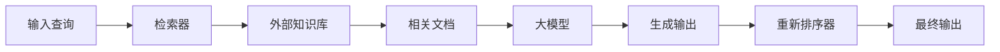

# 【大模型应用开发 动手做AI Agent】从用户角度看RAG流程

## 1. 背景介绍

### 1.1. 大模型时代的到来

近年来,大型语言模型(Large Language Models, LLMs)在自然语言处理领域取得了令人瞩目的进展。这些模型通过在海量文本数据上进行预训练,能够学习到丰富的语言知识和上下文信息,从而在各种自然语言任务中表现出色。

随着计算能力的不断提升和数据量的快速增长,训练大规模语言模型成为可能。GPT-3、PaLM、ChatGPT等大模型的出现,标志着人工智能进入了一个新的里程碑。这些模型不仅在生成任务中表现出色,而且能够在阅读理解、问答等任务中发挥强大的能力。

### 1.2. 大模型的局限性

尽管大模型取得了令人鼓舞的成绩,但它们也面临着一些挑战和局限性。首先,大模型通常缺乏对特定领域知识的理解,容易产生事实错误或者逻辑错误。其次,大模型的推理能力有限,难以进行复杂的推理和分析。此外,大模型的可解释性较差,内部工作机制往往是一个黑箱。

为了解决这些问题,研究人员提出了一种新的范式:将大模型与外部知识库相结合,形成一种混合系统。这种系统能够利用大模型的强大生成能力,同时从外部知识库中获取准确的事实知识,从而提高模型的推理能力和可解释性。

## 2. 核心概念与联系

### 2.1. RAG (Retrieval-Augmented Generation) 架构

RAG (Retrieval-Augmented Generation)架构是一种将大模型与外部知识库相结合的混合系统。它由三个主要组件构成:

1. **检索器(Retriever)**: 从外部知识库中检索与输入查询相关的文档或段落。
2. **大模型(Large Language Model)**: 一个经过预训练的大型语言模型,用于生成输出。
3. **重新排序器(Re-ranker)**: 根据输入查询和生成的输出,对检索到的文档进行重新排序和评分。

RAG架构的工作流程如下:



在这个过程中,检索器从知识库中检索与查询相关的文档,大模型基于这些文档生成初步输出,重新排序器根据查询和输出对文档进行重新排序和评分,最终得到最终输出。

### 2.2. RAG架构的优势

与纯粹依赖大模型的方法相比,RAG架构具有以下优势:

1. **提高了输出的准确性和可靠性**,因为它能够从外部知识库中获取准确的事实知识。
2. **增强了推理能力**,因为大模型能够基于检索到的相关文档进行推理和分析。
3. **提高了可解释性**,因为输出与相关文档之间存在明确的联系,使得模型的决策过程更加透明。
4. **减轻了大模型的记忆压力**,因为大模型不需要记住所有的事实知识,只需要关注生成和推理。

### 2.3. RAG架构的应用场景

RAG架构可以应用于各种自然语言处理任务,包括但不限于:

- **问答系统**: 利用外部知识库回答各种复杂问题。
- **对话系统**: 根据对话上下文从知识库中检索相关信息,生成更加准确和富有见解的回复。
- **文本生成**: 基于相关文档生成高质量的文本内容,如新闻报道、文案等。
- **文本摘要**: 从大量文档中提取关键信息,生成准确的文本摘要。

## 3. 核心算法原理具体操作步骤

RAG架构的核心算法原理可以分为以下几个步骤:

### 3.1. 查询表示

首先,需要将用户的输入查询转换为一个适合检索和生成的表示形式。常见的方法包括:

1. **词袋(Bag-of-Words)表示**: 将查询表示为一个词频向量。
2. **词嵌入(Word Embeddings)表示**: 将每个单词映射到一个低维密集向量,然后对所有单词向量进行加权求和或者使用更复杂的编码方式。
3. **序列表示**: 使用预训练的语言模型(如BERT)对整个查询序列进行编码,得到一个固定长度的向量表示。

### 3.2. 相关文档检索

接下来,需要从外部知识库中检索与查询相关的文档或段落。常见的检索方法包括:

1. **TF-IDF**: 基于词频-逆文档频率(TF-IDF)计算查询和文档之间的相似度,选择最相关的文档。
2. **BM25**: 一种更加精确的相似度计算方法,考虑了词频、文档长度等因素。
3. **向量相似度**: 使用预训练的语言模型将查询和文档映射到向量空间,计算它们之间的相似度(如余弦相似度)。

检索过程可以分为两个阶段进行:

1. **初步检索(Coarse Retrieval)**: 从整个知识库中快速检索出一批候选文档。
2. **精细检索(Re-ranking)**: 对候选文档进行重新排序和评分,选择最相关的文档。

### 3.3. 条件生成

有了相关文档后,大模型就可以基于这些文档生成初步输出。常见的生成方法包括:

1. **前缀条件生成(Prefix-Conditioned Generation)**: 将查询和相关文档拼接作为前缀,大模型基于这个前缀生成输出。
2. **注意力融合(Attention-Fusion)**: 在大模型的注意力机制中,将查询和相关文档作为额外的注意力输入,与原始输入进行融合。

生成过程中,还需要考虑一些细节,如生成长度控制、去重、解码策略等。

### 3.4. 重新排序和评分

由于初步检索和生成可能存在噪声和错误,因此需要对生成的输出和相关文档进行重新评估和排序。常见的方法包括:

1. **相关性打分(Relevance Scoring)**: 计算输出与查询、相关文档之间的相关性分数,选择分数最高的输出。
2. **语言模型打分(Language Model Scoring)**: 使用语言模型对输出的流畅性和语法正确性进行评分。
3. **人工评分(Human Evaluation)**: 由人工对输出的质量进行评分,作为监督信号优化模型。

重新排序和评分的目标是选择最终的高质量输出,并为模型提供监督信号,不断优化整个系统。

## 4. 数学模型和公式详细讲解举例说明

在RAG架构中,常见的数学模型和公式主要集中在相关性计算和重新排序阶段。下面将详细介绍一些常用的模型和公式。

### 4.1. TF-IDF相似度

TF-IDF (Term Frequency-Inverse Document Frequency)是一种常用的文本相似度计算方法。它将查询 $q$ 和文档 $d$ 表示为词频向量,然后计算它们之间的余弦相似度:

$$\text{sim}(q, d) = \frac{\sum_{t \in q \cap d} \text{tfidf}(t, q) \cdot \text{tfidf}(t, d)}{\sqrt{\sum_{t \in q} \text{tfidf}(t, q)^2} \cdot \sqrt{\sum_{t \in d} \text{tfidf}(t, d)^2}}$$

其中 $\text{tfidf}(t, x)$ 表示词项 $t$ 在文本 $x$ 中的 TF-IDF 值,定义为:

$$\text{tfidf}(t, x) = \text{tf}(t, x) \cdot \log \frac{N}{\text{df}(t)}$$

$\text{tf}(t, x)$ 表示词项 $t$ 在文本 $x$ 中的词频, $N$ 表示总文档数, $\text{df}(t)$ 表示包含词项 $t$ 的文档数。

TF-IDF 相似度能够很好地捕捉查询和文档之间的词级相关性,但是缺乏对语义和上下文的理解。

### 4.2. BM25相似度

BM25 (Best Matching 25)是一种改进的相似度计算方法,它考虑了词频、文档长度等因素,公式如下:

$$\text{sim}_{BM25}(q, d) = \sum_{t \in q} \text{idf}(t) \cdot \frac{\text{tf}(t, d) \cdot (k_1 + 1)}{\text{tf}(t, d) + k_1 \cdot (1 - b + b \cdot \frac{|d|}{avgdl})}$$

其中 $\text{idf}(t) = \log \frac{N - \text{df}(t) + 0.5}{\text{df}(t) + 0.5}$ 是逆文档频率, $k_1$ 和 $b$ 是调节参数, $|d|$ 是文档 $d$ 的长度, $avgdl$ 是平均文档长度。

BM25 相似度通过调节参数,能够更好地平衡词频、文档长度等因素,提高检索的准确性。

### 4.3. 向量相似度

除了基于词袋的相似度计算方法,我们还可以使用预训练的语言模型将查询和文档映射到向量空间,然后计算它们之间的相似度。常用的相似度函数包括:

1. **余弦相似度**:

$$\text{sim}_\text{cos}(q, d) = \frac{q \cdot d}{\|q\| \|d\|}$$

2. **点积相似度**:

$$\text{sim}_\text{dot}(q, d) = q \cdot d$$

3. **欧几里得距离**:

$$\text{dist}_\text{euc}(q, d) = \|q - d\|_2$$

其中 $q$ 和 $d$ 分别表示查询和文档的向量表示。

向量相似度能够捕捉查询和文档之间的语义相关性,但是计算开销较大,需要对整个知识库进行向量编码。

### 4.4. 重新排序评分

在重新排序阶段,我们需要对生成的输出和相关文档进行评分,以选择最终的高质量输出。常用的评分函数包括:

1. **相关性评分**:

$$\text{score}_\text{rel}(o, q, d) = \alpha \cdot \text{sim}(o, q) + \beta \cdot \text{sim}(o, d)$$

其中 $o$ 表示输出, $q$ 表示查询, $d$ 表示相关文档, $\text{sim}$ 可以是上述介绍的任何相似度函数, $\alpha$ 和 $\beta$ 是权重参数。

2. **语言模型评分**:

$$\text{score}_\text{lm}(o) = \frac{1}{|o|} \sum_{t \in o} \log P(t | o_{<t})$$

其中 $P(t | o_{<t})$ 表示语言模型对于下一个词 $t$ 的预测概率,基于之前的上下文 $o_{<t}$。

3. **综合评分**:

$$\text{score}(o, q, d) = \gamma \cdot \text{score}_\text{rel}(o, q, d) + (1 - \gamma) \cdot \text{score}_\text{lm}(o)$$

其中 $\gamma$ 是权重参数,用于平衡相关性评分和语言模型评分。

通过合理设置权重参数,我们可以根据具体任务的需求,选择最优的评分函数。

## 5. 项目实践: 代码实例和详细解释说明

为了更好地理解 RAG 架构的实现细节,我们将使用 HuggingFace 的 Transformers 库,构建一个简单的问答系统。

### 5.1. 环境配置

首先,我们需要安装必要的依赖库:

```bash
pip install transformers datasets
```

### 5.2. 加载数据

我们将使用 HuggingFace Datasets 库中的 `squad` 数据集,它包含了大量的问答对和相关文档。

```python
from datasets import load_dataset

dataset = load_dataset("squad")
```

### 5.3. 检索器实现

我们将使用 TF-IDF 向量空间模型作为检索器。首先,我们需