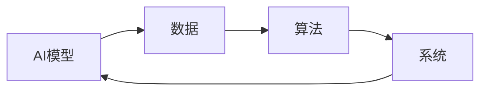
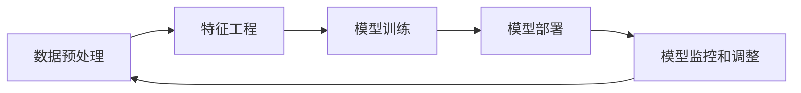

## 1.背景介绍

在当前的技术环境中，人工智能(AI)已经成为了一种无处不在的存在，它正在改变我们的生活方式，工作方式，甚至是我们的思维方式。在这个过程中，AI模型的规模和复杂性也在持续增加。这就引出了一个重要的问题：如何有效地开发和应用这些大型AI模型呢？在本文中，我将介绍一种名为LangChain的方法，这是一种专为大型AI模型设计的开发框架。

## 2.核心概念与联系

LangChain是一个构建AI Agent的开发框架，它的设计目标是实现AI模型的高效开发、部署和管理。LangChain的主要组成部分包括AI模型、数据、算法和系统，这些部分相互协作，共同实现AI Agent的功能。



## 3.核心算法原理具体操作步骤

LangChain的核心是一个由多个步骤组成的算法流程。首先，通过数据预处理和特征工程，将原始数据转化为适合AI模型使用的数据。然后，使用适当的AI模型进行训练，得到模型参数。接着，将训练好的模型部署到生产环境中，进行预测和推理。最后，通过监控和调整，对模型的性能进行持续优化。



## 4.数学模型和公式详细讲解举例说明

在LangChain中，我们使用了多种数学模型和公式来实现AI模型的训练和优化。例如，我们使用梯度下降法来优化模型参数。梯度下降法的基本思想是通过计算函数的梯度，找到函数值下降最快的方向，然后沿着这个方向更新参数。梯度下降法的更新公式为：

$$
\theta = \theta - \alpha \nabla J(\theta)
$$

其中，$\theta$是模型参数，$\alpha$是学习率，$\nabla J(\theta)$是损失函数$J(\theta)$的梯度。

## 5.项目实践：代码实例和详细解释说明

下面是一个使用LangChain进行模型训练的简单示例。在这个示例中，我们首先加载数据，然后定义模型和优化器，接着进行模型训练，最后保存模型。

```python
# 加载数据
data = load_data('data.csv')

# 定义模型和优化器
model = Model()
optimizer = Optimizer()

# 模型训练
for epoch in range(epochs):
    for batch in data:
        loss = model(batch)
        optimizer.zero_grad()
        loss.backward()
        optimizer.step()

# 保存模型
model.save('model.pth')
```

## 6.实际应用场景

LangChain可以应用于各种场景中，包括但不限于自然语言处理、图像识别、推荐系统等。例如，在自然语言处理中，我们可以使用LangChain构建一个文本分类模型，对新闻文章进行分类。在图像识别中，我们可以使用LangChain构建一个图像分类模型，对图片进行分类。在推荐系统中，我们可以使用LangChain构建一个推荐模型，对用户的兴趣进行预测，并根据预测结果生成推荐列表。

## 7.工具和资源推荐

在使用LangChain进行开发时，有一些工具和资源可以帮助我们更有效地进行开发。例如，TensorFlow和PyTorch是两个非常流行的深度学习框架，它们提供了丰富的API，可以帮助我们快速地构建和训练AI模型。此外，Jupyter Notebook是一个非常好用的交互式编程环境，它可以帮助我们更好地理解和调试代码。

## 8.总结：未来发展趋势与挑战

随着AI技术的不断发展，AI模型的规模和复杂性也在持续增加。这就需要我们开发出更有效的方法来应对这种趋势。LangChain是我们为此而设计的一种开发框架，它可以帮助我们更高效地开发和应用大型AI模型。然而，LangChain也面临着一些挑战，例如如何处理大规模数据，如何优化模型性能，如何保证模型的可解释性等。我们将持续研究和改进LangChain，以应对这些挑战。

## 9.附录：常见问题与解答

**Q: LangChain适用于哪些类型的AI模型？**

A: LangChain适用于各种类型的AI模型，包括但不限于深度学习模型、机器学习模型、强化学习模型等。

**Q: LangChain如何处理大规模数据？**

A: LangChain通过数据分片和并行计算等技术，有效地处理大规模数据。

**Q: LangChain如何优化模型性能？**

A: LangChain通过各种优化算法和技术，例如梯度下降法、正则化、早停等，优化模型性能。

**Q: LangChain如何保证模型的可解释性？**

A: LangChain通过可视化、特征选择等方法，提高模型的可解释性。

作者：禅与计算机程序设计艺术 / Zen and the Art of Computer Programming