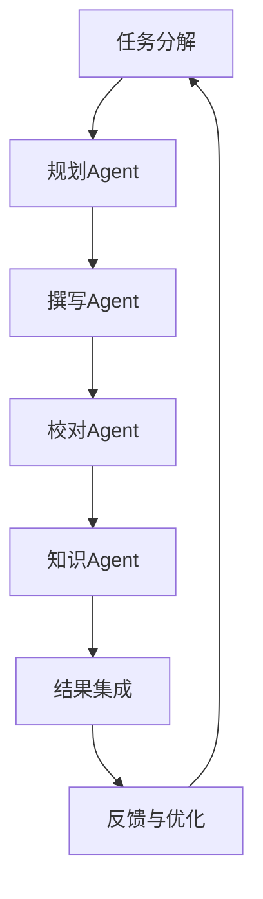
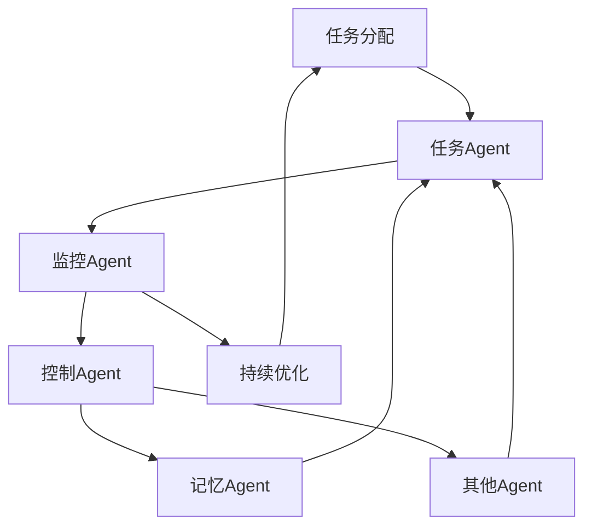

# 【大模型应用开发 动手做AI Agent】多Agent框架——AutoGen和MetaGPT

## 1. 背景介绍

### 1.1 人工智能的发展历程

人工智能(Artificial Intelligence, AI)是当代科技发展的前沿领域,它的目标是创造出能够模拟人类智能行为的智能系统。自20世纪50年代AI概念被正式提出以来,经历了几个重要的发展阶段。

#### 1.1.1 AI的起步阶段

1956年,约翰·麦卡锡在达特茅斯学院主持召开了著名的"人工智能暑期研讨会",正式将"人工智能"一词引入学术界。这标志着AI作为一个独立的研究领域正式开端。

#### 1.1.2 AI的停滞期

20世纪60年代末至70年代,AI进入了一个相对停滞的时期,主要原因是当时的计算机硬件性能有限,无法支持复杂的AI算法。此外,AI技术也受到了一些质疑和批评。

#### 1.1.3 AI的复兴与发展

21世纪以来,受益于计算机硬件性能的飞速提升、大数据的积累以及机器学习算法的突破,AI技术开始蓬勃发展。尤其是深度学习的兴起,推动了AI在语音识别、图像识别、自然语言处理等领域取得了突破性进展。

### 1.2 大模型的兴起

随着AI技术的不断发展,训练大规模神经网络模型成为可能。这种庞大的模型被称为"大模型"(Large Model),具有数十亿甚至上万亿参数,能够从海量数据中学习丰富的知识。

大模型的代表有:

- GPT-3(2020年)
- PanGu-Alpha(2021年)
- DALL-E(2021年)
- ChatGPT(2022年)

这些大模型展现出了强大的文本生成、图像生成、问答等能力,引发了人们对AI的浓厚兴趣。但同时,大模型也存在着一些局限性和挑战,例如对话一致性、事实准确性、安全隐私等问题。

### 1.3 多Agent框架的需求

虽然单一的大模型已经展现出了惊人的能力,但它们仍然存在一些缺陷和局限性。为了克服这些缺陷,提高AI系统的性能和可靠性,研究人员提出了将多个专门化的AI模型(Agent)组合起来的多Agent框架。

多Agent框架的主要优势包括:

1. **分工协作**:不同的Agent专注于不同的任务,发挥各自的长处。
2. **互相监督**:Agent之间可以互相监督和纠正,提高系统的鲁棒性。
3. **动态调整**:根据任务需求动态调整Agent的组合,提高系统的灵活性。

基于这些优势,多Agent框架被认为是未来AI系统发展的一个重要方向。本文将介绍两种多Agent框架:AutoGen和MetaGPT。

## 2. 核心概念与联系

### 2.1 Agent的概念

在多Agent框架中,Agent是指一个具有特定功能的AI模型或组件。每个Agent都被设计和训练用于处理特定的任务,例如文本生成、图像识别、知识查询等。

Agent可以是基于不同技术实现的,如深度学习模型、知识图谱、规则系统等。它们之间通过明确定义的接口进行交互和协作。

### 2.2 AutoGen框架

AutoGen是一种基于多Agent的自动生成(Automatic Generation)框架,旨在通过多个专门化的Agent协同工作,实现高质量的文本、图像、代码等内容生成。

AutoGen框架的核心思想是将整个生成过程分解为多个子任务,由不同的Agent分工协作完成。例如,在文本生成任务中,可能包括以下Agent:

- **规划Agent(Planner Agent)**: 负责生成内容的大纲和结构。
- **撰写Agent(Writing Agent)**: 根据规划Agent的输出,生成具体的文本内容。
- **校对Agent(Proofreading Agent)**: 检查生成的文本,纠正语法错误和不一致性。
- **知识Agent(Knowledge Agent)**: 提供相关的背景知识和事实信息。

这些Agent通过有序的交互和反馈,最终生成高质量的输出内容。

### 2.3 MetaGPT框架

MetaGPT是另一种多Agent框架,旨在构建一个具有元认知(Meta-Cognition)能力的AI系统。元认知指的是认知过程的自我监控和调节能力,是人类智能的一个重要特征。

MetaGPT框架的核心思想是将不同的Agent组合起来,模拟人类的元认知过程。主要包括以下几个Agent:

- **任务Agent(Task Agent)**: 负责执行具体的任务,如问答、文本生成等。
- **监控Agent(Monitoring Agent)**: 监控任务Agent的执行过程,评估其输出的质量和一致性。
- **控制Agent(Control Agent)**: 根据监控Agent的反馈,调整任务Agent的行为,或者切换到其他更合适的Agent。
- **记忆Agent(Memory Agent)**: 维护对话历史和相关知识,为其他Agent提供信息支持。

通过这些Agent之间的交互和反馈,MetaGPT框架旨在实现更加自主、一致和可靠的AI系统。

### 2.4 AutoGen和MetaGPT的关系

AutoGen和MetaGPT框架在本质上是相通的,都是基于将复杂的AI任务分解为多个子任务,由专门化的Agent分工协作来完成。

不同之处在于,AutoGen框架更侧重于通过多Agent协作实现高质量的内容生成,而MetaGPT框架则更注重模拟人类的元认知过程,提高AI系统的自主性和一致性。

在实际应用中,这两种框架可以结合使用,例如在AutoGen框架中引入元认知能力,或者在MetaGPT框架中加入专门的生成Agent,从而构建出更加强大和智能化的AI系统。

## 3. 核心算法原理具体操作步骤

### 3.1 AutoGen框架的工作流程

AutoGen框架的工作流程可以概括为以下几个步骤:

1. **任务分解**: 将整个生成任务分解为多个子任务,如规划、撰写、校对等。
2. **Agent选择**: 根据子任务的性质,选择合适的Agent来执行。
3. **Agent执行**: 各个Agent按照预定的顺序执行对应的子任务。
4. **结果集成**: 将各个Agent的输出结合起来,形成最终的生成结果。
5. **反馈与优化**: 根据生成结果的质量,对各个Agent的模型进行优化和改进。

我们以文本生成任务为例,具体说明AutoGen框架的工作流程:

1. **任务分解**: 将文本生成任务分解为规划、撰写、校对和知识查询四个子任务。
2. **Agent选择**: 选择规划Agent、撰写Agent、校对Agent和知识Agent来执行对应的子任务。
3. **Agent执行**:
    - 规划Agent生成文本的大纲和结构。
    - 撰写Agent根据规划Agent的输出,生成初步的文本内容。
    - 校对Agent检查生成的文本,纠正语法错误和不一致性。
    - 知识Agent提供相关的背景知识和事实信息,支持撰写Agent和校对Agent的工作。
4. **结果集成**: 将各个Agent的输出结合起来,形成最终的文本生成结果。
5. **反馈与优化**: 根据生成结果的质量,对各个Agent的模型进行优化和改进,以提高下一次生成的效果。

### 3.2 MetaGPT框架的工作流程

MetaGPT框架的工作流程可以概括为以下几个步骤:

1. **任务分配**: 将整个任务分配给任务Agent执行。
2. **监控与评估**: 监控Agent持续监控任务Agent的执行过程,评估其输出的质量和一致性。
3. **控制与调整**: 根据监控Agent的反馈,控制Agent决定是否需要调整任务Agent的行为,或者切换到其他更合适的Agent。
4. **知识支持**: 记忆Agent为任务Agent、监控Agent和控制Agent提供相关的对话历史和知识支持。
5. **持续优化**: 根据系统的整体表现,对各个Agent的模型进行优化和改进。

我们以问答任务为例,具体说明MetaGPT框架的工作流程:

1. **任务分配**: 将问答任务分配给任务Agent执行。
2. **监控与评估**:
    - 任务Agent开始回答问题。
    - 监控Agent持续监控任务Agent的回答过程,评估其回答的质量和一致性。
3. **控制与调整**:
    - 如果监控Agent发现任务Agent的回答存在问题,控制Agent会介入调整任务Agent的行为。
    - 如果需要,控制Agent也可以切换到其他更合适的Agent(如知识查询Agent)来处理该问题。
4. **知识支持**:
    - 记忆Agent为任务Agent、监控Agent和控制Agent提供相关的对话历史和知识支持。
5. **持续优化**:
    - 根据系统在该问答任务上的整体表现,对各个Agent的模型进行优化和改进。

通过这种元认知的监控、控制和调整机制,MetaGPT框架旨在提高AI系统的自主性、一致性和可靠性。

## 4. 数学模型和公式详细讲解举例说明

在多Agent框架中,各个Agent通常都是基于机器学习模型实现的。这些模型涉及到一些数学原理和公式,下面我们将详细讲解其中的一些核心内容。

### 4.1 神经网络模型

神经网络是当前机器学习领域最流行和有效的模型之一,也是大多数Agent的基础。一个典型的神经网络模型可以表示为:

$$
y = f(W^Tx + b)
$$

其中:

- $x$是输入向量
- $W$是权重矩阵
- $b$是偏置向量
- $f$是非线性激活函数,如Sigmoid、ReLU等

通过训练过程,神经网络可以学习到合适的权重$W$和偏置$b$,使得对于给定的输入$x$,模型可以输出期望的结果$y$。

### 4.2 注意力机制

注意力机制(Attention Mechanism)是近年来在自然语言处理等领域取得巨大成功的关键技术之一。它允许模型在处理序列数据时,动态地关注输入序列的不同部分,捕捉长距离依赖关系。

注意力机制的核心公式为:

$$
\text{Attention}(Q, K, V) = \text{softmax}(\frac{QK^T}{\sqrt{d_k}})V
$$

其中:

- $Q$是查询向量(Query)
- $K$是键向量(Key)
- $V$是值向量(Value)
- $d_k$是缩放因子,用于防止内积过大导致梯度消失

通过计算查询向量与各个键向量的相似性得分,注意力机制可以自适应地分配不同位置的注意力权重,从而更好地捕捉序列数据的重要信息。

### 4.3 生成式对抗网络

生成式对抗网络(Generative Adversarial Networks, GAN)是一种用于生成式建模的框架,常用于图像生成、文本生成等任务。GAN的基本思想是训练一个生成器(Generator)和一个判别器(Discriminator)相互对抗,最终使生成器能够生成逼真的数据样本。

GAN的目标函数可以表示为:

$$
\min_G \max_D V(D, G) = \mathbb{E}_{x \sim p_{\text{data}}(x)}[\log D(x)] + \mathbb{E}_{z \sim p_z(z)}[\log(1 - D(G(z)))]
$$

其中:

- $G$是生成器,将随机噪声$z$映射为生成的样本$G(z)$
- $D$是判别器,判断输入样本是真实数据$x$还是生成的假样本$G(z)$
- $p