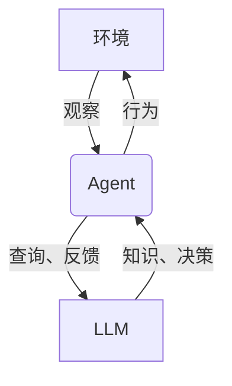
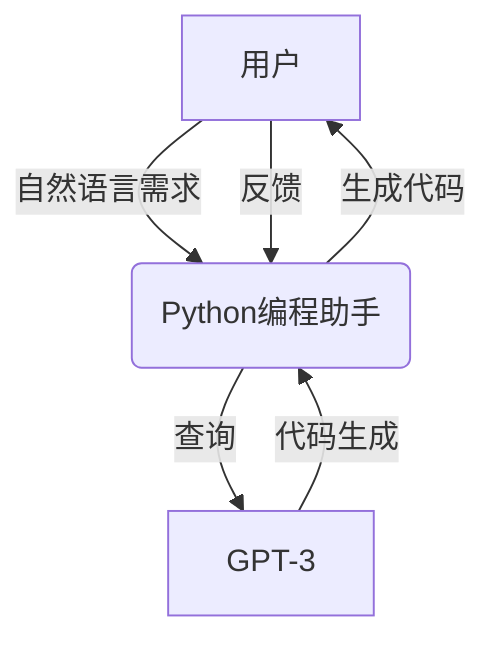

# 【大模型应用开发 动手做AI Agent】完善请求，让Agent完成任务

## 1.背景介绍

### 1.1 人工智能的发展历程

人工智能(Artificial Intelligence, AI)是当代科技发展的前沿领域,自20世纪50年代诞生以来,已经取得了长足的进步。从早期的专家系统、机器学习算法,到近年来的深度学习和大规模预训练语言模型,AI技术不断突破,应用领域也在不断扩展。

### 1.2 大模型的兴起

近年来,benefiting from算力、数据和算法的飞速发展,大规模预训练语言模型(Large Language Models, LLMs)成为AI领域的新热点。这些庞大的神经网络模型通过消化海量文本数据,掌握了丰富的自然语言知识,展现出惊人的生成、理解和推理能力。

代表性的大模型包括OpenAI的GPT-3、Google的LaMDA、DeepMind的Chinchilla、以及最新的对话模型ChatGPT等。它们不仅能以人类水平完成写作、问答、代码生成等任务,更重要的是具备一定的推理和迁移能力,为构建通用人工智能(Artificial General Intelligence, AGI)系统带来了新的契机。

### 1.3 AI Agent的兴起

基于大模型的能力,人们开始尝试将其应用于智能代理(Agent)的构建。AI Agent是一种自主系统,能根据环境状态作出决策和行动,以完成特定任务。传统的Agent多基于规则引擎或有限领域知识,而大模型凭借其广博的知识和推理能力,有望催生新一代通用智能Agent。

这种Agent不仅能执行简单的问答和任务,更能根据上下文需求生成个性化的响应,并通过持续学习和交互不断完善自身。它们在辅助写作、智能客服、个人助理等领域大有可为,被视为迈向AGI的关键一步。

## 2.核心概念与联系  

### 2.1 人工智能Agent

人工智能Agent是一种能够感知环境、做出决策并采取行动以实现目标的自主系统。一个理想的Agent应当具备以下几个核心能力:

1. **感知(Perception)**: 获取环境信息的能力
2. **学习(Learning)**: 根据经验持续改进的能力  
3. **决策(Decision Making)**: 根据状态选择行动的能力
4. **规划(Planning)**: 制定行动序列以达成目标的能力
5. **交互(Interaction)**: 与环境和其他Agent交互的能力

### 2.2 大规模语言模型(LLM)

大规模语言模型是一种基于深度学习的自然语言处理(NLP)模型,通过消化大量文本数据而获得广博的知识。这些模型具有以下几个关键特征:

1. **大规模参数**: 通常包含数十亿甚至上万亿个参数
2. **通用知识**: 掌握了涵盖多个领域的自然语言知识  
3. **生成能力**: 能够生成连贯、流畅的自然语言文本
4. **迁移学习**: 可通过少量数据快速适应新任务

基于上述能力,LLM不仅能完成传统的NLP任务,更展现出一定的推理和决策能力,为构建智能Agent奠定了基础。

### 2.3 Agent与LLM的结合

将LLM与Agent相结合,可以产生一种新型的AI系统——大模型驱动的智能Agent。这种Agent可以利用LLM强大的语言理解和生成能力,更好地感知环境、做出决策并与用户进行自然语言交互。

具体而言,LLM可以为Agent提供以下支持:

1. **环境感知**: 通过自然语言输入获取环境状态
2. **知识库**: 利用LLM中蕴含的丰富知识进行推理和决策
3. **行为生成**: 根据上下文生成自然语言或代码等行为输出
4. **持续学习**: 通过与用户的交互不断获取新知识,优化自身

通过这种结合,Agent不仅可以完成复杂的认知任务,更能与人类进行自然、个性化的交互,大大拓展了其应用场景。

## 3.核心算法原理具体操作步骤

构建一个大模型驱动的智能Agent系统,需要将LLM与传统Agent架构相结合。下面将介绍其核心算法原理和具体操作步骤。

### 3.1 Agent-LLM架构

Agent-LLM架构将LLM作为Agent的核心组件,用于处理自然语言输入、知识推理和行为生成等关键环节。整体架构如下所示:

其中:

1. **环境(Environment)**: 指Agent所处的环境,包括用户的自然语言输入、任务要求等。
2. **Agent**: 负责与环境交互,根据LLM的支持做出决策和行为响应。
3. **LLM**: 作为Agent的"大脑",提供知识库支持、自然语言理解和生成等能力。

Agent与LLM之间存在双向交互:

- Agent将环境状态和任务需求传递给LLM,以获取相关知识和决策支持。
- LLM根据输入生成自然语言响应或代码等,Agent将其作为行为输出到环境。

### 3.2 算法流程

构建Agent-LLM系统的核心算法流程如下:

1. **输入处理**:将用户的自然语言输入(文本/语音)转化为结构化数据,传递给LLM进行理解和分析。

2. **知识检索**:在LLM的知识库中检索与输入相关的信息,形成初步的语义表示。

3. **决策与规划**:基于LLM的语义理解和推理能力,Agent制定行为计划以完成任务目标。

4. **行为生成**:将决策结果输入LLM,生成自然语言响应或代码等行为输出。

5. **交互与反馈**:将行为输出到环境,获取反馈(如用户回复),并将反馈输入LLM,用于持续学习和改进。

6. **持续学习**:根据与环境的交互,不断优化LLM的知识和决策模型,提高其任务完成能力。

这个循环将持续进行,直至Agent完成目标任务或终止交互。

### 3.3 关键技术

实现上述算法流程需要多项关键技术的支持:

1. **自然语言处理(NLP)**: 用于理解和生成自然语言,是LLM的核心能力。

2. **知识表示与推理**: 将LLM中的知识形式化,并支持符号推理,为决策提供依据。

3. **决策算法**: 基于知识库和任务目标,生成行为计划,如强化学习、启发式搜索等。

4. **人机交互**: 支持多模态输入输出(文本/语音/视觉),实现自然的人机对话。

5. **持续学习**: 通过与环境的交互不断获取新知识,优化LLM的语义理解和决策能力。

6. **安全与控制**: 确保Agent行为的安全性和可控性,避免产生不当或有害输出。

## 4.数学模型和公式详细讲解举例说明

构建大模型驱动的智能Agent涉及多种数学模型和算法,下面将介绍其中几个核心模型。

### 4.1 自然语言处理模型

自然语言处理是LLM的基础,常用的模型有:

1. **N-gram语言模型**

N-gram模型是统计语言模型的一种,它根据前n-1个词来预测第n个词的概率:

$$P(w_n|w_1,w_2,...,w_{n-1})$$

其中,概率可由最大似然估计获得:

$$P(w_n|w_1^{n-1})=\frac{C(w_1^n)}{C(w_1^{n-1})}$$

这是一种简单但有效的模型,广泛应用于语言生成、机器翻译等任务。

2. **神经网络语言模型**

神经网络语言模型利用神经网络对序列数据建模,常用的有RNN、LSTM等。以LSTM为例,给定过去的词序列$x_1,...,x_t$,它可以计算出生成下一个词$x_{t+1}$的条件概率:

$$P(x_{t+1}|x_1,...,x_t)=\text{LSTM}(x_1,...,x_t)$$

LSTM通过门控机制捕获长期依赖,在捕捉上下文语义方面表现优异。

3. **Transformer语言模型**

Transformer是一种全新的基于注意力机制的序列模型,是目前主流的大模型架构。它通过自注意力层对输入序列进行建模:

$$\text{Attention}(Q,K,V)=\text{softmax}(\frac{QK^T}{\sqrt{d_k}})V$$

其中,Q、K、V分别为Query、Key和Value,通过计算Query与Key的相关性对Value进行加权求和。

Transformer直接捕捉全局依赖关系,避免了RNN的递归计算,在大规模语料上表现出色。

以上模型为LLM提供了自然语言理解和生成的基础能力。在实际系统中,还需要结合知识库、决策算法等模块,才能构建出完整的智能Agent。

### 4.2 决策与规划算法

决策与规划算法是Agent的"大脑",它根据当前状态和目标制定行为序列。常用算法有:

1. **启发式搜索**

启发式搜索是一种基于评估函数(heuristic)的图搜索算法,广泛应用于路径规划、游戏等领域。

对于一个初始状态s和目标状态g,设f(n)为从当前节点n到目标的估计代价,则:

$$f(n)=g(n)+h(n)$$

其中g(n)为实际代价,h(n)为启发函数(heuristic)。通过不断扩展f(n)最小的节点,可以找到最优解。

2. **强化学习**

强化学习是一种基于奖惩的序列决策算法。设$s_t$为t时刻的状态,$a_t$为相应的行为,则状态转移和奖励过程可表示为:

$$s_{t+1}=f(s_t,a_t)$$
$$r_t=R(s_t,a_t)$$

目标是最大化累积奖励$R_t=\sum_{k=0}^{\infty}\gamma^kr_{t+k}$,其中$\gamma$为折现因子。通过与环境交互并不断更新策略模型,可以学习出最优行为序列。

3. **基于LLM的决策**

除了传统算法,LLM本身也可用于决策和规划。通过输入当前状态和目标,LLM会生成一个或多个行为序列作为响应。例如,对于一个Python编程任务,LLM可以直接生成解决方案的代码。

这种基于LLM的决策方式利用了大模型的知识推理能力,但也存在不确定性和不可控风险。因此,实际系统往往需要将LLM与其他决策算法相结合,发挥各自的优势。

通过上述模型和算法,Agent可以根据环境状态和任务目标,生成合理的行为序列,完成预期的任务。

## 4.项目实践:代码实例和详细解释说明  

为了更好地理解大模型驱动的智能Agent系统,下面将通过一个实际项目案例,介绍其核心代码实现和工作原理。

### 4.1 项目概述

我们将构建一个基于GPT-3的Python编程助手,它可以根据用户的自然语言需求生成Python代码,并通过交互式反馈进行优化和完善。

该系统的核心流程如下:

1. 用户输入自然语言描述,描述所需的Python程序功能。
2. 系统利用GPT-3生成初步的Python代码。
3. 用户审阅代码,提供反馈(修改需求、指出错误等)。
4. 系统根据反馈继续优化代码,直至满足需求。
5. 用户确认并获取最终代码。

### 4.2 系统架构

该系统采用了前文介绍的Agent-LLM架构,其中GPT-3扮演了LLM的角色。具体架构如下:

其中:

- **