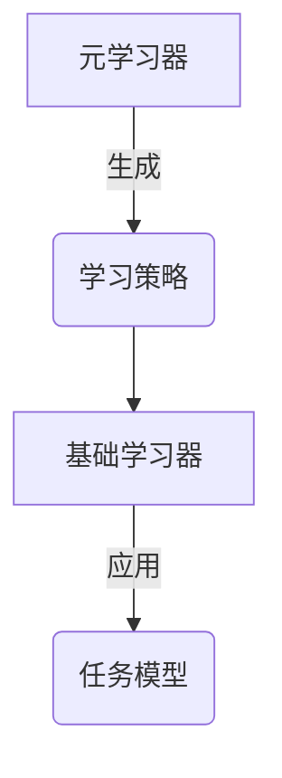
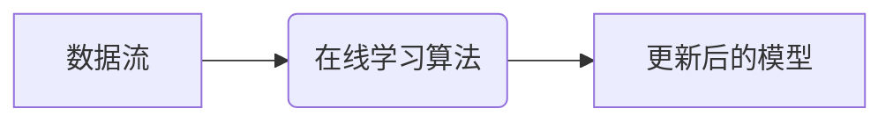
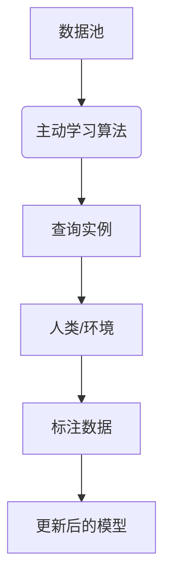
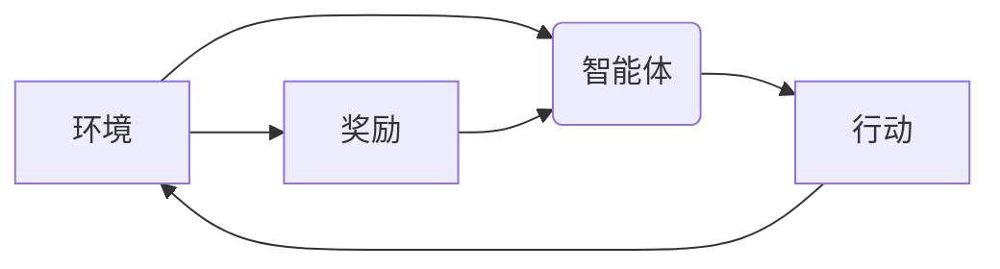
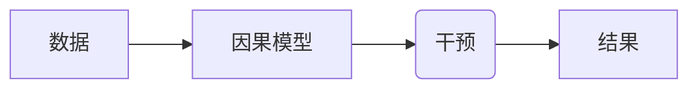
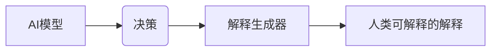
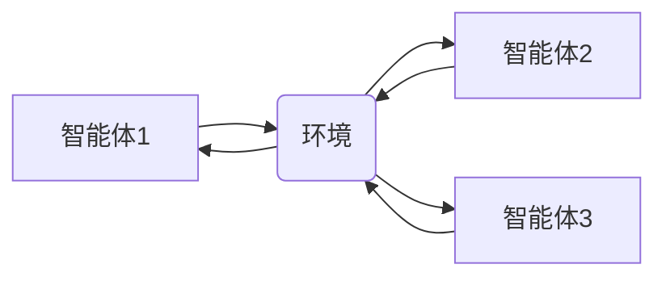

# 【大模型应用开发 动手做AI Agent】自我演进的AI

## 1.背景介绍

### 1.1 人工智能的崛起

人工智能(AI)已经成为当代科技发展的核心驱动力,在各个领域都产生了深远的影响。随着计算能力的不断提升和算法的创新,AI系统的性能和应用范围不断扩大,展现出前所未有的能力。其中,大模型(Large Model)凭借其强大的计算能力和海量训练数据,在自然语言处理、计算机视觉、决策推理等领域取得了突破性进展。

### 1.2 大模型的挑战

然而,大模型也面临着诸多挑战,例如:

- 训练和推理成本高昂
- 数据质量和隐私问题
- 模型可解释性和可控性不足
- 存在偏见和不当行为

### 1.3 自我演进AI的愿景

为了应对这些挑战,自我演进的AI(Self-Evolving AI)应运而生。自我演进AI旨在构建能够持续学习、自我改进和自主决策的智能系统,最终实现与人类合作的通用人工智能(AGI)。这种AI系统不仅能够高效利用现有数据和计算资源,还能主动获取新知识,调整自身模型和行为策略,从而不断提升自身能力。

## 2.核心概念与联系

### 2.1 元学习(Meta-Learning)

$$J(\theta) = \sum_{t=1}^{T} \mathcal{L}(f_\theta(x_t^{tr}), y_t^{tr}) + \lambda \mathcal{R}(\theta)$$

元学习是自我演进AI的核心概念之一。它关注如何从过去的经验中学习,以便更快更好地适应新的任务和环境。通过对各种任务和数据集的元训练,模型能够捕获通用的学习策略,从而在新任务中快速适应。

### 2.2 在线学习(Online Learning)

在线学习允许AI系统在运行时持续吸收新数据,动态更新模型参数。这种增量式学习方式避免了从头重新训练的高昂成本,并使系统能够及时适应环境变化。

### 2.3 主动学习(Active Learning)

主动学习赋予AI系统主动获取有价值数据的能力。系统可以根据当前模型的不确定性,选择性地查询人类或环境以获取新的标注数据,从而以较低的成本提高模型性能。

### 2.4 强化学习(Reinforcement Learning)

强化学习使AI系统能够通过与环境的互动,学习最优策略以实现特定目标。这种以奖励为驱动的学习范式,赋予了系统自主探索和决策的能力。

### 2.5 因果推理(Causal Inference)

因果推理是理解和控制复杂系统的关键。通过建立因果模型,AI系统能够推断出干预措施对结果的影响,从而做出更明智的决策。

### 2.6 解释性AI(Explainable AI)

解释性AI旨在提高AI系统的透明度和可解释性,使其决策过程更加可理解和可信赖。这对于确保AI系统的安全性、公平性和可控性至关重要。

### 2.7 多智能体系统(Multi-Agent Systems)

多智能体系统由多个相互作用的智能体组成,能够协同完成复杂任务。这种分布式架构提高了系统的鲁棒性和可扩展性,并为模拟复杂社会系统提供了有力工具。

## 3.核心算法原理具体操作步骤

### 3.1 元学习算法

#### 3.1.1 模型无关元学习(Model-Agnostic Meta-Learning, MAML)

MAML是一种广泛使用的基于优化的元学习算法。它通过在一系列任务上进行元训练,学习一个好的模型初始化,使得在新任务上只需少量梯度更新即可获得良好的性能。

1. 初始化元学习器参数 $\theta$
2. 对于每个元训练任务 $\mathcal{T}_i$:
    a. 从 $\mathcal{T}_i$ 采样支持集 $\mathcal{D}_i^{tr}$ 和查询集 $\mathcal{D}_i^{val}$
    b. 计算支持集上的梯度 $\nabla_\phi \mathcal{L}_{\mathcal{D}_i^{tr}}(f_\phi)$
    c. 更新模型参数 $\phi_i' = \phi - \alpha \nabla_\phi \mathcal{L}_{\mathcal{D}_i^{tr}}(f_\phi)$
    d. 评估查询集上的损失 $\mathcal{L}_{\mathcal{D}_i^{val}}(f_{\phi_i'})$
3. 更新元学习器参数 $\theta \leftarrow \theta - \beta \nabla_\theta \sum_i \mathcal{L}_{\mathcal{D}_i^{val}}(f_{\phi_i'})$

#### 3.1.2 基于梯度的元学习(Gradient-Based Meta-Learning)

基于梯度的方法直接学习一个可以快速适应新任务的梯度更新规则,避免了重新训练从头开始的低效率。

1. 初始化元学习器参数 $\theta$
2. 对于每个元训练任务 $\mathcal{T}_i$:
    a. 从 $\mathcal{T}_i$ 采样支持集 $\mathcal{D}_i^{tr}$ 和查询集 $\mathcal{D}_i^{val}$
    b. 计算支持集上的梯度 $g_i = \nabla_\phi \mathcal{L}_{\mathcal{D}_i^{tr}}(f_\phi)$
    c. 根据元学习器输出的更新规则 $U_\theta$ 更新模型参数 $\phi_i' = U_\theta(\phi, g_i)$
    d. 评估查询集上的损失 $\mathcal{L}_{\mathcal{D}_i^{val}}(f_{\phi_i'})$
3. 更新元学习器参数 $\theta \leftarrow \theta - \beta \nabla_\theta \sum_i \mathcal{L}_{\mathcal{D}_i^{val}}(f_{\phi_i'})$

### 3.2 在线学习算法

#### 3.2.1 随机梯度下降(Stochastic Gradient Descent, SGD)

SGD是一种常用的在线学习算法,它通过小批量样本的梯度更新来逐步优化模型参数。

1. 初始化模型参数 $\theta$
2. 对于每个小批量数据 $\mathcal{B}_t$:
    a. 计算小批量损失 $\mathcal{L}_{\mathcal{B}_t}(\theta)$
    b. 计算梯度 $g_t = \nabla_\theta \mathcal{L}_{\mathcal{B}_t}(\theta)$
    c. 更新模型参数 $\theta \leftarrow \theta - \eta g_t$

#### 3.2.2 在线元学习(Online Meta-Learning)

在线元学习将元学习和在线学习相结合,旨在学习一种可以快速适应新数据分布的更新策略。

1. 初始化元学习器参数 $\theta$ 和模型参数 $\phi$
2. 对于每个新数据批次 $\mathcal{B}_t$:
    a. 计算批次损失 $\mathcal{L}_{\mathcal{B}_t}(\phi)$
    b. 根据元学习器输出的更新规则 $U_\theta$ 更新模型参数 $\phi' = U_\theta(\phi, \nabla_\phi \mathcal{L}_{\mathcal{B}_t}(\phi))$
    c. 评估更新后模型在验证集上的损失 $\mathcal{L}_{val}(\phi')$
    d. 更新元学习器参数 $\theta \leftarrow \theta - \eta \nabla_\theta \mathcal{L}_{val}(\phi')$

### 3.3 主动学习算法

#### 3.3.1 不确定性采样(Uncertainty Sampling)

不确定性采样是一种简单而有效的主动学习策略,它根据模型对未标注数据的预测不确定性来选择查询实例。

1. 初始化模型参数 $\theta$ 和标注数据集 $\mathcal{D}_L$
2. 训练初始模型 $f_\theta$ 在 $\mathcal{D}_L$ 上
3. 对于每个未标注实例 $x_i \in \mathcal{D}_U$:
    a. 计算模型预测的不确定性分数 $s_i = \text{Uncertainty}(f_\theta(x_i))$
4. 选择具有最高不确定性分数的实例集 $\mathcal{Q} = \{x_i \mid \text{top-k}(s_i)\}$
5. 查询人类/环境以获取 $\mathcal{Q}$ 上的标注
6. 将 $\mathcal{Q}$ 及其标注添加到 $\mathcal{D}_L$,重新训练模型

#### 3.3.2 基于委员会的主动学习(Committee-Based Active Learning)

基于委员会的方法使用多个不同初始化或架构的模型来估计数据实例的不确定性,提高了查询质量。

1. 初始化模型委员会 $\{f_{\theta_1}, f_{\theta_2}, \dots, f_{\theta_M}\}$ 和标注数据集 $\mathcal{D}_L$
2. 在 $\mathcal{D}_L$ 上训练所有委员会模型
3. 对于每个未标注实例 $x_i \in \mathcal{D}_U$:
    a. 计算委员会不确定性分数 $s_i = \text{Disagreement}(f_{\theta_1}(x_i), \dots, f_{\theta_M}(x_i))$
4. 选择具有最高不确定性分数的实例集 $\mathcal{Q} = \{x_i \mid \text{top-k}(s_i)\}$
5. 查询人类/环境以获取 $\mathcal{Q}$ 上的标注
6. 将 $\mathcal{Q}$ 及其标注添加到 $\mathcal{D}_L$,重新训练所有委员会模型

### 3.4 强化学习算法

#### 3.4.1 Q-Learning

Q-Learning是一种常用的基于价值函数的强化学习算法,它通过估计每个状态-动作对的长期回报来学习最优策略。

1. 初始化Q函数 $Q(s, a; \theta)$ 和经验回放池 $\mathcal{D}$
2. 对于每个episode:
    a. 初始化状态 $s_0$
    b. 对于每个时间步 $t$:
        i. 根据 $\epsilon$-贪婪策略选择动作 $a_t = \pi(s_t) = \begin{cases} \arg\max_a Q(s_t, a; \theta) & \text{with prob. } 1-\epsilon \\ \text{random action} & \text{with prob. } \epsilon\end{cases}$
        ii. 执行动作 $a_t$,观测reward $r_t$ 和新状态 $s_{t+1}$
        iii. 存储转移 $(s_t, a_t, r_t, s_{t+1})$ 到 $\mathcal{D}$
        iv. 从 $\mathcal{D}$ 采样小批量转移 $\{(s_j, a_j, r_j, s_j')\}$
        v. 计算目标Q值 $y_j = r_j + \gamma \max_{a'} Q(s_j', a'; \theta^-)$
        vi. 更新Q函数 $\theta \leftarrow \theta - \alpha \nabla_\theta \sum_j (y_j - Q(s_j, a_j; \theta))^2$