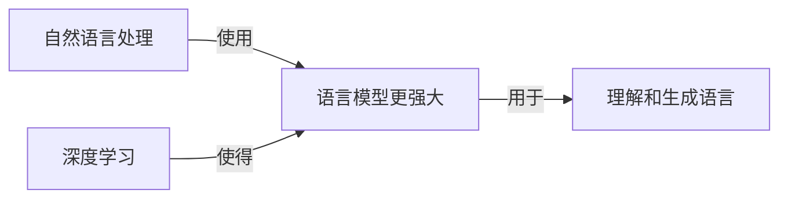

## 1.背景介绍

在我们的日常生活中，语言交互是我们获取信息、表达情感、进行沟通的重要工具。随着人工智能技术的发展，语言交互能力已经不再是人类的专利，机器也可以通过语言与人类进行交互。本文将详细介绍如何开发具有语言交互能力的AI Agent。

## 2.核心概念与联系

在开发具有语言交互能力的AI Agent时，我们需要了解以下几个核心概念：

- **语言模型**：语言模型是一种统计模型，用于根据上下文预测下一个词的概率。在AI Agent中，语言模型用于理解和生成语言。

- **自然语言处理**：自然语言处理（NLP）是一种技术，用于让机器理解和生成人类语言。

- **深度学习**：深度学习是一种机器学习的方法，通过模拟人脑的神经网络结构，使机器能够学习到从数据中抽象出的复杂模式。

这三个概念之间的关系可以用以下的Mermaid流程图表示：



## 3.核心算法原理具体操作步骤

在开发具有语言交互能力的AI Agent时，我们可以按照以下步骤进行：

1. **数据准备**：收集和准备用于训练语言模型的数据。

2. **模型选择**：选择合适的语言模型，如Transformer、GPT等。

3. **模型训练**：使用深度学习的方法训练语言模型。

4. **模型测试**：测试训练好的模型，确保其能够理解和生成语言。

5. **模型部署**：将训练好的模型部署到AI Agent中。

## 4.数学模型和公式详细讲解举例说明

在语言模型中，我们常常使用以下的数学模型和公式：

- **词嵌入**：词嵌入是将词语转化为实数向量的技术。如果我们有一个词汇表V，那么每个词w都可以通过一个嵌入函数e来映射到一个d维的实数向量，即$e(w) \in R^d$。

- **概率模型**：语言模型的目标是预测下一个词的概率。如果我们有一个句子S，它由词$w_1, w_2, ..., w_n$组成，那么我们可以通过以下的公式来计算句子的概率：

$$P(S) = \prod_{i=1}^{n} P(w_i | w_1, ..., w_{i-1})$$

## 5.项目实践：代码实例和详细解释说明

在Python环境下，我们可以使用以下的代码来训练一个语言模型：

```python
from transformers import GPT2LMHeadModel, GPT2Tokenizer

tokenizer = GPT2Tokenizer.from_pretrained('gpt2')
model = GPT2LMHeadModel.from_pretrained('gpt2')

input_ids = tokenizer.encode('Hello, my dog is cute', return_tensors='pt')

outputs = model.generate(input_ids, max_length=100, num_return_sequences=5, no_repeat_ngram_size=2)

for i, output in enumerate(outputs):
    print(f'Generated text {i+1}:')
    print(tokenizer.decode(output, skip_special_tokens=True))
```

## 6.实际应用场景

具有语言交互能力的AI Agent可以广泛应用于各种场景，如：

- **智能助手**：AI Agent可以用于开发智能助手，如Siri、Alexa等。

- **客户服务**：AI Agent可以用于开发客户服务系统，提供24/7的客户支持。

- **内容生成**：AI Agent可以用于生成新闻、文章等内容。

## 7.工具和资源推荐

以下是一些开发具有语言交互能力的AI Agent的工具和资源：

- **Transformers**：一个开源的深度学习模型库，提供了各种预训练的模型，如BERT、GPT等。

- **TensorFlow**：一个开源的深度学习框架，提供了各种工具来训练和部署模型。

- **PyTorch**：一个开源的深度学习框架，提供了各种工具来训练和部署模型。

## 8.总结：未来发展趋势与挑战

随着人工智能技术的发展，我们期待看到更多具有语言交互能力的AI Agent。然而，这也带来了一些挑战，如如何提高模型的理解能力、如何处理模型生成的偏见等。

## 9.附录：常见问题与解答

在开发具有语言交互能力的AI Agent时，你可能会遇到以下的问题：

- **Q: 如何提高模型的理解能力？**
- A: 你可以通过更多的数据、更复杂的模型、更好的训练技术来提高模型的理解能力。

- **Q: 如何处理模型生成的偏见？**
- A: 你可以通过公平性和透明性的技术来处理模型生成的偏见。

作者：禅与计算机程序设计艺术 / Zen and the Art of Computer Programming