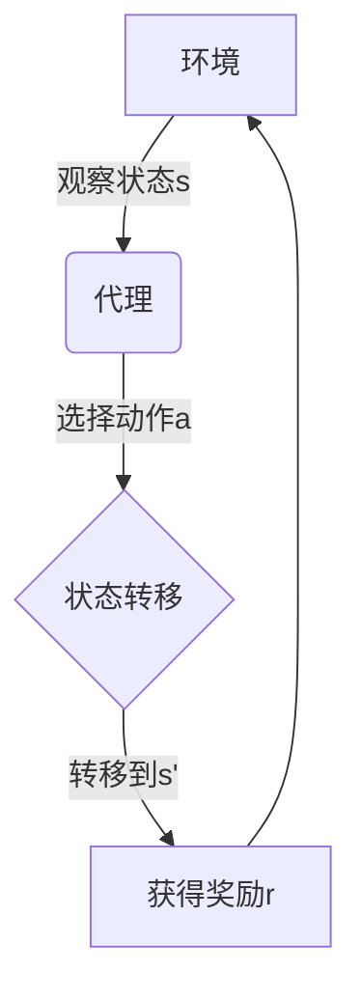

# 一切皆是映射：AI Q-learning博弈论视角解读

## 1. 背景介绍

### 1.1 人工智能的崛起

人工智能(AI)已经成为当今科技领域最炙手可热的话题之一。从语音助手到自动驾驶汽车,AI系统无处不在,正在重塑我们的生活和工作方式。然而,要构建真正智能的系统,需要解决许多复杂的挑战,其中之一就是让机器具备自主学习和决策的能力。

### 1.2 强化学习的重要性

在人工智能的多个分支中,强化学习(Reinforcement Learning)被认为是最有前景和最具挑战性的领域之一。它旨在开发能够通过与环境的互动来学习和优化决策过程的智能体(Agent)。强化学习代理不需要人工标注的数据集,而是通过试错和奖惩机制来学习,这使得它在处理复杂、动态环境中的决策问题时具有巨大的潜力。

### 1.3 Q-learning算法的关键作用

在强化学习的众多算法中,Q-learning算法因其简单性和广泛应用而备受关注。它是一种无模型的时序差分(Temporal Difference)学习算法,能够估计在给定状态下采取某个行动的长期回报。通过不断更新Q值函数,Q-learning算法可以逐步优化代理的行为策略,从而达到最大化累积奖励的目标。

### 1.4 博弈论与Q-learning的交汇

尽管Q-learning算法在单个代理环境中表现出色,但在多智能体系统(Multi-Agent Systems)中,代理之间的相互作用会带来新的挑战。这就需要借助博弈论(Game Theory)的理论和方法来分析和解决这些复杂的交互问题。将Q-learning与博弈论相结合,不仅可以帮助我们更好地理解多智能体系统中的动态过程,还可以设计出更加鲁棒和高效的决策算法。

## 2. 核心概念与联系

### 2.1 马尔可夫决策过程(MDP)

马尔可夫决策过程(Markov Decision Process, MDP)是强化学习的基础模型。它描述了一个完全可观测的环境,其中代理通过执行动作来影响环境的状态转移,并根据转移后的状态获得相应的奖励。MDP可以用一个四元组 $(S, A, P, R)$ 来表示,其中:

- $S$ 是有限的状态集合
- $A$ 是有限的动作集合
- $P(s'|s,a)$ 是状态转移概率,表示在状态 $s$ 下执行动作 $a$ 后转移到状态 $s'$ 的概率
- $R(s,a,s')$ 是奖励函数,表示在状态 $s$ 下执行动作 $a$ 后转移到状态 $s'$ 所获得的即时奖励

在MDP中,代理的目标是找到一个最优策略 $\pi^*$,使得在任何初始状态下,按照该策略执行动作可以最大化预期的累积奖励。

### 2.2 Q-learning算法

Q-learning算法是一种基于时序差分(Temporal Difference)的无模型强化学习算法,它直接估计在给定状态下采取某个行动的长期回报,而不需要知道环境的转移概率和奖励函数。

Q-learning算法维护一个Q值函数 $Q(s,a)$,表示在状态 $s$ 下执行动作 $a$ 后可获得的预期累积奖励。通过不断更新Q值函数,Q-learning算法可以逐步优化代理的行为策略。

Q值函数的更新规则如下:

$$Q(s_t, a_t) \leftarrow Q(s_t, a_t) + \alpha \Big[r_{t+1} + \gamma \max_{a} Q(s_{t+1}, a) - Q(s_t, a_t)\Big]$$

其中:

- $\alpha$ 是学习率,控制新信息对Q值的影响程度
- $\gamma$ 是折现因子,用于权衡即时奖励和未来奖励的重要性
- $r_{t+1}$ 是在执行动作 $a_t$ 后获得的即时奖励
- $\max_{a} Q(s_{t+1}, a)$ 是在下一状态 $s_{t+1}$ 下可获得的最大预期累积奖励

通过不断更新Q值函数,Q-learning算法最终会收敛到最优Q值函数 $Q^*$,从而导出最优策略 $\pi^*$。

### 2.3 博弈论与多智能体系统

在单个代理环境中,Q-learning算法表现出色,但在多智能体系统(Multi-Agent Systems, MAS)中,代理之间的相互作用会带来新的挑战。博弈论为分析和解决这些交互问题提供了理论基础和分析工具。

在博弈论中,每个代理被视为一个理性的决策者(Player),它们通过选择不同的策略来最大化自己的收益。根据代理之间的关系,博弈可以分为几种类型:

- 零和博弈(Zero-Sum Game):一方获利就意味着另一方等量损失,双方利益完全对立。
- 非零和博弈(Non-Zero-Sum Game):代理之间的利益既有一致性,也有冲突。
- 完全信息博弈(Perfect Information Game):每个代理都完全知道游戏的当前状态和过去的所有移动。
- 不完全信息博弈(Imperfect Information Game):代理只能获得有限的信息,无法完全观察到游戏的状态。

通过将Q-learning算法应用于不同类型的博弈,我们可以设计出更加鲁棒和高效的多智能体决策算法。

## 3. 核心算法原理具体操作步骤

### 3.1 Q-learning算法步骤

Q-learning算法的核心步骤如下:

1. 初始化Q值函数 $Q(s,a)$,对于所有的状态-动作对,将Q值初始化为任意值(通常为0)。
2. 对于每个时间步骤 $t$:
    a. 观察当前状态 $s_t$
    b. 根据某种策略(如 $\epsilon$-贪婪策略)选择动作 $a_t$
    c. 执行动作 $a_t$,观察到下一状态 $s_{t+1}$ 和即时奖励 $r_{t+1}$
    d. 更新Q值函数:
    $$Q(s_t, a_t) \leftarrow Q(s_t, a_t) + \alpha \Big[r_{t+1} + \gamma \max_{a} Q(s_{t+1}, a) - Q(s_t, a_t)\Big]$$
3. 重复步骤2,直到Q值函数收敛或达到停止条件。

在实际应用中,我们通常采用一种称为 $\epsilon$-贪婪(epsilon-greedy)的策略来平衡探索(exploration)和利用(exploitation)。具体来说,代理有 $\epsilon$ 的概率随机选择一个动作(探索),有 $(1-\epsilon)$ 的概率选择当前状态下Q值最大的动作(利用)。随着时间的推移,我们会逐渐降低 $\epsilon$ 的值,以确保算法最终收敛到最优策略。

### 3.2 Q-learning在多智能体系统中的应用

在多智能体系统中,每个代理都有自己的Q值函数,并且它们的行为会相互影响。为了应对这种情况,我们可以采用以下几种策略:

1. **独立学习(Independent Learners)**:每个代理都独立地学习自己的Q值函数,将其他代理视为环境的一部分。这种方法简单,但可能无法达到最优解,因为它忽略了代理之间的相互影响。

2. **联合动作学习(Joint Action Learners)**:所有代理共享一个Q值函数,其状态空间包括了所有代理的状态,动作空间包括了所有代理的联合动作。这种方法可以捕捉代理之间的相互作用,但是状态-动作空间会快速增长,导致维数灾难(Curse of Dimensionality)。

3. **博弈论方法**:将多智能体系统建模为一个博弈,并利用博弈论的概念和算法来求解。例如,在零和博弈中,我们可以使用极小极大值(Minimax)算法或其变体来计算最优策略;在非零和博弈中,我们可以使用Nash均衡(Nash Equilibrium)或其他解概念来分析代理的最优行为。

4. **多智能体深度强化学习(Multi-Agent Deep Reinforcement Learning)**:结合深度神经网络和强化学习,直接从环境中学习代理的策略,而无需显式建模。这种方法具有很强的表现力,但需要大量的计算资源和训练数据。

无论采用哪种策略,关键是要正确建模代理之间的相互作用,并设计出合适的算法来求解最优策略。

## 4. 数学模型和公式详细讲解举例说明

### 4.1 马尔可夫决策过程(MDP)

在第2.1节中,我们介绍了马尔可夫决策过程(MDP)的基本概念。现在,我们来详细讨论MDP的数学模型和相关公式。

MDP可以用一个四元组 $(S, A, P, R)$ 来表示,其中:

- $S$ 是有限的状态集合
- $A$ 是有限的动作集合
- $P(s'|s,a)$ 是状态转移概率,表示在状态 $s$ 下执行动作 $a$ 后转移到状态 $s'$ 的概率,满足 $\sum_{s'\in S} P(s'|s,a) = 1, \forall s\in S, a\in A$
- $R(s,a,s')$ 是奖励函数,表示在状态 $s$ 下执行动作 $a$ 后转移到状态 $s'$ 所获得的即时奖励

在MDP中,代理的目标是找到一个策略 $\pi: S \rightarrow A$,使得在任何初始状态下,按照该策略执行动作可以最大化预期的累积奖励。

对于任意策略 $\pi$,我们定义其在状态 $s$ 下的值函数(Value Function)为:

$$V^\pi(s) = \mathbb{E}_\pi\Big[\sum_{t=0}^\infty \gamma^t r_{t+1} \Big| s_0=s\Big]$$

其中 $\gamma \in [0,1)$ 是折现因子,用于权衡即时奖励和未来奖励的重要性。值函数 $V^\pi(s)$ 表示在状态 $s$ 下执行策略 $\pi$ 所能获得的预期累积奖励。

我们还可以定义策略 $\pi$ 在状态 $s$ 下执行动作 $a$ 的Q值函数(Action-Value Function):

$$Q^\pi(s,a) = \mathbb{E}_\pi\Big[\sum_{t=0}^\infty \gamma^t r_{t+1} \Big| s_0=s, a_0=a\Big]$$

Q值函数 $Q^\pi(s,a)$ 表示在状态 $s$ 下执行动作 $a$,然后按照策略 $\pi$ 继续执行所能获得的预期累积奖励。

值函数和Q值函数之间存在以下关系:

$$V^\pi(s) = \sum_{a\in A} \pi(a|s) Q^\pi(s,a)$$

其中 $\pi(a|s)$ 表示在状态 $s$ 下选择动作 $a$ 的概率。

我们的目标是找到一个最优策略 $\pi^*$,使得对于任意状态 $s$,都有 $V^{\pi^*}(s) \geq V^\pi(s)$。这个最优策略对应的值函数 $V^*$ 和Q值函数 $Q^*$ 满足以下方程:

$$V^*(s) = \max_{a\in A} Q^*(s,a)$$
$$Q^*(s,a) = \mathbb{E}_{s'\sim P(\cdot|s,a)}\Big[R(s,a,s') + \gamma \max_{a'\in A} Q^*(s',a')\Big]$$

上式被称为贝尔曼最优方程(Bellman Optimality Equations),它为求解MDP提供了理论基础。

### 4.2 Q-learning算法的数学推导

在第2.2节中,我们介绍了Q-learning算法的基本原理和更新规则。现在,我们来详细推导一下这个更新规则的数学依据。

我们的目标是找到最优Q值函数 $Q^*$,使得对于任意状态-动作对 $(s