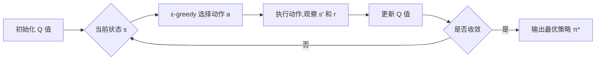

# 一切皆是映射：AI Q-learning博弈论视角解读

## 1.背景介绍
### 1.1 人工智能与强化学习
人工智能(Artificial Intelligence, AI)作为计算机科学的一个分支,其目标是让机器能够执行通常需要人类智能才能完成的任务。近年来,随着计算能力的提升和大数据的积累,人工智能取得了突破性的进展。而强化学习(Reinforcement Learning, RL)作为人工智能的一个重要分支,为智能体的决策和行为提供了理论基础。

### 1.2 Q-learning 与博弈论
Q-learning 是强化学习中一种经典的无模型算法,其核心思想是通过不断尝试和学习,使智能体学会在给定状态下选择最优动作,从而获得最大累积奖励。而博弈论则是研究理性个体在相互作用中的决策问题的数学理论,为分析多个决策者的策略提供了框架。将 Q-learning 与博弈论相结合,可以更好地理解和设计多智能体系统。

### 1.3 万物互联时代的 AI 决策
在万物互联的时代,人工智能系统需要在复杂多变的环境中实时做出最优决策。传统的 AI 方法往往依赖于大量的先验知识和人工设计的特征,难以适应开放环境下的挑战。而 Q-learning 强调从数据中自主学习,并能够动态调整策略,为构建自适应、鲁棒的智能系统提供了新的思路。

## 2.核心概念与联系
### 2.1 状态、动作与奖励
- 状态(State):表示智能体所处的环境状况,通常用特征向量表示。
- 动作(Action):智能体在某一状态下可采取的行为选择。 
- 奖励(Reward):环境对智能体采取特定动作的即时反馈,引导智能体学习最优策略。

状态、动作和奖励是构成强化学习问题的三个基本要素。智能体通过感知状态,执行动作,并根据环境反馈的奖励不断调整策略,最终学习到最优行为序列。

### 2.2 Q 值与价值函数
- Q 值:在某一状态 s 下采取动作 a 的期望累积奖励,记为 Q(s,a)。
- 价值函数:将每个状态映射到一个实数,表示该状态的长期价值,记为 V(s)。

Q-learning 的目标是学习最优 Q 值函数 Q*(s,a),使得在每一个状态下选择 Q 值最大的动作,就能获得最优策略。价值函数与 Q 值函数满足贝尔曼方程:

$$V(s) = \max_a Q(s,a)$$

### 2.3 探索与利用
- 探索(Exploration):尝试未知动作,获取对环境的新知识。
- 利用(Exploitation):基于已有知识,选择当前最优动作。

平衡探索和利用是强化学习的核心问题之一。过度探索会降低学习效率,而过度利用则可能导致局部最优。常用的平衡策略有 ε-greedy 和 Upper Confidence Bound (UCB) 等。

### 2.4 纳什均衡与最优响应
- 纳什均衡(Nash Equilibrium):在博弈中,如果任何一方无法通过单方面改变策略获得更高收益,则称为纳什均衡。
- 最优响应(Best Response):在其他玩家策略给定的情况下,能够最大化自身收益的策略。

在多智能体强化学习中,环境状态与其他智能体的联合行为有关。博弈论为分析智能体的相互作用提供了理论工具,纳什均衡刻画了均衡状态下的策略组合,而最优响应则揭示了博弈过程中的动态调整机制。

## 3.核心算法原理具体操作步骤
### 3.1 Q-learning 算法流程
Q-learning 的核心是通过不断更新 Q 值函数来逼近最优策略。其基本流程如下:

1. 初始化 Q 值表 Q(s,a),对所有状态-动作对,初始值可以随机或置零。
2. 重复以下步骤,直到收敛:
   - 根据当前状态 s,用 ε-greedy 策略选择一个动作 a。
   - 执行动作 a,观察下一状态 s' 和即时奖励 r。 
   - 根据贝尔曼方程更新 Q 值:
     $$Q(s,a) \leftarrow Q(s,a) + \alpha [r + \gamma \max_{a'}Q(s',a') - Q(s,a)]$$
     其中,α 为学习率,γ 为折扣因子。
   - 将当前状态更新为 s'。
3. 输出最优策略 π*:在每个状态 s 下选择具有最大 Q 值的动作。

### 3.2 Q-learning 的理论基础
Q-learning 算法的收敛性可以用以下定理描述:

**定理** 考虑一个有限状态和动作空间的马尔可夫决策过程(MDP),令 Q_t 为 t 时刻的 Q 值估计。如果满足:
1. 状态-动作对 (s,a) 被无限次访问;
2. 学习率满足 $\sum_t \alpha_t(s,a) = \infty$,且 $\sum_t \alpha_t^2(s,a) < \infty$;
3. 奖励函数有界;
则 Q_t 以概率 1 收敛到最优值函数 Q*。

直观上,定理表明只要每个状态-动作对被充分探索,且学习率满足一定条件,Q-learning 就能够学习到最优策略。这为 Q-learning 在实际应用中提供了理论保障。

### 3.3 多智能体 Q-learning
在多智能体系统中,每个智能体不仅要学习自身的最优策略,还需要考虑其他智能体的行为。一种常用的方法是独立 Q-learning:
1. 每个智能体 i 维护自己的 Q 值表 $Q_i(s,a_i)$。
2. 在联合状态 s 下,智能体 i 根据 $\epsilon$-greedy 策略选择动作 $a_i$。
3. 环境反馈联合奖励 $r_i$,智能体 i 观察下一状态 s'。
4. 智能体 i 根据自身的观察更新 $Q_i$ 值:
$$Q_i(s,a_i) \leftarrow Q_i(s,a_i) + \alpha [r_i + \gamma \max_{a_i'}Q_i(s',a_i') - Q_i(s,a_i)]$$
5. 重复步骤 2-4,直到所有智能体的策略收敛。

独立 Q-learning 假设其他智能体的策略固定,忽略了策略的相互影响。而博弈论分析则考虑了智能体间的策略依赖,如纳什 Q-learning 通过寻找 Q 值的纳什均衡来学习均衡策略。

## 4.数学模型和公式详细讲解举例说明
### 4.1 MDP 与 Q-learning
马尔可夫决策过程(Markov Decision Process, MDP)提供了强化学习问题的数学模型。一个 MDP 由以下元素组成:
- 状态空间 $\mathcal{S}$
- 动作空间 $\mathcal{A}$ 
- 状态转移概率 $\mathcal{P}(s'|s,a)$
- 奖励函数 $\mathcal{R}(s,a)$
- 折扣因子 $\gamma \in [0,1]$

MDP 的最优价值函数 V* 和最优 Q 值函数 Q* 满足贝尔曼最优性方程:

$$V^*(s) = \max_a \sum_{s'} \mathcal{P}(s'|s,a) [\mathcal{R}(s,a) + \gamma V^*(s')]$$
$$Q^*(s,a) = \sum_{s'} \mathcal{P}(s'|s,a) [\mathcal{R}(s,a) + \gamma \max_{a'} Q^*(s',a')]$$

Q-learning 通过随机近似的方法来逼近 Q*。考虑一个状态序列 $\{s_0,a_0,r_0,s_1,a_1,r_1,...\}$,Q 值的更新公式为:

$$Q(s_t,a_t) \leftarrow Q(s_t,a_t) + \alpha [r_t + \gamma \max_a Q(s_{t+1},a) - Q(s_t,a_t)]$$

其中 $\alpha$ 为学习率。可以证明,在适当条件下,通过不断迭代更新,Q 值最终会收敛到 Q*。

### 4.2 博弈论与纳什均衡
考虑一个有 N 个玩家的博弈,每个玩家 i 的策略空间为 $\Pi_i$,其中 $\pi_i \in \Pi_i$ 表示玩家 i 的一个策略。令 $\pi = (\pi_1,...,\pi_N)$ 表示联合策略,$\pi_{-i}$ 表示除玩家 i 外其他玩家的策略组合。玩家 i 的收益函数为 $u_i(\pi)$,刻画了在联合策略 $\pi$ 下,玩家 i 的期望收益。

纳什均衡是博弈论的核心概念,其定义为:一个联合策略 $\pi^* = (\pi_1^*,...,\pi_N^*)$ 是纳什均衡,当且仅当对任意玩家 i 和任意策略 $\pi_i \in \Pi_i$,有:

$$u_i(\pi_i^*,\pi_{-i}^*) \geq u_i(\pi_i,\pi_{-i}^*)$$

即在纳什均衡时,任何玩家单方面改变策略都不会获得更高的收益。

在多智能体强化学习中,每个智能体的最优 Q 值依赖于其他智能体的策略。令 $Q_i^*(s,a_1,...,a_N)$ 表示在联合状态-动作 $(s,a_1,...,a_N)$ 下,智能体 i 的最优 Q 值。则多智能体系统的纳什均衡可以表示为:

$$Q_i^*(s,a_1^*,...,a_N^*) \geq Q_i^*(s,a_1^*,...,a_{i-1}^*,a_i,a_{i+1}^*,...,a_N^*), \forall i,\forall a_i$$

即在均衡时,每个智能体的策略都是其他智能体策略下的最优响应。

### 4.3 案例分析:囚徒困境
囚徒困境是博弈论中的经典案例。假设两名囚徒分别面临认罪(C)或不认罪(D)的选择,其收益矩阵如下:

|   | C | D |
|---|---|---|
| C | -1,-1 | -5,0 |
| D | 0,-5 | -3,-3 |

可以看出,(D,D) 是该博弈的纳什均衡,尽管 (C,C) 能带来更高的总收益。现在考虑囚徒困境的重复博弈版本,每一轮博弈结束后以概率 $p$ 继续下一轮。令 $Q_i(a_i,a_j)$ 表示在当前状态下,囚徒 i 选择动作 $a_i$ 而囚徒 j 选择动作 $a_j$ 时的 Q 值。根据 Q-learning 算法,Q 值的更新公式为:

$$Q_i(a_i,a_j) \leftarrow Q_i(a_i,a_j) + \alpha [r_i(a_i,a_j) + \gamma \max_{a_i'} Q_i(a_i',a_j') - Q_i(a_i,a_j)]$$

其中 $r_i(a_i,a_j)$ 为囚徒 i 在联合动作 $(a_i,a_j)$ 下的即时奖励。重复迭代更新,直到 Q 值收敛。可以证明,当折扣因子 $\gamma$ 和继续概率 $p$ 满足一定条件时,重复囚徒困境博弈存在合作均衡,即双方均采取策略 (C,C)。这表明在长期互动中,合作可能成为理性选择。

## 5.项目实践：代码实例和详细解释说明
下面给出一个简单的 Q