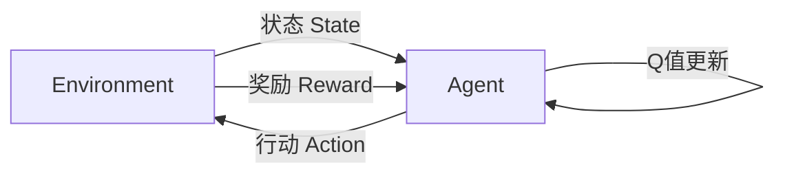

# 一切皆是映射：AI Q-learning在数据中心能源管理的锐利工具

## 1.背景介绍

### 1.1 数据中心的能源挑战

随着云计算、大数据和人工智能的快速发展,数据中心的能耗正在飞速增长。据统计,全球数据中心的能源消耗已经超过了航空业,占全球总能耗的2%左右。与此同时,数据中心的碳排放也成为一个日益严峻的环境问题。因此,提高数据中心的能源效率,实现绿色可持续发展,已经成为当前亟待解决的重大挑战。

### 1.2 传统能源管理方法的局限性

过去,数据中心的能源管理主要依赖于人工经验和预设的策略规则。然而,这种方法存在以下几个关键缺陷:

1. 难以处理数据中心复杂的动态环境和不确定因素
2. 无法充分利用大量的实时监控数据进行优化
3. 人工经验和规则容易过时,难以适应新的工作负载模式

因此,迫切需要一种更加智能化、自适应的能源管理方法,以提高数据中心的能源效率。

### 1.3 AI Q-learning的机遇

近年来,强化学习(Reinforcement Learning)作为人工智能的一个重要分支,展现出了强大的决策优化能力。其中,Q-learning作为一种基于价值迭代的强化学习算法,已经被成功应用于多个领域,如机器人控制、游戏AI等。

Q-learning的核心思想是通过不断的试错学习,从环境反馈的奖励信号中逐步优化决策策略,最终达到最优化目标。这种自适应性和优化能力,恰好契合了数据中心能源管理的需求。因此,将Q-learning引入数据中心能源管理,具有重大的理论和应用价值。

## 2.核心概念与联系

### 2.1 Q-learning的核心概念

Q-learning算法的核心概念包括:

1. **Agent(智能体)**: 观察环境状态并做出行动决策的主体
2. **Environment(环境)**: 智能体所处的外部世界,包括各种状态和智能体行动所产生的影响
3. **State(状态)**: 环境在某个时刻的具体情况,可以是一个状态向量
4. **Action(行动)**: 智能体在当前状态下可以采取的行动选择
5. **Reward(奖励)**: 环境对智能体当前行动的反馈,指导智能体往正确方向优化
6. **Q-value(Q值)**: 在某个状态下采取某个行动的价值评估,算法目标是最大化Q值

Q-learning的核心思想是通过不断探索和利用,从环境反馈的奖励信号中,逐步更新和优化Q值函数,最终得到一个最优的策略函数,指导智能体在任意状态下做出最佳行动。



### 2.2 Q-learning在数据中心能源管理中的应用

将Q-learning应用于数据中心能源管理时,需要建立如下映射关系:

- **Agent**: 数据中心的能源管理系统
- **Environment**: 数据中心的IT设备、负载、温度等动态环境
- **State**: 数据中心当前的负载、温度、能耗等状态向量
- **Action**: 调节冷却设备、调整IT负载分布等能源管理行为
- **Reward**: 能源消耗、服务质量等综合反馈

通过不断探索和利用,Q-learning算法可以自主学习出一个最优的策略函数,指导数据中心在任意工作负载和环境条件下,做出最佳的能源管理决策,从而达到节能和服务质量的最佳平衡。

## 3.核心算法原理具体操作步骤

### 3.1 Q-learning算法原理

Q-learning算法的核心是基于贝尔曼最优方程,通过价值迭代的方式不断更新Q值函数,逐步逼近最优策略。算法的数学模型如下:

$$
Q(s_t, a_t) \leftarrow Q(s_t, a_t) + \alpha \big[r_t + \gamma \max_a Q(s_{t+1}, a) - Q(s_t, a_t)\big]
$$

其中:

- $s_t$: 时刻t的环境状态
- $a_t$: 时刻t智能体采取的行动
- $r_t$: 时刻t获得的即时奖励
- $\alpha$: 学习率,控制Q值更新的步长
- $\gamma$: 折现因子,权衡即时奖励和长期回报

通过不断探索和利用,算法逐步收敛到一个最优的Q值函数$Q^*(s, a)$,指导智能体在任意状态s下采取最优行动$a^* = \arg\max_a Q^*(s, a)$。

### 3.2 算法具体步骤

1. **初始化**
   - 初始化Q值函数,如全部设为0
   - 设置学习率$\alpha$和折现因子$\gamma$
2. **循环**
   - 对每个episode(即一个数据中心工作负载周期):
     - 初始化起始状态$s_0$
     - 对每个时刻t:
       - **探索**:以$\epsilon$-greedy策略选择行动$a_t$
       - **执行**:执行行动$a_t$,获得奖励$r_t$和下一状态$s_{t+1}$
       - **更新**:根据贝尔曼方程更新$Q(s_t, a_t)$
       - $s_t \leftarrow s_{t+1}$
     - 直到episode结束
3. **输出**:得到最终的最优Q值函数$Q^*(s, a)$

其中,$\epsilon$-greedy策略是在探索(exploration)和利用(exploitation)之间权衡的一种方法。具体来说,以$1-\epsilon$的概率选择当前Q值最大的行动(利用),以$\epsilon$的概率随机选择一个行动(探索)。这样可以在探索和利用之间达到动态平衡。

## 4.数学模型和公式详细讲解举例说明

### 4.1 Q-learning的数学模型

Q-learning算法的核心数学模型是基于马尔可夫决策过程(Markov Decision Process, MDP)。MDP可以用一个四元组$(S, A, P, R)$来表示:

- $S$: 有限的状态集合
- $A$: 有限的行动集合
- $P(s' | s, a)$: 状态转移概率,表示在状态s下执行行动a,转移到状态s'的概率
- $R(s, a)$: 奖励函数,表示在状态s下执行行动a所获得的即时奖励

在MDP框架下,Q-learning的目标是找到一个最优的Q值函数$Q^*(s, a)$,使得对于任意状态s,执行$\arg\max_a Q^*(s, a)$可以获得从当前状态开始的最大期望奖励。

根据贝尔曼最优方程,最优Q值函数$Q^*$应该满足:

$$
Q^*(s, a) = \mathbb{E}_{s' \sim P}\big[R(s, a) + \gamma \max_{a'} Q^*(s', a')\big]
$$

其中$\mathbb{E}_{s' \sim P}$表示对所有可能的下一状态s'进行期望计算,加权因子是状态转移概率$P(s' | s, a)$。$\gamma$是折现因子,用于权衡即时奖励和长期回报。

Q-learning算法通过价值迭代的方式,不断逼近最优Q值函数$Q^*$。

### 4.2 Q值更新公式推导

我们来推导一下Q-learning算法中Q值更新公式的具体过程:

$$
\begin{aligned}
Q(s_t, a_t) &\leftarrow Q(s_t, a_t) + \alpha \big[r_t + \gamma \max_a Q(s_{t+1}, a) - Q(s_t, a_t)\big] \\
&= (1 - \alpha)Q(s_t, a_t) + \alpha \big[r_t + \gamma \max_a Q(s_{t+1}, a)\big]
\end{aligned}
$$

我们将右边第二项展开:

$$
\begin{aligned}
r_t + \gamma \max_a Q(s_{t+1}, a) &= r_t + \gamma \mathbb{E}_{s' \sim P}\big[\max_a Q(s', a)\big] \\
&\approx r_t + \gamma \max_a \mathbb{E}_{s' \sim P}\big[Q(s', a)\big] \\
&= r_t + \gamma \max_a \sum_{s'} P(s' | s_t, a_t) Q(s', a) \\
&\approx \mathbb{E}_{s' \sim P}\big[R(s_t, a_t) + \gamma \max_{a'} Q(s', a')\big]
\end{aligned}
$$

最后一步是由贝尔曼最优方程给出的。因此,Q值更新公式本质上是在逐步逼近最优Q值函数$Q^*$。通过不断探索和利用,算法最终会收敛到$Q^*$。

### 4.3 Q-learning在数据中心能源管理中的应用举例

假设我们有一个小型数据中心,包含10台服务器和2台制冷机组。我们将数据中心的状态$s_t$定义为一个三维向量$(u_t, t_t, e_t)$,分别表示:

- $u_t$: 当前的总工作负载(0~100%)
- $t_t$: 当前的总温度($^\circ$C)  
- $e_t$: 当前的总能耗(kWh)

可能的行动$a_t$包括:

- 调节制冷机组的功率输出
- 在服务器之间重新分配工作负载

我们设计奖励函数$R(s_t, a_t)$为一个加权和:

$$
R(s_t, a_t) = w_1 \times \text{服务质量分数} - w_2 \times \text{能耗}
$$

其中,服务质量分数是根据温度和工作负载分布的合理性来评估的。$w_1$和$w_2$是权重系数,用于平衡服务质量和能源消耗。

通过Q-learning算法的不断探索和利用,最终可以得到一个最优的Q值函数$Q^*(s, a)$,指导数据中心在任何工作负载和温度条件下,做出最佳的制冷和负载分布决策,从而实现服务质量和能源消耗的最佳平衡。

## 5.项目实践:代码实例和详细解释说明

为了更好地理解Q-learning算法在数据中心能源管理中的应用,我们提供了一个简单的Python实现示例。

### 5.1 环境模拟

我们首先定义一个简化的数据中心环境模拟器:

```python
import numpy as np

class DatacenterEnv:
    def __init__(self, n_servers, n_acs):
        self.n_servers = n_servers
        self.n_acs = n_acs
        self.reset()

    def reset(self):
        self.load = np.random.randint(10, 91)
        self.temp = np.random.randint(18, 26)
        self.energy = 0
        return self.observe()

    def observe(self):
        return (self.load, self.temp, self.energy)

    def step(self, action):
        # 简化的环境模拟逻辑
        ac_power, load_dist = action
        energy_inc = ac_power * 0.3 + sum(load_dist) * 0.1
        temp_dec = ac_power * 0.5
        self.energy += energy_inc
        self.temp = max(18, self.temp - temp_dec)
        
        # 计算奖励
        load_score = 100 - abs(np.mean(load_dist) - self.load/self.n_servers)
        temp_score = max(0, 100 - (self.temp - 18) * 5)
        reward = 0.6 * load_score + 0.4 * temp_score - 0.3 * energy_inc
        
        done = False
        return self.observe(), reward, done
```

这个环境模拟器定义了数据中心的基本状态(工作负载、温度、能耗)和行动(调节制冷功率、重新分配负载)。通过`step()`函数,我们可以模拟环境的状态转移和获得相应的奖励。

### 5.2 Q-learning算法实现

接下来,我们实现Q-learning算法:

```python
import numpy as np

class QLearning:
    def __init__(self, env, alpha=0.1, gamma=0.9, epsilon=0.1):
        self.env = env
        self.q_table = {}
        self.alpha = alpha
        self.gamma = gamma
        self.epsilon = epsilon

    def get_q_value(self, state, action):
        key = str(state) +