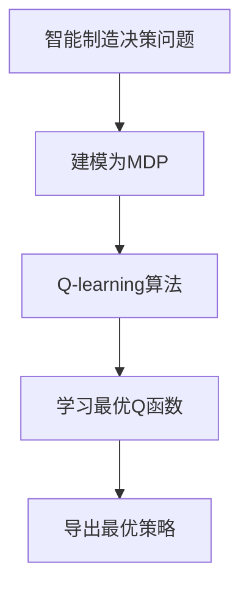

# 一切皆是映射：AI Q-learning在智能制造中的探索

## 1.背景介绍

### 1.1 智能制造的兴起

随着人工智能(AI)和机器学习(ML)技术的不断发展,智能制造正在成为制造业转型升级的关键驱动力。传统的制造过程面临着诸多挑战,如生产效率低下、资源利用率低、产品质量参差不齐等。智能制造通过融合AI、大数据、物联网等先进技术,旨在实现制造过程的智能化、自动化和优化,从而提高生产效率、降低成本、提升产品质量。

### 1.2 强化学习在智能制造中的作用

在智能制造的背景下,强化学习(Reinforcement Learning,RL)作为AI领域的一个重要分支,展现出了巨大的应用潜力。强化学习旨在通过与环境的互动,学习如何根据当前状态选择最优行为,从而最大化预期的长期回报。这种学习方式与智能制造过程中的决策问题高度契合,可以有效解决诸多复杂的优化和控制问题。

### 1.3 Q-learning算法简介

Q-learning是强化学习中最著名和广泛使用的算法之一。它基于价值迭代的思想,通过不断更新状态-行为对的价值函数(Q函数),逐步逼近最优策略。Q-learning具有无模型(model-free)、离线学习和收敛性证明等优点,使其在智能制造领域具有广泛的应用前景。

## 2.核心概念与联系

### 2.1 智能制造中的决策过程

智能制造过程中存在着大量的决策问题,例如:
- 生产计划制定
- 库存管理
- 设备维护策略
- 物流路径优化
- 质量控制

这些决策问题通常涉及复杂的状态空间和行为空间,且需要考虑多种约束条件和优化目标。传统的规则引擎或优化算法往往难以有效解决这些问题。

### 2.2 Q-learning作为强化学习框架

Q-learning作为强化学习的一种范式,为解决智能制造中的决策问题提供了有力的工具。它将决策过程建模为一个马尔可夫决策过程(Markov Decision Process,MDP),其中:

- 状态(State)描述了系统的当前状况
- 行为(Action)代表可执行的操作
- 奖励(Reward)衡量行为执行后的即时收益
- 状态转移概率(State Transition Probability)描述了执行某个行为后,系统转移到新状态的概率
- 折扣因子(Discount Factor)体现了对未来奖励的权衡

Q-learning算法旨在学习一个最优的Q函数,该函数能够为每个状态-行为对估计出最大化的长期累积奖励。通过与环境的互动,Q函数会不断更新,最终收敛到一个最优策略。



### 2.3 Q-learning与其他强化学习算法

除了Q-learning之外,强化学习领域还存在其他一些著名算法,如策略梯度(Policy Gradient)、蒙特卡罗树搜索(Monte Carlo Tree Search)等。相比之下,Q-learning具有以下优势:

- 无需建模环境动态,属于无模型(model-free)算法
- 可直接从环境交互数据中学习,无需手工设计特征
- 理论上保证收敛到最优策略(在满足马尔可夫性和有界性假设下)

然而,Q-learning也面临一些挑战,如维数灾难(Curse of Dimensionality)、探索与利用权衡(Exploration-Exploitation Trade-off)等,需要通过各种技术改进来加以缓解。

## 3.核心算法原理具体操作步骤

### 3.1 Q-learning算法流程

Q-learning算法的基本流程如下:

1. 初始化Q函数,通常将所有状态-行为对的Q值初始化为0或一个较小的常数
2. 对于每个Episode(即一个完整的交互序列):
    a) 初始化起始状态 $s_0$
    b) 对于每个时间步 $t$:
        i) 根据当前Q函数,选择行为 $a_t$ (探索或利用)
        ii) 执行行为 $a_t$,获得即时奖励 $r_t$ 和新状态 $s_{t+1}$
        iii) 更新Q函数:
        $$Q(s_t, a_t) \leftarrow Q(s_t, a_t) + \alpha \left[ r_t + \gamma \max_{a'}Q(s_{t+1}, a') - Q(s_t, a_t) \right]$$
        其中 $\alpha$ 为学习率, $\gamma$ 为折扣因子
    c) 直到Episode终止
3. 重复步骤2,直到Q函数收敛

### 3.2 探索与利用策略

在Q-learning中,探索(Exploration)与利用(Exploitation)是一对矛盾统一体。探索有助于发现潜在的优策略,而利用则可获取当前已知的最大回报。算法需要在二者之间寻求平衡:

- $\epsilon$-贪婪策略($\epsilon$-greedy):以概率 $\epsilon$ 随机选择行为(探索),以概率 $1-\epsilon$ 选择当前最优行为(利用)
- 软更新(Soft Updates):利用Boltzmann分布或其他软化函数,赋予次优行为一定的选择概率

### 3.3 函数逼近

当状态空间和行为空间较大时,直接存储和更新Q表会导致维数灾难。此时可以使用函数逼近器(如神经网络)来拟合Q函数,这种方法被称为深度Q网络(Deep Q-Network,DQN)。DQN的训练过程如下:

1. 初始化Q网络的参数 $\theta$
2. 对于每个时间步 $t$:
    a) 根据当前Q网络,选择行为 $a_t$
    b) 执行行为 $a_t$,获得即时奖励 $r_t$ 和新状态 $s_{t+1}$
    c) 计算目标Q值: $y_t = r_t + \gamma \max_{a'}Q(s_{t+1}, a'; \theta^-)$
    d) 更新Q网络参数:
    $$\theta \leftarrow \theta - \alpha \nabla_\theta \left( Q(s_t, a_t; \theta) - y_t \right)^2$$
    其中 $\theta^-$ 为目标网络参数(用于稳定训练)

DQN通过经验回放(Experience Replay)和目标网络(Target Network)等技术,有效缓解了Q-learning在大规模问题上的不稳定性。

## 4.数学模型和公式详细讲解举例说明

### 4.1 马尔可夫决策过程(MDP)

马尔可夫决策过程是强化学习问题的数学模型,由一个五元组 $(S, A, P, R, \gamma)$ 组成:

- $S$: 有限的状态集合
- $A$: 有限的行为集合
- $P(s' \mid s, a)$: 状态转移概率,表示在状态 $s$ 执行行为 $a$ 后,转移到状态 $s'$ 的概率
- $R(s, a, s')$: 奖励函数,表示在状态 $s$ 执行行为 $a$ 后,转移到状态 $s'$ 时获得的即时奖励
- $\gamma \in [0, 1)$: 折扣因子,用于权衡当前奖励和未来奖励的重要性

在MDP中,我们的目标是找到一个策略 $\pi: S \rightarrow A$,使得期望的累积折扣奖励最大化:

$$\max_\pi \mathbb{E} \left[ \sum_{t=0}^\infty \gamma^t R(s_t, a_t, s_{t+1}) \mid \pi \right]$$

其中 $s_0$ 为初始状态, $a_t = \pi(s_t)$, $s_{t+1} \sim P(\cdot \mid s_t, a_t)$。

### 4.2 Q函数和Bellman方程

Q函数 $Q(s, a)$ 定义为在状态 $s$ 执行行为 $a$ 后,能获得的期望累积折扣奖励:

$$Q(s, a) = \mathbb{E} \left[ \sum_{t=0}^\infty \gamma^t R(s_t, a_t, s_{t+1}) \mid s_0 = s, a_0 = a \right]$$

Q函数满足Bellman方程:

$$Q(s, a) = \mathbb{E}_{s' \sim P(\cdot \mid s, a)} \left[ R(s, a, s') + \gamma \max_{a'} Q(s', a') \right]$$

这个方程揭示了Q函数的递推关系:执行行为 $a$ 后,获得即时奖励 $R(s, a, s')$,然后转移到新状态 $s'$,在新状态下继续执行最优行为序列。

### 4.3 Q-learning更新规则

Q-learning算法通过不断更新Q函数,使其逼近真实的最优Q函数 $Q^*$。更新规则如下:

$$Q(s_t, a_t) \leftarrow Q(s_t, a_t) + \alpha \left[ r_t + \gamma \max_{a'}Q(s_{t+1}, a') - Q(s_t, a_t) \right]$$

其中:
- $\alpha$ 为学习率,控制更新幅度
- $r_t$ 为执行行为 $a_t$ 后获得的即时奖励
- $\gamma \max_{a'}Q(s_{t+1}, a')$ 为估计的最优未来累积奖励
- $Q(s_t, a_t)$ 为当前Q值估计

这一更新规则本质上是在缩小当前Q值估计与目标值(真实Q值)之间的差距。在满足适当条件下,Q函数将收敛到最优解 $Q^*$。

### 4.4 Q-learning收敛性证明(简化版)

我们可以证明,在满足以下条件时,Q-learning算法将收敛到最优Q函数 $Q^*$:

1. 马尔可夫决策过程是可终止的(Episode长度有限)
2. 所有状态-行为对被无限次访问
3. 学习率 $\alpha$ 满足适当的衰减条件

证明思路:

1) 定义误差函数 $\Delta_t(s, a) = Q_t(s, a) - Q^*(s, a)$
2) 证明误差函数的期望值单调递减:
$$\mathbb{E}[\Delta_{t+1}(s_t, a_t)] \leq \Delta_t(s_t, a_t)$$
3) 由于误差函数有下界(Q函数有界),根据单调收敛定理,误差函数必将收敛到0

因此,Q函数将最终收敛到最优解 $Q^*$,对应的策略也将是最优策略。

需要注意的是,上述证明是建立在一些理想化假设之上的,在实际应用中,我们往往需要引入各种技术改进(如函数逼近、经验回放等)来提高Q-learning的性能和稳定性。

## 5.项目实践:代码实例和详细解释说明

为了更好地理解Q-learning算法,我们将通过一个简单的网格世界(GridWorld)示例来演示其实现过程。在这个示例中,智能体需要在一个二维网格中找到最短路径到达目标位置。

### 5.1 问题描述

考虑一个 $4 \times 4$ 的网格世界,其中:

- 智能体初始位置为 $(0, 0)$
- 目标位置为 $(3, 3)$
- 存在一个障碍位置 $(1, 1)$,智能体不能通过
- 每一步,智能体可以选择上下左右四个方向之一移动
- 到达目标位置获得 +1 的奖励,撞墙获得 -1 的惩罚,其他情况奖励为 0

我们的目标是训练一个Q-learning智能体,使其能够找到从起点到终点的最短路径。

### 5.2 环境构建

我们首先构建一个简单的网格世界环境,包括状态转移和奖励计算逻辑:

```python
import numpy as np

class GridWorld:
    def __init__(self, size=4):
        self.size = size
        self.obstacles = [(1, 1)]  # 障碍位置
        self.start = (0, 0)  # 起始位置
        self.goal = (size - 1, size - 1)  # 目标位置
        self.reset()

    def reset(self):
        self.pos = self.start
        return self.pos

    def step(self, action):
        #