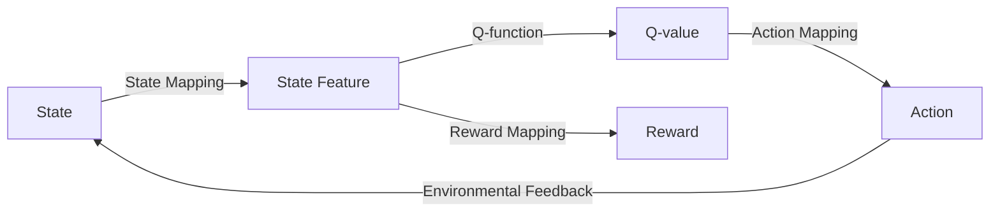

# 一切皆是映射：AI Q-learning在机器人领域的创新

## 1.背景介绍
### 1.1 人工智能与机器人的发展历程
#### 1.1.1 人工智能的起源与发展
#### 1.1.2 机器人技术的演进
#### 1.1.3 人工智能与机器人的融合

### 1.2 强化学习与Q-learning算法
#### 1.2.1 强化学习的基本原理  
#### 1.2.2 Q-learning算法的提出
#### 1.2.3 Q-learning在机器人领域的应用现状

### 1.3 映射思想在人工智能中的应用
#### 1.3.1 什么是映射
#### 1.3.2 映射在人工智能领域的重要性
#### 1.3.3 Q-learning与映射思想的结合

人工智能(Artificial Intelligence, AI)作为计算机科学的一个分支,旨在研究如何让机器模拟人类的智能行为。自1956年达特茅斯会议首次提出"人工智能"这一概念以来,AI经历了从早期的符号主义到连接主义,再到如今的深度学习等不同阶段的发展。

与此同时,机器人技术也在快速进步。从最初的工业机器人,到服务机器人、协作机器人,再到具备自主学习能力的智能机器人,机器人正在逐步走进人们的日常生活。而将人工智能技术与机器人结合,则是构建真正智能化机器人系统的关键。

强化学习(Reinforcement Learning, RL)作为机器学习的一个重要分支,为机器人的智能化发展提供了新的思路。不同于监督学习需要大量标注数据,强化学习让智能体在与环境的交互中学习,通过奖励信号来指导决策行为,更接近人类的学习方式。

而Q-learning作为一种经典的无模型、异策略的强化学习算法,以其简单有效著称。通过构建状态-动作值函数(Q函数),Q-learning能够在连续的状态空间中学习到最优策略。近年来,Q-learning及其变种算法在机器人自主导航、抓取操作、运动规划等任务中得到了广泛应用。

映射(Mapping)是人工智能领域的一个重要概念,它描述了不同空间之间元素的对应关系。在机器人系统中,传感器读数到环境状态的映射、状态到动作的映射、动作到奖励的映射等,构成了机器人感知、决策、学习的基础。将映射思想与Q-learning相结合,能够建立起机器人与环境之间的智能交互,是实现机器人自主学习的关键。

本文将从Q-learning算法原理出发,结合映射思想,探讨Q-learning在机器人领域的创新应用。通过分析Q-learning的数学模型,给出算法的具体实现步骤,并以机器人自主导航为例,展示Q-learning的工程实践。最后,本文还将讨论Q-learning在机器人领域的发展趋势与面临的挑战。

## 2.核心概念与联系
### 2.1 Q-learning的核心概念
#### 2.1.1 状态空间与动作空间
#### 2.1.2 Q值函数与贝尔曼方程
#### 2.1.3 探索与利用的平衡

### 2.2 映射思想的核心概念  
#### 2.2.1 映射的数学定义
#### 2.2.2 状态映射与动作映射
#### 2.2.3 奖励函数的设计

### 2.3 Q-learning与映射思想的关联
#### 2.3.1 Q值函数实现状态到动作的映射
#### 2.3.2 Q-learning中的状态空间映射
#### 2.3.3 Q-learning中的连续状态离散化映射

Q-learning的核心是构建状态-动作值函数Q(s,a),其中s表示状态,a表示动作。Q值函数刻画了在状态s下选择动作a的长期累积奖励期望。Q-learning的目标是学习最优的Q值函数,使得在每个状态下选择Q值最大的动作,就能获得最大化的长期奖励。

根据贝尔曼最优方程,最优Q值函数满足:

$$Q^*(s,a)=\mathbb{E}\left[r+\gamma \max _{a^{\prime}} Q^*\left(s^{\prime}, a^{\prime}\right) \mid s, a\right]$$

其中$r$是立即奖励,$\gamma$是折扣因子,$s'$是下一个状态。Q-learning则使用时间差分(TD)误差来逼近最优Q值函数:

$$Q(s, a) \leftarrow Q(s, a)+\alpha\left[r+\gamma \max _{a^{\prime}} Q\left(s^{\prime}, a^{\prime}\right)-Q(s, a)\right]$$

$\alpha$是学习率。在探索过程中,Q-learning需要在探索新知识和利用已有知识之间权衡,常用的探索策略有$\epsilon$-贪婪和Boltzmann探索等。

映射是指两个集合之间的对应关系。设$X$和$Y$是两个集合,如果存在一个法则$f$,使得$X$中的每个元素$x$按法则$f$都有$Y$中唯一确定的元素$y$与之对应,则称$f$为从$X$到$Y$的映射,记为$f:X \rightarrow Y$。在Q-learning中,Q值函数实际上建立了从状态-动作对(s,a)到Q值的映射。

在机器人系统中,传感器读数(如激光雷达点云)到环境状态(如占据栅格地图)的转换,是一种状态空间的映射。而Q值函数将状态s映射到动作a,体现了基于价值的决策映射。此外,在连续状态空间下,通常需要将状态离散化,这也是一种状态映射。奖励函数的设计则反映了状态-动作对到奖励值的映射。

综上,Q-learning通过价值函数逼近、状态映射、探索策略等,建立起状态、动作、奖励之间的关联,实现从状态到最优动作的映射,是一种基于映射思想的强化学习范式。

## 3.核心算法原理具体操作步骤
### 3.1 Q-learning算法流程
#### 3.1.1 初始化Q值函数
#### 3.1.2 状态映射与特征提取
#### 3.1.3 动作选择与探索策略 
#### 3.1.4 环境交互与状态转移
#### 3.1.5 即时奖励计算与Q值更新
#### 3.1.6 算法收敛性与停止准则

### 3.2 基于映射思想的改进
#### 3.2.1 状态空间映射与泛化  
#### 3.2.2 连续状态动作空间的处理
#### 3.2.3 基于示范的奖励函数设计

Q-learning的基本算法流程如下:

1. 初始化Q值函数$Q(s,a)$,对所有的状态-动作对,初始化$Q(s,a)=0$。

2. 对当前状态$s$,通过状态映射和特征提取得到状态特征表示$x(s)$。

3. 基于探索策略(如$\epsilon$-贪婪),选择一个动作$a$。若随机数小于$\epsilon$,则随机选择动作,否则选择Q值最大的动作:

$$a=\arg \max _{a} Q(x(s), a)$$

4. 执行动作$a$,观察环境反馈,得到即时奖励$r$和下一状态$s'$。

5. 基于$(s,a,r,s')$的四元组,更新Q值函数:

$$Q(x(s), a) \leftarrow Q(x(s), a)+\alpha\left[r+\gamma \max _{a^{\prime}} Q\left(x\left(s^{\prime}\right), a^{\prime}\right)-Q(x(s), a)\right]$$

6. 将下一状态$s'$作为新的当前状态$s$,重复步骤2-5,直到满足收敛准则或达到最大训练轮数。

在实际应用中,为了提高Q-learning的泛化能力和收敛速度,常常引入基于映射思想的改进。例如,可以对状态空间进行映射,将原始高维状态映射到低维特征空间,减少状态空间的维度灾难。对于连续状态动作空间,可以使用函数逼近器(如神经网络)来拟合Q值函数,将连续空间映射为参数空间。

此外,奖励函数的设计也至关重要。传统的奖励函数需要人工设计,但往往难以准确刻画任务目标。基于示范(demonstration)的逆强化学习方法可以从专家示范数据中学习隐含的奖励函数,建立状态-动作对到奖励值的映射,使奖励设计更加自动化。

通过引入映射思想,Q-learning能够更高效地处理高维、连续的状态动作空间,学习更加准确的奖励函数,从而提升机器人的自主学习能力。下一节将详细讨论Q-learning的数学模型与示例分析。

## 4.数学模型和公式详细讲解举例说明
### 4.1 马尔可夫决策过程(MDP)
#### 4.1.1 MDP的定义与组成要素
#### 4.1.2 状态转移概率与折扣累积奖励
#### 4.1.3 最优价值函数与最优策略

### 4.2 Q-learning的数学模型  
#### 4.2.1 Q值函数的定义与贝尔曼方程
#### 4.2.2 Q-learning的时间差分(TD)更新
#### 4.2.3 Q-learning的收敛性证明

### 4.3 数值示例
#### 4.3.1 网格世界环境设置
#### 4.3.2 Q值函数的迭代更新过程
#### 4.3.3 最优策略的生成与可视化

Q-learning算法可以在马尔可夫决策过程(Markov Decision Process, MDP)框架下进行描述。一个MDP由状态空间$\mathcal{S}$、动作空间$\mathcal{A}$、状态转移概率$\mathcal{P}$、奖励函数$\mathcal{R}$和折扣因子$\gamma$组成。在每个时间步$t$,智能体处于状态$s_t \in \mathcal{S}$,选择动作$a_t \in \mathcal{A}$,环境根据状态转移概率$\mathcal{P}(s_{t+1}|s_t,a_t)$转移到下一状态$s_{t+1}$,并给出即时奖励$r_t=\mathcal{R}(s_t,a_t)$。

智能体的目标是最大化折扣累积奖励:

$$G_t=\sum_{k=0}^{\infty} \gamma^k r_{t+k}$$

其中$\gamma \in [0,1]$为折扣因子,表示未来奖励的重要程度。定义状态价值函数$V^{\pi}(s)$为从状态$s$开始,遵循策略$\pi$能获得的期望累积奖励:

$$V^{\pi}(s)=\mathbb{E}_{\pi}\left[G_t \mid s_t=s\right]$$

类似地,动作价值函数$Q^{\pi}(s,a)$表示在状态$s$下选择动作$a$,之后遵循策略$\pi$的期望累积奖励:

$$Q^{\pi}(s, a)=\mathbb{E}_{\pi}\left[G_t \mid s_t=s, a_t=a\right]$$

最优价值函数$V^*(s)$和$Q^*(s,a)$分别表示在状态$s$下遵循最优策略$\pi^*$能获得的最大期望累积奖励。根据贝尔曼最优方程,最优Q值函数满足:

$$Q^*(s,a)=\mathbb{E}\left[r+\gamma \max _{a^{\prime}} Q^*\left(s^{\prime}, a^{\prime}\right) \mid s, a\right]$$

Q-learning算法通过时间差分(TD)误差来逼近最优Q值函数,更新公式为:

$$Q(s, a) \leftarrow Q(s, a)+\alpha\left[r+\gamma \max _{a^{\prime}} Q\left(s^{\prime}, a^{\prime}\right)-Q(s, a)\right]$$

其中$\alpha \in (0,1]$为学习率。Watkins等人证明了在适当的条件下,Q-learning算法能够以概率1收敛到最优Q值函数。

下面以一个简单的网格世界环境为例,说明Q-learning的工作原理。考虑一个3x4的网格,智